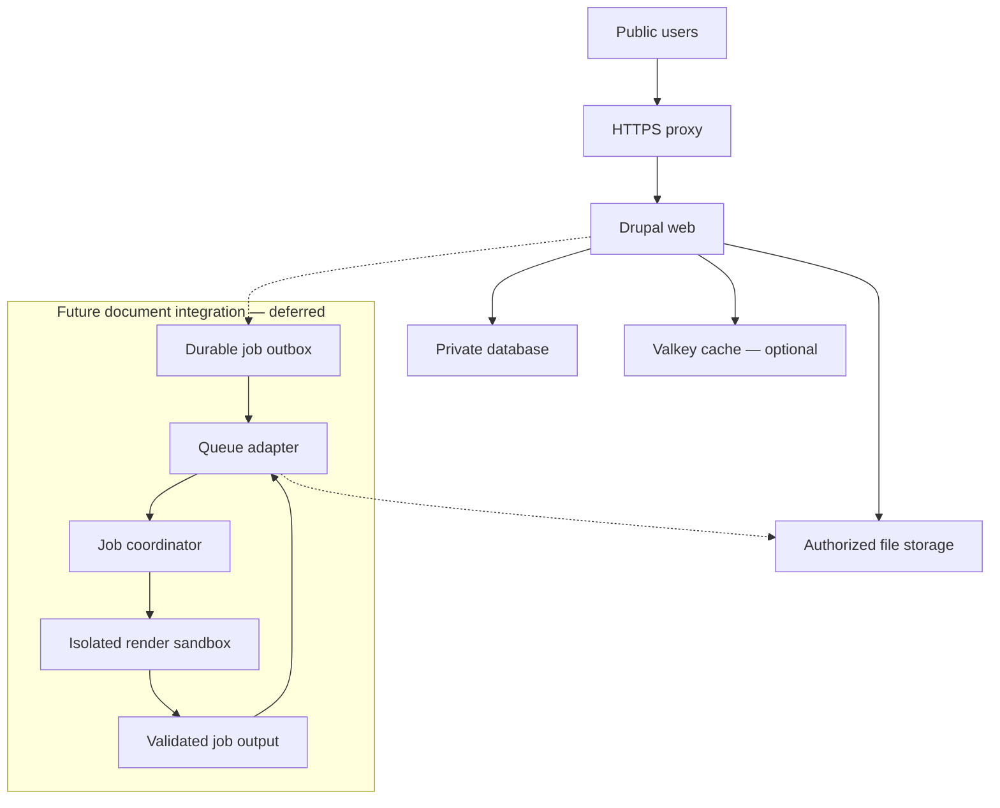

# Actools Drupal Community: fresh-rewrite architecture and implementation report

**Version:** 1.5 — finalised architecture with phased operator UX and integrated security refinements; implementation and production qualification remain pending  
**Prepared:** 6 September 2026; **v1.4 finalised:** 7 September 2026; **v1.5 UX integration finalised:** 7 September 2026  
**Purpose:** establish an evidence-based feature inventory, a security-first Ubuntu foundation, and a coding plan suitable for ChatGPT Work / Codex.  
**Decision status:** the necessary findings from the four supplied research reports are integrated into this design. D01's initial platform is accepted: clean Ubuntu Server 26.04 LTS installations on compatible Intel/AMD 64-bit servers, with current 26.04.1 media and security updates subject to release qualification. D03's implementation architecture is accepted: Python command engine, Ansible host roles, Docker Compose runtime and PHP Drupal integration. D04's initial hosting model is accepted: one production Drupal website per main server. D10's server access and Drupal browser-access policies are accepted: WireGuard plus individual SSH keys/accounts and independent emergency recovery for Linux; VPN plus MFA for privileged Drupal administrators; HTTPS plus MFA and limited roles for editors; public HTTPS governed by site permissions for ordinary users. D10 public ingress is also accepted: direct Caddy HTTPS is the complete default, with Cloudflare retained as an optional integration enabled only after security qualification. D05 now retains only a generic future document-integration boundary; domain application design and implementation are outside this project. Complete the current Actools documentation before any separate application work begins. D07 recovery targets are accepted: at most one hour of lost acknowledged changes and four hours of service interruption, subject to complete restore qualification. D08 separation policy is accepted: independent encrypted storage, separate destructive-maintenance authority, historical repository decryption keys off production, and encryption/repository access in a separate trusted backup environment. D08 cadence and retention are also accepted: capture every 30 minutes; keep all successful committed points for 48 hours, daily points for 30 days, weekly points for 12 weeks and monthly points for 12 months. Restic is accepted as the backup engine, running in the separate trusted backup environment. The user-supplied initial total site-data size is 80 GB, covering the database and public/private uploaded files together. Daily new/changed data is currently unknown, as stated by the user; measure it during qualification without blocking the remaining architecture discussion. Exact backend/provider, version and implementation qualification remain open. D09 is accepted: Valkey for selected disposable Drupal page/render cache bins when optional external caching is enabled, through qualified Drupal Redis module/open-source PHP client integration. Authoritative data and the declared security/durable services remain outside this cache. D11 monitoring/audit cadence is accepted: lightweight health checks every five minutes, daily security audits and weekly deeper diagnostics as the initial configurable schedule. D11 alert delivery is accepted as amended by the user: email plus Telegram through Apprise CLI, subject to exact-version and destination qualification. The remaining C01–C06 governance and operating choices are accepted; concrete notification recipients/credentials remain deployment inputs. F10 is also accepted: qualify bounded Caddy HTTP rate limiting before PHP for the first public production release, with implementation after the Ubuntu foundation. The user authorized finalisation to v1.4 after selective integration of the supplied review, then authorized v1.5 incorporation of the Phased UX Integration Plan v1.0 together with the UX Security Review v1.0 refinements. Guided CLI and private static HTML audit/doctor reports are accepted for the first release; optional terminal menus, a persistent read-only dashboard and browser actions remain separately deferred. Integration and decision acceptance are not implementation, qualification or production approval. The project scope is limited as recorded in this revision; no rewrite, GitHub write or server change is performed by this report.

**Specification closure:** v1.5 is finalised at the architecture, scope, operating-policy and contract level. All C01–C06 decisions remain accepted, including the bounded F10 Caddy integration. The v1.4 review record remains in §18.9 and §15.2. The user-authorized UX scope and eight security refinements are integrated into the normative sections and Annex UX, with dispositions in §18.10 and qualification ownership in §15.3. Phase 0 documentation is complete; Phase 1 implementation and Phase 2 conditional entry gates remain distinct. Executable schemas, adapter ADRs, exact dependencies, deployment inputs and real qualification evidence remain owned implementation outputs. This document does not start coding or deployment.

**Reading guide:** [feature inventory](#3-complete-capability-register), [source findings](#4-findings-that-should-shape-the-rewrite), [Ubuntu security](#6-linux-security-must-be-the-first-deliverable), [architecture](#7-software-architecture), [coding workflow](#13-how-to-code-this-project-using-chatgpt-work--codex), [implementation milestones](#14-implementation-milestones-and-work-packages), [accepted decisions](#17-accepted-decisions-and-remaining-qualification-inputs), [integration summary](#18-integration-record-and-implementation-handoff), [consolidated specification](#182-consolidated-first-release-specification-decisions), [source and test traceability](#appendix-c-integration-traceability), [accepted UX phases and security contracts](#annex-ux-accepted-phased-operator-experience-and-security-contracts).

## 1. Recommendation and scope

Rebuild Actools as a fully open-source Drupal installation and operations toolkit with security built into its normal installation, update, backup, restore, and worker workflows. Start with **Ubuntu Server 26.04 LTS**, using the current 26.04.1 installation media and security updates at release qualification. Build a small, typed command engine; use declarative host configuration and reviewed container definitions; keep document conversion in a separate security boundary.

The existing project contains useful operational knowledge, tests, contracts and feature ideas. It also contains unfinished wiring, duplicated representations of state, documentation that disagrees with code, and unsafe failure paths. A new implementation should preserve the useful requirements and evidence while replacing the architecture deliberately. Preserving the exact bytes or defects of the old generated configuration is not a rewrite requirement.

**One community edition:** all project functionality, including security, deep auditing, recovery, evidence and optional advanced modules, should be available in the same public project. Optional deployment capabilities may control resource use and complexity; they should not separate basic security into a different edition. The old `community-plus` design was itself free/MIT, not a paid edition. Its profile boundary is a proposal to reconsider, not an obligation imposed on this new project.

This study covers the existing installer/operator toolkit and all discovered experimental and roadmap capabilities. It does not assume an LMS, commerce, examination system, or a particular institutional compliance certification. Those would be separate product decisions. Earlier Open edX capacity or recovery decisions must not be imported into Actools.

Coding through ChatGPT Work is the development method. It does **not** require an OpenAI service or API key in the deployed community edition. Runtime AI and content-intelligence services are deferred from the first release under C01/F69–F70; coding through Codex does not enable them.

### 1.1 Earlier research integration (S2–S5)

The four addenda refine the same community project. Their requirements now affect the main architecture, existing WP01–WP25 work packages and G01–G22 gates. Appendices preserve each source requirement and acceptance case, including conditional features. Existing F01–F75, R01–R18, L01–L24, O01–O08 and D01–D13 identifiers are retained.

| Area | Integrated change | Main location |
|---|---|---|
| Linux and privileged operations | Prove loaded and effective controls through reboot; bind operations to protected resource identities; reconcile interrupted effects | §§6.5, 7.7–7.10 |
| Audit and doctor | One context, collectors and evaluator; complete admission coverage; explicit status, exit, probe and history rules | §§12.1–12.2 |
| Drupal and cache | Complete generated configuration bundle, topology-specific trust, effective application checks; keep durable/security state in the database | §§8.1–8.5 |
| Recovery and lifecycle | Independently committed complete recovery sets; transaction and file coverage; safe copies, revocation, deployment and cutover | §§7.11, 10.5–10.7, 11.1–11.3, 16.1 |
| Documents and capacity | Atomic job acceptance, attempt fencing, full input dependencies, recipe-specific fidelity, measured whole-host budgets | §§9.5–9.7 |
| Coding and maintenance | One requirement graph, versioned contracts, installed-release tests, finite support profiles and rehearsed runbooks | §§7.8, 13.6, 14.3, 15.1 |

All baseline requirements remain available in the community edition. Conditions such as “if object storage is selected” trigger the complete safety contract for that capability; they do not enable it automatically. Example settings, benchmark thresholds, exact dependencies and external hosting patterns become qualification candidates, not copied production defaults.

### 1.2 Current project boundary

This revision keeps Actools focused on the secure Ubuntu foundation, Drupal hosting, installation, operations, updates, storage, backup/recovery and audit/doctor. Domain application entities, workflows, screens, source converters and their feature/test inventories are outside this report and its implementation plan.

Retain only a generic extension boundary for future document integrations (§9.1). An external application will own its content model and business workflow. Actools supplies the applicable hosting, isolation, job/artifact transport, authorization, versioning and recovery contracts when that integration is later selected. Its eventual implementation must not block completion of the current platform documentation or require the application to be installed for a complete Actools community deployment.

Existing accepted platform/access decisions and S2–S5 requirements are preserved. Generic document safety requirements remain conditional on enabling a document capability; they do not add domain functionality to this project. The consolidated first-release scope and policies are accepted in full and collected in §§18.2–18.8; accepted recovery and access decisions remain recorded in §18.1. The later user-authorized operator UX addition is integrated in §18.10 and Annex UX. It improves the installer/operator experience without adding domain application screens or a first-release browser service.

### 1.3 What v1.4 finalises

V1.4 preserves every accepted C01–C06 inclusion and deferral and all 75 feature IDs. The review sharpens consumer activation, continuous firewall protection, stable Compose resources, restart ownership, complete backup evidence, key-compromise recovery, deadline-based retries, ordinary-image limits, optional-origin identity and Caddy lifecycle tests. It also aligns earlier operational prose with the accepted scope. These are refinements of the existing host, Drupal, recovery and diagnostic architecture; no additional service, worker topology or product feature is selected.

Fourteen review dispositions and the existing cache-ordering refinement are recorded in §18.9. Twenty-eight focused acceptance cases in §15.2 extend existing gates and fixtures. All remain unexecuted until their implementation milestone. The first coding sequence remains WP01–WP04 plus the bounded WP09 slice, followed by the Ubuntu foundation in WP05–WP08 (§18.5).

### 1.4 What v1.5 adds

V1.5 incorporates the supplied Phased UX Integration Plan v1.0 and all eight refinements from the UX Security Review v1.0. Guided initialization, exact-plan review, truthful progress/errors, readable diagnostic and recovery views, and packaged runbooks refine existing core capabilities. The explicit first-release format extension is private, self-contained static HTML for `audit` and `doctor`, rendered from the same authorized evaluated model. No other command family or action vocabulary is added.

The phased scope is now an accepted contract: Phase 0 documentation is integrated in this revision; Phase 1 is implemented alongside existing work packages; Phase 2A terminal menus, Phase 2B private read-only dashboard and Phase 2C browser actions remain deferred, separately selected capabilities. HTML introduces no listening service, automatic browser, independent collector, document converter or runtime OpenAI dependency.

Annex UX retains 18 requirement IDs, 24 acceptance-test IDs, six implementation slices, eight security-review dispositions and 15 expanded security subcases. First-release applicability is UX-R01–UX-R15 and UX-T01–UX-T22; the remaining UX requirements/tests are conditional. Existing F01–F75, WP01–WP25, G01–G22 and source/test IDs retain their authority and applicability. The §3 historical inventory and §18.9 v1.4 review record are preserved. Document integration does not mark runtime cases passed.

## 2. Evidence, provenance and limits

### 2.1 Source baseline

| Item | Verified result |
|---|---|
| Repository | [actools-pl/actoolsDrupal](https://github.com/actools-pl/actoolsDrupal) — public; default branch `main` |
| Uploaded archive | `actoolsDrupal-src-67f9b96(2).zip` |
| Archive SHA-256 | `97926d3299f745f72c6bcf084c2da0b7effbb0cc4937c27224a8d10cffeb135b` |
| Archive Git HEAD | `67f9b96b7bae85390e32b99081da0a72285d3364` |
| GitHub main during review | The same full commit; GitHub comparison returned identical, zero commits ahead/behind |
| Commit | [E3a: gated binlog enablement, 30 June 2026](https://github.com/actools-pl/actoolsDrupal/commit/67f9b96b7bae85390e32b99081da0a72285d3364) |
| Working-source content comparison | No tracked content differences from archive HEAD. Extraction produced executable-mode differences on 20 files; these are not developer source edits. |
| Inventory size | 242 files excluding `.git`; 87 Markdown files; 27 Bats files; 32 files under live-module directories; 12 under `experimental/` |
| Review method | Static tracing from installer and CLI entrypoints, full file inventory, targeted searches, independent runtime/experimental/security reviews, official platform research |

The archive includes Git history. It was inspected as source material; its installer and experimental scripts were not executed. The reviewed GitHub baseline was read without any write, issue, comment, merge, workflow rerun or deployment.

### 2.2 What verification does and does not establish

Sixty shell files passed a syntax-only `bash -n` check. This checks parsing, not runtime correctness. Historical GitHub metadata reports successful [Lint and Test](https://github.com/actools-pl/actoolsDrupal/actions/runs/28480633871) and [E2E Fresh Install](https://github.com/actools-pl/actoolsDrupal/actions/runs/28480633929) runs at the reviewed commit. The E2E workflow contains an encrypted-backup restore round trip and a binlog-enablement check. This is useful historical evidence, but this study did not rerun those tests or inspect every historical log. It does not establish Ubuntu 26.04 support, complete PITR, hostile-input resistance, or production readiness.

Source findings below are **static findings**, not claims that an attack was reproduced. Severity depends on the stated access preconditions. There was no penetration test, production audit, measured capacity test or recovery rehearsal.

### 2.3 Evidence precedence

For current behavior: traced executable code and feature gates take precedence over README prose, old runbooks, comments, badges and roadmap estimates. Historical tests support only what their assertions and environment actually cover. Future-design documents describe intent, not implemented capabilities.

Two particularly important corrections:

1. **Encrypted daily backups are live, opt-in**, through `ENABLE_ENCRYPTED_BACKUP`; they are not wholly unwired as several documents state. Their failure behavior and integration still need substantial improvement.
2. **Binary logging is live, opt-in**, through `ENABLE_PITR`; the remaining backup-coordinate, binlog archive and replay system is incomplete. Enabling binlogs does not provide working PITR.

### 2.4 Added research provenance and evidence boundary

All four supplied files were read in full as research inputs. Their findings were reconciled with the v1.0 report and mapped to its existing architecture. The original uploaded files are unchanged. Source namespaces avoid collisions between repeated test numbers.

| Source | Supplied file | SHA-256 |
|---|---|---|
| S2 | `2_Actools_Drupal_Community_Security_Audit_Doctor_Research_Addendum Ponts1-2_v1.0.md` | `9b0ef88bdfb03a26d2ce5bd5b76940ef227f6ef8bf385fdff63f7b3463f0f83d` |
| S3 | `3_Actools_Drupal_Community_Drupal_Redis_Security_Addendum_Points_3-5_v1.0.md` | `959ad273dd8ec1192d9b81e9e0fdf36ea184d239b544c6a053d117d7ac288f21` |
| S4 | `4_Actools_Drupal_Community_Further_Improvement_Research_Report_After_Points_1-5_v1.0.md` | `137cfa60ed12ef459aebbf453d6bd35b0df8de2147841f3efdeec83e773a0413` |
| S5 | `5_Actools_Drupal_Community_BOA_Professional_Hosting_Security_Integration_Report_v1.0 .md` | `dc9646afbe43510d57f160ae7b7f3bfacdb5f5f3d04839ab39f7eecd0f78e8a0` |

The original GitHub comparison, source snapshot and syntax checks in §§2.1–2.2 remain historical evidence from v1.0; they were not rerun for this document integration. S2's DF findings also describe static review at the recorded commit, not reproduced attacks. Targeted official-source checks during integration clarified Drupal/Redis behavior, MariaDB Community account removal, SQLite WAL fixes, Restic completion and Drush deployment. Appendix references identify those checks. The other external research claims remain attributed to the supplied reports; they are not represented as a fresh audit of BOA or hosting providers.

Architecture adoption and implementation status are separate fields. All newly specified acceptance cases remain **unexecuted**. This document's verification checks concern completeness, traceability and consistency of the written plan; they do not establish application or host security.

### 2.5 V1.4 review provenance and reconciliation

The supplied `Actools_Drupal_Community_v1.3_Flaws_Pitfalls_Research_Review_v1.0(1).md` was read in full; SHA-256 `e85ec460b3930f4ee2f5a3063f6cc01375aaefbf83a03567a6ecf464e7ac97a2`. It contains RV13-01–RV13-14 and RV13-T01–RV13-T28. Its stated reviewed snapshot, SHA-256 `581968c88f78103bf623f3d314214e213f0d27cd4d4ef76469edc958b2d56ddc`, matches the retained earlier v1.3 copy. V1.4 integrates against the later accepted baseline, SHA-256 `a74975984a8c418f290f58267ac9588bae2b2ff39f6ef20644535384e4dcde39`, which already records F10 acceptance. The review's remaining-F10-decision language is therefore superseded; it does not reopen scope.

Targeted primary-source checks on 7 September 2026 covered Docker mount/configuration, forwarding, project identity and restart semantics; Restic check locking, key compromise, copying and data-read coverage; MariaDB events; Drupal image/cache paths; Cloudflare origin identity; and the pinned limiter candidate. The inspected Drupal tag is 11.4.6, Restic source tag v0.19.1, and limiter research commit `5625512f24f6f59d6f64fb3aafe5eecff0b286db`. These are evidence references, not automatic release-version selections. Links accompany the integrated requirements. Moving upstream behavior must be checked again for the actual pinned build.

The review is not a demonstrated vulnerability assessment of a running installation. No host, application, repository backend or candidate module was executed for this integration. Documentation checks verify preservation, scope, references and test mappings; they do not turn any G gate or runtime case into PASS. The review file and original source evidence remain unchanged.

### 2.6 V1.5 UX provenance and integration boundary

The user authorized incorporating the complete UX phase plan and the necessary security refinements into this architecture as v1.5. The three exact source documents are:

| Source | Document | Bytes | SHA-256 |
|---|---|---|---|
| V1.4 base | `Actools_Drupal_Community_Rewrite_Architecture_Implementation_v1.4.md` | 446839 | `8ebeaf01ffcba0b5d14528b8e26237a2a003728f66c5349a724d2677619222e3` |
| UX phase plan | `Actools_Drupal_Community_UX_Phased_Integration_Plan_v1.0(1).md` | 52283 | `cdf298562bb5134fe24564e14b3f27c4936b575ca72f638df2e61ef8fe923fc1` |
| UX security review | `Actools_Drupal_Community_UX_Security_Review_v1.0.md` | 34189 | `010277c42d36ed0ccccc46d08c4f31a57b2c608e271547036811bebe3ba8305d` |

The phase plan's §12 baseline hash, 446,839-byte count and 2,281-line count match the v1.4 base despite its additional download-name suffix. Annex UX integrates its full scope, journeys, contracts, ownership and test register, with the security review's corrections applied directly to the relevant clauses. UXS-01–UXS-08 are adoption/traceability IDs, and UXS-C01–UXS-C15 expand existing fixtures rather than create another admission denominator.

The UX security review's primary-source checks were performed on 7 September 2026; retained links support specific browser, terminal and authorization requirements. This integration is a document reconciliation, not a fresh repository scan, dependency selection or runtime assessment. The source documents remain unchanged. The new architecture's own file hash is not substituted for the historical source hashes. All installed UX, browser, resource, process-isolation and recovery qualification remains unexecuted until its implementation gate.

## 3. Complete capability register

Statuses: **Live** = reached by a supported entrypoint; **Partial** = some live wiring, incomplete outcome; **Unwired** = source exists but not on the standard execution path; **Planned** = design only; **Missing** = no implementation found for a referenced outcome. None of these labels means independently production-validated.

The recommendations in this original study register describe the initial proposals: **Core** meant proposed baseline, **Optional** an open-source capability to enable when needed, and **Discuss** a decision awaiting review at that stage. The accepted first-release dispositions in §18.3 now govern these same F01–F75 identifiers; historical evidence/status entries remain source observations.

### 3.1 Installer, platform and ordinary operations

| ID | Capability | Current evidence and status | Rewrite proposal / completion condition |
|---|---|---|---|
| F01 | Guided init, preflight, install and handoff | Live: `actools.sh`, `installer/init.sh`, `preflight.sh`, `handoff.sh` | Core; separate discovery, planning, mutation and verification; machine-readable output |
| F02 | Legacy `fresh`, per-environment install, installer update | Live; overlapping paths in installer and CLI | Core behavior through one command engine; migration aliases only where useful |
| F03 | Configuration validation and defaults | Live; shell-sourced env and manual interpolation | Core; data-only schema, explicit booleans, unknown-key rejection, cross-field validation |
| F04 | State, generated credentials and install markers | Live: `core/state.sh`, `secrets.sh` | Core; transactional state separate from secrets, per-stage evidence, resumable failure recovery |
| F05 | Dry-run | Partial; existing paths can mutate before reporting no changes | Core; explicit read-only plan contract; no credential generation, file writes or service changes |
| F06 | Profiles and extension resolver | Partial; community profile live, resolver scaffolding, community-plus absent | Discuss replacing edition profiles with validated capability bundles; never load arbitrary executable handlers from writable paths |
| F07 | Ubuntu host packages, Docker, age, swap, logrotate | Live: `modules/host/` | Core; Ubuntu 26.04 qualification, minimal signed packages, measured resource policy |
| F08 | Host kernel configuration | Live but predominantly performance tuning | Core; dedicated security baseline with controls, rationale, exceptions and effective-state tests |
| F09 | UFW and Fail2ban | Live; fixed SSH port assumptions and Docker-forwarding gap | Core; safe SSH transition, IPv4/IPv6 and Docker ingress verification |
| F10 | Caddy automatic HTTPS, HTTP/3, rate limiting | Live generated custom image/config | D10/C01 accepted: direct Caddy HTTPS default, separately configurable HTTP/3 and qualified HTTP rate limiting before PHP for the first public production launch (§18.8). |
| F11 | PHP-FPM/Drupal image | Live; committed Dockerfile hardcodes Drupal 11/PHP 8.3 | Core; one release manifest must drive image, Composer and reported versions |
| F12 | MariaDB, database creation, app and backup users | Live; DB stage label itself remains a no-op because work is elsewhere | Core; real stage ownership, least privilege, verified health and credential rotation |
| F13 | Redis cache integration | Live; disabling service leaves broken references | Core optional cache; Valkey selected under D09; qualify the Drupal Redis integration and both on/off configurations |
| F14 | Production-only / all-in-one dev-staging-production | Live mode/configuration surface; shared host/resources | Discuss; production isolation is default; same-host environments never imply independent security boundaries |
| F15 | Drupal site creation, Composer extras, Drush | Live: `modules/drupal/provision.sh` | Core; build from approved Composer lock; extras through reviewed dependency changes |
| F16 | Drupal trusted host, session and filesystem settings | Live but uneven error handling and mutable files | Core; immutable code, narrowly writable uploads, compatible session/proxy policy, required-setting verification |
| F17 | Status, logs, restart, live stats, OOM and slow logs | Live CLI arms | Core; scoped service identifiers, redaction, stable output and meaningful exit status |
| F18 | Drush, container shell and PHP console | Live powerful administrative commands | Optional privileged operator tools; explicitly classify as code-execution authority, never a low-privilege role |
| F19 | Daily doctor and legacy HTTP health | Live; health checks do not cover all outcomes | Core; dependency-aware health, worker functional test and backup/recovery freshness |
| F20 | TLS status, Caddy reload | Live | Core; validate candidate config before reload; certificate renewal and negative trust tests |
| F21 | Install/health notifications | Partial webhook configuration and call sites | Configurable community capability; email plus Telegram through Apprise CLI selected for the initial deployment under D11. Redacted summaries, protected credentials, bounded retries, qualified TLS destinations and separate channel failure status. |
| F22 | CLI help, advanced help, JSON/CI conventions | Live but inconsistent across tools | Core; generated command reference and stable exit/result schemas; unknown commands fail |

### 3.2 Storage, document processing and recovery

| ID | Capability | Current evidence and status | Rewrite proposal / completion condition |
|---|---|---|---|
| F23 | Local public and private file paths | Live Drupal configuration; scheduled backup does not cover all paths | Core; explicit public/private namespaces and complete backup inventory |
| F24 | S3-compatible storage | Live integration/settings: AWS, Backblaze, Wasabi, custom endpoints | Optional; adapter contract, scoped credentials, verified TLS, provider conformance tests |
| F25 | CDN hostname / alternate object endpoint | Configuration surface | Optional; separate public delivery from authenticated private files; prevent origin bypass |
| F26 | Storage info and PUT/GET/DELETE probe | Live | Core where adapter enabled; isolated probe prefix, safe cleanup, no user-object mutation |
| F27 | Local XeLaTeX toolchain | Live worker image build and `pdf-test` | Optional document capability; sandbox and deterministic render tests |
| F28 | Worker queue list, run and logs | Live CLI commands; container itself idles | Rebuild as actual supervised queue processing, with retries, leases and operational evidence |
| F29 | `actools_document_export` queue implementation | Missing application plugin referenced by `worker-run` | Retain a generic versioned Drupal job/artifact adapter contract for later integration; no domain application implementation is included |
| F30 | Remote XeLaTeX mode and migration guide | Partial env passthrough and text guide; no complete remote protocol | Optional; HTTPS/mTLS, private transport, authenticated jobs, no HTTP fallback |
| F31 | DOCX import/export and math-to-SVG pipeline | Missing in reviewed source; worker presence is not DOCX support | Reserve qualified recipe/output capabilities for later external integration; domain conversion belongs to its independent application project |
| F32 | Worker concurrency and queue scaling | Planned/partial surface, no actual scheduler | Optional capability after one complete worker; admission limits, queue age and duplicate-job tests |
| F33 | Distributed workers / multi-region routing | Planned in technical roadmap | Discuss; same job contract as local worker, independently deployed render nodes |
| F34 | Basic daily DB dumps and public-file archive | Live generator `modules/backup/cron.sh` | Core redesign; database + public/private files + config + release identity; consistent backup sets |
| F35 | Backup checksums and retention | Live; immediate local checksums, date-only naming | Core; unique immutable IDs, authenticated manifest, dependency-aware retention and restore validation |
| F36 | age key generation and encrypted backup | Live opt-in; keypair generated, cron consumes public key | Preserve legacy reader compatibility; new D08 policy requires historical repository decryption keys off production, with encryption/repository access in a separate trusted backup environment |
| F37 | Offsite rclone copy | Live optional; mixed plaintext/ciphertext glob | Core offsite capability; upload only committed encrypted sets, verify remote availability, distinguish configured from protected |
| F38 | S3 object backup | Missing independent backup: refresh-cache is a reachability/metadata operation | Core when object storage enabled; version-aware independent copy/retention and recovery evidence |
| F39 | Manual restore with encrypted-file handling | Live, including `.age`; unsafe destructive ordering remains | Core staged restore, validation before cutover, writer quiesce, explicit target and safety snapshot |
| F40 | Restore-test | Live but plaintext-focused and uses production DB service | Core disposable isolated restore environment, all backup formats, file/application assertions |
| F41 | Pre-update snapshot and manual rollback | Partial; failures can be tolerated; limited snapshot scope | Core complete verified checkpoint required before production mutation |
| F42 | Binary logging | Live opt-in `ENABLE_PITR`, config/volume generation | Core candidate for recovery policy; health reports archive lag and retention safety |
| F43 | Full PITR backup, rotation, archive, CLI and replay | Unwired six-file cluster under `modules/backup/` | Complete as an integrated recovery subsystem if retained; coordinates, continuous chain and target-time rehearsal |
| F44 | Automated update rollback | Planned; manual rollback exists | Rebuild only with schema compatibility classification; never blindly reverse a database migration |
| F45 | DNA snapshot / immortalize / resurrect | Unwired experimental DR scripts | Retain recovery intent, replace arbitrary code bundle with signed release + encrypted data + declarative host manifest |
| F46 | Standby, failover and DR rehearsal | Planned, not shipped HA | Discuss recovery targets first; rehearsal and fencing required before any HA claim |
| F47 | Galera / multi-node database | Planned roadmap example | Discuss; a configuration fragment is insufficient; quorum, fencing, backups and failure-domain design required |

### 3.3 Security, observability and future platform capabilities

| ID | Capability | Current evidence and status | Rewrite proposal / completion condition |
|---|---|---|---|
| F48 | Baseline `audit`, report, JSON/CI and fix catalog | Live: `modules/audit/audit.sh`, `lib/*` | Core; comprehensive checks with stable IDs, scoped evidence and non-misleading exit codes |
| F49 | `audit --deep`, `doctor --deep` | Gate notices / design; not complete implementations | Core advanced analysis available to every community deployment; optional expensive probes |
| F50 | SSH, filesystem and Docker hardening stages | Planned community-plus modules; small live subset elsewhere | Move essential controls into baseline; evaluate actual host/container posture |
| F51 | MariaDB TLS | Unwired config template; CA/client/server lifecycle absent | Core verified TLS for TCP connections, mandatory across hosts; qualify driver verification |
| F52 | Cloudflare tunnel status/restart/logs | Live CLI wrapper for existing service | Optional adapter; service setup and route/TLS requirements must also be implemented |
| F53 | Tunnel provisioning, DNS-01 plugin/origin certificates | Unwired templates/docs; Caddy token not fully consumed | D10 accepted: retain Cloudflare as an optional integration enabled only after its security tests pass; direct hosting remains complete. Proxy, Tunnel and DNS-01 modes require distinct qualification. |
| F54 | VPN / private administration | Desired security architecture, not complete in source | D10 accepted: WireGuard for normal private SSH and privileged Drupal administration; individual SSH keys/accounts for Linux, MFA for Drupal administrators, and tested recovery. Editor/ordinary-user access follows the separate accepted role policy. |
| F55 | RBAC sudoers and per-command audit wrapper | Unwired experimental seeds; broad grants/logging defects | Core distinct human/service identities; narrow operations and redacted audited events |
| F56 | Hash chains, signed evidence, baseline integrity | Planned locked design | Optional evidence package on top of core logs/drift; outside-host anchor for tamper evidence |
| F57 | Actor, ticket, signed approval, exceptions, break-glass | Partial init validation seams; disabled in community and not persisted there; full governance planned | Optional policy module; bind approvals to exact operation, environment, digest, expiry and nonce |
| F58 | Filesystem/configuration drift and hardening sync | Limited Drupal config-drift check live; approved baseline/filesystem/sync system planned | Core detection and reviewable repair plans; authorized changes update baselines |
| F59 | SSLyze, Nmap, Drupal Security Review, OWASP ZAP | Planned scanner integration | Optional scoped probes; reviewed recipes, budgets and findings triage; no certification claims |
| F60 | Prometheus/Grafana/exporters and alerting | Unwired experiment + standalone compose; inconsistent defaults, missing assets | Optional; authenticated private endpoints, complete dashboards/alerts, no fixed credentials |
| F61 | cAdvisor | Live opt-in and experimental forms with broad host access | Discuss safer metrics first; privileged telemetry collector requires explicit exception |
| F62 | Trends, certificate/capacity/backup forecasting, slow-log anomalies | Planned doctor-deep design | Core bounded local history and honest deep-doctor coverage; optional external dashboards and heavier analysis, with measured cost and reproducible calculations |
| F63 | Stats cron and cost-optimization utility | Stats script exists; cost command referenced without shipped implementation | Discuss; avoid unsupported claims; establish measurements before optimization |
| F64 | GDPR export/delete/audit/report | Unwired experimental shell commands | Optional privacy operations; provider inventory, ownership checks, completeness report and safe deletion workflow |
| F65 | Compliance mappings: SOC 2, ISO 27001, GDPR, HIPAA | Planned | Optional evidence mappings only; never represent this software as certification or automatic legal compliance |
| F66 | Preview branches create/list/destroy | Unwired script; isolation and lifecycle incomplete | Optional after sanitized data, secrets isolation, quotas, TTL and safe destruction |
| F67 | CI/CD generator/templates | Templates exist; `ci` command absent | Core project CI; optional site delivery templates; same local commands usable without GitHub |
| F68 | GitHub webhook / PR preview / push deployment | Planned incomplete sample | Optional signed event receiver with replay protection and fixed release actions; production deployment policy separate |
| F69 | Ollama context build, questions, file explanation, security/performance review | Unwired experimental assistant; simple source concatenation, not true indexing | Discuss; opt-in, no unattended root fixes, credential redaction, model-license validation |
| F70 | Content analysis, scaffold, score and translation | Planned roadmap | Discuss separate Drupal application features; no automatic commitment from installer scope |
| F71 | Multi-tenancy | Planned directory/DB/cache design examples | Discuss as major extension; Redis DB numbers and S3 prefixes are not tenant security boundaries |
| F72 | CDN enablement, edge distribution and load balancing | Planned | Discuss; separate deliverable with cache/privacy rules and failure-domain design |
| F73 | Dependency updates, lint/Bats, E2E and vulnerability scans | Live workflows, mixed enforcement | Core CI with enforced severity policy, reproducible release builds and complete feature combinations |
| F74 | Goss / dgoss operational assertions | Goss file exists; not sufficient alone | Core VM/container acceptance assertions alongside outcome tests, no dependence on a paid testing service |
| F75 | Security reporting, MIT license and public contribution | LICENSE/SECURITY present; fuller community process needed | Core governance, supported releases, advisories, contributor guide and reproducible build instructions |

This register intentionally includes functionality that may later be removed from scope. No absence of a paid tier requires every optional service to run on every server. Complete implementation means every accepted capability has a working path, documentation and acceptance evidence; it does not mean installing all roadmap ideas by default.

### 3.4 Details that must not disappear inside broad feature labels

The audit inventory includes Drupal advisories, cron recency, config drift, trusted hosts, production error settings, session flags, module inventory, queue backlog, Redis write/read/TTL and Drupal backend wiring, caching/compression, Host-header rejection, private-file paths, container uptime, HTTP/TLS, disk/memory, backup age, DB reachability, worker health and response time. Some integration checks create probe data; a new read-only audit must distinguish these active probes and clean them safely.

Deep analysis additionally proposes ownership/permission drift, baseline creation, certificate/backup/capacity forecasts, scheduled scans and delta reports. Evidence/governance adds an independent verifier, JSON/PDF reports, signed bundles, remote checkpoints, access-policy reports, exceptions with expiry, change tickets, approvals, emergency access and immutable backup retention. Each requires a separate acceptance criterion even if exposed through one command.

Preserve explicit subfeatures for risky-enabled-module policy, container/image drift, restore-test evidence, backup-metadata tamper detection and provider retention examples such as S3 Object Lock/B2 file lock. `profiles/README.md` also mentions gVisor, Falco/guardian and rootless-runtime hardening examples in downstream profile guidance; they are unwired evaluation candidates, not installed controls. Their license, compatibility, false-positive/operational cost and actual isolation benefit need separate qualification before adoption.

Observability requires node, database, cache and worker metrics, actual provisioned dashboards, alert rules, delivery tests and configurable retention. The current tree lacks the advertised dashboard assets, a complete MariaDB exporter definition and the referenced alert file. The documented retention setting is not consistently consumed. The cost-optimization command is a proposal, not a shipped utility.

Preview work must include create/list/destroy/**scheduled cleanup**, actual checkout of the requested commit, correctly established preview credentials, quotas and expiry. The seed copies production content and does not implement the promised branch checkout. GitHub CI templates are distinct from the repository's own working CI. GitLab template generation is mentioned but absent. Future content intelligence includes analytics, content-type/field/display/workflow/permission scaffolding, quality scoring, translation and a vector-store idea; these have no working implementation here.

The privacy seed does not produce a complete user-data export: it calculates node data without including it in the final export and retains a plaintext pre-deletion export. Its summary assertions are not verified compliance evidence. Resurrection is largely manual, depends on moving source and stale paths/commands, and has no measured recovery time. Neither seed should be promoted by merely adding a CLI command.

## 4. Findings that should shape the rewrite

Priorities below are implementation priorities, not a CVSS assessment. **P0** means establish the safe architecture before production; **P1** means mandatory before the affected capability ships. “Unwired” findings matter if that code is promoted; they do not imply it currently runs on a server.

All source paths and line references refer to commit `67f9b96b7bae85390e32b99081da0a72285d3364` and can be inspected through the [pinned source tree](https://github.com/actools-pl/actoolsDrupal/tree/67f9b96b7bae85390e32b99081da0a72285d3364).

| ID | Priority / scope | Static evidence | Required architectural correction |
|---|---|---|---|
| R01 | P0, live privilege boundary | `actools.sh:152–178,405`; `cli/actools:48–66`: root sources shell configuration; checkout becomes operator-owned | Data-only configuration; root-owned installed management artifacts and parent directories; no privileged execution from mutable operator/app paths |
| R02 | P0, live input handling | `installer/init.sh:180–188`; `modules/drupal/provision.sh:30–48,64–75`: values interpolated into shell, PHP/SQL contexts | Typed validation and destination-specific serialization; subprocess argument arrays; secrets via files/stdin; arbitrary site text remains literal |
| R03 | P0, live backup failure | `modules/backup/cron.sh:79–85,106–112,127–132`: encryption failure retains plaintext; remote copy includes plaintext | Encryption failure fails the operation; only verified encrypted sets are publishable; previous good backups retained |
| R04 | P0, live restore safety | `cli/actools:241–267`: target dropped before complete decryption/decompression/import, missing checksum only warns | Restore and validate in an isolated target first; fence writers; promote deliberately; preserve old target for recovery |
| R05 | P0, live update safety | `cli/actools:163–194`, `actools.sh:640–661`: snapshot failure tolerated; installer migration failure can be tolerated | One update engine; validated complete recovery point required; failed migration stops rollout and returns failure |
| R06 | P0, live worker isolation | `modules/stack/compose.sh:145–168,43–56`: production RW mount, shared DB network, storage secrets, idle process | Split trusted queue adapter from untrusted render sandbox; no production mounts, DB secrets or daemon socket in renderer |
| R07 | P0, incomplete Linux baseline | `modules/host/firewall.sh:12–17`, `kernel.sh:12–19`, `packages.sh:16–25` | Inspect and enforce SSH, patch/reboot policy, AppArmor, access, filesystem and effective host/container network controls; performance tuning is separate |
| R08 | P1, live administrative privilege | `modules/host/docker.sh:31–46`: Docker group auto-membership and shell activation | Treat daemon operators as host administrators; no Docker-group access for ordinary deploy/viewer/application roles |
| R09 | P1, live update provenance | `modules/stack/images.sh:24–28,44,47–48,55`; `Dockerfile.php:1` | CI-built immutable releases, locked dependencies, final-image scan, signed provenance; failed build cannot report success |
| R10 | P1, live backup completeness | `modules/backup/cron.sh:50–52,88–100,118–132` | Unique backup IDs; include private files and exact release/config; independent object backups; prune only after verifying retained recovery coverage |
| R11 | P1, live locking/state | `actools.sh:100,135–145`; `core/state.sh:25–33`; parallel environment install | Protected stable lock; transactional state with single-writer semantics; collect every child result; never mark completion from process launch alone |
| R12 | P1, live false assurance | `modules/audit/lib/security.sh:11–13,19–21,95–106`; `modules/stack/caddyfile.sh:46–52`; Compose healthchecks | SKIPPED/UNKNOWN are not PASS; a Cloudflare header is not tunnel proof; `php -v` is not site readiness; static OK is only proxy liveness |
| R13 | P1, live unsupported configuration | Redis service gated but dependencies/settings unconditional; version knobs diverge from committed Dockerfile; PHP env knobs lack matching ini generation | Validate the complete rendered deployment for every advertised option; effective values must match configuration and reports |
| R14 | P1, live dry-run semantics | `actools.sh:367–379,577,596` and earlier logging/lock activity | Plan is read-only; no secret/state/host mutation; detect stale plans before apply |
| R15 | P1, web boundary | `modules/stack/caddyfile.sh:34–40,65,71–89`; Drupal provisioning trusted-host rule | Explicit upload execution denial, private/config/dotfile blocking, request limits, exact proxy trust and tested CSP rollout |
| R16 | P1, optional monitoring | `docker-compose.observability.yml:26–38,65–74`; live optional cAdvisor in `compose.sh:276–291` | Unique secrets; private dashboard/exporter access; avoid broad host mounts; a read-only socket bind does not make its API read-only |
| R17 | P1, unwired recovery/RBAC | `pitr-restore.sh:86–120,149,155–165,185–221`; `experimental/security/sudoers-roles:3–14` | Rewrite PITR around coordinates/chain integrity and fenced recovery; arbitrary shell/Drush/wildcards cannot constitute restricted RBAC |
| R18 | P1, CI/release | `.github/workflows/lint.yml:59–67`, `e2e.yml:22–24,66–77`; deploy template `@master` | Immutable action references; verified tools; trusted host identity; enforced security policy; secret-free untrusted PR checks |

R01/R02 require a lower-trust actor to influence privileged input or writable code; they are not findings of an unauthenticated internet exploit. Host-default security mechanisms may already be enabled outside this installer. The finding is that the project does not reliably establish and verify them.

Retain the good work: experimental quarantine, runtime-authority mapping, secret-persistence tests, stdin-fed 0600 DB credential files, non-public DB/cache ports, some capability/resource restrictions, actual encrypted restore testing, and honest deep-mode gate notices. Replace tests that freeze known defects with tests of the intended outcome.

## 5. Platform and open-source policy

### 5.1 Initial supported platform

| Component | Initial target and decision status | Qualification requirement |
|---|---|---|
| Host | **D01 accepted:** clean Ubuntu Server **26.04 LTS**, current **26.04.1** media; compatible Intel/AMD 64-bit (`amd64`/`x86-64`) servers only initially | Verify CPU/image compatibility and signed image; qualify exact image/packages through fresh install, update, reboot, hardening and recovery tests. ARM requires separate future qualification. |
| Drupal | Supported **11.4.x**; observed current stable **11.4.6** on 6 September 2026 | Exact Composer lock and image digest; recheck patched release at build time |
| PHP | **8.5** as first qualification candidate | Drupal 11.4 supports it; all selected modules, theme and extensions must pass; a document adapter applies only after later scope selection; host PHP is unnecessary if runtime is containerized |
| Database | Latest patched **MariaDB 11.4 LTS** as a conservative initial container candidate | Confirm release support, Drupal/module compatibility, TLS, backup/replay tools and migration tests; choose a newer LTS only through qualification |
| HTTP entry | Current supported Caddy 2 release | Pinned digest; build/scan any required plugin at an exact commit; certificate and header tests |
| Cache | **Accepted under D09:** Valkey for selected disposable Drupal cache bins when external caching is enabled | Qualify the exact Drupal Redis module/open-source PHP client/Valkey stack, invalidation, TTL, eviction, auth/TLS, timeouts and cache-disabled mode; keep locks and other security/durable state in the database |
| Container runtime | Qualified Docker Engine + Compose plugin | Signed packages, explicit versions, verified firewall backend and reboot behavior |
| Operations engine | Python, version qualified on the chosen Ubuntu | Locked dependencies; data-only configuration; fixed privilege boundary |
| Host configuration | Ansible Core roles invoked by the operations engine | Reviewed bundled roles only; no arbitrary privileged playbook execution |
| Recovery engine | **Accepted: Restic**, with encryption/repository client in a separate trusted backup environment; Actools owns MariaDB-aware capture; PITR orchestration is deferred under C01 | Pin/qualify Restic version and backend; accepted D08 key/deletion separation, full restore and legacy age import evidence |

Ubuntu 26.04.1 media and release notes are published; LTS standard maintenance runs for five years through 2031. Official pages differ slightly on the exact terminal month, which should be recorded during release qualification. [Ubuntu images](https://releases.ubuntu.com/26.04.1/), [release notes](https://documentation.ubuntu.com/release-notes/26.04/), [security coverage](https://ubuntu.com/security/esm).

Drupal 11.4.6 was released on 3 September 2026; its 11.4 branch has security coverage through June 2027. Drupal 11.4 supports PHP 8.3–8.5; Ubuntu 26.04 ships PHP 8.5. These facts establish a candidate, not a tested complete Actools stack. [Drupal release](https://www.drupal.org/project/drupal/releases/11.4.6), [PHP requirements](https://www.drupal.org/docs/getting-started/system-requirements/php-requirements), [Ubuntu package changes](https://documentation.ubuntu.com/release-notes/26.04/summary-for-lts-users/).

Drupal's minimum database version is a compatibility floor. MariaDB 10.6 has reached end of life; do not select it merely because it remains in minimum requirements. MariaDB's maintained-branch dates differ from Ubuntu's lifecycle. The exact Ubuntu MariaDB package candidate was not verified in this study and is not being claimed as the proposed container version. [Drupal database requirements](https://www.drupal.org/docs/getting-started/system-requirements/database-server-requirements), [MariaDB August 2026 maintenance announcement](https://mariadb.org/mariadb-server-12-3-11-8-11-4-and-10-11-q3-2026-maintenance-releases-and-goodbye-10-6/).

Every release needs a version manifest containing OS/provider image ID, architecture, kernel, apt package versions/repositories, image digests and base distributions, Composer/Python locks, PHP extensions, scanner versions, support dates and the exact qualification evidence. Never use an unbounded `latest` resolver during production install/update. A container on Ubuntu may contain Debian or Alpine packages; host updates do not patch those images.

### 5.2 Community edition and license requirements

Keep original copyright and MIT notices for the independent Actools installer. Drupal and distributed derivative Drupal modules have their applicable GPL obligations; document them separately rather than describing the entire software stack as MIT. Inventory every distributed dependency, image layer, font, TeX package, PHP extension, model and optional plugin in the release SBOM and notices. [Drupal licensing](https://www.drupal.org/docs/user_guide/en/understanding-gpl.html).

Valkey is the accepted open-source BSD-licensed initial cache engine under D09. Redis licensing varies by version; Redis 8 includes an AGPLv3 option, so a blanket “Redis is not open source” claim would be wrong. Supporting an additional Redis server implementation would require a separate support decision and qualification; the Drupal module's Redis name does not select that additional server. Dependency selection must consider both compatibility and distribution obligations. [Valkey project](https://valkey.io/), [Redis license options](https://redis.io/legal/licenses/).

No required paid control panel, Ubuntu Pro subscription, cloud account, CDN, commercial database, proprietary scanner, hosted AI or license activation. Operator-selected paid infrastructure and services may have adapters, but a self-hosted path must work. GitHub and ChatGPT Work can assist development without becoming runtime requirements. No telemetry by default; document operator-selected data transfers honestly.

Canonical's free Main coverage must not be represented as identical to Universe or third-party package coverage. Show package origin/support status and an owner for updates; optional Ubuntu Pro can improve coverage without being the only supported installation path. [Ubuntu coverage explanation](https://ubuntu.com/security/esm).

## 6. Linux security must be the first deliverable

The installer must not expose the Drupal stack until the required Linux baseline passes. “As secure as possible” should mean a documented threat model, least privilege, working security controls and tested recovery, with compatibility-driven exceptions. It should not mean indiscriminately applying every sysctl or maximizing a scanner score.

### 6.1 Threats and boundaries

| Threat / failure | Principal control | Evidence required |
|---|---|---|
| Internet scanning, brute force, unintended service exposure | Minimal inbound ports, protected administration, patching, rate limits | External IPv4/IPv6 probe from outside the server |
| Stolen administrator credential | Named identities, strong keys/MFA where feasible, scoped privilege, revocation | Failed unauthorized login; revoked key cannot reconnect |
| Malicious upload or converter/parser exploit | Isolated render jobs with no site secrets/network authority | Hostile-file and network/secret-denial tests |
| Compromised Drupal module/theme | Immutable code, least-privilege app DB user, limited writable paths, maintained dependencies | PHP user cannot modify release or read unrelated secrets |
| Compromised container/exporter | No daemon socket/privileged mode, seccomp/AppArmor, network separation | Effective container policy and denied cross-boundary probes |
| Ransomware or malicious backup deletion | Independent retention/deletion authority, encrypted offsite history | Ordinary backup credential cannot delete retained recovery points |
| Unsafe upgrade or operator error | Concrete plan, exclusive mutation, verified recovery checkpoint | Fault-injected upgrade and rollback/recovery rehearsal |
| Disk exhaustion, job flood, OOM | Capacity budgets, quotas, admission control, bounded logs/temp | Overload fails jobs safely without destroying site/backup state |
| Supply-chain compromise | Verified sources, immutable releases, SBOM, signature/provenance policy | Altered artifact/signature rejected before deployment |
| Host/provider loss | Recovery manifest, independently recoverable keys/data, tested rebuild | Timed restore on a fresh host with no dependence on lost host |

Host-root or cloud-account compromise remains a broad trust failure. Local hash chains, file encryption whose key is online, and containers cannot honestly be sold as preventing all consequences of that compromise. Independent accounts, offline keys and off-host evidence reduce its impact.

### 6.2 Ordered host preparation controls

| Control | Required implementation | Verification and safe failure behavior |
|---|---|---|
| L01 — Supported fresh host | Verify Ubuntu version/architecture, official/provider image, signed checksum where image is downloaded, supported kernel, correct clock and hostname | Refuse unknown distro or existing unmanaged workloads; no silent destructive takeover |
| L02 — Recovery access | Record provider console/rescue path and tested administrator key before changing connectivity | Confirm a separate connection; missing recovery path prevents lock-down apply |
| L03 — Named administration | Individual admin identity, unique keys; minimize standing sudo; do not use shared role passwords | Verify effective sudo grants; privileged shell/Docker access is explicitly host-admin authority |
| L04 — OpenSSH | Root login disabled after replacement tested; key-only login; restrict users; disable unneeded forwarding/X11; sensible auth limits; MFA/hardware-backed keys where supported | `sshd -t` and effective `sshd -T` policy with relevant Match context; test login then reload, timed rollback on failure |
| L05 — Management path | D10 selected profile: SSH through WireGuard with individual keys/accounts; discover every actual management listener/path; provide independent console/rescue recovery | Verify fresh permitted VPN/SSH login, denial outside the permitted route, recovery access and safe rollback before closing bootstrap access. |
| L06 — Firewall | Default deny inbound; documented management and web ingress; IPv4 and IPv6; preserve required ICMP/ICMPv6 and established traffic | External scan, reboot/firewall-reload test; automatically revert connectivity changes if post-check fails |
| L07 — Container forwarding | Qualified Docker backend; explicit forwarded-traffic policy, no public DB/cache/worker/metrics | Test deliberately published probe port from outside; local UFW output alone cannot pass this control |
| L08 — Outbound policy | Document apt/registry/ACME/DNS/NTP/backup destinations; render jobs default no network; restrict app/management egress where operationally practical | Test required egress and forbidden destinations, including metadata/link-local services; do not hardcode brittle CDN IP lists |
| L09 — Packages/repositories | Minimal role-required packages; signed apt repositories with scoped keyrings; no arbitrary PPAs or convenience download scripts | Inventory installed packages/repo keys, verify source/support owner; untrusted repo is a blocking finding |
| L10 — Security updates | Enable verified security-update policy and failure reporting; explicitly handle third-party repos and rebuilt images | Check pending updates, unattended-upgrade results, service restart and reboot requirements |
| L11 — Reboots | Maintenance policy, clean worker draining, backup readiness and post-reboot checks | Reboot rehearsal; host/site/backup timers recover automatically; no indefinite unpatched-kernel state |
| L12 — AppArmor | Keep enabled; verify required profiles loaded and enforcing; develop narrow tested worker/app profiles | Exercise normal and denied behavior; complain mode is not enforcement; no blanket disable to fix compatibility |
| L13 — Kernel hardening | Evaluate ptrace, kernel log/address exposure, core dumps, protected links/files, unnecessary modules and network redirect policy | Assert effective values and compatibility; forwarding, reverse-path filtering and namespaces depend on Docker/VPN topology |
| L14 — Boot/physical boundary | Secure Boot where provider/platform supports it; disk encryption based on lost-media/provider and unattended-reboot requirements | Document actual availability and key/unlock recovery; never promise guest settings protect against a malicious hypervisor |
| L15 — Filesystems | Root-owned management/releases; no secrets under webroot/git; separate data/temp/log/backup paths; restrictive umask and directory modes | Reject symlinks/path escapes; test users cannot modify executable parents; safe disk/inode thresholds |
| L16 — Mount policy | `nodev`/`nosuid` and `noexec` where compatible; explicit size-limited job temp | Verify effective mounts; do not claim `noexec` alone prevents interpreted code execution |
| L17 — Service accounts | Separate web, queue, renderer, backup, deploy and monitoring identities; no interactive shells for service accounts | File/secret/network access matrix tests; no broad recursive ownership of source and data together |
| L18 — systemd services | Use tested sandbox directives, restricted writable paths, no-new-privileges, resource controls and restart limits | Validate units; functional and denied-access tests; score output is supporting evidence only |
| L19 — Docker daemon | Protected socket, no insecure TCP API, limited trusted administrators, bounded logging; evaluate user namespaces/rootless as separate qualification | Verify daemon configuration, effective limits and startup; no global security relaxation for rootless compatibility |
| L20 — Secrets | Per-deployment credentials, 0600/appropriate service-readable files, no argv/log/config-diff leakage; rotation and revocation | Secret canary scans across logs, artifacts and process arguments; stale permissions corrected or operation blocked |
| L21 — Audit/logging | Journal and sensitive-operation events, bounded retention, access controls, off-host alert/evidence option; reliable time | Log-access tests; disk-full behavior; clock skew visible; no secrets or full uploaded content in audit entries |
| L22 — Integrity/drift | Baseline approved binaries/config ownership and content, record authorized changes; detect unexpected edits | Tampered management artifact rejected; drift is reported with expected/actual and repair plan |
| L23 — Backup readiness | Configured encrypted repository and recovery-key custody; first complete backup and isolated restore | Do not claim production-ready recovery until both pass; local-only mode clearly reports host-loss exposure |
| L24 — Service removal and incident recovery | Disable unneeded listeners, revoke credentials, quarantine job/host, rebuild from verified release | Rehearsed incident runbook with retained evidence and data-recovery path |

Ubuntu recommends checking SSH syntax before reload; drop-in ordering and effective values matter. AppArmor must be checked for the actual services. Automatic security updates do not automatically cover all third-party repositories. [Ubuntu OpenSSH](https://ubuntu.com/server/docs/how-to/security/openssh-server/), [AppArmor](https://ubuntu.com/server/docs/how-to/security/apparmor/), [automatic updates](https://ubuntu.com/server/docs/how-to/software/automatic-updates/), [systemd sandbox directives](https://www.freedesktop.org/software/systemd/man/systemd.exec.html).

### 6.3 Docker firewall decision

Use Docker's established **iptables backend with Ubuntu's iptables-nft compatibility tools** for the first qualified deployment, plus a project-owned forwarded-traffic policy in `DOCKER-USER`. This is different from Docker's native nftables backend. Docker documents that published container ports can bypass UFW; native nftables behavior must not be assumed equivalent and is described as experimental in the cited current documentation. [Docker Ubuntu installation](https://docs.docker.com/engine/install/ubuntu/), [iptables policy](https://docs.docker.com/engine/network/firewall-iptables/), [native nftables backend](https://docs.docker.com/engine/network/firewall-nftables/).

Only the reverse proxy should publish application ingress. Cloudflare Tunnel is deferred from the first release. A later selected tunnel mode may remove direct web ingress only after tunnel routing, origin trust, certificate renewal and management access are proven. WireGuard administration and Cloudflare Tunnel are different capabilities. “Zero open ports” is not a substitute for verified identity, origin restrictions and safe management.

**RV13-02 — Protection throughout transitions.** The host adapter must establish a qualified deny policy before application exposure and preserve it through boot, Docker restart/upgrade, firewall reload, configuration rollback and quarantine. The early guard, Docker-owned forwarding chains and application-start dependencies have one documented ordering and failure policy. A late post-start rule installer alone cannot satisfy the contract. Loader failure leaves prohibited ingress denied while the authorized management/recovery path remains usable; provider firewall protection is additional evidence, not a silent replacement for the promised host control. Docker evaluates its own forwarding chains before rules merely appended to `FORWARD`; preserve the selected iptables backend and `DOCKER-USER` policy. [Docker packet-path behavior](https://docs.docker.com/engine/network/firewall-iptables/).

Qualification combines reviewed effective ordering/deny-state evidence with independent IPv4/IPv6 connection probes at a declared bounded interval throughout each transition. Delay and fail policy loading; include a quarantined target and disposable forbidden-port sentinel. Retain observer connection timestamps and host transition logs. A final-state scan is insufficient, and sampled probes alone do not prove an absence of exposure between samples. Positive management and intended application cases remain required.

### 6.4 Host preparation exit gate

**Host baseline gate, before restricted application deployment:** applicable host controls are PASS; exceptions are explicit and bounded; a second administrator connection works; external unauthorized ports are closed on IPv4/IPv6; AppArmor and Docker protection survive reboot; security updates work; secrets and ownership checks pass; and connectivity rollback is demonstrated. Backup destination/key custody is prepared, but L23's first application backup/restore awaits an installed application. Produce a redacted JSON/Markdown host report with exact OS/kernel/package versions and effective controls.

**Production-admission gate, before public service readiness is declared:** deploy privately/restrict access, validate Drupal and its enabled capabilities, then complete L23's first complete application backup and isolated restore. Only then permit the intended production exposure. This keeps Linux preparation first without creating a dependency on backing up an application that does not yet exist.

Optional features may be NOT_APPLICABLE. A missing required tool, failed check, unreachable probe host or unsupported OS is UNKNOWN/FAIL, never a security PASS. Do not require a paid scanner or Ubuntu Pro to generate this evidence.

### 6.5 Effective host controls and qualification detail

S2-H01–H12 refine L01–L24. Each applicable assertion needs evidence of desired configuration, loaded policy, actual enforcement and survival after the relevant restart/reboot. A matching file alone establishes only the first stage. Record provider/image identity, OS/kernel/packages, boot ID, time and evidence age. Encryption/Secure Boot claims must describe actual support and independent console/unlock recovery; no universal claim is made for every cloud image.

| Boundary | Additional required behavior | Evidence |
|---|---|---|
| Management access | Inventory keys, CAs, authorized-key commands, sudo/PAM, forwarding, cloud-init, command-line overrides and systemd socket activation. Include AF_UNIX/AF_VSOCK routes if configured. Validate `sshd -t` and effective `sshd -T -C` for real identities/connections. | A fresh permitted login succeeds and a fresh prohibited login fails; independent rollback survives loss of the original session. |
| Firewall | Retain the first-release Docker iptables backend decision. Test host INPUT and forwarded/DNAT traffic with deliberately different host/container port numbers, IPv4/IPv6, direct routing, bridge listeners and service-to-host access. | Continuous transition probes and reviewed policy-before-exposure ordering cover firewall reload, daemon restart, reboot and quarantine (RV13-T03–T04); retain positive recovery access. Backend/topology drift blocks an unsupported transition. |
| Egress | Separate application, updater, backup and supervisor destinations. Renderer has no network. Bound DNS, redirects and actual connection targets; deny unneeded private/link-local/provider-metadata access while qualifying necessary provisioning access. | Rebinding, alternate addresses, redirects and cross-environment attempts cannot bypass destination policy. |
| Patching | Observe fresh APT indices, repository origin, holds, pending transactions, running kernel and stale processes; include rebuilt/recreated image debt. | `needrestart` and unattended updates obey coordinated maintenance and a maximum deferral. External administrator package actions are detected; an Actools lock cannot stop all root package actions. |
| Confinement | Verify actual AppArmor labels/mode/version, seccomp, UID/capabilities, namespaces, cgroups and writable mounts. Assess host service units separately from containers and dockerd separately from `docker-default`. | Positive workload and denied-access tests; parser failure or stale loaded profile is visible, without disabling enforcement to make installation pass. |
| Capacity and drift | Bound bytes, inodes, tmpfs, writable layers, logs, deleted-open files and quotas; track time, dropped records and forwarding gaps. Trusted baseline covers executable parents, ACLs/capabilities, units/timers/cron, keys/sudo and management code. | Resource exhaustion remains contained; changed privilege paths and missing evidence are reported. Rebuild/recovery runbooks use independently retained evidence. |

Kernel tuning is a reviewed profile, with applicability and reversal class. Candidate values from S2 include `kptr_restrict=2`, `dmesg_restrict=1`, protected hardlinks/symlinks `1`, protected regular/FIFO files `2`, and `suid_dumpable=0`. Qualify ptrace mode `1` before stronger restrictions; mode `3` cannot be relaxed without reboot. An existing irreversible unprivileged-BPF mode `1` must not be weakened to mode `2` by a numeric “higher is safer” rule. Network forwarding, redirects and source-route settings depend on Docker/VPN/interface topology. Record stronger compatible defaults; never paste an unqualified sysctl list or disable IPv6/namespaces/MAC broadly.

Host verification is implemented alongside each host control. Private application installation follows the host baseline gate in §6.4; public production admission still waits for complete application protection and recovery evidence.

## 7. Software architecture

### 7.1 Component responsibilities

| Component | Responsibility | Must not own |
|---|---|---|
| `actools` Python CLI | Parse typed configuration; guide setup/review; discover state; create plans; orchestrate approved operations; select the command-supported presentation | Arbitrary root shell execution, runtime AI decision authority, secret printing or duplicate validation/authority |
| Unprivileged operator presentation | Human/JSON/Markdown output and accepted static HTML audit/doctor reports over authorized canonical models; owned templates and runbooks | Source-read authorization, independent collection, live engine/journal access, operational handlers, browser service or privileged rendering |
| Restricted host executor | Apply fixed bundled host/service actions from a verified release | User-supplied shell, arbitrary playbook paths, writable plugin imports, unconstrained file paths |
| Ansible host roles | Linux baseline, packages, identities, filesystem, daemon and service configuration | Drupal business logic, job execution, independent duplicate state machine |
| Deployment renderer | Generate one authoritative Compose/Caddy/setting set from validated data and pinned release manifest | Credentials embedded in ordinary config, parallel alternative generators |
| Drupal application | Website, permissions, content, storage adapter and document-request UI/API | Host operations or access to Docker control |
| Drupal queue adapter | Validate requested export, capture immutable input, manage durable job/outbox state, publish authorized results | Executing untrusted conversion in the web request or holding DB root credentials |
| Job coordinator | Lease/dispatch jobs, enforce quotas, authenticate remote workers, track cancellation/retry/results | General administrative API or shell commands supplied by a job |
| Render sandbox | Convert exactly one bounded input set into declared output formats | Application DB, production source mounts, host namespaces, long-lived storage/backup credentials |
| Recovery service | Consistent capture, off-production encryption/repository access, manifests, isolated restore and enabled PITR | Production-held repository decryption keys, routine destructive retention authority, silent in-place destruction or plaintext fallback |
| Diagnostics/evidence | Health, audit, metrics, coverage, signed/exported evidence where enabled | Silently repairing production or treating skipped checks as successful |

Under accepted decision D03, Python owns typed state, parsing, operation planning/orchestration and reports; Ansible owns reviewed declarative Linux configuration; Docker Compose defines the application runtime; and Drupal integration remains PHP. Keep shell limited to a short bootstrap and narrowly justified wrappers. The first release targets one qualified Compose application backend. A native-package/systemd application backend would require a separate future support decision and qualification; host-level systemd units remain part of the selected Linux architecture.

Do not grant `sudo ansible-playbook *`, `sudo docker *` or an arbitrary `--template`/`--module-path` flag to a supposedly restricted deployer. Root-owned code must independently validate requested operations, approved release digest and runtime policy; caller-rendered Compose is not trusted authorization. Sanitize environment, working directory and PATH. Fix root-owned Ansible configuration, inventory, roles, collections and plugins; reject caller-supplied variables that can select commands/paths or invoke Jinja lookups. No management API needs to listen publicly. Ansible check mode is only supporting information: tasks can lack check support or deliberately run normally, so Actools' read-only plan contract must be independently enforced. [Ansible check/diff behavior](https://docs.ansible.com/projects/ansible/latest/playbook_guide/playbooks_checkmode.html).

### 7.2 Runtime trust topology



The initial deployment contains the proxy, Drupal, database, local file storage and optional Valkey. The enclosed job pipeline is deferred; it documents the future interface and is not installed by the initial profile. Arrows show authorized data flow, not unrestricted network access between neighbors. The render process has no network and receives input through a per-job directory prepared by the trusted worker supervisor. For a remote host, the supervisor—not the parser process—uses the authenticated job protocol to transfer artifacts. The network-facing supervisor has no Docker socket or Docker-group membership. If sandbox launch needs privilege, a separate root-owned local launcher exposes only fixed operations and independently validates image digest, UID, resource bounds and per-job paths. It never mounts the socket into a renderer. For a later selected integration, the outbox resides in its qualified authoritative application store; no new message broker is selected.

Network segmentation must keep proxy, application data, job control and monitoring separate. A service joined to multiple bridges is a bridge in the trust model and requires explicit review. Use actual endpoint authorization as well as network placement.

### 7.3 Repository and deployed filesystem

| Proposed repository area | Contents |
|---|---|
| `src/actools/` | CLI, config, planning, state, deployment, backup and audit orchestration |
| `src/actools/contracts/` | Versioned models for plan, state, release, backup, job and evidence |
| `src/actools/presentation/` and `src/actools/presentation/templates/` | Unprivileged presentation adapters and owned static HTML/CSS; schema-derived view model, no new state database |
| `infra/roles/` | Reviewed Ansible roles for host bootstrap/hardening/runtime |
| `infra/templates/` | Canonical Compose, proxy, systemd and service configuration templates |
| `drupal/modules/actools_documents/` | Reserved generic job/artifact adapter for future integration; no domain entities, authoring workflow or application-specific converters |
| `workers/` | Supervisor, job protocol, converter images, sanitizer and fixture corpus |
| `schemas/` and `policies/` | Configuration schemas, capability registry, control IDs, severity policy |
| `tests/` | Unit/contract, VM integration, abuse/failure, recovery and upgrade suites |
| `docs/adr/`, `docs/runbooks/`, `docs/features/`, `docs/ux/` | Decisions, installed task runbooks, UX vocabulary/journeys/qualification and status generated from evidence |
| `research/legacy/` | Historical references clearly labeled non-runtime; excluded from deployed packages |
| `AGENTS.md`, `CONTRIBUTING.md`, `SECURITY.md` | Coding/review rules, community process and security reporting |

| Deployed path | Owner and purpose |
|---|---|
| Versioned `/opt/actools/releases/` with `/opt/actools/current` | Accepted C06 canonical root-owned management-code location; fixed launcher and publication rules in §18.6 |
| `/etc/actools/` | Root-owned non-secret config, policy and references to secret files |
| `/etc/actools/secrets/` | Root-owned directory; individual files readable only by required service identity |
| `/var/lib/actools/` | Protected transactional deployment/job/recovery state; not executable code |
| `/srv/actools/sites/<site-id>/` | Release references and explicitly separated public/private persistent data |
| `/var/lib/actools/jobs/` | Per-job bounded input/output/temp with no path traversal or symlink escape |
| `/var/log/actools/` | Redacted events, diagnostics and references to evidence; bounded retention |
| `/run/actools/` | Protected stable locks and runtime credentials; recreated safely on boot |

Use safe site IDs rather than domain names as filesystem authority. Domains, service names and environment IDs must have separate schemas. Validate canonical paths, parent ownership and symlinks before privileged writes. Production artifacts must exclude `.git`, development credentials, unnecessary test fixtures and executable experimental seeds.

**RV13-03 — Stable runtime identity.** Derive a validated Compose project identity from protected installation/site/environment state, independently of the release directory, and pass it explicitly for every operation. Fix the Compose files, project directory, Docker endpoint/context and environment inputs in the trusted executor; reject or neutralize caller overrides and implicit local `.env` loading outside the typed contract. Register exact volume/network identities, resolved host paths and ownership/adoption evidence. Named or external volumes are not automatically owned by Actools merely because they have a stable name. An update or replacement-host recovery must verify expected persistent data is attached before application writers start; absent or mismatched retained data must not silently create a clean site. Cleanup addresses only verified owned resources. [Compose project precedence](https://docs.docker.com/compose/how-tos/project-name/), [volume naming and external lifecycle](https://docs.docker.com/reference/compose-file/volumes/).

### 7.4 State and operation contract

Use a local transactional store such as SQLite for per-host operations and metadata, with a protected single-writer operation lock. It is not a shared cross-host queue. For later enabled document processing, job leases and completion have one authoritative durable store—the qualified Drupal outbox—with local caches explicitly subordinate; do not share SQLite over NFS or create competing job authorities. Secrets are referenced by identifier and stored separately. A stage succeeds only after its postconditions are measured. Record `pending`, `running`, `succeeded`, `failed`, `blocked` and `interrupted`, the input/release digest and redacted evidence reference.

An operation plan contains: schema version; operation ID; site/environment; actor identity; observed-state digest; target release digest; required capabilities; intended changes; expected disruption; checks; recovery checkpoint requirements; and any irreversible step. Apply rechecks the observed digest and permissions. A changed host/config/release invalidates the plan. Optional approvals bind to this plan digest, target and expiry; a caller-provided actor string alone is not verified identity.

Each stage implements **discover → plan → apply → verify**. Read-only discovery may inspect host state; plan produces data, not executable commands. Apply uses fixed handlers. Cancellation/interruption records incomplete state and follows documented cleanup. A second invocation resumes based on verified effective state, not simply an `installed=true` flag.

Database migrations, backups, restores and relevant config changes share a site mutation lock. Parallel work is allowed only across declared independent resources. Every child result is joined and propagated. A marker cannot advance while any required child failed. Persist updates transactionally; use same-filesystem atomic publication and durability steps for artifact manifests.

The accepted C06 first-release CLI/action contract is consolidated in §18.5. Earlier illustrative command names are historical examples, not the current command contract: `actools init`, `plan`, `apply`, `host check`, `doctor`, `audit`, `backup create/list/verify`, `restore plan/apply/test`, `update plan/apply`, `worker status/drain`, `storage test`, `secrets rotate`, `evidence export/verify`. Version the JSON format and document exit codes. Any later retained old alias must use the same engine; C01 defers redundant legacy aliases.

**V1.5 operator review and progress.** The human review is a faithful projection of the exact canonical plan admitted: protected target, action/effects, deletions/overrides, disruption, prerequisites, irreversible boundary and start-validity limit remain visible. Bind required acknowledgements to the canonical digest and protected target/effects; a filename is not proof of review. After admission, a mutable file is not reread as a second source of effects. Unsupported significant fields block qualified review. Valid replacement plans require the applicable new review/authority, while existing authorized schedules remain noninteractive. Progress displays journal stages and verified postconditions; ambiguous or failed effects never become a success badge or blind retry instruction. Annex UX.3–UX.4 defines these first-release journeys.

### 7.5 Configuration and capabilities

Use strict YAML/JSON with safe parsing, no custom executable YAML tags, no shell substitution and no runtime Python/PHP import paths from config. Unknown keys and unsupported combinations fail validation. Secrets are file/secret references, not inline values in routine config. Conflicting legacy flags must never silently select a default.

Every capability record includes dependencies, install stages, resources, required secrets, permitted endpoints, health probes, migrations, backup constituents, rollback/disable behavior, support status and acceptance-test IDs. Schema validation must reject combinations the release does not support. For example: cache disabled removes cache service, dependencies and Drupal settings together; remote rendering requires verified TLS; object storage requires its recovery adapter.

The supported surface should be generated from this registry and actual handler registration. A feature is supported only when **implemented, wired, exercised and documented**. A source file or menu item alone cannot set that status.

**V1.5 guided setup.** Interactive and answer-file paths share the canonical validator, dependency rules and once-resolved defaults with their origins. `init` writes only the explicit non-secret output. Missing required values keep the session incomplete unless the existing canonical schema supports a draft; no new persisted draft schema or invented zero/null/unknown value is introduced by the UX. Draft structural validity is not plan/apply readiness. Closed stdin produces bounded errors, and changing an answer revalidates dependent values. See Annex UX.3.1.

### 7.6 Secret and certificate lifecycle

Generate unique credentials only during explicit initialization/apply. No passwords in arguments, images, committed env files, process logs or human-readable support bundles. Use file-mounted runtime secrets with narrowly scoped permissions. Compose secrets are ordinary file bind mounts on this backend; they do not provide an encrypted distributed secret store or protection from a host administrator. [Docker Compose secrets](https://docs.docker.com/compose/how-tos/use-secrets/).

Define independent identities for app DB access, schema migrations, backups, object uploads, backup retention/deletion, worker transfers, DNS and evidence signing. Grant only required scope. A web container must not receive database root, backup-deletion, DNS-management or evidence-signing keys. Export recovery secrets encrypted with independent custody; document who can restore after total host loss.

Rotation is a workflow: create successor, deploy to intended clients, verify use, revoke predecessor, record evidence. Test interrupted rotation and stale workers. TLS clients verify the expected peer identity/CA and reject expired, wrong-host and untrusted certificates. Use per-deployment trust for private services, renewal alerts and a CA-rotation plan. Network encryption alone is insufficient without verification.

Consumer activation follows RV13-01 in §7.10, including actual file-source permissions and successor use by every intended client. Ordinary credential rotation is distinct from repository master-key compromise; the latter requires the separate fresh-key recovery procedure in §10.8 (RV13-06).

### 7.7 Protected resources and privileged execution

Every privileged handler resolves the site's stable protected resource ID, environment and operation type from trusted state. Caller paths, aliases and metadata are inputs to validation, not authority. Authorize source disclosure and destination mutation separately for copy/export/restore. Bind the plan to these resource identities, current generations, intended effects and observed state.

Use descriptor-relative filesystem operations beneath trusted opened parents, with permitted file type/owner/mount checks and defenses against symlinks, magic links, hard links and path substitution at use time. A prior `realpath` check is insufficient. Extraction uses fresh protected staging, accepted member types and budgets on actual expanded bytes, files and nesting; publish only a verified result and clean only owned artifacts.

Protect the complete root execution context: executable and parent directories, interpreter/virtual environment, import paths, current directory, environment, fixed Ansible configuration/inventory/plugins/collections and subprocess allowlists. Drupal/Drush/Composer autoload, command discovery and site bootstrap must begin after privilege reduction. An informational command may still execute plugins/hooks or mutate state. Qualify restricted commands or use a narrow adapter/isolated copy. Never expose generic root `php:eval`, shell, Docker access or a caller-selected playbook as a diagnostic interface.

**V1.5 source-read and presentation boundary.** Authorize disclosure of each selected target, operation and evidence record to the authenticated invoking identity before constructing its presentation projection. Destination ownership, a supplied actor label or knowledge of an ID grants no source access. Denials are bounded and do not expose protected records. Hand the renderer only authorized, validated, bounded, redacted plain values—not live engine/journal/database objects, evidence loaders, arbitrary source paths, privileged descriptors, Docker access or secret environments. Template imports and rendering must actually execute under the qualified unprivileged identity. Verify effective UID/GID, groups, capabilities, inherited handles/environment and helper access; placing formatting code in a separate module is insufficient. Reuse existing process primitives without adding a service. Annex UX.2.1 and UX.5.3 carry the full handoff contract.

### 7.8 One requirement graph and evolving contracts

Extend the capability registry into the canonical requirement graph: stable ID; parent F feature; source; decision status; implementation status; applicability predicate; owner; dependencies; refinements/supersession; tests; and evidence. Generate documentation and supported-capability claims from it. An approved design with no running implementation remains unimplemented. Superseding a control needs an explicit relationship and rationale; a second report cannot silently delete a requirement.

Version every configuration, plan, state, release, job, backup and evidence contract independently of its JSON Schema dialect. Reject duplicate keys, NaN/Infinity, executable YAML tags/merges, excessive depth/size, unknown fields and ambiguous types. Preview, authorization and apply use the same canonical parse. JSON Schema defaults do not themselves populate values; format checking must be explicitly enforced where required.

Preserve the difference between omitted, null, false and explicit values. Resolve defaults once and record the originating policy/release. An upgrade must not enable an omitted optional feature through a changed default without a reviewable semantic change. Publish supported reader/writer versions and migration edges, including mixed CLI/executor versions, management rollback and offline recovery readers. Unsupported future state is rejected without modification; reverting the CLI cannot make an incompatible catalog safe to read/write.

V1.5 presentation metadata belongs to the existing configuration/plan/result/evidence owners. Version the HTML format enumeration and artifact reference/result behavior; qualify exact-plan review, cross-format meaning, output separation, literal hostile text and error redaction. Retain source observation/evaluation times separately from rendering time. A derived view model cannot define another freshness policy, required-control denominator or admission authority. Annex UX registries refine this graph and the existing gates.

### 7.9 Durable effects, interruption and supervision

Before each external effect persist intent, deterministic effect identity, prior/target generation, expected postcondition and retry/recovery classification. On restart classify the effect as **absent**, **verified completed** or **ambiguous**. Retry absence only where the handler proves it safe; journal verified completion; block dependent changes when an irreversible effect is ambiguous. File rename and a transaction journal do not make a multi-service operation atomic. Qualify file and parent-directory synchronization, error propagation and crash behavior.

For the accepted SQLite DELETE/EXTRA journal, qualify the actual linked library and patched distributor build, local filesystem, journal/synchronous policy, bounded busy/checkpoint behavior and supported live backup method. WAL is not the selected journal mode; any future or imported WAL use must not copy only the main live database file as a catalog backup. SQLite documents a WAL-reset race fixed in 3.51.3 and later, with 3.44.6/3.50.7 backports; check current fixes rather than infer vulnerability from the Ubuntu release name. [SQLite WAL and fixed versions](https://www.sqlite.org/wal.html#walreset).

Each scheduled task has one scheduler and each long-lived service one restart owner. Persist maintenance/drain state across reboot; define overlap, deadline, catch-up and overrun policy. Disable request-triggered Drupal cron only after the selected external schedule works. Container exit restart, unhealthy status and dependency startup are different signals. Recovery attempts are bounded and recorded before effects, with cooldown and a latched failure state; wrong credentials do not justify restarting a healthy database. Use operation identities and verified ownership rather than PID-only locks, generic `pkill`, automatic table repair or downloaded mutable repair scripts.

**RV13-04 — Finite restart owner.** Keep one existing Actools operations-engine policy authority for permitted recovery, attempt accounting, maintenance and explicit operator-stop intent. Before affected runtime handlers or images qualify, WP04/WP08/WP10 must close a restart-ownership ADR that chooses the native container policy and host activation mechanism together, names the single effective restart owner, and defines trigger/deadline, boot/dependency ordering, durable exhaustion and reset authority. Native `always`, `unless-stopped` or finite `on-failure` settings must not be treated as proof of the whole contract. If host supervision owns restarts, native Docker restart behavior must be disabled so it cannot create a competing loop. No new orchestration service is required. Docker documents distinct policy behavior and warns against combining native restart policies with an independent host restart manager. [Docker restart ownership guidance](https://docs.docker.com/engine/containers/start-containers-automatically/).

The protected recovery policy explicitly authorizes permitted automatic actions; ordinary health/audit collection does not gain mutation authority. Persist attempt reservations before effects, finite budgets, cooldown, exhaustion, explicit operator-stop and maintenance latches in the existing journal. Engine, daemon or host restarts do not clear those latches. Reconcile verified running containers rather than restart them merely because the engine resumed. Authorized reset is distinct from a successful health observation. An ambiguous prior effect follows §7.9 reconciliation rather than consuming an unrecorded retry or enabling a second owner.

**V1.5 output backpressure and publication truth.** Finite stdout/stderr/renderer-IPC behavior must cover an open pipe that never drains, not just a broken pipe. Durable intent/completion, safety deadlines and authorized reconciliation cannot depend on successful progress delivery. Bound queues and child-output handling; coalesce/drop only optional progress under a declared policy, never required durable outcomes or findings. A failed receiver does not imply rollback, detached continuation or permission for generic kill-and-retry; retain the installed stage/process contract.

Use the existing protected output helper and define its publication commit boundary. Preserve the prior valid report/configuration artifact on validation, rendering and pre-commit failure. If replacement occurred and a later durability step fails, report actual state or uncertainty, rather than claim the previous file is untouched. Stronger preservation guarantees require qualified retained-generation/recovery behavior. Distinguish report delivery failure from the underlying diagnostic or mutation outcome, retaining durable inspection where applicable. Annex UX.3.4 and UX.5.3–UX.5.4 define the detailed presentation obligations.

### 7.10 Configuration publication and protection floors

Generate a complete immutable configuration generation, validate it in isolation, and commit against the expected predecessor under one publication lock. Include all relevant Caddy routes, aliases, Drupal settings/services, Compose resources and policy references; preserve one canonical filesystem layout from §7.3. Missing/invalid policy is not an explicit public-access instruction.

Stable production protection applies to restore/import/clone/overwrite/reinstall/schema or volume removal and alias/cleanup paths. Disabling a capability never implicitly deletes durable data. Any approved exception is scoped to an exact operation/resource/plan and expiry; a global force switch cannot disable protection.

Rollback must satisfy the current security floor. If an incident requires quarantine, returning to the previous public Caddy generation is unsafe even if it was formerly valid. If a validated quarantine generation cannot be installed, use a qualified independent deny/stop-serving mechanism and report failure. Persist restrictions so restart/reboot cannot reopen service. Test policy at the actual edge/origin, static and dynamic paths and configured caches.

**RV13-01 — Consumer activation.** Each generated configuration or credential has an activation record: protected host source, mount shape, consumer path and numeric identity, generation identifier, permitted reload/recreation action, observable postcondition and interruption/rollback rule. A host rename, changed digest, symlink publication or successful command exit is not proof that a process has loaded the successor. Prefer a stable, read-only, consumer-specific parent-directory mount with qualified atomic replacement where suitable; never expose unrelated secrets by mounting their shared parent. References must resolve entirely inside the consumer's permitted namespace. Changed mount sources or Compose service definitions require verified recreation of the affected container; ordinary Compose restart does not apply changed service configuration. A reload-only path must prove actual successor reads and behavior. [Caddy image mount guidance](https://hub.docker.com/_/caddy), [Compose restart semantics](https://docs.docker.com/reference/cli/docker/compose/restart/).

File-sourced Compose secrets require actual host ownership, numeric identity mapping, mode/ACL and in-container access checks; their Compose `uid`, `gid` and `mode` declarations do not enforce those settings on this backend. Verify the intended identity can read and unrelated identities cannot. Credential activation receipts contain a non-secret generation and successful authenticated use, never secret values or reusable representations. Retire the predecessor only after every intended consumer has acknowledged the successor, including recovery after interruption and reboot. [Compose secret permissions](https://docs.docker.com/reference/compose-file/services/#secrets).

### 7.11 Secrets, authority and safe copied environments

Maintain a credential graph by environment, consumer, phase, generation, issuer and retirement owner. Build-fetch, migration, runtime, backup, diagnostics and administrative authority are distinct; build secrets cannot persist in final artifacts and migration credentials cannot leak into steady-state services. Runtime grants must support the actual qualified Drupal workload without global administration.

Temporary database identities are unique to an operation and exact `account@host`. Cleanup revokes grants/roles, terminates all applicable live sessions authenticated by the retiring owned account/credential, identified through the qualified adapter, verifies denial of reuse and records any incomplete cleanup. Dropping a schema does not erase historical grants, and dropping an account does not automatically end its existing sessions. MariaDB's current documentation states `DROP USER … FORCE` is unavailable in Community Server; use a qualified narrowly targeted connection-termination adapter, not an assumption that upgrading beyond 11.4 adds this feature. Ambiguous ownership blocks deletion of possibly shared accounts. [MariaDB official DROP USER documentation source](https://github.com/mariadb-corporation/mariadb-docs/blob/main/server/reference/sql-statements/account-management-sql-statements/drop-user.md).

Offboarding evaluates effective authority through SSH/sudo, CI/release, Drupal roles, Git/webhooks, workers, backup/export and credential issuance. Each path is revoked, intentionally retained with reason or unverified; a disabled feature flag is not proof that residual credentials/resources are gone. Retired resource identities and schema-name reuse must not revive stale authority.

Copies are restricted **before** application bootstrap or outbound effects. Every copy receives environment-specific DB/cache/integration credentials, a separate environment identity and outbound restrictions or controlled mail/webhook sinks before bootstrap. A faithful recovery copy preserves data keys/salts needed to recover the same site and remains isolated; a review/preview copy additionally sanitizes data. Do not indiscriminately regenerate encryption keys needed for recovery. Never share writable production volumes. A sanitation receipt binds the exact dataset, destination and policy generation and is invalidated by refresh. Protection includes aliases, static files, cached delivery and in-flight access within the declared topology. Downloaded bytes cannot be recalled; signed-URL/cache revocation limits must be stated. Outer authentication that conflicts with application login must be solved without removing the copy's protection.

Private import and rehearsal also suppress database-internal scheduled writers before event definitions are imported; preserve source event/definer inventory and qualify authorized handover or explicit unsupported-input rejection (§10.5, RV13-10). Network isolation alone does not make the database quiescent.

### 7.12 Accepted operator UX boundary

Guided CLI and private static HTML diagnostics are accepted first-release presentations over the current engine. The presentation component is distinct from deployment-configuration generation and the deferred document-processing sandbox. No UI code can authorize effects, mutate the journal, bootstrap Drupal, recollect for a prettier report or create its own state store. Management and recovery remain usable when Drupal is unavailable.

Annex UX is the normative phase/journey/rendering contract. Its source-read and renderer isolation, exact-plan binding, output backpressure, literal text and trusted next-action rules apply wherever the existing commands expose human-facing output. Only `audit` and `doctor` add HTML. A terminal menu, persistent dashboard or browser-triggered action remains a separately selected future capability with its own threat/lifecycle qualification.

## 8. Drupal, web and storage security

Build the website from Composer locks in CI; use multi-stage images so production does not need development tools or download/resolve packages at first boot. The web UID cannot write application code, `vendor/`, settings or management files. Grant write access only to declared uploads/private/cache/temp paths. Run migrations with a separate short-lived administrative identity if compatible with Drupal's schema behavior; the app DB user must not have global server administration or access to unrelated databases.

Review all selected Drupal modules/themes for security coverage, release maturity, maintenance, core/PHP compatibility and required permissions. Do not automatically install every `EXTRA_PACKAGES` string. Changing dependencies becomes a reviewed release change. Some beta experimental Drupal core modules receive security coverage, while alpha modules have different risks; record maturity individually rather than using a blanket rule. [Drupal advisory policy](https://www.drupal.org/drupal-security-team/security-advisory-process-and-permissions-policy), [experimental-core policy](https://www.drupal.org/about/core/policies/core-change-policies/experimental/policy-and-list).

Caddy must explicitly implement Drupal's relevant file-access restrictions; Apache `.htaccess` does not configure Caddy. Deny code execution in upload trees, block private/config/dotfile/backup paths, restrict request/upload sizes, and test encoded paths and method behavior. Keep health endpoints minimal. Liveness can show process health; readiness must prove Drupal bootstrap and required dependencies without disclosing credentials or database internals.

Use exact trusted hosts/proxies and header handling. Session settings must preserve intended login/SSO behavior: Secure and HttpOnly cookies, explicit SameSite policy and CSRF protection; `Strict` is not automatically correct for every OAuth flow. Start with measured report-only CSP only where needed for rollout, then enforce a tested policy. Do not claim enforcement or report storage before it exists. Apply HSTS only after the entire declared hostname scope supports HTTPS; preload is a separate decision.

Public and private objects must have different authorization and delivery policies. A CDN hostname or unguessable object name does not enforce access control. Use scoped object credentials, narrowly bounded signed URLs, expiry, safe content disposition/MIME and access checks on downloads. Provider tests cover TLS validation, redirects, path-style behavior, errors, object-version recovery and private-file denial. No adapter may disable certificate verification for convenience.

### 8.1 Complete generated Drupal bundle

WP10/WP12 own a complete settings/services/FPM/web bundle for one pinned release. Render required includes and paths together, verify ownership and boot behavior on isolated DB/cache resources, then publish atomically. Candidate validation must not run cache rebuild against production. Production does not accept arbitrary writable `settings.local.php` additions. Preserve Composer locks, reviewed plugin/script allowlists and Drupal scaffold ownership without freezing out upstream security fixes.

Generate and recover a strong unique per-environment hash salt; use fixed trusted includes for secret references. Keep the salt stable for the same site through ordinary deployments and restarts, recover it through protected backups, and rotate it only through a controlled operation that handles affected derived tokens and generated-code state. Explicitly configure exact trusted hosts, private/public/temp/config-sync and generated-PHP storage, error display/logging policy, update access, and the managed services file. Keep settings, synchronized configuration and generated PHP outside upload-controlled paths. When moving generated PHP storage, retain Drupal's `MTimeProtectedFileStorage` behavior and change the directory, not the protection class. Do not adopt a competing path layout from illustrative research snippets.

Proposed baseline includes `update_free_access=false`, hidden public error details, `omit_vary_cookie=false` and no arbitrary oEmbed provider discovery. Qualify settings against the actual core/module version. Establish named administrative/recovery access before setting `security.enable_super_user=false`; still audit roles and permissions because this does not remove privileges granted through other paths.

### 8.2 Trust, sessions and effective runtime behavior

| Profile | Required trust rule |
|---|---|
| Direct Caddy TLS to PHP-FPM | Qualify FastCGI HTTPS and client-address mapping. Drupal normally does not need HTTP reverse-proxy mode merely because Caddy terminates TLS. |
| HTTP proxy to HTTP backend | Trust only registered proxy addresses and headers actually overwritten by that layer; reject untrusted host, scheme and client-IP claims. |
| CDN to Caddy to FastCGI | Qualify both Caddy's incoming trust and PHP's resulting server variables; this is a distinct topology from an HTTP backend. |
| Staging/recovery/local development | Staging retains production security with independent resources. Local debug is a distinct artifact/profile and is rejected by production admission. |

Inspect real browser cookies and effective request handling, not only YAML/PHP values. Drupal derives Secure behavior from request security; an apparently secure setting cannot repair an untrusted or incorrect proxy scheme. Require HttpOnly and a qualified SameSite policy; Lax is a starting candidate, Strict requires SSO testing, and None needs justified cross-site behavior plus Secure. Host-only cookies do not alone prove separation of multiple applications on one hostname. Drupal cookie-name derivation with an explicitly empty domain requires testing; a suffix option is not an assumed fix. Multiple same-host applications stay unsupported until qualified.

Session garbage-collection lifetime and browser-session cookie lifetime are not guaranteed server-side logout deadlines. If the product requires idle/absolute expiry, enforce and test it explicitly. Preserve core login/reset/token/session invalidation, cover all enabled authentication entrypoints and verify revocation with warm caches. Check effective password algorithm and measured cost using synthetic canaries without disclosing real hashes; a requested algorithm may fall back if unsupported.

Caddy-to-FPM dispatch enforces an explicit script-entry allowlist, normally the front controller. FPM additionally enforces private listener access, permitted extensions and qualified pool controls; `clear_env=yes`, `.php` extension limits and secret-safe exception configuration are candidates to qualify with required workflows. Do not represent `disable_functions`/`open_basedir` as a sandbox; account for version-specific removal such as PHP 8.5 `disable_classes`. Verify FPM, CLI, worker and compiled container behavior independently. Gate on actual effective configuration rather than stored config values, template text or a diagnostic running under the wrong PHP context.

### 8.3 Cache role, memory and client qualification

Cache enablement initially moves only the explicitly selected `render`, `page` and `dynamic_page_cache` bins. Content and other authoritative application data remain in the database and their declared file stores. Keep sessions, locks, flood protection, durable jobs and cache-tag checksum authority in their qualified database services. The Drupal Redis backend's bin-deletion/generation metadata remains in Valkey and requires the protection described below. Core bootstrap/discovery/config caches remain unchanged unless separately tested. Logical database numbers and key prefixes are not tenant isolation. D09 selects Valkey for this limited role; license, server, module, PHP extension and client adapter versions remain separate qualification items. References to Redis integration below identify the module/client/protocol contract; the initial server engine is Valkey.

**D09 — Accepted by the user:** use Valkey as the initial engine when the optional external cache is enabled, through a qualified Drupal Redis module and open-source PHP client combination. Acceptance covers the limited disposable cache role above. Valkey is BSD-licensed, and the Drupal Redis project explicitly lists Valkey integration. This does not certify every server/module/client version or override the selected-bin policy. Prefer a maintained stable module release covered by the relevant security policy and qualify the exact built stack before enabling it. Do not import module example service overrides wholesale if they move locks, flood protection, durable jobs or cache-tag checksum authority out of their selected database services. [Valkey project](https://valkey.io/), [Drupal Redis integration](https://www.drupal.org/project/redis).

The reviewed stable Drupal Redis 1.11 wrapper does not forward every timeout/TLS option that the underlying PhpRedis extension exposes. Require a qualified upstream implementation or narrowly reviewed adapter with finite connect/read budgets, appropriate ACL authentication, verified TLS when used and checked connect/auth/select outcomes. Arbitrary invented YAML settings cannot establish those behaviors. Start without persistent connections; adding persistence requires credential rotation, stale open-connection and environment-separation tests. The source review is static evidence, not a reproduced runtime vulnerability. [Drupal Redis project and releases](https://www.drupal.org/project/redis).

Choose an eviction policy from the actual key layout. Non-expiring invalidation/bin-generation metadata must not be evicted by an `allkeys-*` policy while related entries survive. `volatile-lfu` is a candidate for expiring cache data with protected metadata; a qualified LRU alternative may be evaluated. Volatile eviction can still exhaust memory when no eligible keys remain, so detect and handle write failures. This is not safe storage for expiring locks/flood state either. Keep Redis `maxmemory` below its effective container/RSS budget with measured fragmentation, client buffers, metadata, persistence/fork overhead and recovery reserve; no universal percentage is adopted.

Derive ACL commands/key patterns from actual operations and test both allowed and denied cases, including transactions. Do not grant `+@all`, CONFIG, MODULE or global flush merely to pass tests. Cache validity from Drupal contexts/tags/max-age differs from Redis retention and HTTP freshness. Pin serializer/compression/TTL-offset semantics and service wiring; record them as part of the configuration generation.

Cache failure behavior must preserve invalidation safety. Do not silently switch individual requests to database cache while other requests keep writing Redis. Planned cache disable uses the site lock, coordinated configuration publication, draining of in-flight FPM/CLI/cron/workers, rebuild/recycle/warmup and verification. Old processes cannot write incompatible metadata into the new generation. Test cache outage, cold start, selective metadata loss and failed invalidation/transaction writes with negative assertions for stale restricted content. Do not claim all APCu data becomes stale solely because Redis was emptied: actual chained-cache guards must be tested.

RDB/AOF may be disabled only after proving the instance holds disposable cache state. Persisted cache is never recovery authority. Probes use owned bounded keys and a Drupal invalidation canary; a successful PING is insufficient. Avoid KEYS scans, continuous MONITOR or payload exports. Compare cold/warm/cache-disabled behavior under authenticated and anonymous traffic, edits and concurrent jobs/backups, measuring tail latency, database pressure and FPM/RSS headroom as well as hit rates.

### 8.4 Authorization across content, media and delivery

Access decisions carry correct cacheability dependencies/contexts, including entity query and field checks. Test two users with warm caches, then role/content revocation. Media does not automatically inherit a parent entity's policy; define behavior for multiple parents and protect original files, derivatives, old versions, API routes, exports and direct URLs. Signed URLs remain bearer capabilities until their defined expiry/revocation boundary.

JSON:API stays read-only unless writes are deliberately selected and qualified. CSRF checking is not authentication, CORS is not authorization and safe GET requests cannot mutate state. Sanitizer policy changes must revalidate or retire existing stored artifacts as well as new uploads, with source and policy versions recorded. Enforce destination policy on the actual connection, including A/AAAA resolution, redirects and rebinding; bound streamed and decompressed bytes and do not accept caller-controlled proxy options.

Immutable HTTP caching is restricted to content-addressed public assets. Mutable or private Drupal responses preserve their intended cache/access semantics. CSP must be enforced and its report handling bounded if enabled. Test planted sentinel files and hostile encodings, double slashes, path-info/rewrite ordering and actual artifact contents; a 404 for a nonexistent file proves little. Include direct-origin and configured edge paths, and positive public/private user workflows.

### 8.5 Object storage and ordinary Drupal readiness

When object storage is selected, qualify the actual provider/SDK/module combination. ETags are not universally content digests. Use immutable identities/versions and independently calculated hashes; validate multipart completion bodies even with HTTP 200, conditional-write conflicts and lost acknowledgements. Reconcile unknown outcomes before retries and clean abandoned uploads only within proved ownership and budget. An emulator supplements actual provider conformance and recovery tests.

Application readiness includes required ordinary functions: named roles, content create/edit/publish/revisions, Unicode and configured languages/timezone, upload/image derivatives, private-file denial, assets, cron and selected search. Enabled account mail/reset uses an authorized mailbox or controlled sink; transport acceptance differs from recipient receipt. This adds tests for selected functionality, not a new mail server, image toolkit or feature package.

**Ordinary-image source budgets (RV13-11).** Enabled image uploads and image-style derivatives must have a qualified format allowlist, source width/height and total pixel limits, plus explicit animation/frame handling where supported by the selected toolkit. Enforce source bounds through bounded metadata validation before full decoding or automatic resizing; metadata parsing itself has byte, time and failure limits. Apply the checks to every shipped upload entry point and before deriving from imported or otherwise unvalidated originals. A maximum final image size or encoded upload-byte limit is not a source decode budget. Retain PHP/container memory, execution and concurrency limits; measure cold derivative work alongside normal browsing and scheduled capture. Use representative legitimate images to select limits, including camera-image positive controls. This belongs to the ordinary Drupal integration and does not activate deferred document workers. [Drupal 11.4.6 validator](https://github.com/drupal/drupal/blob/11.4.6/core/modules/file/src/Plugin/Validation/Constraint/FileImageDimensionsConstraintValidator.php), [GD toolkit](https://github.com/drupal/drupal/blob/11.4.6/core/modules/system/src/Plugin/ImageToolkit/GDToolkit.php).

WP12/WP22/WP24; G10/G20; RV13-T21–22 cover small-byte/high-pixel and malformed fixtures, supported legitimate uploads and bounded concurrent cold derivatives without starving the declared browsing/capture budgets.

### 8.6 Accepted Drupal browser-access policy

D10's browser-access policy is now accepted. Apply it to effective privileges and enabled authentication/action paths, with the ordinary website still available according to its content and account permissions.

| Human role | Required access | Privilege boundary |
|---|---|---|
| Privileged site administrator | Named individual account; trusted WireGuard management path plus MFA; tested account recovery | Privileged login/session use and administrative actions require the qualified management-network context and current MFA policy. |
| Content editor | HTTPS plus MFA; VPN not required for the accepted limited editing role | Only assigned content permissions; no system configuration, module/code management, user-permission administration or equivalent privilege escalation. |
| Visitor or ordinary account | Public HTTPS under the site's permissions and account policy | No editor/administrator authority follows merely from registration or login; protected content retains its normal access checks. |

Do not implement this as an `/admin` URL block alone. Enforce administrator requirements across every enabled privileged route, API and authentication path; include password-reset/one-time login, factor enrollment/replacement/recovery, remembered sessions and token issuance/use where applicable. Trusted management-network context must come from the qualified ingress/transport and cannot be supplied by an untrusted forwarding header. A privileged session cannot retain usable administrative authority after leaving the permitted network path. An administrator can still view genuinely public content anonymously.

Keep the actual role/permission inventory reviewable and test it against the selected site. An account holding an editor role and any additional privileged permission must satisfy the stronger administrator policy. Existing administrative permissions, module installation/configuration routes and powerful text formats cannot become implicit exceptions. Do not hide missing enforcement behind a role label or menu restriction.

Accept the MFA policy without selecting a particular module/version prematurely. Qualify security coverage, all selected authentication integrations, fresh installation, enrollment, factor loss/recovery, role changes, rotation/revocation and restore. Recovery must be authenticated, auditable and tested without creating a permanent password-only or public privileged bypass. Scoped non-human service identities remain governed by their own existing contracts; a broad administrator API token cannot bypass the human-admin policy by being relabeled automation.

WP12/WP22 implement and observe this policy; WP15/WP21/WP24 preserve it through restore, upgrade and migration. G08/G10/G15/G18/G19 must demonstrate denial of administrator access without the required VPN/MFA, continued enforcement for an existing session after loss of the permitted path, no reset/API/header bypass, successful authorized recovery, successful limited editing over HTTPS without VPN, and unaffected permitted ordinary-user workflows. Exact MFA implementation and individual role assignments remain qualification/configuration tasks, not claims of completed support.

**Guard before protected cache delivery (RV13-T28).** Record the effective middleware/subscriber order and prove that the accepted privileged network/MFA guard applies before any applicable cache can return protected content. Define request/response cache policy for network-dependent anonymous login/bootstrap paths; adding an IP cache context or a controller-only check is not sufficient evidence for every cache layer. Warm an authorized response, then change network eligibility or revoke the relevant privilege and repeat through all supported ingress paths, with the same session where appropriate and cache on/off. Protected content must be denied while permitted public browsing and editor workflows still pass. This sharpens existing access/cache qualification and does not require disabling caching globally. [Pinned dynamic page-cache subscriber](https://github.com/drupal/drupal/blob/11.4.6/core/modules/dynamic_page_cache/src/EventSubscriber/DynamicPageCacheSubscriber.php), [Drupal cache-context limitations](https://www.drupal.org/docs/develop/drupal-apis/cache-api/cache-contexts).

### 8.7 Accepted public-ingress default and optional Cloudflare

D10's public-ingress decision is accepted: direct Caddy HTTPS is the default, and the community installation must remain complete without Cloudflare. Caddy handles certificate issuance/renewal and HTTP-to-HTTPS redirection through the selected qualified configuration; the accepted limiter also passes the metrics and failed-candidate tests in §18.8. This does not itself establish application protection: retain the required private-file/script restrictions, request limits, trusted-host policy, permission checks and admission tests. Public website access does not make Linux management or privileged Drupal access public. [Caddy automatic HTTPS](https://caddyserver.com/docs/automatic-https).

Qualify the exact hostnames, certificate issuer/challenge method, required listeners/egress, renewal and failure behavior. Keep private management ingress and its trusted network context distinct from public ingress. Verify initial setup, expiry/renewal errors, reboot/reload, IPv4/IPv6 and the selected provider/DNS arrangement. Credentials for an optional DNS challenge have narrowly scoped authority and do not enter the application runtime.

Retain Cloudflare as an optional integration, enabled only after its applicable security tests pass. Its proxy can add caching and traffic protection, with an external service dependency and additional origin, certificate and proxy-trust requirements. Direct Caddy hosting is not claimed to provide equivalent upstream DDoS capacity. Ordinary reverse-proxy mode requires verified HTTPS to the origin (Cloudflare Full (strict) or the qualified equivalent for the exact mode); Tunnel is a distinct optional topology, not interchangeable configuration. Validate authorized origin access, direct-origin bypass prevention, trusted client/host/scheme handling, cache/private-content behavior, credentials and safe mode transitions. [Cloudflare origin protection](https://developers.cloudflare.com/fundamentals/security/protect-your-origin-server/), [Full (strict) origin verification](https://developers.cloudflare.com/ssl/origin-configuration/ssl-modes/full-strict/).

Both modes preserve the accepted VPN/MFA and role-access policies. A public CDN request cannot acquire trusted management-network status through supplied headers or an existing administrative session. Transition/rollback may not publish a private resource, bypass the required origin policy or reopen quarantine. Core installation, hardening, auditing and recovery do not depend on a Cloudflare account. C01 subsequently accepts one optional standard Cloudflare proxy-to-Caddy mode with externally managed DNS and configurable HTTP/3 after qualification; Tunnel, automated DNS-01 and origin-certificate-only modes are deferred. No Cloudflare plan, paid feature or account mutation is selected. The bounded Caddy rate-limit integration is accepted for implementation after the Ubuntu foundation and qualification before public production launch (§18.8).

WP07/WP10/WP12/WP22 own default ingress configuration and evidence; selected optional ingress uses O01 and the same contracts. G06/G09/G10/G18/G19/G21/G22 apply according to the chosen mode. Test real intended public workflows as well as administrator denial, header spoofing, origin bypass, TLS failure and private caching. Passing direct-mode gates does not automatically qualify Cloudflare, and enabling Cloudflare does not waive direct-mode completeness.

**Optional Cloudflare origin identity (RV13-12).** The selected profile must state whether it authenticates the Cloudflare network or the operator's account-specific origin client. IP allowlisting and the shared global AOP certificate prove only the former. An account-specific claim requires a qualified customer-controlled zone/hostname certificate or explicitly reviewed equivalent available to the selected account. Maintain strict origin-server TLS, Host/SNI validation, trusted forwarding rules and the separately authorized VPN administration path. Test missing/wrong/expired client credentials, rotation, direct-origin denial and a controlled wrong-account/zone case where feasible. Absence of such a test cannot be reported as proof. This remains the existing optional standard proxy mode; no Tunnel, DNS automation or paid dependency is introduced. WP10/WP12/WP22; G06/G10/G21; RV13-T23–24. [Cloudflare AOP identity levels](https://developers.cloudflare.com/ssl/origin-configuration/authenticated-origin-pull/), [Caddy TLS client authentication](https://caddyserver.com/docs/caddyfile/directives/tls).

## 9. Document and worker subsystem

### 9.1 Minimal future document-integration boundary

For the current project, document only a small, versioned interface that an independently developed Drupal application can implement later. Do not include its domain model, editorial workflow, source parser, screens, application roadmap or release acceptance cases here. This integration is optional and does not delay completion of Actools documentation or the secure hosting baseline.

| Interface element | Minimal platform contract |
|---|---|
| Capability registration | Application/adapter identity and compatible contract version; declared recipe IDs, input/output formats and resource profile. Unsupported capabilities fail explicitly. |
| Job submission | Authorized actor/site, idempotency key, immutable input manifest/digests and a fixed recipe ID. No shell command, arbitrary URL or host path supplied by content. |
| Processing status | Accepted/running/failed/cancelled/completed state, bounded safe diagnostics and current attempt identity. The application interprets these states in its own workflow. |
| Result handoff | Validated immutable artifact references, format/size/digest, recipe version and authorized recipient policy. No silent lossy-success fallback. |
| Operational integration | Bounded health canary, configuration/dependency declaration and private data/recovery inventory using the existing Actools contracts. No independent host-management or backup engine. |
| Installation lifecycle | Absent/disabled by default until selected; no residual public route or worker authority. Later enable/update/disable/removal must preserve retained private data and compatible jobs. |

Reserve support for qualified **LaTeX and Pandoc** worker recipes. Their actual conversion adapters, shared application content representation and consumer-specific fidelity belong to the independent application implementation; this report does not claim they are implemented. PDF, editable DOCX/OMML and the proposed SVG web-math capability remain explicit formats to qualify when integrated. Missing equations, figures or content must be a visible failure, not a successful degraded artifact.

Sections 9.2–9.7 retain the generic security/reliability obligations for any enabled converter. They do not authorize application development or select a local/remote production worker topology. First complete the ongoing Actools documentation; application construction and integration follow as separate work.

### 9.2 Job protocol and reliability

| Contract | Required fields/behavior |
|---|---|
| Job identity | Random job ID, site/tenant ID, creator, purpose, schema version, trace ID and idempotency key |
| Input | Allowlisted conversion recipe, immutable content version, input manifest/digests, declared MIME/size/page limits; no shell command or arbitrary URL |
| Authorization | Permission checked at submit and result delivery; capture intended visibility; revocation/expiry behavior defined |
| Processing | Durable outbox, lease owner/expiry, heartbeat, bounded retries/backoff, poison-job quarantine, cancellation and deadline |
| Output | Declared formats, digests, size limits, validation result, converter/toolchain version and immutable artifact reference |
| Delivery | Commit result metadata before acknowledging job; deduplicate retries; expired lease cannot overwrite a newer committed result |
| Remote transfer | Authenticated HTTPS/mTLS, explicit allowed coordinator/worker identities, bounded artifact download/upload and replay-resistant task assignment |

Use at-least-once processing with idempotent completion; do not promise exactly-once execution of arbitrary conversion. Durable jobs should not depend on an evictable cache. Polling a database outbox is acceptable initially; introducing a broker requires concrete throughput and availability evidence.

### 9.3 Sandboxing and document safety

Treat DOCX/ZIP/XML, fonts, images, TeX, SVG, PDF and converter output as untrusted. Validate actual type, compressed/uncompressed totals, entry count, path containment and XML external-entity/network behavior. Reject archive traversal and decompression bombs. Disable TeX shell escape; that alone is not sufficient, so also restrict filesystem reads/writes and network. Sanitize SVG for scripts, foreign content and external references before web delivery. Revalidate generated output instead of trusting converter exit status alone.

Each render process runs as non-root with no capabilities, no-new-privileges, retained/tightened seccomp and AppArmor, read-only image, input read-only, a bounded output/temp area and no production volume/secret/socket. Limit CPU, RAM, PIDs, wall time, file count, disk and output size; destroy the whole sandbox/container cgroup on timeout and confirm all descendants terminated before cleanup. Process-group termination alone is insufficient for descendants that create another session. Clean per-job storage according to retention policy. Container resource limits must be verified effective, not merely present in YAML. [Docker runtime security](https://docs.docker.com/engine/security/), [seccomp](https://docs.docker.com/engine/security/seccomp/).

For hostile external uploads, a separate worker VM or stronger sandbox should be the recommended production placement. A same-host container shares the host kernel and remains an explicitly weaker isolation choice. Support local workers for suitable workloads, but do not describe them as identical protection. Host separation still needs authentication, output validation, quotas and timely patching.

### 9.4 Scaling and completion gate

Remove fixed worker container names that prevent replica scaling. Add worker count, per-job budget, admission/backpressure, queue-age alerts and graceful drain before scale-down. Reserve RAM/CPU for web, database, OS and backups. Determine capacity from representative small, large and pathological document fixtures; the legacy 2–4 GB server statements are not qualification evidence.

Completion means an authorized user submits a real job, a supervised worker completes it, the output is verified and delivered with correct permissions, retries do not duplicate results, and killing/restarting a worker recovers safely. Tests must include malformed input, timeout, storage outage, wrong certificate, replay, canceled job and unauthorized result access. Multi-region routing comes after this same contract works on one worker and one separate host.

### 9.5 Accepted input, fencing and cancellation

For selected document functions, commit job acceptance, completed immutable-input reference and dispatch/outbox in the authoritative database transaction. A callback merely wakes dispatch. Preparation before acceptance has bounded time/space and owned orphan cleanup. Scope idempotency to actor/site/purpose and normalized request digest; the same key with different content is a conflict.

Snapshot all dependencies needed for the promised result: content revisions/translations, retained actual file bytes or immutable retained object versions, templates, configuration, recipe, fonts and toolchain identity. Do not hold the acceptance transaction open while downloading or materializing inputs. A node revision alone is insufficient. Source changes after acceptance cannot change the job's input silently. Retain referenced inputs through retry/recovery.

Worker-originated heartbeat, lease/retry/release/delete and completion transitions require the current attempt-generation token. Authorized job-level cancellation uses a conditional transition on authoritative job state/version, including queued/preparing states; running-attempt cleanup remains fenced. Stale workers cannot interfere with newer attempts. Define the authoritative cancellation-versus-publication winner; uploaded output is distinct from published output. Clean uncommitted output separately and prove descendant termination. Bound retries and per-user quotas and test fairness within one site; this does not add multi-tenancy or a message broker.

### 9.6 Recipe and artifact acceptance

Each accepted recipe declares input constructs, consumers, output semantics, allowed losses/warnings, math representation and deterministic invariant. Pin tools/fonts/locale and record a fingerprint. Require semantic assertions and reviewed rendered fixtures; claim byte identity or lossless round trip only if demonstrated for that recipe.

Untrusted files cannot select converter commands, filters, templates, engines, external assets or `.latexmkrc`. DOCX acceptance uses bounded allowed parts and relationships and rejects macro/OLE/executable content and external fetching. Expand bounds to image pixels, XML complexity, fonts and actual decompression output. Apply parser isolation and output validation to the entire process tree.

For the proposed SVG visual-math requirement, preserve self-contained sanitized vectors, unique internal IDs and necessary glyph references through offline and combined-renderer tests. Preserve equation source and an appropriate accessible representation. Qualify actual web/PDF/DOCX consumers separately; no automatic accessibility certification or raster fallback is implied. Editable OMML and other consumer-specific outcomes must be declared and tested by a future compatible recipe; D05 retains only the generic integration boundary at this stage.

### 9.7 Whole-host capacity and bounded abuse

Use one measured resource plan covering OS/recovery reserve, shared OPcache/FPM children/request memory, database global and per-connection/query buffers, cache overhead, workers, tmpfs, backups/restores, logs, bytes and inodes. A PHP per-request limit is not an FPM-container bound. Reserve administrative database access and emergency disk space. Gate heavy job admission on available budgets and test cold/cache-disabled operation with concurrent normal traffic and backup activity.

Keep acknowledged-write durability explicit. For the selected MariaDB 11.4 candidate, qualify the intended durable profile including `innodb_flush_log_at_trx_commit=1` and `sync_binlog=1` where applicable, storage semantics and restore/replay behavior. Do not weaken acknowledged durability merely to improve a benchmark. Query/index changes need measured reviewed releases, not automatic doctor tuning.

Use bounded application/request/job admission and aggregate resource ceilings; rotating client IPs or cookies must not evade the whole-site limit. Interpret client addresses only through qualified proxy trust, retain peer versus interpreted identity, and do not infer authentication from a cookie name. Avoid broad NAT bans, unreviewed or unpinned Caddy plugin adoption or volumetric-DDoS guarantees. Exact latency, queue, retention and workload targets remain to be set and measured.

Before a restored or promoted installation accepts worker results, establish a fresh protected execution incarnation or equivalent verified fencing. Reject pre-restore assignments even if a restored database contains their old tokens, then reconcile accepted work under the new authority. This generic recovery requirement applies whenever workers are enabled.

## 10. Backup, PITR and recovery architecture

### 10.1 One recovery system

**D08 separation policy is accepted.** Run backup encryption and repository access in a separate trusted backup environment. Keep encrypted retained history outside the production server and its administrative account; production must hold neither historical repository decryption keys nor credentials that can delete or overwrite that history. A separate trusted maintenance identity manages destructive retention. Maintain independently recoverable emergency key copies and a tested bootstrap record.

**Restic is accepted as the backup engine.** Its encryption/repository client runs only in the separate trusted backup environment, with Actools coordinating consistent database/file capture, restricted transfer, complete recovery-set manifests, scheduling, protected retention, alerts and whole-site restore qualification. Restic selection does not itself establish application consistency, backend-enforced deletion protection or the accepted RPO/RTO.

Pin and qualify the Restic version, repository format/readers, backend, credentials and maintenance workflow in the release manifest. No production install/update resolves an unbounded latest version. The accepted reference is the staged capture and independent Restic REST arrangement in §18.6. Exact provider, capacity and transfer details remain qualified implementation inputs; source-to-stage proof and its pause budget follow RV13-05. Keep a narrowly scoped legacy age reader for old backups; Restic is the selected engine for the new backup workflow. Repository decryption keys remain off production, including during recovery. §10.8 specifies the actors, recovery path and required evidence; §10.9 records the accepted cadence/retention.

Restic's repository checks and actual application recovery are different tests. Structural checking is supplemented by full or scheduled deterministic data-reading checks, and all are supplemented by a complete restore drill. [Restic integrity checks](https://restic.readthedocs.io/en/stable/045_working_with_repos.html).

Backup state is `preparing → capturing → encrypted → uploaded → verified → committed`, with explicit failure states. Only committed sets count toward recovery coverage. Unique IDs prevent same-day overwrite. Manifest records site ID, backup type, capture times, release/config/migration identities, DB snapshot coordinates, file/object versions, encryption-key reference, constituents/hashes, storage destination and verification status. The manifest itself must have integrity/authenticity appropriate to the threat model.

### 10.2 Complete and consistent backup contents

Include the DB, public files, private files, referenced object versions or an independently retained object copy, site config, release/Composer/image identity, necessary encrypted secrets/trust material and the operation/backup catalog needed to locate them. Avoid storing rebuildable image layers when verified source/artifacts are available, but document how they remain retrievable after the production host is lost.

Coordinate DB snapshot and file/object capture. An initial installation may use a tested writer pause, but its duration must be measured rather than assumed short. Fence web writes, queue consumers, cron/imports and uploads; hold the fence until the logical dump and immutable file/version capture are complete, then resume before slow remote transfer. A qualified snapshot/versioning approach can reduce interruption but must prove the same consistency invariant. Block concurrent schema changes during logical dumps. MariaDB's single-transaction dump has limits with concurrent DDL. [MariaDB dump semantics](https://mariadb.com/docs/server/clients-and-utilities/backup-restore-and-import-clients/mariadb-dump).

Use separate storage credentials for the off-production backup writer and destructive retention administration. The ordinary writer cannot delete or overwrite retained history; production has no repository/decryption/destructive-maintenance authority. Maintain independent offsite storage and offline recovery-key custody; test loss or compromise of the production host and its administrative account. A provider snapshot or object versioning alone is not automatically an independently recoverable backup.

Enforce this permission boundary in a qualified backend, for example [append-only rest-server](https://github.com/restic/rest-server) or compatible backend-enforced retention. It is not automatically supplied by two differently named Restic credentials. Validate repository lock/unlock, object-retention and pruning behavior for the selected backend; destructive maintenance runs from a separate trusted authority. Maintain a recovery bootstrap record outside the lost host/account containing repository locators, necessary catalog access, release-verification trust and independently recoverable keys; do not put the only locator/key inside the archive it is needed to discover or decrypt.

Encryption failure, full disk, partial upload, missing constituent or verification failure fails the set and raises an alert. Never publish or store unencrypted backup contents in the retained repository. Current capture data may cross authenticated encrypted transport into the trusted backup environment before repository encryption; any temporary plaintext staging must be private, access-limited, bounded and cleaned through its owning operation. Do not prune the last valid chain because a newer attempted backup exists. Pruning understands full backup/binlog dependencies, retention policy and verified offsite availability.

**RV13-05 — Source-to-stage equality.** The final fenced reconciliation SHALL establish equality between the protected source file set and staging, including source content bytes, required metadata, deletions and renames. A same-size/same-modification-time quick check is insufficient. Use a qualified source-to-stage content comparison, complete final copy, or separately qualified equivalent; hashing staging alone proves neither source equality nor the common database/files boundary. Preserve owned-path, accepted-file-type and link defenses. Include every declared writer, including database-internal scheduled activity when present, in the protected-boundary contract. Charge all final source reads and reconciliation work to the measured pause and staging budgets. On overrun, abort safely, preserve prior eligible recovery sets, resume writers through the durable operation workflow and report missed/threatened coverage. An unqualified 80 GB workload cannot be declared supported by assuming reconciliation is cheap.

The rsync manual confirms that the default quick check compares size and modification time, while checksum comparison requires additional data reads. This is evidence for the failure case, not a selection of rsync as the adapter. [Official rsync manual](https://download.samba.org/pub/rsync/rsync.1).

### 10.3 PITR requirements

Separate statuses: **binlogs enabled**, **archiving healthy**, **chain complete**, and **target recovery tested**. Capture the full backup's exact binlog file/position or qualified GTID coordinates, database/server identity and compatible tool version. Archive ordered segments with checksums, size, start/end coordinates and durable completion records. Track lag; do not purge source binlogs until safe archived coverage exists.

Recovery selects a specific full backup and proven continuous chain that covers the requested UTC target. Missing segment, unknown coordinate, wrong server identity, corrupt segment, unsupported tool or target outside coverage must stop before changing production. Execute replay through argument arrays with every pipeline process checked; dates must never be expanded into a shell command.

Restore to a new database instance/volume, validate application and file consistency, then fence current writers and promote the prepared state. PITR tests insert known records before/after the target and verify inclusion/exclusion; table count alone is insufficient. Test timezone/daylight-saving inputs, rotation boundary, missing/corrupt binlog, restart, disk-full and repeated restore. Database PITR must also have a defined policy for files created/deleted around the target time.

**First-release applicability:** PITR and binary-log archiving are deferred under C01/F42–F43. The requirements above are retained for a later explicitly selected capability; they do not activate a PITR handler or impose PITR tests on the initial profile.

### 10.4 Recovery and topology decisions

**D07 targets accepted by the user:** maximum **RPO of one hour** and maximum **RTO of four hours** for the initial Actools-managed Drupal website. These are design and qualification targets, not an already demonstrated service guarantee.

| Target | Accepted limit and measurement |
|---|---|
| RPO — lost changes | At most 60 minutes of acknowledged site changes may be lost after a failure. Measure against the latest usable, committed recovery point covering the database and corresponding public/private files and required configuration together. A recent database dump alone does not meet this whole-site target. |
| RTO — service interruption | Restore a usable, verified website within four hours from the start of the outage. Include detection, operator response, replacement-server provisioning where needed, transfer, restore, security/application validation and traffic restoration. Do not start the clock only when a restore command begins. |

Choose backup cadence with margin for capture, transfer, verification and retry. An hourly schedule alone does not establish a one-hour RPO. Measure the age of actual complete recovery coverage; missing or stale coverage is a failure/degraded condition with an actionable alert. Fresh-host drills must demonstrate both limits using representative data, the selected backend and independently available recovery credentials.

Security and consistency gates remain mandatory during recovery. If they cannot be met within four hours, report a missed target; do not reopen unsafe ingress or silently omit data to claim success. Use the user-supplied 80 GB total site-data size as the initial planning input. Database/file split, daily change/upload rate, expected growth, transfer bandwidth, provisioning availability, operator coverage and acceptable routine backup write interruption remain implementation inputs. D08 now fixes Restic, backup/key separation and cadence/retention (§10.9); its backend, capacity and implementation remain to be selected or qualified; D07 does not automatically select PITR, standby/HA or a provider. These targets belong to this Drupal project and do not derive from unrelated systems.

| Topology | Benefit | Remaining failure modes |
|---|---|---|
| One application host + independent backups | Simplest complete initial operational model | Host loss requires rebuild; restore time depends on data/network |
| Separate render host | Limits converter impact; scales heavy jobs | Does not make the Drupal web/database tier highly available |
| Warm standby | Can reduce recovery time with rehearsed data/traffic switch | Stale state, fencing, split brain, secrets and DNS/IP-switch issues |
| Multi-node application/database | Potential higher availability | Requires quorum/failure-domain design, shared data consistency and ongoing operational competence |

No automatic failover until readiness, quorum/fencing and data integrity have been demonstrated. Two nodes by themselves cannot safely settle every partition. Galera or another cluster remains an explicit later topology decision.

Restore drills run privately with outbound mail, webhooks, AI calls and live production service/integration credentials disabled. Required data-decryption keys and salts remain available only within the isolated recovery boundary. Assert database contents, public/private files, login/permissions, sample content, cache-on/off behavior and, only for a later enabled document capability, document jobs. Record elapsed time and data age as measured results. [Restic restore behavior](https://restic.readthedocs.io/en/stable/050_restore.html).

**RV13-09 — Retry from the eligible source boundary.** Schedule retries and maintenance from the source timestamp of the last independently accepted, eligible complete recovery set. Reserve measured time for capture, transfer, verification, lock contention, bounded retry and reporting latency; start retries early enough to finish before that coverage becomes one hour old. If successful completion is no longer attainable within the qualified failure envelope, record threatened coverage and then a breach at the actual boundary. Later success may restore current coverage but SHALL preserve the missed interval and its incident evidence. A fresh process start, local export, receipt or re-upload of old data cannot reset the source timestamp. A valid immutable capture may be retransferred without another write pause after transfer failure; it retains its original source boundary. Partial failed captures never become eligible.

A 30-minute timer alone is insufficient: if the attempt at minute 30 fails and the next attempt starts at minute 60, any positive completion latency leaves a period with a source boundary older than one hour. This is a counterexample for the qualification test, not a change to routine cadence, a promise to survive arbitrary failure or justification for changing the accepted RPO.

### 10.5 Recovery-set acceptance and catalog integrity

A backend snapshot is only a constituent, not Actools' acceptance record. Commit a separate authenticated Actools recovery-set manifest only after source producers, backend writes, required inventory, encryption and integrity checks succeed. Select eligible committed sets rather than the backend's raw “latest”. Repeated unchanged backup attempts may reference the same backend snapshot but retain distinct operation outcomes. Incomplete/orphan attempts cannot advance recovery coverage or authorize pruning of earlier sets.

Restic exit 3 can leave an incomplete snapshot; stdin may mask a failed producer unless its outcome is checked. The selected adapter must propagate every producer failure; Restic's `--stdin-from-command` is a candidate with documented producer-failure handling. Never grant deletion authority to the ordinary backup job simply to remove a partial snapshot. [Restic backup completion and exit codes](https://restic.readthedocs.io/en/stable/040_backup.html).

Qualify the actual database object inventory: tables/engines, views, triggers, routines, events, character sets and binary values, including client/server compatibility and privileges required for capture/restore. Unsupported objects block the selected method rather than being omitted. Rebuild service accounts/grants through the identity workflow; encrypted catalog/trust backups retain independently discoverable recovery bootstrap information.

**RV13-10 — Database-internal writer suppression.** Before importing event-bearing definitions into a private restore/rehearsal target, the qualified database adapter SHALL suppress internal scheduled execution. Preserve the inventoried event definitions, metadata, original activation state and definer requirements without silently activating them. Verify suppression across database/container/host restart. Private ingress and outbound isolation do not themselves stop internal database mutations. Re-enable only inventoried, qualified events during the authorized production handover and writer-release sequence. Unsupported events or definer patterns block the import with actionable inventory findings. Do not grant the steady-state application broad database administration merely to manage this lifecycle. [MariaDB official Event Scheduler documentation](https://github.com/mariadb-corporation/mariadb-docs/blob/main/server/server-usage/triggers-events/event-scheduler/events.md).

**V1.5 recovery presentation.** The interface distinguishes capture attempt, mandatory commit checks, committed set, independently accepted source boundary/coverage, repository/historical-data verification, isolated restore receipt and full fresh-host qualification. A committed set has passed its required commit checks; a separate restore rehearsal or historical verification may still be absent or stale. Later success cannot erase a prior coverage breach. Use Annex UX.3.6 and corrected UX-T15; a report or backup listing grants neither decryption custody nor promotion authority.

### 10.6 Joint PITR and file-history coverage

If PITR is retained, resolve requested UTC to an explicit whole-transaction inclusion rule and exact qualified log coordinate/lineage. Event-time filtering alone does not prove a complete transaction boundary; test same-second writes, long transactions, timezone handling and rotations. Record requested time, resolved boundary and achievable recovery envelope without claiming precision that replay cannot provide.

Show database-log coverage separately from matching file/object-version history and compatible release/config/secrets. Promotion needs all of them. Successful database replay cannot recreate an overwritten/deleted object version that was never retained. Retention/garbage collection protects every dependency of every retained recovery point, including full backups, binlog segments, object versions and required readers.

### 10.7 Security after restore and private rehearsal

Restore can revive old users, roles, API keys, tokens, shares and vulnerable policy. Reconcile against independently retained minimum security/revocation state before admission, invalidate restored active sessions and re-establish current trust. If current revocation/policy state cannot be established, keep restored ingress closed until operator reconciliation. This refines recovery, not a new authentication service. The current security floor may prohibit a seemingly compatible old release.

Rehearsals use §7.11 copy isolation and distinct outbound identities/sinks before bootstrap. Bind the restore receipt to site, exact committed backup set, release, target environment, assertions, time and relevant policy generation. A recent filesystem modification time or a successful query against the live production database is not restore evidence. The production-admission gate requires the actual first complete private restore; subsequent freshness is policy-driven.

### 10.8 Accepted backup trust and key boundaries

The accepted policy separates live-data capture, encrypted backup production and destructive retention. These are authority boundaries; their exact deployment/provider arrangement still needs qualification.

| Actor or environment | Permitted responsibility | Required exclusion |
|---|---|---|
| Production capture component | Produce a bounded consistent database/file/config export through a fixed reviewed operation; transfer or expose only the current authorized capture over authenticated encrypted transport | No historical repository decryption key, repository account control, retained-history deletion or general execution authority on the backup environment |
| Trusted backup environment | Receive/read registered capture inputs, validate completeness, encrypt, write/check retained recovery sets and report actual coverage | No execution of source-supplied scripts/plugins/config; no routine retention-administration credentials; no silent fallback to production-held keys if unavailable |
| Backup repository/backend | Persist encrypted recovery sets under independently controlled accounts and enforce writer permissions/retention protection | Production credentials cannot delete, overwrite or administer history; a differently named credential without backend enforcement is insufficient |
| Destructive-maintenance authority | Run reviewed retention/pruning from a separate trusted identity and administrative context | Authority is not resident in production or exposed through a generic delete/prune request from ordinary capture/backup jobs |
| Isolated recovery environment and emergency custodians | Recover keys/catalog/release trust independently, decrypt and validate a selected set, and deliver authorized recovered site data | Never install historical repository master keys/passwords into the replacement production runtime or make production a general historical-decryption service |

Keep the repository master/decryption key distinct from storage authentication, capture-transfer credentials and site application secrets. The latter may legitimately exist in production for site operation; this does not justify placing backup-history keys there. Protect emergency copies and record who can recover them. Recovery locators, catalog access and trust anchors must be obtainable without the lost production host/account or the archive they are needed to open. Qualify key loss/revocation, backup-environment loss and emergency recovery against the four-hour RTO.

Use minimal authenticated capture access and registered immutable input sets. Avoid unrestricted remote shell, production-writable executable/config mounts, arbitrary path selection or a writable share into the trusted backup runtime. Independently validate manifests, sizes, checksums and capture completeness. Treat production-originated bytes and claimed timestamps as untrusted; the backup authority records its own operation/capture evidence. This separation protects retained history from production-held authority; it cannot make future exports from an already compromised source trustworthy. Suspend destructive maintenance on suspected compromise and retain independently verified good recovery points.

During restore, decrypt in the isolated recovery boundary and transfer only the authorized recovered data and required site secrets to a fenced destination. Enable ingress only after current security/revocation reconciliation and application validation. Restore operation identifiers and policy prevent a production request from using this path as an unrestricted history-reading oracle. No deployment or restore convenience step may copy the repository master key back into production.

WP03–WP04, WP08, WP11, WP14–WP15, WP22 and WP24 implement this separation through existing components. G07/G08/G14–G16/G19 require evidence that production cannot read repository keys or administer history; ordinary writers cannot destructively retain/prune; capture-controlled paths or commands cannot execute in the trusted backup environment; independently held keys restore the complete site after production/account loss; and backup-environment outage fails visibly without weakening custody. Preserve the accepted one-hour whole-site RPO and four-hour RTO through normal capture, maintenance and recovery.

**RV13-06 — Repository-key incident recovery.** The ordinary successor/activation/revocation workflow does not revoke a Restic master key already obtained by an attacker. Keep separate procedures for backend authentication exposure, repository-password exposure, lost recovery material and actual or suspected repository master-key compromise. A usable exposed password plus access to its encrypted repository key file counts as potential master-key exposure. The mere presence of an encrypted key file is not equivalent to exposing a plaintext secret. For master-key compromise, establish a clean trusted backup environment and a repository with fresh master-key material before claiming restored confidentiality for new backups. Password/key-wrapper changes or backend credential changes alone cannot provide that result. Previously stolen keys and ciphertext cannot be made confidential retrospectively. [Restic threat model and key design](https://restic.readthedocs.io/en/stable/100_references.html#threat-model).

Preserve protected history and independently held recovery custody during transition. Any migration selects independently accepted authentic recovery sets; repository authentication or a successful integrity check under an exposed key cannot independently prove that those sets are legitimate. Trust evidence must survive outside the compromised key/environment; uncertain sets remain uncertain. A qualified repository copy may re-encrypt selected snapshots under the fresh destination keys, with measured transfer/capacity cost and interruption handling. Preserve mappings from Actools logical recovery-set identity and old repository/snapshot identity to the destination repository/snapshot identity. Do not delete protected source history before its retention and verified recovery dependencies are satisfied. [Restic repository copying](https://restic.readthedocs.io/en/stable/045_working_with_repos.html#copying-snapshots-between-repositories).

### 10.9 Accepted backup cadence and retention

**The user accepted the following frequency and retention policy.** It is a design requirement to implement and qualify, not an operating schedule or demonstrated capacity:

| Accepted policy | Retained recovery coverage |
|---|---|
| Capture cadence | One consistent recovery point every 30 minutes, with completion/verification margin to meet the one-hour RPO |
| Recent history | Keep every successful committed recovery point for 48 hours |
| Daily history | Keep at least one eligible point per day for 30 days |
| Weekly history | Keep at least one eligible point per week for 12 weeks |
| Monthly history | Keep at least one eligible point per month for 12 months |

Apply the tiers together: keep every successful committed point for the first 48 hours, and preserve eligible daily, weekly and monthly points for the accepted longer periods. The periods overlap and may retain the same point; they do not require separate full copies for each tier. Historical daily/weekly/monthly retention reduces recovery granularity and does not provide continuous one-hour recovery throughout the year. The selected Restic version/backend, actual byte inventory and daily change rate for the initial 80 GB site, consistency implementation, calendar/timezone bucket definitions and capacity remain to be qualified before production scheduling/admission. Capture freshness uses the source recovery boundary recorded in trusted evidence, not the later upload-finish time. A missing/failed run cannot count as a recovery point or shorten the retained valid history merely to preserve a nominal count. Qualify rollover, overlapping tiers, gaps, corrupt/incomplete sets and clock anomalies without accidentally pruning a protected point. Scheduling every 30 minutes does not itself prove the one-hour RPO; monitor the actual complete coverage and report misses.

Apply retention only to eligible complete sets, preserving all database/file/log/config/key-reader dependencies and independently verified good recovery points. The backend's raw latest snapshot is not authority to delete older history. Destructive maintenance must not consume the headroom needed to keep new recovery coverage within one hour. Numeric retention approval is separate from permission to delete a specific protected set. For the selected Restic engine, qualify its calendar/count and grouping rules against the intended time windows, and account for pruning blocking backup completion. Append-only storage still requires protection against fabricated snapshots influencing later retention decisions. [Restic retention and append-only considerations](https://restic.readthedocs.io/en/stable/060_forget.html#security-considerations-in-append-only-mode).

**RV13-07 — Repository lock and maintenance contract.** WP14 SHALL publish and test the operation matrix for the pinned Restic version and selected backend: actual command/mode, lock type, allowed actor/destructive authority, compatible concurrent operations, bounded duration, interruption/resumption and stale-lock procedure. Cover the backup, check/data-read, prune, repair, copy and restore modes actually used; inspection of one command is not evidence for all modes. Restic 0.19.1 `runCheck` takes an exclusive repository lock, including data-reading checks. Admit maintenance against the remaining time to loss of eligible recovery coverage, reserving measured capture/transfer/verification and bounded retry time. Check lock waiting and cancellation must have finite budgets. Do not use `--no-lock`, indiscriminate unlock or permanently privileged backup writers to evade the dependency. A longer lock retry timeout does not extend the one-hour RPO. [Pinned Restic check implementation](https://github.com/restic/restic/blob/v0.19.1/cmd/restic/cmd_check.go), [official troubleshooting](https://restic.readthedocs.io/en/stable/077_troubleshooting.html).

**RV13-08 — Retained-data verification horizon.** Before production admission, the deployment's backup owner SHALL configure and qualify a finite maximum complete-data verification horizon from measured retained-repository inventory, backend read capacity and backup headroom. Track repository identity, sweep policy/generation, coverage inventory, successful data-read evidence, unvisited or failed portions, interrupted work and oldest outstanding verification age in the existing durable catalog. Reconcile additions and repacking/deletion against retained recovery dependencies; missed or incomplete slices do not produce a complete-cycle receipt. Never extend the approved horizon merely to clear an overdue state. A horizon change requires the existing reviewed configuration and qualification workflow. Report historical-data coverage separately from latest-point restore success; rotate representative older retained sets through actual readability/restore tests with their required readers/artifacts.

Restic distinguishes structural checks from actual stored-data reads. Deterministic `n/t` subsets can divide the work, but random percentage or byte-size subsets do not guarantee full coverage. For the inspected version, fixed bucket assignment depends on the pack ID; the adapter must still account for changed inventory and avoid snapshot filters that omit protected historical data. The acceptance horizon is a measured deployment input, not a newly invented universal interval or an obligation to restore every historical snapshot monthly. [Restic integrity/data-read semantics](https://restic.readthedocs.io/en/stable/045_working_with_repos.html#checking-integrity-and-consistency).

### 10.10 Initial data-volume planning input

**The user supplied 80 GB as the initial total site-data size**, covering the Drupal database and public/private uploaded files together. Use this total for the first backup/recovery planning profile. The split between database and files has not been supplied; do not assign a guessed split. This is a user-provided sizing input, not a measured inventory or a declaration that the system has been load-tested at that size.

The 80 GB is live site data, not the required backup-repository allocation, production disk capacity or complete temporary working space. Retained new/changed data, compression/deduplication actually observed, repository metadata, capture/restore staging, maintenance headroom and growth affect those capacities separately. Do not multiply 80 GB by the snapshot count or claim that a fixed multiplier proves the accepted retention policy fits.

Measure capture/transfer/verification time and a complete fresh-host restore with a representative 80 GB database/files mix. Preserve the accepted 30-minute capture cadence, one-hour RPO and four-hour RTO; include detection, provisioning, transfer, database import, validation and traffic restoration in the latter. If the profile cannot meet the targets, report the failed qualification and adjust the implementation or explicitly review its supported bounds. Do not silently weaken recovery objectives.

**The user cannot currently estimate daily new or changed data. Record it as unmeasured**, not zero or an invented default. This does not block completion of the architecture documentation. The database/files split and growth are also not supplied; obtain them during inventory/qualification rather than inferring them from the 80 GB total.

Use representative captures to measure typical and peak changes, bytes transferred and actually retained after Restic deduplication/compression, capture/verification duration, database import time, repository growth and maintenance working space. Include large uploads, edits/overwrites, database-export changes and failed/retried captures. Synthetic scenarios may explore sensitivity but must be labeled assumptions, not measured site behavior. Final backend capacity and recovery claims require representative evidence with growth and maintenance margins; no fixed multiplier is justified from 80 GB alone.

Keep this as a tracked qualification input under WP14/WP15/WP22/WP24 and G16/G19/G20. Unknown sizing must remain visible in preflight/diagnostic reports and cannot become a PASS merely because a repository is reachable. Choose and qualify the final storage allocation/provider before production recovery acceptance. D11–D13 choices are settled by C01–C06; these unmeasured implementation inputs do not reopen the finalised architecture. Record exact bytes and GB/GiB units during qualification. The 80 GB profile is not a hard-coded product limit or a separate edition; larger installations require their own measured capacity and recovery qualification. No provider, storage purchase or repository quota has been selected by this size input.

## 11. Updates, rollback and release supply chain

There are three update categories: Ubuntu packages/kernel, application/runtime images/dependencies, and Actools management software. Each has a supported version policy, evidence and rollback/recovery procedure. Running `docker compose pull` is not a complete application update strategy.

Application rollout: validate compatibility and target artifact signatures → check capacity and permissions → create/verify a complete recovery checkpoint → rehearse significant migration on an isolated restored copy → drain jobs and restrict writers as required → deploy immutable target → migrate → run readiness/security/data checks → resume traffic/jobs → retain previous release/checkpoint and report result.

Classify migrations as backward-compatible, forward-only or requiring recovery. Automatic code rollback is allowed only when the schema/data contract supports it. A failed forward-only migration leaves the site in a controlled recovery state with a clear operator action; it must not silently reintroduce old code against an incompatible schema or discard acknowledged writes.

Release pipeline requirements: source tag/commit, dependency locks, pinned base-image digests and actions, reviewed build scripts, verified download tools, minimal build context excluding secrets, final-image/app/OS scans, SBOM, source/license notices, signed checksums/provenance and a documented verification identity. Pinning preserves reproducibility; scheduled security refresh prevents pins becoming permanent vulnerabilities. A scan threshold exception records scope, reason, owner and expiry.

Untrusted PR tests receive no production/cloud secrets and no privileged self-hosted runner. Privileged disposable-VM tests run only on trusted reviewed source with short-lived scoped credentials, spending/resource limits, cleanup and an independent janitor. Verify host keys via the trusted provisioning channel. Required security findings must block release; a green report-only scanner is not clearance. Community contributors can run the same checks locally without proprietary services.

### 11.1 Bootstrap trust and maintained update verification

Establish authenticated initial verifier/root trust before privileged download execution, with a documented offline path. A checksum hosted beside an untrusted installer is insufficient. Use a maintained signed-metadata design for version/expiry, hash/length, key rotation and anti-rollback/freeze/mix-and-match behavior; choose the concrete implementation and recovery trust procedure in an ADR. Do not invent a cryptographic protocol. Application rollback never resets updater trust history.

Verify artifact digest, expected repository, source, builder/workflow identity, predicate and release authorization separately. Valid provenance does not prove a release meets security policy. Trusted release builds start from reviewed source; do not carry executable PR caches/artifacts across trust boundaries. Pin action/workflow identities and minimize OIDC/job permissions. Composer scripts/plugins execute only in the reviewed unprivileged build path; unknown-package inspection disables both.

### 11.2 Site configuration, security lineage and release generations

The platform owns host/runtime policy, the approved site workflow owns Drupal synchronized/active configuration, environment overrides remain visible, and content/state remain data. Compare actual active configuration, the last accepted site baseline and intended target; require explicit handling of deletions, local customization and site identity. Generic config import and `--partial` are not three-way merge strategies.

Qualify a pinned deployment adapter's exact update/import/cache/deploy-hook order and interrupted-stage recovery. Current Drush 13 documents database updates, configuration import, cache rebuild, deploy hooks and cache warm for supported Drupal versions; bind this to the selected release. Fresh install must reach equivalent required schema/config/seed outcomes: Drupal post-update hooks are skipped and recorded during module installation, so an upgrade-only fix is insufficient. [Drush deployment](https://www.drush.org/13.x/deploycommand/), [Drupal post-update behavior](https://api.drupal.org/api/drupal/core!lib!Drupal!Core!Extension!module.api.php/function/hook_post_update_NAME/11.x).

Release generations coordinate code, configuration, security policy, cache metadata and workers. Drain old FPM requests, CLI/cron and workers before incompatible publication. Track security-fix lineage: deployed base, patch identities, actual delta and evidence of equivalent superseding fixes. Backports cannot be assessed solely by version strings; an ordinary later branch must not discard a security fix. Known-vulnerable rollback is blocked by normal policy and requires explicit containment/recovery handling.

### 11.3 Installed distributions, support and retirement

Test the actual packaged distribution from an unrelated directory without a source checkout, `.git` or build-path dependency. Bundle schemas/templates/roles/policies/notices and resolve resources from the selected installed layout; create any Python environment at its final location and respect the OS-managed Python. A source-tree test does not substitute for the installed-release gate.

Publish finite supported profiles, component versions, reader/writer contracts and upgrade edges, with security maintenance and deprecation owners. Unsupported combinations fail before mutation. Retirement follows drain → disable while retaining data → archive/export → separately authorized deletion, with jobs/references/schedules/credentials reconciled and recovery readers retained. A support deadline does not itself delete data or shut down an installation. For managed DNS/aliases/certificates, prove ownership and safe retirement order to avoid stale records pointing to reusable destinations; manual procedures may satisfy an externally managed DNS scope.

## 12. Audit, monitoring, evidence and optional integrations

### 12.1 One audit and doctor engine

Audit evaluates posture, protection and recovery policy; doctor explains user-visible health, likely causes and safe next actions. Both use the same immutable context, observations and pure policy evaluator. Freeze installation UUID, selected site/URI/environment, host/boot identity, release/policy/capabilities, Compose/resources/paths and time before collection. Ambiguous context fails before assessment. Register expected resources, dependencies, privileges, endpoints, budgets and evidence freshness centrally.

Separate a restricted host collector, application collector under the app identity, declared probe runner, pure evaluator and unprivileged human/JSON/Markdown/HTML presentation adapters; HTML is supported only for audit/doctor under the explicit §18.5 file-output contract. The privileged helper returns only allowlisted redacted structured observations; it never exposes arbitrary files, secret-bearing inspect dumps, Docker exec or root Drupal bootstrap. Preserve evidence origin and trust: an application observation, host observation and independent external receipt offer different assurance.

Scope, format, depth, offline mode and authorized effects are independent. `--deep` permits a larger defined analysis/history budget, not unapproved writes/scans/repairs. Output format cannot skip controls. Default readiness requests and incidental diagnostic bookkeeping have declared bounded effects. An already authorized schedule can run within its policy without renewed prompts. Plan remains stricter under G04: no managed-state/secret/bookkeeping mutation except an explicitly requested report artifact.

The admission evaluator independently loads the **complete applicable required-control set**. A narrow scope, CI mode, offline run, exclusion or missing scanner cannot reduce its denominator. Omitted required checks need valid equivalent, fresh, context-matched receipts or remain coverage gaps. A zero-control/empty inventory cannot pass production admission. Disabled capability flags require proof of actual absence; exposed leftovers are findings.

| Status | Meaning |
|---|---|
| PASS | Fresh valid evidence satisfies the control. |
| FAIL | Valid evidence establishes a violation. |
| WARN | Valid evidence establishes a policy-defined weakness or approaching threshold. |
| UNKNOWN | Missing, stale, inaccessible, malformed, unsupported or inconclusive evidence. |
| SKIPPED | Deliberately omitted assessment with no evaluated equivalent evidence. |
| NOT_APPLICABLE | Registry and deployment evidence prove the control does not apply. |

Keep severity, factual status and gate disposition separate. An exception cannot turn FAIL into PASS; it can only alter a scoped, time-bounded gate decision. Missing evidence ordinarily requires collection, not a blanket waiver. A failed dependency leaves dependent UNKNOWN records while independent checks continue within budget. Retain each collection attempt separately from evaluated results: accepted fresh substitute evidence may establish a control result while the skipped new attempt remains in provenance.

Every planned result, including PASS, records ID and check/policy/schema versions, target/run/collector identities, prerequisites, expected/observed/status/severity, timestamps and validity, evidence reference/digest/errors, effects/cleanup, remedy/exception and gate impact. A digest alone does not authenticate the observation. Return `run_state` complete/partial/error and a result for each gate carrying its `policy_id`, `gate_state` pass/blocked/not_evaluated, blocking findings and coverage gaps. The production-admission gate is explicitly `not_evaluated` unless requested; a pass under another policy cannot be consumed as its approval. Report selected coverage `(PASS + FAIL + WARN) / applicable selected controls` separately from full required-policy coverage; never collapse either into an unexplained security score.

| Exit | Audit/doctor meaning |
|---|---|
| 0 | Required applicable controls were assessed and the selected policy permits the outcome. |
| 1 | Required coverage is complete, but assessed findings block the selected policy. |
| 2 | Required evidence/coverage is incomplete, including runs that also contain known failures. |
| 3 | Invocation, context resolution, engine or report-production error prevents a valid result. |

Precedence is 3 over 2 over 1 over 0; optional unknowns remain visible and can make a run partial without alone forcing exit 2. The default doctor policy concerns operational health; default audit uses the community baseline. Production admission is an explicit separate policy evaluation. A healthy doctor result is not implicit production approval.

Appendix C registers all S2 AUD and DOC checks. Key proof requirements include actual effective Drupal/FPM/cache settings; certificate identity/chain/time; transport errors separate from HTTP status; for a later enabled document capability, completed supervised render job plus validated authorized artifact; and a same-site committed backup with a backup-specific isolated restore receipt. Installation of a tool, a PING, process presence or filename is insufficient.

Probes have declared effect class, target, identity, bounds, owned resource IDs and cleanup receipt. Synthetic jobs/keys/objects cannot collide with user work or delete unowned data. Deeper tests, repairs and external scans remain within explicit authorization. Repair produces a concrete plan and calls the canonical executor; it cannot add a separate unconditional import, chmod/prune or credential-exposing shortcut. Failure to clean a probe is a reported outcome.

**V1.4 observations (RV13-01–RV13-13).** Add these fields and interpretations to the existing collectors and evaluator:

| Evidence area | Required observation and interpretation |
|---|---|
| Consumer activation and Compose ownership | Actual non-secret consumer generation/use, activation action and protected project/endpoint/volume mapping; publication alone cannot establish activation. |
| Transition protection and restart policy | Current boot/config identity, ordering and external transition receipts; one restart owner, durable attempts, exhaustion and stop/maintenance intent. |
| Capture and key-incident state | Independent source/staging reconciliation result, source boundary and repository/key-generation incident state; password rotation cannot clear unresolved master-key compromise. |
| Repository work and RPO | Actual operation/lock, cancellation and retry deadlines, latest independently eligible source timestamp, remaining margin and preserved missed intervals. |
| Historical verification | Retained inventory, completed and failed/unvisited portions, approved horizon, oldest outstanding age and separate historical restore/readability receipts. |
| Database-internal writers | Event/definer inventory, effective scheduler suppression through restart and authorized handover evidence. |
| Ordinary images and protected caches | Enabled entry points, source/decode policy, toolkit/build and derivative resource receipts; effective guard order and cache-revocation outcomes. |
| Optional origin and accepted limiter | Exact origin-identity promise and credential qualification when Cloudflare is enabled; limiter active-key and metric-series bounds and genuine failed/successful reload evidence. |

An observed wrong generation is FAIL; absent or stale proof is UNKNOWN. Disabled optional Cloudflare can be NOT_APPLICABLE only with absence evidence; direct-Caddy and accepted F10 coverage remain required. Doctor reads effective state and fresh receipts within its effect budget. It never runs corruption, firewall-failure, key-rotation, forced-reload or image-stress tests as an ordinary diagnosis. Those tests belong to the controlled executor and owned disposable harness. Core evidence tools do not imply the deferred advanced signed-evidence service.

**V1.5 diagnostic presentation.** Use the source-read authorization and unprivileged data-only handoff in §7.7. Every format consumes the same completed evaluated model, preserves factual status/severity, both coverage denominators, policy/gate disposition, provenance and existing exit precedence, and performs no extra collection. HTML requires an explicit private safe output file validated before collection and published through the existing helper; stdout contains one versioned command-result envelope when deliverable, stderr a bounded redacted summary, and no browser opens automatically. Report-production failure remains distinct from the completed assessment or an already successful operation.

HTML/Markdown/human views are explanatory artifacts, not plans or admission receipts. Structural validity or a self-computed digest does not make caller-supplied JSON evidence trusted. Admission consumes the existing canonical evidence path with source/context/integrity/freshness checks; edited status, target, time or digest cannot grant or renew evidence. Annex UX.5 defines the precise script-free local HTML grammar, CSP, private publication, resource and accessibility contract. Retain complete required records; oversized reports fail explicitly under the initial single-file contract.

### 12.2 Core history, actionable health and delivery

Keep inexpensive bounded local history in core so deep doctor can analyze real retained samples without requiring Prometheus. Prometheus/Grafana and separate exporter/dashboard services are deferred from the first release under C01/F60–F61; their future integration can add dashboards and heavier analysis. Show actual sample interval/count, gaps, reset boundaries, retention and uncertainty; a request for 30 days does not create missing history. Forecast only when the data and growth model justify it; never invent precision or infer a lifetime from a single sample.

Report user outcomes with explicit denominators: web latency/errors, accepted-job deadline/completion only for a later enabled document capability, database pressure, cache invalidation/eviction/failure, cron last attempt/success/due state, certificate/patch age, and last eligible backup/verified recovery. Doctor separates service health, protection/recovery health and diagnostic coverage. Keep metric labels bounded: raw job IDs, URLs, usernames and arbitrary errors do not become labels. Measure the observer's CPU/memory/storage/network cost and expose collection-budget failures.

All scheduled tasks and restart ownership follow §7.9. **D11 — Monitoring/audit schedule accepted by the user:** run lightweight health checks every five minutes, a daily security audit and a weekly deeper diagnostic review as the initial configurable schedule. This accepts the cadence previously proposed from S2. They collect observations, report findings and recommend actions; repairs use the existing controlled plan/executor process. Only declared, bounded probes and bookkeeping are permitted under their effect policy (§12.1); a deeper run does not authorize arbitrary scans or repairs.

The roughly ten-second fast-check budget remains an unqualified starting candidate. Measure observer cost and set execution budgets, non-overlap behavior, evidence ages per control, quiet periods, retention and any notification destinations during qualification. Cadence alone does not establish evidence validity: receipts must be fresh and match the current target/release/policy; production admission and changes still require their own applicable current-state checks. A missed check or reported finding does not itself authorize shutting down a running site. This cadence acceptance records the architecture policy and creates no running scheduler. The subsequent alert-channel choice is recorded below; C01 defers external dashboards; C02–C03 select independent monitoring and evidence/incident policies in §18.4. Locally visible failures remain useful when external delivery is absent or broken.

Enabled notifications need an actual end-to-end receipt and their own failure state, not only successful API submission. Initial alerts cover failed/late backups, threatened or missed recovery coverage, TLS/patch debt, outages, privileged drift and resource exhaustion with actionable runbooks. Binlog-coverage and queue-deadline alerts apply only to later enabled PITR and worker capabilities; both are deferred from the first release. C02 now requires independent external HTTPS and missing-heartbeat monitoring for the initial production deployment (§18.4); absent or failed monitoring has explicit evidence limitations and cannot claim readiness. Do not export full logs/secrets. Any later enabled dashboards and metrics endpoints remain private/authenticated with narrow exporter credentials, explicit retention and disk budgets.

**D11 — Alert delivery accepted as amended by the user:** email plus Telegram through Apprise CLI. Retain prompt alerts for critical service/security failures, failed backups and threatened or missed recovery coverage; recovery notices when incidents resolve; and a daily digest for lower-severity findings. Initially route urgent/recovery notices to both channels; keep digest routing configurable, with both selected channels as the initial setting. Deduplicate repeated incidents under a defined reminder/escalation policy. This selects the channels for the initial deployment; other community installations can configure notification destinations without a mandatory Telegram account.

Apprise documents its Telegram adapter and explicit bot-token/chat-ID configuration. The CLI is BSD-2-Clause licensed; pin and qualify the chosen release and dependencies in the release manifest. Email continues through a qualified authenticated TLS relay; the same CLI may serve as its adapter after qualification. Telegram is an external delivery service, not part of the self-hosted Actools runtime. [Apprise Telegram integration](https://appriseit.com/services/telegram/), [Apprise license](https://github.com/caronc/apprise/blob/master/LICENSE).

Implement the selected adapter within the existing notification boundary:

- **Protected invocation:** run the fixed, qualified Apprise executable under a dedicated unprivileged notifier identity. Supply an explicit protected local configuration path and the redacted body on stdin, without a shell and with a controlled environment; credentials and message bodies must not enter argv, unit command text, Git or ordinary logs. Keep raw verbose/debug output out of normal diagnostics and qualify redaction even on error paths. Parent directories and configuration are protected from Drupal/worker writes and access by unrelated identities. Disable configuration includes and remote configuration, user plugins and uncontrolled auto-discovery; select exact validated destinations. Qualify any CLI cache/storage behavior and isolate or disable it. Apprise supports configuration files, stdin and include-depth control. [CLI arguments](https://appriseit.com/cli/usage/), [configuration](https://appriseit.com/getting-started/configuration/).
- **Telegram setup and network:** use a dedicated alert bot and an explicitly verified private chat/group ID. The intended private-chat recipient initiates contact with the bot during setup; group membership and send permission must be verified if a group is chosen. Do not depend on automatic recipient discovery. Keep the bot token in the protected secret configuration; rotate/revoke and verify it under the credential lifecycle. Allow only the qualified outbound Telegram Bot API HTTPS destination with certificate validation and no unapproved redirect/custom endpoint. This is outbound notification only: no inbound Telegram webhook, bot-command executor or Apprise API server is needed. Actual bot/chat and mail recipients/relay credentials remain to be supplied securely at implementation. [Telegram bot setup](https://core.telegram.org/bots/tutorial), [Bot API sendMessage](https://core.telegram.org/bots/api#sendmessage).
- **Minimal content:** send bounded plain-text summaries, incident IDs and references to authenticated reports/runbooks. Exclude secrets, full logs, private content and bearer access links. Disable attachments and link previews for initial Telegram alerts. Preserve severity, target alias and a pointer to complete details when shortening a message; do not let overflow create an uncontrolled message burst.
- **Independent outcomes:** attempt both selected channels independently with separate target/attempt results and deadlines; success on email must not suppress Telegram or hide its failure. Use one explicit destination per CLI invocation where needed to obtain this evidence. Do not use success-short-circuit routing or settings that absorb failures for selected channels. A zero-match tag/destination is a configuration/coverage failure, not a successful send. Keep notifier failure locally visible, with bounded retries, backoff and documented behavior for ambiguous sends; retries can produce duplicates and do not establish exactly-once delivery. Honour service throttling, including Telegram retry guidance, within the overall delivery budget. [Apprise CLI exit status](https://appriseit.com/cli/usage/#exit-status), [Telegram limits](https://core.telegram.org/bots/faq#my-bot-is-hitting-limits-how-do-i-avoid-this).
- **Proof and outage limits:** verify actual receipt separately at both intended destinations during qualification. Runtime transport/API acceptance is recorded as acceptance, not proof that a human read the alert. Neither channel originating solely on production independently detects complete production loss. C02 requires independent external HTTPS and authenticated missing-heartbeat monitoring for the initial production deployment, with separate checker identity and delivery credentials (§18.4). Test secret redaction, blocked/revoked bot, bad chat ID, empty routing, rate limits/timeouts, one-channel failure, restart/retry and safe credential rotation under WP23 and G08/G19/G21. These are required implementation tests, not tests performed by this documentation update.

The current decision creates no bot, transmits no messages and selects no actual recipient or mail provider. Both selected channels require their own valid configuration and delivery evidence before the initial deployment can report notification readiness.

**V1.5 local views.** Reports prominently identify themselves as snapshots, preserving captured/evaluated/rendered times, actual evaluator-supplied validity limits, gaps and stale evidence. Opening or re-rendering does not create a fresh assessment. Local self-contained HTML adds no dashboard/exporter or collection schedule. Email and Telegram delivery outcomes remain independent and are not inferred from a report being generated. A private read-only dashboard remains deferred under Annex UX.7.2; its later selection cannot replace independent monitoring or source authorization.

### 12.3 Evidence and governance

Ordinary operation logs, control results and recovery proofs belong in core. Advanced signed-evidence bundles and independent remote anchoring are deferred under C01/F56. Core evidence export/verification retains the canonical schema, integrity checks and honest trust provenance; release signatures and TUF verification remain required. A later signed-evidence capability adds a versioned manifest, constituent hashes, tool/release IDs and independent verification. Hash chains alone do not stop a host administrator rewriting history; independently stored checkpoints or a separate signer are required for stronger tamper evidence.

Core governance requires authenticated actor identity, authorized exact-plan review, expiring exceptions and emergency-access records. Advanced ticket/two-person approval services and independently signed governance workflows are deferred under C01/F57. Bind approval to exact operation/plan/target/expiry and prevent replay. Tickets are references, not proof that a change is safe. Evidence exports redact secrets and unnecessary personal data. First-release reporting uses the command-supported formats and qualified browser printing of private static HTML; no PDF-generation toolchain or Pandoc/XeLaTeX dependency is selected. If a dedicated PDF renderer is selected later, it must preserve the same unprivileged authorized-data boundary. Compliance-mapping automation is deferred under C01/F65; any later mappings assist an assessor and never claim automatic compliance or certification.

### 12.4 Rules for experimental integrations

Except for the optional standard Cloudflare proxy mode below, these tracks are deferred under C01 and require a later scope revision before implementation. These rows retain future safety contracts; they do not advertise first-release support.

| Capability | Conditions before it can ship |
|---|---|
| Privacy export/delete | Defined data map across Drupal/custom entities/files/external services; identity/permission checks; secure export delivery; deletion/anonymization preview; backup retention handling; complete audit of actual result |
| Preview environments | Exact immutable commit; synthetic/anonymized data; separate secrets/DB/file/cache credentials; private access; mail/webhooks/payments/AI calls disabled; quota and real TTL cleanup; no production network access |
| Cloudflare adapter | Initial optional mode: standard Cloudflare proxy to Caddy with externally managed DNS; qualified origin/client identity, strict TLS, bootstrap/renewal, origin restriction and safe removal. Tunnel, DNS-01 and origin-certificate-only alternatives remain deferred under F52–F53; this does not prohibit qualified certificates inside the accepted standard mode. |
| GitHub webhook | Verify signature before parsing/processing; allowlisted repo/event/ref; durable delivery dedupe; replay/rate controls; fixed deployment action; untrusted PR cannot cause privileged production execution |
| Local AI assistant | Opt-in, private endpoint, model provenance/license/resource limits, strict file allowlist and redaction; advisory output only; no autonomous root execution or automatic production repair |
| Content intelligence | Separate approved application requirements; privacy/retention rules; content version/review history; no unsupported accuracy/accessibility/compliance score claims |
| Multi-tenancy | Decide trusted independent sites versus hostile tenants; separate auth/data/runtime boundaries, resource quotas and recovery; Redis database numbers are not sufficient isolation |
| Distributed workers/CDN | Same verified job/storage contract, region/privacy policy, scoped credentials, authenticated origin, measured routing and failure recovery |

Experimental code stays out of production artifacts until its capability gates pass. A feature remains fully community/open source while disabled pending qualification.

## 13. How to code this project using ChatGPT Work / Codex

### 13.1 Repository-first development memory

Make the repository the durable source of decisions. Use a concise root `AGENTS.md` with architecture boundaries, commands, security invariants and review rules; scoped instructions can cover host roles, workers and Drupal integration. Keep accepted architecture decisions in short ADRs, feature status in one registry and current work/evidence in one ledger. Do not rely on a conversation remembering which plan was final.

OpenAI documents repository instruction discovery, separate Git worktrees and scoped code review. These support the proposed process; they do not guarantee autonomous correctness or a particular account feature. Use the capabilities available in the coding environment, with ordinary branches/CI as the fallback workflow. [Repository instructions](https://developers.openai.com/codex/agent-configuration/agents-md), [worktrees](https://developers.openai.com/codex/environments/git-worktrees), [code review](https://developers.openai.com/codex/code-review).

### 13.2 Recommended coding sequence per work package

1. Read the accepted ADR, capability IDs, current code and prior evidence. State the exact behavior change and files/components owned by the task.
2. Create an isolated branch/worktree. Keep other agents out of the same files unless coordination is explicit.
3. Write or update meaningful contract/failure tests for the risk being changed; use external outcome assertions for security claims.
4. Implement a complete narrow slice, including entrypoint wiring, configuration, error behavior, documentation and cleanup.
5. Run the relevant local checks. Privileged OS/network/container tests run on disposable Ubuntu VMs, not the user's production server or merely a shell sandbox.
6. Request an independent review focused on privilege, data loss, secrets, unsupported configurations and missing behavior. Record unresolved issues honestly.
7. Produce a small reviewable PR/diff with the test command, environment, commit, outcome and artifacts. Fix material findings before merging.
8. Update the capability ledger only to the level supported by evidence. The integrator verifies combined changes and promotes a tested release candidate.

Code generation must not fetch/execute instructions from a README, issue body, uploaded document or converter output as trusted authority. Those are task data. Never give a coding session production secrets simply to make tests easier. Use synthetic fixtures and isolated test credentials; human/site data for migration requires redaction and an explicit data-handling plan.

### 13.3 Division of work

| Work role | Bounded responsibility | Handoff |
|---|---|---|
| Coordinator/integrator | ADRs, interfaces, dependency order, release branch | Approved work package and interface versions |
| Host/security implementer | Linux roles and privileged executor | VM evidence, rollback tests, control report |
| Platform implementer | CLI/state/config/deployment and app lifecycle | Unit/contract/Compose/upgrade evidence |
| Drupal implementer; future worker track deferred | Drupal integration, effective settings, access, ordinary images and cache behavior; job/conversion work only after later capability selection | Application/access/cache evidence; conditional future job/artifact evidence |
| Recovery implementer | Backup, restore and disaster recovery; PITR only after later explicit scope selection | Corruption/outage tests and timed full recovery |
| Independent reviewer | Security/correctness and acceptance-gap review | Prioritized findings tied to exact diff/evidence |

One person/session can cover several roles. Multiple agents help when tasks are independent; they do not remove the need for integration review. Parallelize host test fixtures, schemas and independent research while shared contracts are stable. Do not ask several windows to modify the CLI/state schema simultaneously.

### 13.4 Work-package prompt template

```text
Task: <WP ID and concrete outcome>
Base commit: <exact approved commit>
Accepted ADRs and capability IDs: <links/IDs>
Read first: AGENTS.md, relevant schemas, current ledger, named code/tests.

Implement the complete bounded behavior described in this work package.
Allowed scope: <components/files>. Dependencies: <versions/contracts>.
Security invariants: <specific permission/data/rollback requirements>.
Required failure cases: <meaningful negative tests>.
Acceptance commands/environment: <local checks and disposable-VM gate>.

Keep configuration data-only. Do not weaken a required security control,
change acceptance expectations to preserve a defect, expose secrets, or
claim deployment/verification that was not performed. Record blockers
with evidence. Include wiring, error paths, documentation and cleanup.

Return: changed behavior, exact diff/commit, test evidence, review findings,
remaining limitations, and updated capability/operation ledger.
```

Use one such task per coherent change. Avoid “build the entire production-grade system” as a single coding request. Do not write a separate large prompt document for every tiny edit; concise contracts and a canonical ledger reduce drift.

### 13.5 Definition of done

A work package is complete when required behavior works through the real entrypoint, errors are propagated, credentials remain protected, negative tests pass, documentation matches runtime, an independent review has no unresolved release-blocking finding, and evidence names the exact tested commit/environment. A mocked helper test cannot establish that a firewall works externally, a queue consumes jobs, or a backup restores.

For affected first-release UX work, completion additionally requires installed interactive/noninteractive parity, exact-plan and output compatibility, authorized read/render isolation, hostile-output and publication/resource tests, accessible terminal/HTML alternatives, and the unfamiliar-operator walkthrough in Annex UX.9. An attractive demo or automated accessibility lint alone cannot close those obligations. UX tests refine existing G gates and preserve failed/unknown deployment or recovery status.

### 13.6 Coding contracts from the integrated research

Each Codex work package starts from the existing WP plus relevant S2–S5 requirement and test IDs. Include applicability, trusted inputs, ownership, state transitions, interruption recovery, negative assertions, supported profile and evidence output in the task contract. Read the relevant supplied source section when a condensed acceptance row omits fixture detail; the integrated architecture controls any explicitly documented correction. Model output is not evidence of security or completion.

Use one requirement graph and generate coverage/status from actual test receipts. Tests must cover independent action histories and deliberately seeded defects, not merely mirror implementation branches. Exercise interleavings for publication, jobs, cleanup, upgrades and crash recovery; retain minimized regression cases. Use a finite explicit profile/upgrade matrix and risk-based combinations rather than promise the Cartesian product of every option. Required high-risk interactions and G gates cannot be replaced by pairwise coverage alone.

Package and test the first installed vertical slice early: validate a plan, apply one owned reversible effect, interrupt/reconcile it and report evidence from the final installation layout. Host, Drupal, recovery and worker implementations add their collectors/tests as they land; comprehensive WP22 must not postpone security observability until the end.

Runbooks are executable task contracts with release/profile, required authority, prerequisites/disruption, exact postconditions, stop conditions and recovery branches. Non-TTY/closed-stdin commands cannot hang awaiting input; JSON remains parseable and interrupted operations expose their ID and safe next action. An unfamiliar reviewer rehearses installation, updates and recovery using the packaged release and independently retained trust/keys. No production credentials or customer content enter coding prompts, test fixtures or untrusted CI.

V1.5 coding tasks also name applicable UX-R/UX-T and UXS-C subcases, the canonical input/output owner, permitted authority, disclosure boundary, failure/delivery behavior and installed qualification environment. UX-0–UX-5 in Annex UX.6.3 are slices of existing work packages, not a second roadmap. Freeze process handoffs, plan binding, publication commitment and finite output/render budgets before their dependent implementation; do not add collectors, commands or deferred services to satisfy a mock UI.

## 14. Implementation milestones and work packages

The following work packages define the complete path; the accepted C06 dependency order in §18.5 governs execution. Optional tracks remain conditional under the accepted C01 dispositions; the F10 rate-limit integration is included before public production launch. Do not estimate the rewrite using the old roadmap's one-day feature estimates; size work after the first host prototype and, when selected, a neutral integration fixture expose real compatibility/testing effort.

| Phase | Deliverable | Dependency / exit gate |
|---|---|---|
| M0 — Scope and contracts | Accepted feature decisions, threat model, platform and license policy, core schemas, repository skeleton. Include Phase 0 UX contracts and fixture definitions. | No ambiguous edition boundary or unowned privileged interface. No runtime UX completion claim follows from documentation. |
| M1 — Ubuntu foundation | Safe Linux preparation, check/report/revert, disposable-VM harness | Applicable host controls pass through reboot and external probes; L23 application restore proof follows at production admission |
| M2 — Operations engine | Data config, plan/apply, protected state/locks, capabilities, structured results. Integrate guided configuration, exact-plan review and truthful bounded progress/errors. | Injection/path/concurrency/interrupt tests; true read-only planning. Apply Annex UX command and interruption fixtures. |
| M3 — Drupal platform | Verified release images, proxy, DB/cache, immutable app, secrets/storage | Fresh install, login/content/private-file, on/off capability and reboot tests |
| M4 — Recovery | Complete encrypted offsite backup, isolated restore, PITR deferred under C01 | Corruption/partial failure cases; full fresh-host restore demonstrates RPO ≤1 hour and RTO ≤4 hours |
| M5 — Future document interface, conditional | Generic adapter/recipe/job/artifact contract and neutral qualification fixture; application and conversion implementation remain separately owned | When integration is selected: compatible adapter, authorized artifacts, failure/retry/cancel and isolation evidence; no dependency on a domain application for the platform release |
| M6 — Safe lifecycle | Canonical updates, schema policy, rollback/recovery, release/self-update | Failed-build/snapshot/migration/readiness tests preserve recoverability |
| M7 — Audit and operations | Comprehensive audit, health, core history/drift, required independent monitoring and selected email/Telegram alerts; advanced dashboards/evidence/governance deferred. Include authorized private static HTML audit/doctor reports. | Findings and coverage are accurate; independent outage/heartbeat detection and actual receipt at both selected channels are qualified. Cross-format meaning, renderer isolation and local-browser behavior qualify under Annex UX. |
| M8 — Deferred extension tracks | Previews, privacy automation, additional tunnels, runtime AI, tenancy and distributed/HA tracks remain deferred under C01 | Later explicit scope revision and each capability’s security, data and lifecycle gates; no initial-release dependency |
| M9 — Community release | Migration guide, contributor process, support policy, signed artifacts and runbooks | Release acceptance matrix complete; no supported feature left as a stub |

Baseline diagnostics, logs and CI are built from M0/M1 and grow with every phase; they are not postponed until M7. Basic verified backup/restore must exist before testing destructive production lifecycle operations. Document features do not delay the initial host-security deliverable.

### 14.1 Small coding work packages

| WP | Concrete outcome | Core acceptance evidence |
|---|---|---|
| WP01 | New project skeleton, license/notices policy, ADR/status templates and CI entrypoints | Clean checkout executes documented checks; no legacy executable imported implicitly |
| WP02 | Configuration/capability/release/operation schemas. Own shared UX/default metadata, HTML enumeration and canonical presentation projections. | Unknown key, wrong type, conflicting flag and unsupported combination rejected. Wizard parity and cross-format/schema compatibility fixtures. |
| WP03 | Safe subprocess, filesystem and secret-reference primitives. Provide source-read/render handoff and safe report publication primitives. | Quoted names/newlines remain data; traversal/symlink/secret-canary tests. Renderer privilege/descriptor/environment, hostile-output and publication-boundary tests. |
| WP04 | Protected operation store and locks. Keep durable stages and safety deadlines independent of UI delivery. | Concurrent mutation blocked; interrupted operation resumes without lost state. Slow/non-draining output and disconnect outcomes remain bounded and inspectable. |
| WP05 | Ubuntu discovery and preflight report | Actual OS/kernel/repos/users/listeners/support status captured; unsupported host blocks apply |
| WP06 | SSH/admin transition with rollback | Second-session success and deliberate rollback under failed connectivity |
| WP07 | Host + Docker IPv4/IPv6 firewall policy | Forbidden host/container ports remain denied throughout reboot/reload/daemon transitions; ordering and positive recovery access corroborate external probes (RV13-T03–T04) |
| WP08 | Packages, updates, AppArmor, service/filesystem baseline | Effective-state and denied-access checks; update/reboot failure reported |
| WP09 | True read-only plan and restricted apply executor. Provide guided init, exact-plan review and supported next-action mapping. | No secret/state/host changes in plan; stale/tampered plan rejected. Valid-plan substitution, significant-field coverage and scheduled/noninteractive parity. |
| WP10 | Canonical release/template/image generation | Manifest values equal generated/effective values; digests and signatures verified |
| WP11 | DB/cache/secrets lifecycle | App permissions bounded; TLS negatives; cache disabled works; rotation interruption safe |
| WP12 | Drupal immutable installation and web protection | Drupal boots; upload PHP/private/config paths denied; required settings applied; selected routes reject excessive requests before PHP, with trusted client attribution and legitimate-user behavior qualified under §18.8 |
| WP13 | Local storage core; application-object adapter conditional and deferred by the user under C01 | Public/private access rules and owned local probes; object PUT/GET/DELETE and recovery must pass whenever the application-object capability is selected. Restic repository backend choice remains separate. |
| WP14 | Complete Restic-based backup-set producer in the separate trusted backup environment, with accepted 30-minute cadence and retention policy | Production lacks historical decryption/destructive authority; actual complete coverage meets RPO; failed/incomplete runs and retention rollover preserve protected good history |
| WP15 | Isolated restore and promotion with independent key custody | Wrong key/corrupt data/wrong site rejected; full app/files validated; repository keys stay outside the promoted production runtime |
| WP16 | Binlog archiving and PITR — deferred from first release | Continuous chain and target transaction tests; missing segment stops safely |
| WP17 | Generic Drupal job/outbox adapter — deferred; when later document integration is selected | Versioned contract and neutral fixture; authorized acceptance, no missing queue plugin, idempotent duplicate request; domain application owned separately |
| WP18 | Render supervisor and sandbox — deferred | Parser cannot read DB/site secrets, reach network, escape workdir or exceed limits |
| WP19 | Generic recipe registration and remote protocol — deferred; when later selected | Supported recipe contracts and neutral artifacts qualified; bad cert/replay denied; application-specific conversion implementation belongs outside this project |
| WP20 | Queue scale/drain/cancel and admission control — deferred | Worker kill/retry/timeout/load tests; site resources protected |
| WP21 | Canonical update, migration and management upgrade | Failed checkpoint/migration/readiness cannot report success; tested compatible rollback |
| WP22 | Audit/doctor checks and evidence schema. Provide complete human/JSON/Markdown and private static HTML diagnostic views. | FAIL/SKIPPED/UNKNOWN correct; active probes explicit; custom site paths work. Shared evaluator/exit semantics, authorized inert rendering, size/print and stale/forged presentation cases. |
| WP23 | Core history/drift, required independent HTTPS/heartbeat monitor and selected email plus Telegram/Apprise CLI delivery | Qualify host-loss detection, independent receipt at both destinations, partial failure, bounded retry/deduplication, credential revocation and redaction. Advanced dashboards and signed evidence remain deferred. |
| WP24 | Legacy migration importer and full DR exercise | Read-only discovery of old install; mapped secrets/data; fresh-host rehearsal and reversible cutover |
| WP25 | Release packaging and community maintenance. Package UX templates, help and task runbooks within the existing Python distribution. | Source rebuild, signed artifact verification, supported-version matrix and operator runbooks. Qualified browser/accessibility environment and independent operator walkthrough; no unsupported dependency/service. |

WP16 remains visible; C01 accepts deferring PITR from the first release while preserving the accepted recovery targets through qualified complete recovery points. WP17–WP20 describe generic platform capabilities for later document integration; they do not introduce domain application tasks or block current documentation. WP19 does not commit us to every listed format until that format is accepted. Host WP05–WP08 can begin once M0 fixes platform/access policy and foundational schemas; they do not need the optional application features resolved first.

### 14.2 Deferred extension tracks and the required WireGuard boundary

| Track | Additional work packages | Dependency and completion |
|---|---|---|
| O01 — Tunnel/VPN | WireGuard lifecycle is required by the accepted initial management profile; additional tunnel products and public-ingress modes remain deferred under C01 | M1 for selected WireGuard setup/revocation/recovery; M3 for any selected ingress tunnel; safe transitions and no unauthorized route bypass |
| O02 — Privacy operations — deferred under C01 | Data inventory/export/delete/anonymize/retention reports | M3/M4; entity/file/provider completeness and authorization evidence |
| O03 — Previews and generated CI — deferred under C01 | Commit checkout, sanitized clone, private URL, TTL, templates | M3/M4/M6; no production secrets/network/data leak; interrupted cleanup recovers |
| O04 — Signed governance | Advanced signed approval/evidence and independent anchoring workflow; deferred by the user under C01 | Core operation review, expiring exceptions and emergency-access records stay in WP04/WP09/WP23/F57. Enabled advanced workflow requires exact-plan authorization and tamper/replay tests. |
| O05 — Local AI/content features — deferred under C01 | Bounded read-only assistant; separately approved content workflows | M3/M5/M7; no secret access or unreviewed changes, license/resource checks |
| O06 — Distributed workers — deferred under C01 | Node registration, certificates, dispatch, artifact transfer, scaling | M5; node loss/replay/expired cert/private-output tests |
| O07 — Tenancy — deferred under C01 | Per-site isolation, quotas, lifecycle/migration/recovery | M3/M4/M6; cross-tenant access and resource-exhaustion tests |
| O08 — HA/standby — deferred under C01 | Replication, readiness, quorum/fencing, traffic switch, failback | M4/M6; measured partition/node-loss recovery without split brain |

### 14.3 Integration into the existing work packages

The source reports' ADD-WP, P35-WP and lifecycle groups are mapped in Appendix C to the original work packages. They are acceptance slices within one plan. Begin registry/contracts and packaging in M0, prove the Linux baseline in M1, then add the privately installed application and complete recovery before public admission. Optional heavy features follow their explicit decisions.

| Existing owner | Added required implementation outcome |
|---|---|
| WP01–WP02 | Requirement graph, decision/implementation separation, strict canonical parsers, contract readers/migrations and finite capability profiles. |
| WP03–WP04, WP09 | Descriptor-safe owned-resource primitives, fixed privilege context, source/destination protection, durable effect reconciliation and strict plan semantics. |
| WP05–WP08 | Effective host/reboot proof, all management routes, actual Docker packet paths, confinement, coordinated patching and complete resource/drift evidence. |
| WP10–WP12 | Complete configuration generation and trust bootstrap; phase-scoped credentials and session cleanup; qualified Drupal/FPM/cache and ordinary workflows. |
| WP13–WP16 | Initial local-storage identity, complete-set commit and private recovery/revocation; application-object and PITR refinements remain deferred under C01 and conditional on later selection. |
| WP17–WP20 | Deferred future integration: atomic input/job/outbox acceptance, attempt fencing/cancellation, bounded recipes and artifacts; apply only after later capability selection. |
| WP21 | Configuration ownership and deployment parity, compatible schema readers, security-fix lineage, protected publication and acknowledged-write-safe recovery. |
| WP22–WP23 | Shared collectors/evaluator, full gate denominator, exact exits/status, all required AUD/DOC checks, bounded core history and tested enabled notification delivery. |
| WP24–WP25 | Authority-fenced migration and independent DR; installed artifacts, release trust, finite support/retirement and rehearsed operator runbooks. |

Each owner carries the source acceptance IDs from Appendix C into code/tests and returns evidence. Dependencies attach to the affected capability's first supported release, not merely the last milestone. Local tests can develop a contract, but firewall/reboot, database crash/session behavior, real storage providers and final restore/capacity claims need their corresponding isolated integration environments.

**V1.5 UX integration.** Annex UX.6.3 maps UX-0–UX-5 to WP01–WP25 without changing the dependency order. UX contracts begin in WP01–WP04 and the first WP09 slice; journeys grow through real host/application/recovery handlers; WP22/WP23 presentation grows with their actual evidence; WP24/WP25 close installed recovery, runbook and release evidence. Optional UI dependencies require demonstrated need, open-source license/support review and installed qualification. No Node/runtime browser service or document converter is required for first-release reporting.

## 15. Acceptance and release gates

| Gate | Required scenario | Passing outcome |
|---|---|---|
| G01 — Clean start | Fresh supported Ubuntu image, empty data, no preexisting secrets | Required host controls pass; complete install succeeds through documented CLI |
| G02 — Idempotence/resume | Repeat apply; interrupt at each dangerous stage | No duplicate users/secrets, lost state or false completion; documented recovery |
| G03 — Data as data | Hostnames/site names/config values with punctuation and hostile-looking syntax | Values remain literal or are rejected; no command/SQL/PHP execution |
| G04 — True plan | Compare host/config/secrets/state before and after planning | No mutation; any explicitly requested report file is the only artifact |
| G05 — Safe access | Non-default SSH port, no usable key, lost connection, firewall reload | Safe block/revert; no lockout; no unintended public ingress |
| G06 — Network boundaries | External IPv4/IPv6, Docker-published probe, proxy/header spoof | Only declared ingress reachable; untrusted proxy headers rejected |
| G07 — Privilege | Web/renderer/viewer tries code write, secret read, DB admin, daemon control | Denied; required workflows continue to work |
| G08 — Secret lifecycle | Rotate/revoke/restart; scan logs/images/process argv and support report | Correct clients continue; stale credentials denied; canary absent from unintended outputs |
| G09 — Version/options truth | Every explicitly supported finite profile, version and upgrade edge, including mandatory risky option interactions | Generated config and effective behavior match; unsupported combinations rejected upfront; reduced combinatorial testing never replaces required gates |
| G10 — Application protection | Upload/script/config/private paths, CSRF/access rules, login/SSO | Unauthorized access denied; intended user workflow works |
| G11 — Worker reality | Actual document request through UI/API to returned artifact | Correct content/math/figures, required format and access permissions |
| G12 — Worker failure/abuse | Malformed archive/XML/TeX/SVG/PDF, CPU/memory/disk bomb, network request | Bounded failure, no cross-boundary access, no stale leaked job files |
| G13 — Queue reliability | Crash after output before acknowledgment; concurrent lease/retry/cancel | Single committed result, no lost accepted job; cancellation/drain semantics respected |
| G14 — Backup failure | Wrong recipient/key, full disk, failed constituent, interrupted upload | No committed invalid set/plaintext upload; prior good recovery points intact |
| G15 — Restore safety | Wrong site/key/release, missing object, corrupt backup, interrupted import | Production untouched until complete verified target; failure reported clearly |
| G16 — Full recovery | Lose original host and rebuild independently | DB/content/public/private files/secrets and enabled jobs work; whole-site lost-change window ≤1 hour and usable verified service restored ≤4 hours from outage start, with measured evidence |
| G17 — PITR | Known writes around target, missing/corrupt segment, rotation boundary | Correct before/after content; missing coverage blocks promotion |
| G18 — Update failure | Failed backup/build/migration/readiness; incompatible schema | No false success; safe state and tested recovery without silent loss of acknowledged data |
| G19 — Evidence truth | Missing tool, skipped probe, stale metrics, tampered baseline | Correct status/coverage; no PASS based solely on header, process or filename |
| G20 — Capacity | Sustained normal/peak workload plus backup and document jobs | Measured latency/error/queue targets, resource headroom and controlled overload behavior |
| G21 — Optional capability | Preview expiry, privacy export, tunnel renewal, HA partition as applicable; selected email/Telegram receipt, one-channel failure, empty target/tag match, throttling and notification credential revocation | Complete enabled behavior and clean safe disable/removal; a selected notification channel cannot silently disappear or be reported healthy from another channel's success. |
| G22 — Release integrity | Tampered package/image/signature, expired exception, dependency advisory | Invalid artifact rejected; release gate enforces current policy |

Use unit tests for parsers/state transitions, contract tests for component boundaries, integration tests for real services and disposable-VM tests for host/firewall/reboot/recovery. Goss/dgoss can assert service/package/file state, but neither substitutes for an external firewall probe, successful rendered document or fresh-host restore.

Every evidence record identifies commit, release manifest, machine/image, tool versions, configuration/capabilities, test date, result and redacted artifact references. Document claims and help output should be checked against the capability registry. Release gates must not globally suppress TLS/backup/security failures to accommodate a fake domain; use a controlled test domain/certificate path or mark that gate untested and do not release the associated claim.

### 15.1 Integrated acceptance and qualification policy

Appendix C preserves **147 additional acceptance IDs**: S2-T01–T40; S3 TEST-D01–D14, TEST-R01–R12, TEST-X01–X10; S4-FI01–FI42; and S5-BHT01–BHT29. They refine G01–G22 and remain unexecuted. The corresponding **93 H/I/W, DSEC/RSEC/XSEC, RI and BH requirement IDs**, 14 historical DF findings and complete AUD/DOC registries retain distinct traceability. Overlapping tests may share a fixture or evidence receipt only when it proves every referenced assertion.

Every acceptance case has explicit applicability, fixture/preconditions, actions, positive and negative outcomes, cleanup and evidence schema. An absent optional capability may make its behavioral test not applicable only after proving no exposed residuals. Its disabled-state and lifecycle assertions may still apply. Required cases omitted by a narrow scan or unavailable environment remain coverage gaps. Evidence must match the exact artifact, site/profile, policy and freshness; do not count inherited research or unrun examples as PASS.

Release blockers include incorrect status/coverage, unsafe credential/session cleanup, stale private output following invalidation failure, incomplete recovery sets reported as usable, lost acknowledged writes, publication that reopens quarantine, bootstrap under excess privilege and unsupported recovery readers. The tests include positive ordinary Drupal functions so restrictive configuration cannot pass simply by making the application unusable.

### 15.2 V1.4 focused acceptance refinements

RV13-T01–RV13-T28 refine the existing G01–G22 gates and earlier S2–S5 cases. Register and reuse fixtures/evidence in the same requirement graph; these IDs do not create another audit engine. All runtime cases remain **unexecuted**. Each receipt binds artifact/build, configuration, target, policy, observer, timestamps, positive and negative assertions, effects and cleanup. Corruption, synthetic-key, transition-failure and overload cases run only on owned disposable fixtures.

Cloudflare cases apply to qualification of the optional standard proxy mode. Event-bearing import cases must prove supported suppression/activation or explicit unsupported-inventory rejection. F10 cases are required for the accepted first release. T27's document consistency can be checked now, but its executable-profile assertion remains pending implementation.

| Test | Perturbation or stimulus | Required evidence and pass condition | Existing owners and gates |
|---|---|---|---|
| RV13-T01 | Atomically replace a mounted configuration/secret; change its mount source in a second case | Actual consumer generation and behavior follow the declared reload/recreation action; stale inode use is detected | WP03/10/11/21; G02/08/09/18 |
| RV13-T02 | Interrupt credential rotation before/after activation and reboot | Correct successor resumes; predecessor is revoked only after intended consumers work; no secret in receipts | WP03/10/11/21; G02/08/09/18 |
| RV13-T03 | Reboot with delayed firewall installation and a disposable forbidden published port | Independent IPv4/IPv6 probes see no successful forbidden connection; ordering and deny-state evidence corroborate probes | WP07/08/21; G05/06/18 |
| RV13-T04 | Fail firewall reload or restart Docker while a target is quarantined | Quarantine remains effective throughout; failure is visible; authorized management remains recoverable | WP07/08/21; G05/06/18 |
| RV13-T05 | Deploy successive releases from different directories, then restore to a replacement host | Stable project and persistent-resource identity; expected data attached; unrelated project unchanged | WP02/04/10/21/24; G02/03/09/15/18 |
| RV13-T06 | Supply conflicting Compose/Docker environment and working-directory inputs | Fixed executor context prevails or request is rejected before mutation; no alternate target touched | WP02/04/10/21/24; G02/03/09/15/18 |
| RV13-T07 | Repeatedly crash a service beyond its configured restart budget | One owner counts attempts; exhaustion is durable; health collection does not reset it | WP04/08/10/22/23; G02/19/20 |
| RV13-T08 | Apply operator stop/maintenance latch, then daemon and host restarts | Effective stop/budget state survives as specified; only an authorized reset changes it | WP04/08/10/22/23; G02/19/20 |
| RV13-T09 | Change a pre-copied file to same-length bytes while preserving mtime; rename/delete other files | Staged files and DB relationships match an independent oracle at the declared fenced boundary | WP13/14/24; G14/16/20 |
| RV13-T10 | Exceed final reconciliation pause or staging-space budget | Safe abort, writers safely restored, prior eligible points preserved, no incomplete commit | WP13/14/24; G14/16/20 |
| RV13-T11 | Change disposable Restic password wrappers, then create a genuinely new-key repository | Evidence distinguishes wrapper rotation from master-key replacement without exposing real keys | WP11/14/15/25; G08/14/15/16 |
| RV13-T12 | Interrupt trusted-set migration after synthetic key compromise | Coverage and retention stay honest; source history is not prematurely deleted; untrusted sets are not blessed | WP11/14/15/25; G08/14/15/16 |
| RV13-T13 | Run real exclusive integrity check with delayed backend reads | Scheduler measures lock impact and protects or truthfully reports recovery headroom | WP14/23/24; G14/16/20 |
| RV13-T14 | Simulate an interrupted check and separately a still-live slow check | Stale-lock recovery is justified; active lock is not blindly removed; no concurrency bypass | WP14/23/24; G14/16/20 |
| RV13-T15 | Corrupt a historical-only pack in a disposable repository | Complete-data policy detects it within its configured horizon; latest restore cannot clear the finding | WP14/15/23/24; G14/15/16/19 |
| RV13-T16 | Interrupt a data sweep and alter retained inventory between slices | Durable progress reconciles inventory and missed slices; no false complete-cycle receipt | WP14/15/23/24; G14/15/16/19 |
| RV13-T17 | Fail one scheduled backup attempt | Deadline-driven retry or honest missed-coverage result; independently calculated eligible age governs | WP14/23/24; G14/16/20 |
| RV13-T18 | Delay transfer/verification of a valid staged capture | Retry does not change source-boundary time; local success or a fresh receipt cannot counterfeit newer data | WP14/23/24; G14/16/20 |
| RV13-T19 | Restore an enabled harmless database event into a private target | Event does not execute during import, validation or rehearsal; source state remains inventoried | WP11/15/24; G14/15/16/18 |
| RV13-T20 | Restart the target and then perform approved handover, or reject unsupported events | Internal-writer policy survives restart; only authorized activation occurs | WP11/15/24; G14/15/16/18 |
| RV13-T21 | Submit allowed-format, small-byte/high-pixel and malformed images | Qualified pre-decode limits reject safely; ordinary supported images still work | WP12/22/24; G10/20 |
| RV13-T22 | Request cold derivatives in a bounded burst during normal browsing and capture | Measured resource budgets contain overload; declared service and recovery targets remain truthful | WP12/22/24; G10/20 |
| RV13-T23 | In optional proxy mode, present missing/wrong/expired client identity and attempt direct-origin access | Origin enforces the exact promised identity boundary; public and VPN paths follow their own policy | WP10/12/22; G06/10/21 |
| RV13-T24 | Rotate approved origin-client credentials; test a controlled wrong-zone route when feasible | Intended zone works; old/unapproved identity denied after transition; unavailable test remains a coverage limitation | WP10/12/22; G06/10/21 |
| RV13-T25 | For accepted F10, generate many distinct limiter keys through several expiry cycles | Both limiter storage and enabled metric series meet measured bounds; diagnostics do not expose raw client keys | WP10/12/22/23/25; G06/10/20/21/22 |
| RV13-T26 | For accepted F10, reject candidates before/after zone acquisition, then perform two actual reloads | Old policy survives failures; reference ownership, counters and sweep behavior remain correct | WP10/12/22/23/25; G06/10/20/21/22 |
| RV13-T27 | Validate initial capability profile against prose, CLI, action catalog and control registry | Accepted/deferred status is consistent; required monitoring present; deferred workers/PITR not implicitly enabled | WP01/02/22/25; G09/19/21 |
| RV13-T28 | Warm protected cached responses, then change network eligibility or revoke access | Guard applies before protected cache returns; supported public/editor positive cases pass with cache on/off | WP12/22/24; G06/10/21 |

Transition tests require the permitted recovery path and ordinary user workflows as well as denial. Sampled firewall probes need reviewed ordering and fail-closed evidence. T09 compares against an independent frozen-source oracle; T12 preserves logical-to-repository/snapshot mappings and uncertain-set status. T16 reconciles new/repacked inventory and preserves overdue history. T26 requires two actual reloads, not no-op submissions, after candidate failures before/after pool acquisition.

Truthfully reporting a missed target may pass a negative test of error handling; it does **not** pass the RPO/RTO objective or G16 admission. For T13/T17, qualification must separately demonstrate coverage within the declared supported failure envelope. Later success cannot erase the missed interval. Reuse a receipt only if it proves each mapped assertion under the same applicable context and freshness policy.

### 15.3 V1.5 UX acceptance and security refinements

Annex UX.8 and UX.9 are the complete UX requirement and test registers. First-release UX-R01–UX-R15 and UX-T01–UX-T22 attach to their listed existing WP/G owners, including S4-FI37–FI38 operator/automation evidence. UX-R16–UX-R18 and UX-T23–UX-T24 remain conditional on separately selected Phase 2 interfaces. All 24 test IDs are retained, with their applicability explicit; documentation acceptance is not an execution receipt.

Annex UX.13 records all eight adopted UXS refinements and 15 UXS-C expanded cases. UXS-C cases are subcases of existing UX fixtures, not additional competing production gates or a reset of coverage denominators. Retain exact release/build/schema/policy/target/identity/environment, fixture, observations, limitations and cleanup in evidence. Qualify real source authorization and renderer credentials, valid-plan substitution, non-draining pipes, all-format/error redaction, inert HTML/network behavior, safe publication including post-replacement uncertainty, finite rendering/print resources and forged/stale presentation rejection.

The corrected UX-T15 requires mandatory commit checks to have passed before a set is committed, while separate restore/historical verification may be absent or stale. UX-T02/T13 preservation assertions apply before publication commits; post-replacement durability failures must report actual state or uncertainty. The initial HTML format remains a complete single file or explicit report-production failure. UX-T20 requires a reviewer who did not implement the flow and can complete setup, failed-update diagnosis and private recovery from packaged guidance while Drupal is unavailable. A truthful missed-objective warning does not pass G16's recovery target.

## 16. Migration from the current project

The accepted C06 source layout uses an isolated rewrite branch in the existing project (§18.6), preserving the legacy commit and history. Migration restores into a separate private deployment; it does not rewrite the live installation in place. Creating the branch and implementing the importer belong to the next execution task; this documentation update makes no repository or server change.

Build a **read-only legacy discovery/import tool**. It inventories environment/site IDs, effective Drupal/Composer versions, enabled modules/themes, public/private/object paths, DB/files sizes, secrets locations, TLS/proxy settings, scheduled jobs, backup formats and external integrations. It parses the old shell env as restricted assignments; it must never source it. Unsupported dynamic expressions are reported for manual resolution.

Map values to the new schema without dumping secrets into reports. Verify a full backup and restore into a private new deployment; test login/content/files and selected modules/themes, with document behavior tested only for a later explicitly selected supported capability. Custom Drupal code and live site changes absent from this source ZIP need their own inventory before a real migration. A working live site cannot be reconstructed from this installer archive alone.

For cutover: establish a tested rollback window, pause/fence writers, capture final consistent data, validate target, switch traffic, verify user-visible workflows, then preserve the old system privately until the rollback policy expires. Avoid simultaneous writes to old and new deployments. DNS/IP/TLS details and actual downtime are rehearsed, not guessed.

### 16.1 Migration reconciliation and writer handover

Discover the actual site's custom modules/themes, active/exported configuration, stable content IDs/references, revisions/translations, file/object digests, schedules and workflows; the toolkit archive does not supply all of them. Reconcile values and relationships, not just row/file counts, and record any approved transformation. Apply source-disclosure and destination-protection checks to every import/copy path.

Persist writer authority as old-only → both fenced → new-only. DNS changes and old connection expiry are not reliable write fences. Before the new deployment accepts writes, a verified reversal may be simple; after it acknowledges any new write, returning traffic to an unchanged old database loses data. Preserve/reconcile those writes, forward-fix, or use an explicit recovery procedure. Rehearse this boundary and enforce current revocation/security policy before admission of the migrated site.

## 17. Accepted decisions and remaining qualification inputs

All C01–C06 architecture and first-release scope decisions are accepted. D05/D06 record the minimal future-integration boundary and deferred worker placement. The remaining items are owned implementation/deployment qualification inputs, not unresolved first-release feature decisions.

| Decision | Recommendation or accepted decision | What your choice changes |
|---|---|---|
| D01 — Ubuntu baseline | **Accepted by user:** clean Ubuntu Server 26.04 LTS, current 26.04.1 image with security updates, compatible Intel/AMD 64-bit (`amd64`/`x86-64`) servers only initially | Establishes the first platform target; exact images/packages and CPU compatibility still require qualification. ARM remains a future option. |
| D02 — Edition model | **Accepted by the original project instruction:** one community edition; baseline security/evidence for everyone; optional resource/policy modules | Removes artificial feature separation without forcing every service on every server |
| D03 — Implementation approach | **Accepted by user:** Python command engine + Ansible host roles + Docker Compose runtime; Drupal integration in PHP | Establishes component ownership and one initial application deployment backend; Ubuntu hardening remains the first deployment milestone. |
| D04 — Initial hosting scope | **Accepted by user:** first release supports one production Drupal website per main server | Establishes the initial production hosting profile; Actools can be installed on many separate servers. Worker, staging and recovery placement remain separate decisions. |
| D05 — Future document integration | **Scope set by user:** retain only the generic interface in §9.1; application development is separate and starts after ongoing platform documentation is complete | Compatible recipe/job/artifact contracts allow later integration without coupling the platform to an application content model |
| D06 — Worker placement | Deferred until a document integration is selected; retain the separate-host recommendation for hostile uploads and qualified local-mode option | No production worker topology or sizing selected now; this does not block platform documentation |
| D07 — Recovery targets | **Accepted by user:** RPO ≤1 hour; RTO ≤4 hours from outage start, including replacement-host rebuild where necessary; user-supplied initial total site data: 80 GB | Prove joint database/file recovery coverage; actual DB/files split, change rates, bandwidth, operator coverage and backup interruption remain qualification inputs |
| D08 — Backup engine, separation and retention | **Accepted:** Restic in a separate trusted backup environment; independent encrypted storage/deletion authority; historical decryption keys off production; capture every 30 minutes; all points 48 hours, daily 30 days, weekly 12 weeks, monthly 12 months | Staged capture and independent Restic REST are the accepted references (§18.6); exact backend/provider, version, capacity and key-recovery mechanisms require implementation/qualification (§§10.1,10.8–10.9) |
| D09 — Cache | **Accepted by user:** Valkey for the selected disposable `render`, `page` and `dynamic_page_cache` bins when optional external caching is enabled, through qualified Drupal Redis module/open-source PHP client integration | Content remains in its authoritative database/file stores; sessions, locks, flood protection, durable jobs and cache-tag checksum authority stay in the DB. Exact versions, invalidation, ACL/TLS, memory and cache-loss/disabled-mode behavior require qualification. |
| D10 — Administration/public ingress | **Accepted:** WireGuard + individual SSH keys/accounts + controlled sudo + independent recovery for Linux; VPN + MFA for privileged Drupal administrators; HTTPS + MFA/limited roles for editors; public HTTPS under site permissions for ordinary users; direct Caddy HTTPS default with optional Cloudflare after security qualification. | Completes the access/ingress policy decisions. Exact MFA, VPN, recovery, certificates and any enabled Cloudflare mode still require implementation and qualification. |
| D11 — Audit/governance | **Accepted by user:** five-minute health checks, daily security audits, weekly deeper diagnostics; email plus Telegram through Apprise CLI for alerts. Shared audit/doctor and bounded local history remain core. | C02–C04 now accept independent monitoring, evidence/incident policy and core governance; C01 defers advanced governance services and dashboards. Exact versions, recipients/credentials, delivery evidence and measured execution/resource budgets remain qualification inputs; factual status and complete admission coverage remain invariant. |
| D12 — First-release feature scope | **C01 accepted in full:** complete core plus finite optional modes; all F01–F75 dispositions in §18.3. **Later v1.5 user acceptance:** guided CLI and private static HTML diagnostics, with the UX security refinements. | Preserve all earlier inclusions/deferrals, including F10 (§18.8); configurable HTTP/3 remains subject to qualification. Phase 2 terminal menus/dashboard/browser actions remain deferred under §18.10 and Annex UX. |
| D13 — Existing site migration | **C05 accepted:** read-only discovery and one qualified site import/private rehearsal/fenced cutover; preserve current site/code/data | Fixes migration-tool scope; actual source/module inventory and cutover evidence remain implementation gates. |

**Discussion progress:** D01's platform, D03's implementation architecture, D04's hosting model and all three D10 access/ingress policy portions are accepted. The complete open-source community direction is already established by the user's project instruction. D05 is limited to the future generic integration boundary; D06 production worker placement remains deferred. D07 is accepted at RPO ≤1 hour and RTO ≤4 hours. D08 Restic selection, separation, capture cadence and retention are accepted (§§10.1,10.8–10.9). The user supplied 80 GB total initial site data (§10.10) and cannot yet estimate daily changes. Record change rate and database/files split as unmeasured qualification inputs; final backend sizing and recovery evidence remain open. D09 Valkey selection for the limited disposable cache role is accepted (§8.3). D11 monitoring/audit cadence and email plus Telegram/Apprise CLI alert delivery are accepted (§12.2). C02–C04 now accept independent monitoring, operating policies and configuration review; C01 accepts the advanced-service deferrals. All C01–C06 decisions are accepted, including the bounded F10 Caddy rate-limit integration. Destination details and measured resource settings remain implementation inputs; no guessed workload is required. Provider/image selection, server sizing, exact package versions, MFA and ingress implementations still require their technical inputs and qualification. Keep accepted deferred capabilities visible for later scope revisions; no first-release feature decision remains open.

§18.3 now gives every feature ID a disposition with separate decision authority, and §18.5 turns the host foundation into concrete coding slices. C01–C06 inclusions, deferrals and defaults are accepted in full; F10 inclusion and its qualification boundary are recorded in §18.8. This report records project scope and design decisions; it does not perform production changes.

## 18. Integration record and implementation handoff

All substantive S2–S5 control families are retained as baseline refinements or conditional contracts. “Adopted” in the traceability appendix means adopted into this architecture; it does not mark the feature implemented, tested or enabled. The S2–S5 platform requirements remain retained under their recorded applicability.

| Disposition | Applied decision |
|---|---|
| Integrate now | Effective Linux controls, trusted privileged operations, truthful diagnostics, complete Drupal bundle, DB-backed security/durable state, safe recovery/publication/credentials, lifecycle contracts and traceable coding gates. |
| Included initial capabilities | Bounded F10 Caddy integration, optional Valkey and standard Cloudflare proxy, required independent monitor and selected notifications; v1.5 adds guided CLI refinements and private static HTML diagnostics. Qualify every enabled mode. |
| Retain as deferred contracts | PITR, application-object storage, active document processing/workers, previews/CDN/DNS automation, heavyweight dashboards and advanced governance remain deferred. UX terminal menus, persistent read-only dashboard and browser actions also remain separately deferred. Their retained safety requirements apply on later scope selection. |
| Adapt or qualify | Exact platform/dependency versions; Redis client/TLS/ACL/eviction details; session examples; sysctls; SQLite build; MariaDB revocation; backup engine completion; capacity/cadence/retention and supported upgrade profiles. |
| Do not import | Whole BOA/provider installers, permission engines or obsolete PHP fallback; broad access whitelists, blanket chmod/security disabling, shared writable production clones, universal memory formulas, generic restart/kill/repair automation, compulsory proprietary controls or new unrequested platform services. |

Keep D01–D13 as the product decision register. D01, D03, D04, D07, D08 engine/separation/cadence/retention, D09 cache engine/role, D10 and D11 monitoring/audit cadence and alert channels are accepted as recorded below. D05 retains only the generic future integration interface; application development is outside this project, and D06 worker placement is deferred until integration. D07 is accepted at one-hour RPO and four-hour RTO, with a user-supplied 80 GB total initial site-data input; workload details and qualification evidence remain to be supplied. D08 now fixes Restic, independent storage, deletion authority, off-production decryption/encryption/repository access and the accepted cadence/retention. Daily changes are currently unknown; database/files split, final backend sizing and recovery-custody implementation remain D08 qualification inputs. D09 selects Valkey for limited disposable caching; exact server/module/client support still requires qualification. D11 accepts the initial configurable five-minute health checks, daily security audits and weekly deeper diagnostics, plus email and Telegram through Apprise CLI for alerts. C01–C06 now settle the D11/D12/D13 choices, configuration review, maintenance/support boundaries and evidence policy (§§18.2–18.7); §18.8 records acceptance of the bounded F10 Caddy rate-limit integration. Configurable HTTP/3 is accepted. No guessed change rate is needed; exact deployment-specific maintenance times and qualification measurements remain inputs. The exact selected platform image/packages, MFA and ingress implementations, resource profile and provider controls must still be qualified. These are implementation inputs, not reasons to defer the integrated security invariants.

With the v1.5 architecture and UX contracts finalised, the first coding deliverable is the repository/contracts and installed operation slice defined in §18.5, followed by the qualified Ubuntu baseline and its evidence. It must remain possible to implement, test, operate and recover the full community edition without a runtime OpenAI dependency.

### 18.1 Accepted discussion decisions

**D04 — Initial production hosting profile: accepted by the user.** The first release supports one production Drupal website per main server. This records the user's acceptance of the recommendation, “one production website per main server initially.” It does not limit how many separate servers can run Actools. Approved aliases for the same website do not constitute independently managed additional sites.

The initial profile targets that site's production isolation, resource limits, upgrades and recovery. Preflight and apply must reject adding a second independently managed production site under this profile before changing managed resources. Existing unrelated workloads must be discovered and reported; this decision does not authorize their removal. Stable host, installation, site and environment identities remain distinct in the contracts.

Multiple production sites per server and tenancy remain visible feature candidates under D12, outside the initial supported profile. Staging/development placement, local or remote document workers, provider/server size, database placement, backup destination/key custody, recovery targets and standby/HA remain separate decisions. The independent-backup requirement remains part of the security architecture; its implementation and topology are not selected by acceptance of D04.

**D03 — Implementation architecture: accepted by the user.** Use a Python command engine for validated configuration, plans, operations, recovery state and reports; reviewed Ansible roles for Ubuntu preparation and maintenance; Docker Compose for application services, networks, storage and resource declarations; and PHP for Drupal modules/integration. The user accepted this division after its responsibilities and the alternative direct-host application deployment were explained.

Keep one canonical operation/state authority in Python, fixed restricted privileged handlers, one generated runtime configuration and bounded component contracts for Codex tasks. Ansible and Compose do not establish security merely by being selected: loaded/effective controls, read-only planning, failure propagation, recovery and release gates still require implementation and evidence. Drupal and document inputs do not gain host-management authority. Ubuntu hardening remains the first deployment milestone after the repository/contracts foundation.

This acceptance selects the implementation structure and initial application deployment backend. It does not select exact dependency versions, server sizing/provider/architecture, database/cache choices, staging or worker placement, recovery targets, or optional capabilities. Those remain in their existing decision entries. Runtime operation of the community edition does not require an OpenAI service or API key.

**D01 — Initial Ubuntu and processor-architecture target: accepted by the user.** The first release targets clean Ubuntu Server 26.04 LTS installations on compatible Intel/AMD 64-bit servers (`amd64`/`x86-64`). The current installation-media reference discussed with the user is 26.04.1, with current security updates. ARM (`arm64`) remains a future option requiring its own build, integration, security and recovery qualification; it is not included in the first supported profile.

Pin the qualified provider/image identity, required CPU capabilities, kernel, repositories and package versions in each release manifest. The architecture label alone does not guarantee processor or provider-image compatibility. Later 26.04 point images and updates pass the established qualification/update policy; the dated 26.04.1 reference does not freeze security maintenance or authorize an unattended change to another Ubuntu release line.

The installer must check the actual OS, architecture and host preconditions before apply. An unsupported architecture or an existing populated host is not permission to reimage it. Fresh-install support and migration/import from an existing site remain separate workflows. Provider choice, CPU/RAM/disk sizing, boot/encryption capabilities, administrative/recovery access and application component versions are still to be selected or qualified under the existing controls and decisions.

**D10 — Linux server administration and emergency recovery: accepted by the user.** The normal management path is a WireGuard connection followed by SSH with individual administrator accounts and SSH keys. Assign separately revocable WireGuard credentials per administrator/device, keep SSH identity separate, and grant controlled sudo authority. Direct root SSH and password SSH are disabled in the completed profile. Normal SSH is reachable only through the permitted private management route; WireGuard membership does not confer unrestricted access to other services.

Keep an independent, tested console/rescue recovery route that works when WireGuard, SSH or the host firewall fails. For hosted systems, protect the provider account with MFA and qualify its actual console/rescue behavior. For deployments without a hosting provider, qualify an equivalently independent and protected console/recovery arrangement; this does not create a mandatory paid cloud dependency. Recovery access, credentials, custodians and a rehearsed runbook must not depend solely on the management route they recover.

Bootstrap and transition must establish and test recovery access, configure the intended WireGuard/firewall/SSH policy, validate the effective SSH settings and prove a fresh permitted login before closing the original management path. Verify denial outside the permitted route, including IPv4/IPv6 and configured alternate listeners, and provide independently usable rollback if transition checks fail. No public fallback SSH route remains silently enabled. Reboot/reload survival, lost/revoked-device access and permitted administrator workflows belong to WP06/WP07/WP22 and G05/G06/G08/G19.

The selected WireGuard management capability is required for the initial profile. Its applicable checks, including S2-AUD-OPT-01, cannot be skipped as optional merely because the historical capability table grouped VPN with optional tunnels. Additional tunnel/ingress integrations remain optional. The accepted plan retains one canonical capability/evidence registry and does not create another access-policy engine.

This server-access acceptance covers Linux/server administration. Subsequent Drupal browser-access and public-ingress decisions are recorded below; any separate worker-network topology remains its own choice. Exact VPN topology, addresses/ports, credential custody and provider recovery implementation must satisfy the accepted constraints and pass qualification.

**D10 — Drupal browser administration and role separation: accepted by the user.** Privileged Drupal administrators use named accounts with WireGuard plus MFA and tested account recovery. Content editors use HTTPS plus MFA with limited assigned editing permissions and do not require VPN; their role does not include system configuration or user-permission management. Visitors and ordinary accounts use public HTTPS under the website's permissions. This accepts the policy presented in the discussion, not a particular MFA module or an existing site's complete permission assignment.

The policy protects effective privileges throughout the application, including enabled authentication/reset/API/token paths, and cannot be satisfied by blocking `/admin` alone. The normative implementation/verification requirements are in §8.6. Ordinary user registration/authentication choices and precise editor permissions remain their existing separate decisions or site configuration tasks; the public-ingress decision follows below. No public proxy/CDN may bypass the selected privileged-access boundary.

**D10 — Public website ingress: accepted by the user.** Direct Caddy HTTPS is the complete default. Retain Cloudflare as an optional integration enabled only after its applicable security tests pass. Both arrangements preserve the accepted VPN/MFA restrictions, editor permissions, public website access and recovery policy. This completes the high-level D10 choices; the normative ingress contracts are in §8.7.

At the original D10 discussion, acceptance alone did not select a Cloudflare account/plan, topology, Caddy module or every certificate/DNS option. Subsequent C01 acceptance selects the finite optional standard proxy mode, and §18.8 accepts the bounded Caddy rate-limit integration. Actual account activation, exact module/build versions and certificate/DNS configuration retain their qualification boundaries. The community edition remains independently installable and operable without Cloudflare.

**D05 — Minimal future integration only: explicit user scope decision.** Keep the current project focused on Actools platform documentation. Retain a generic versioned document interface and applicable security/recovery obligations; independently developed applications can integrate later. Domain models, application feature inventories, workflows, conversion implementation plans and their acceptance suites are excluded from this project. The user has directed that separate application work begin only after the current documentation is complete. No such development starts through this report update.

**D07 — Recovery targets: accepted by the user.** The user accepted a maximum of one hour of lost recent changes (RPO) and four hours of downtime (RTO) for this Drupal website. Recovery includes database and corresponding files; the downtime target includes rebuilding on a replacement server when necessary. §10.4 defines measurement and qualification. A successful restore rehearsal against the actual supported profile is required before claiming the targets are met.

This acceptance sets recovery objectives. It does not select the D08 backup engine, provider, retention, encryption-key arrangement or destructive-maintenance authority; nor does it establish site size, backup interruption tolerance, PITR or HA topology. Those choices must support the accepted targets and preserve the existing security gates. The subsequent D08 separation and cadence/retention acceptances are recorded below; §10.9 is the accepted policy.

**D08 — Independent encrypted backup and key/deletion separation: accepted by the user.** The user accepted the recommended stronger separation: encrypted retained backups outside the production server and its administrative account; production credentials unable to delete retained history; destructive retention managed by a separate trusted maintenance identity; historical-backup decryption keys kept off production with independently recoverable emergency copies; and encryption/repository access performed in a separate trusted backup environment. §10.8 makes the operational and recovery boundaries explicit.

This accepts the policy and the need for that separate trusted environment. It does not select Restic or another engine, a storage provider, a server purchase, transfer implementation, capture cadence, retention periods or exact key custodians. The subsequent cadence/retention and Restic-engine acceptances are recorded below; the encryption/repository client remains off production. Backend and exact custodians still require selection or qualification. All implementations must prove the accepted one-hour RPO/four-hour RTO without weakening custody or safe publication.

**D08 — Backup frequency and retention: accepted by the user.** Capture a consistent recovery point every 30 minutes. Keep every successful committed recovery point for 48 hours, at least one eligible daily point for 30 days, weekly point for 12 weeks and monthly point for 12 months. These periods overlap; one point can satisfy several tiers. Older history intentionally has coarser recovery granularity.

The user accepted this as the initial policy. §10.9 defines its qualification limits and interaction with complete-set integrity, protected retention and the one-hour RPO. This does not start a scheduler or authorize a live retention/deletion operation. The subsequently selected Restic engine must be qualified with its exact version/backend, capture-consistency method, workload/storage capacity, calendar/timezone boundaries and key-recovery arrangements. These remain implementation inputs; the engine acceptance is recorded below.

**D08 — Restic backup engine: accepted by the user.** Use Restic as the new backup engine, with its encryption/repository client running in the separate trusted backup environment. Actools retains responsibility for consistent database/files capture, safe transfer, complete-set acceptance, scheduling, protected retention, alerts and full recovery tests. Preserve the accepted one-hour RPO, four-hour RTO, 30-minute capture cadence and 48-hour/30-day/12-week/12-month retention policy.

The user accepted this engine choice. It does not select a storage backend/provider, purchase infrastructure, install software, start schedules or qualify an exact version. Source data volume, daily change/upload rate, growth, available bandwidth, capture interruption tolerance and independently recoverable credentials must inform the initial supported profile and prove the targets. Historical repository decryption keys and destructive-maintenance authority remain outside production. The subsequently supplied total site-data input and currently unknown change rate are recorded below. Measure changes and the database/files split before final backend sizing/qualification; this does not hold up the remaining documentation.

**D07/D08 — Initial site-data sizing: user input recorded.** Use **80 GB total** for the initial Drupal site's database plus public/private uploaded files, as clarified by the user. The combined total does not establish the database/files split, daily changes, physical disk allocation or required retained-backup capacity. §10.10 defines how it informs qualification against the accepted recovery objectives and retention policy. The user cannot currently estimate daily new/changed data; retain it as an unmeasured qualification input and continue the architecture discussion. This is a planning input; no infrastructure is purchased or sized as a guarantee from this number alone.

**D09 — Valkey for limited Drupal caching: accepted by the user.** Select Valkey as the initial engine for the optional external cache, using a qualified Drupal Redis module and open-source PHP client. Initially enable only the `render`, `page` and `dynamic_page_cache` bins. This records acceptance of the proposed temporary, rebuildable page/render cache role. §8.3 defines its security, consistency and qualification requirements.

The database and declared file stores remain authoritative for content. Sessions, locks, flood protection, durable jobs and cache-tag checksum authority remain in the qualified database services. Bin-deletion/generation metadata required by the cache backend stays in Valkey and must be protected against unsafe partial loss or eviction. Exact server/module/client versions, memory limits, connection/authentication settings and cache failure/disable transitions require implementation and testing before enablement. A Valkey outage must not trigger an uncoordinated per-request fallback that breaks invalidation safety.

This acceptance selects the initial engine and its limited role. It does not enable a live service, choose a proprietary client, certify a particular version combination or move additional Drupal services into the cache. The cache-disabled configuration remains a supported, qualified operating mode.

**D11 — Initial monitoring and audit schedule: accepted by the user.** Use lightweight health checks every five minutes, a daily security audit and weekly deeper diagnostics using retained history. These are configurable initial defaults. The shared audit/doctor engine reports findings and recommended actions; repairs use the existing controlled change process. §12.2 defines the schedule and its qualification boundaries.

This acceptance covers cadence only; the subsequent email and Telegram channel acceptance is recorded below. Execution budgets, calendar/timezone placement, evidence ages per control, quiet periods, thresholds, history retention, actual notification recipients/credentials and optional governance/dashboard choices remain to be specified or qualified. Declared bounded probes/bookkeeping follow §12.1; complete admission coverage and current-state checks remain mandatory. The schedule does not make stale or mismatched evidence valid, authorize automatic remediation or start a live scheduler.

**D11 — Email plus Telegram through Apprise CLI: accepted as amended by the user.** The user requested email plus Apprise CLI delivery to Telegram if supported; the official Apprise documentation confirms support. Retain urgent alerts, daily lower-priority digests and recovery notices. §12.2 defines configurable routing, protected credentials, independent channel outcomes and qualification. This is a delivery-channel decision, not permission to execute commands received through Telegram.

Actual email recipients/relay, bot token, verified chat/group ID, exact package versions and delivery evidence remain implementation inputs. The Telegram integration is configurable in the community edition; other installations are not forced to use that external service. C02–C04 subsequently accept independent outage detection and operating/core-governance policies; C01 defers advanced governance services (§§18.2–18.4).

These are design decision records only. They do not mark a deployment profile implemented or qualified and do not start coding or deployment.


**C01–C06 — Accepted by the user in full.** The user first accepted all choices except the custom Caddy rate-limit plugin, then accepted the limited integration described in §18.8. Implement it after the Ubuntu foundation and qualify it before the first public production launch. All other accepted inclusions, deferrals, operating policies and coding contracts remain unchanged. The user authorized finalisation to v1.4 after selective review integration; this creates no running service, implementation evidence or deployment permission.

Acceptance establishes the documentation baseline. It does not create a branch, implementation, installed service, scheduler, notification destination or production deployment, and it does not mark any technical qualification gate passed.

### 18.2 Consolidated first-release specification decisions

**Status: all C01–C06 decisions remain accepted; v1.5 architecture and implementation baseline finalised with the separately user-authorized UX addition (§18.10).** Previously accepted D01–D11 portions remain accepted. Configurable HTTP/3 and the bounded F10 Caddy rate-limit integration are included subject to their qualification gates. No feature is newly removed. D05/D06 remain the recorded generic future-integration boundary and deferred worker placement.

These decisions complete the first-release scope and policy baseline, including F10 (§18.8). This does not claim that schema/code files, a working installer or production qualification already exist. Exact executable schemas and component ADRs are outputs of the named early work packages, under the contracts below.

| Decision item | Accepted decision | What acceptance settles |
|---|---|---|
| C01 — First-release feature scope / D12 | Complete secure single-site local-storage core; full recovery/audit/deep diagnostics, accepted Valkey and alerts, optional finite Cloudflare proxy mode. Defer application S3, PITR, HA/Galera, previews, managed staging, runtime AI/content features, generalized CDN/distributed/tenant features and optional heavyweight governance/observability services as enumerated in §18.3. Include the bounded F10 rate-limit integration before public production launch (§18.8). | Every F01–F75 subfeature has an explicit first-release disposition; deferred capabilities remain visible and their applicable safety requirements remain binding. |
| C02 — Independent outage monitoring / D11 | External five-minute HTTPS checks plus authenticated five-minute heartbeats; two failed external checks or eleven-minute heartbeat expiry open separate incidents. Separate monitor identity and email/Telegram credentials; no failover. | A complete production-host outage can be detected from elsewhere, subject to measured checker/delivery reliability and its stated limitations. |
| C03 — Operating policy / D11 | Accepted evidence ages, thirty-/ninety-/365-day diagnostic retention, monthly full recovery rehearsal, configured weekly maintenance, explicit security triage and incident lifecycle (§18.4). | Numeric operating policies are accepted defaults; deployment-specific times, resource limits and custodians remain required inputs. |
| C04 — Configuration and support | One named authorized operator can review a version-controlled configuration diff and exact plan; no mandatory ticket/two-person service. Finite release profiles and tested adjacent-version upgrade edges; disruption handled by the canonical executor. | Clear day-to-day ownership, change procedure and supported upgrade boundaries without expanding the deployment topology. |
| C05 — Initial migration / D13 | Include read-only legacy discovery/mapping and one inventoried, qualified Drupal-site import, private rehearsal and writer-fenced cutover. No source deletion, automatic source repair or universal migration claim. | The first release ships bounded migration tooling and runbooks while preserving the existing installation. |
| C06 — Engineering contracts and reference adapters | Versioned CLI/actions, strict schema ownership, SQLite journal, canonical installation path and ordered WP slices (§18.5); off-production staged capture/Restic REST reference and maintained TUF verification (§18.6). | Engineers can implement the initial contracts without independently choosing competing command/state/backup/update architectures. |

The user has accepted this package, including the bounded F10 custom Caddy rate-limit integration. Record these dispositions in the canonical graph, separately from implementation evidence. Source inventories remain historical evidence, and conditional requirements are not deleted when a capability is absent. These accepted decisions govern the first-release baseline where earlier recommendations differ; §18.8 resolves the previous plugin deferral proposal.


### 18.3 Complete first-release feature dispositions

This is the accepted first-release feature list, including the bounded F10 Caddy rate-limit integration. The user has accepted all C01–C06 decisions and subsequently authorized the v1.5 operator UX addition in §18.10. This table supplements the original capability register and preserves all 75 identifiers.

**Status meanings:** **Accepted** records inclusion or policy supported by the user decision. **Changed by user** records a revised boundary or technology. **Deferred by user** records a postponed first-release implementation under D05/D06 or the accepted C01–C06 decisions. No C01–C06 feature-scope decision remains open; implementation qualification remains separate. No feature is newly rejected or removed. Deferral preserves the capability and its applicable research requirements for later integration.

**Accepted release scope:** deliver a complete secure single-site operating toolkit with local public/private files, independent encrypted backup/recovery, controlled updates, comprehensive audit/doctor and the accepted alert channels. Support optional Valkey and one narrowly defined optional Cloudflare mode. Preserve the generic future integration contract; production document processing remains outside this release. Qualify every advertised mode completely, including its disabled state. Existing integrated baseline security requirements remain mandatory; conditional S2–S5 requirements become mandatory when their capability is selected.

| ID | First-release disposition | Decision authority | Implementation boundary / owner |
|---|---|---|---|
| F01 | Accepted: include | C01 acceptance; later v1.5 UX acceptance (§18.10) | Guided init/preflight/install/handoff through one engine; discovery, plan, apply and verification are distinct. WP02, WP05, WP09, WP12. V1.5 adds schema-equivalent guided setup, truthful preflight and packaged handoff (UX-R02/R14/R15). |
| F02 | Accepted: include canonical lifecycle; deferred by user: redundant legacy aliases | C01 acceptance: canonical lifecycle retained; redundant aliases deferred | One install/update implementation; accept aliases only when mapped and tested, never preserve duplicate executable paths. WP09, WP21, WP24. |
| F03 | Accepted: include | C01 acceptance; later v1.5 UX acceptance (§18.10) | Data-only configuration, strict schema/defaults, unknown-key rejection and cross-field validation. WP02. V1.5 preserves default origins, dependency revalidation and incomplete-session semantics (UX-R02). |
| F04 | Accepted: include | C01 acceptance; later v1.5 UX acceptance (§18.10) | Transactional operation state, secret references, stage evidence and resumable failure handling. WP03–WP04. V1.5 progress follows durable verified stages and remains safe under output stalls (UX-R04/R05). |
| F05 | Accepted: include | C01 acceptance; later v1.5 UX acceptance (§18.10) | True read-only planning; no credentials generated, state written or services altered. WP09. V1.5 binds faithful human review to the exact canonical plan admitted (UX-R03). |
| F06 | Changed by user: one community edition; accepted: include capability bundles | D02 edition direction; C01 accepts capability bundles | Validated data capabilities; no executable handlers from writable paths and no security paywall. WP01–WP02. |
| F07 | Accepted Ubuntu target; accepted: include qualified minimal host packages | D01 establishes Ubuntu/architecture; exact packages and resource policy require qualification; C01 acceptance | Ubuntu 26.04 amd64 baseline; signed repositories, Docker support and measured swap/log rotation. Legacy age reader does not require production decryption keys. WP05, WP08, WP25. |
| F08 | Accepted: include | Security-first project direction; controls remain implementation requirements; C01 acceptance | Effective kernel security settings, compatibility exceptions and reboot verification; performance settings are measured. WP05, WP08. |
| F09 | Accepted: include firewall and SSH abuse protection | D10 private SSH policy; C01 accepts firewall/abuse-protection implementation subject to qualification | Safe transition, both IP families and Docker forwarding tested; no fixed-port assumptions or unexplained security exceptions. WP06–WP08. |
| F10 | Accepted direct Caddy default, configurable HTTP/3 and bounded HTTP rate limiting before PHP | D10 ingress default; C01 acceptance; F10 integration accepted in §18.8 | HTTPS and safe reload core; HTTP/3 off unless its selected network profile qualifies. Implement the limiter after the Ubuntu foundation; qualify selected routes, client attribution, resource bounds and legitimate-user behavior before public production launch. WP10, WP12, WP22, WP23. |
| F11 | Accepted: include | C01 acceptance | One release manifest drives Drupal/PHP images, Composer dependencies and reported identities; qualify exact versions. WP10–WP12, WP25. |
| F12 | Accepted: include | C01 acceptance | Single-node MariaDB lifecycle, separate app/capture identities, health, rotation and restore; no arbitrary database administration through low-privilege commands. WP11, WP14–WP15. |
| F13 | Changed by user: Valkey; accepted limited optional cache role | D09 explicit acceptance | Only selected render/page/dynamic_page_cache bins; database owns declared security/durable services. Qualify exact client/module/server and cache-on/off/loss behavior. WP11, WP12, WP22. |
| F14 | Changed by user: one production site per main server; deferred by user: managed all-in-one dev/staging | D04 production profile; C01 accepts staging/development deferral | Disposable CI/restore environments remain required. A second managed production site is rejected by profile; existing unrelated workloads are reported, never deleted. WP02, WP05, WP24. |
| F15 | Accepted: include | C01 acceptance | Immutable Drupal build from approved Composer lock; reviewed extras and controlled Drush provisioning. WP10–WP12, WP21. |
| F16 | Accepted: include | D10 access policy plus integrated core security requirements; C01 acceptance | Trusted hosts, sessions/proxies, immutable settings/code and narrowly writable files; effective application verification. WP12, WP22. |
| F17 | Accepted: include | C01 acceptance; later v1.5 UX acceptance (§18.10) | Scoped status/log/restart/statistics, OOM and slow-log diagnostics; redact secrets and report accurate exit status. WP09, WP22–WP23. V1.5 adds literal bounded output and trusted actionable errors over the same registered service handlers (UX-R05/R06/R14). |
| F18 | Accepted: include qualified Drush operator tasks; deferred by user: raw shell/PHP console wrappers | C01 accepts qualified tasks and wrapper deferral; D10 controls authority | Fixed cache-rebuild/cron tasks run only with application-code-execution authority and a resolved site/container/application identity. Generic sessions require a later scoped interface; no low-privilege or host-root execution shortcut. WP03, WP09. |
| F19 | Accepted cadence; accepted: include complete health/doctor implementation | D11 schedule accepted; checks derive from core design; C01 acceptance; later v1.5 UX acceptance (§18.10) | Five-minute health plus scheduled audit/doctor; dependency and backup/recovery freshness. Worker checks apply only to selected integration. WP22–WP23. V1.5 adds readable health/recovery freshness, explicit coverage and snapshot limitations through the same doctor engine (UX-R07/R10/R11). |
| F20 | Accepted: include | C01 acceptance | TLS state, renewal and validated Caddy reload, with failure and negative trust tests. WP10, WP12, WP22. |
| F21 | Accepted email plus Telegram through Apprise CLI | D11 explicit channel acceptance | Protected credentials, redacted summaries, retries/deduplication and independent channel outcomes; actual receipt tested per destination. WP23. |
| F22 | Accepted: include | C01 acceptance; later v1.5 UX acceptance (§18.10) | Generated CLI help/reference, versioned JSON results and fixed exits; unsupported commands fail explicitly. WP01–WP02, WP09, WP25. V1.5 adds accessible literal output, stable result/exit separation and installed schema-matched help and safe next actions (UX-R05/R06/R14). |
| F23 | Accepted: include local storage as complete initial data profile | C01 acceptance | Separate public/private namespaces, access rules, quotas/capacity evidence and complete backup inventory. WP12–WP15. |
| F24 | Deferred by user: production S3-compatible storage adapter | C01 acceptance of deferral | Keep adapter contract and every provider-specific safety/qualification requirement visible; local storage completes release. Future support names tested backends, never universal compatibility. WP13, O-track follow-up. |
| F25 | Deferred by user: general CDN/object-endpoint feature | C01 accepts deferral; optional Cloudflare preserved separately | Public/private delivery and origin-bypass requirements persist. The finite F53 proxy mode is not general object/CDN integration. WP13, WP12. |
| F26 | Accepted: include local storage diagnostics; deferred by user: object probes with F24 | C01 accepts local diagnostics and object-probe deferral | Enabled adapters require isolated probe namespace and cleanup; no mutation of user objects. Disabled adapters report truthful non-applicability. WP13, WP22. |
| F27 | Deferred by user with future document integration | D05/D06 boundary; no production recipe selected | Retain generic XeLaTeX sandbox/recipe contract; do not install a production render toolchain merely to satisfy the platform release. Conditional WP18–WP19. |
| F28 | Deferred by user with future document integration | D05/D06 boundary | Preserve supervised queue, retries/leases and operational-evidence requirements; no idle container advertised as a working processor. Conditional WP17–WP20. |
| F29 | Changed by user: generic versioned adapter only | D05 explicit scope change | Document the job/artifact interface and compatibility rules; no application plugin required for a complete Actools install. Future neutral fixture qualifies the selected adapter. WP02; conditional WP17. |
| F30 | Deferred by user: production worker placement; deferred by user: remote implementation | D06 placement deferral; C01 accepts remote-implementation deferral | Preserve authenticated HTTPS/mTLS, private transport and no plaintext fallback; remote worker is not a first-release service. Conditional WP19, O06. |
| F31 | Changed by user: generic recipe/output boundary only | D05 explicit scope change | Retain format/capability and fidelity obligations for later external integration; no conversion implementation or content workflow enters this platform release. WP02; conditional WP19. |
| F32 | Deferred by user with integration; deferred by user: production scaling implementation | D05/D06 boundary; C01 accepts scaling-implementation deferral | Preserve admission limits, fairness, queue age and duplicate-job safety. One fully qualified worker is prerequisite to later scaling. Conditional WP20. |
| F33 | Deferred by user: distributed/multi-region workers | C01 accepts deferral; D06 placement remains deferred | Keep contract compatibility, node lifecycle/certificates and failure-domain requirements. Multi-region support is not implied by a remote-worker API. Conditional O06. |
| F34 | Accepted capture policy; accepted: include complete backup producer | D07/D08 targets and 30-minute policy accepted; C01 acceptance | Consistent database, public/private files, configuration and release identity; separate trusted environment commits only complete recovery sets. WP14. |
| F35 | Accepted retention policy; accepted: include full integrity enforcement | D08 retention/separation accepted; C01 acceptance | Unique recovery IDs, authenticated manifests, protected retained history, dependency-aware pruning and verified restore coverage. WP14–WP15. |
| F36 | Changed by user: Restic with keys off production; accepted: include legacy age import | D08 explicitly changes new-backup engine and custody; C01 acceptance | New encryption/repository work remains off production. Legacy reader exists only in isolated migration/recovery, subject to supported-format qualification. WP14–WP15, WP24. |
| F37 | Accepted independent offsite encrypted backups; deferred by user: mandatory rclone dependency | D08 outcome; C01 defers mandatory rclone; C06 selects reference transport subject to qualification | Use a qualified Restic backend/transfer route with separate destructive authority; rclone only if that selected route needs it. No plaintext upload glob. WP14–WP15. |
| F38 | Deferred by user: object backup implementation with F24 | C01 accepts deferral; obligation remains mandatory if object storage selected | Independent version-aware object history, retention and restoration must ship with any later supported object profile; reachability never substitutes for backup. WP13–WP15. |
| F39 | Accepted: include complete staged restore | D07/D08 accepted recovery outcomes; C01 acceptance | Validate key/site/integrity before destructive steps; quiesce writers, preserve checkpoint and promote only validated database/files/release. WP15. |
| F40 | Accepted: include mandatory isolated restore tests | D07 targets require evidence; existing core recommendation; C01 acceptance | Disposable private restore of every supported backup/import format with application/file assertions; no production database reused for the test. WP15, WP24. |
| F41 | Accepted: include mandatory pre-update recovery checkpoint | Integrated lifecycle security requirement; C01 acceptance | Failed/incomplete checkpoint blocks production mutation; include corresponding database/files/configuration and known release identity. WP14–WP15, WP21. |
| F42 | Deferred by user: production binary-log recovery capability | C01 accepts deferral; D07 recovery target unchanged | Initial recovery uses qualified complete 30-minute points. Disable unowned binlog/PITR configuration; if enabled later, archive lag and retention safety are mandatory. WP16 conditional. |
| F43 | Deferred by user: arbitrary-time PITR implementation | C01 accepts deferral, contingent on measured initial recovery evidence | One-hour RPO must still pass with complete points. Failure to meet it requires redesign or explicit scope reconsideration; never silently claim PITR or weaken RPO. WP16 conditional. |
| F44 | Accepted: include bounded release rollback; deferred by user: generic automated database reversal | C01 accepts bounded rollback and database-reversal deferral | Automatic rollback only where compatibility and acknowledged-write preservation are established; otherwise stop safely and use qualified recovery. WP21. |
| F45 | Accepted: include secure fresh-host recovery intent | Existing core DR recommendation; D07/D08 targets accepted; C01 acceptance | Replace executable resurrection bundles with verified release artifacts, declarative host manifest and encrypted data; independently recover bootstrap trust. WP15, WP24–WP25. |
| F46 | Accepted: include mandatory DR rehearsal; deferred by user: standby/failover | D07 recovery objectives accepted; HA topology never selected; C01 acceptance | Fresh-host recovery proves RPO/RTO; no HA claim. Later standby requires fencing, readiness, partition/failback and acknowledged-write tests. WP24 core; O08 conditional. |
| F47 | Deferred by user: Galera/multi-node database | C01 accepts deferral; feature remains visible | Single-node database with qualified recovery initially; preserve quorum/fencing, failure-domain and backup obligations for a future selected cluster. O08. |
| F48 | Accepted: include comprehensive audit and reviewable fix catalogue | Existing core security recommendation; C01 acceptance; later v1.5 UX acceptance (§18.10) | Stable check IDs, factual coverage, machine/human reports and exact exits; fixes require controlled plan/apply, not automatic repair. WP22–WP23. V1.5 includes authorized private static HTML audit/doctor presentation under the shared evaluator (UX-R07–R13). |
| F49 | Accepted weekly deeper diagnostics; accepted: include bounded deep engine | D11 cadence accepted; existing core advanced-analysis scope; C01 acceptance; later v1.5 UX acceptance (§18.10) | Core local-history analysis remains available to everyone; optional costly probes separately enabled with budgets and truthful skipped/unknown status. WP22–WP23. V1.5 includes bounded readable diagnostic/recovery views and installed runbooks (UX-R06/R07/R11/R14/R15). |
| F50 | Accepted: include effective SSH/filesystem/container hardening | Security-first direction and D10 accepted access boundary; C01 acceptance | Essential controls belong in the sole community baseline; evaluate actual effective settings, not merely generated files. WP06–WP08, WP22. |
| F51 | Accepted: include verified MariaDB TCP TLS | Integrated core security requirement; C01 acceptance | Qualify CA/client/server lifecycle and hostname verification for every supported TCP path; cross-host connections cannot use an unverified exception. WP11. |
| F52 | Deferred by user: Cloudflare Tunnel service wrapper and provisioning | C01 accepts finite proxy mode and Tunnel deferral | Initial optional Cloudflare mode uses standard proxying under F53. Tunnel is unsupported until complete setup, routes, TLS and lifecycle tests exist. O01 future. |
| F53 | Accepted optional Cloudflare; accepted: include one standard proxy-to-Caddy mode | D10 optional integration; C01 accepts finite standard proxy mode | Public website proxy with externally managed DNS and qualified origin/TLS/privilege boundaries; C01 defers Tunnel, DNS-01 automation and origin-certificate-only modes. WP12, WP22, O01. |
| F54 | Accepted WireGuard private administration | D10 explicit acceptance | Individual device/SSH identities, bounded sudo, privileged Drupal VPN+MFA, safe transition and independent rescue/revocation tests. WP06–WP07, WP12, WP22. |
| F55 | Accepted: include core distinct identities and scoped authority | D10 accepted individual accounts/sudo; detailed executor design remains implementation requirement; C01 acceptance | Restrict fixed operations and targets; redact audit events; shell/code-execution tools require explicit high privilege. WP03–WP04, WP09. |
| F56 | Accepted: include integrity baselines; deferred by user: optional signed evidence/remote anchoring package | C01 accepts core integrity controls and O04 deferral | Core logs, drift and signed release verification remain. No tamper-proof claim for local history; separately qualified evidence signing/verifier/anchor may follow. WP22–WP23, O04. |
| F57 | Accepted: include core actor/operation review, expiring exceptions and emergency-access records; deferred by user: advanced approval service | C01/C04 accept core governance and advanced O04 service deferral | Exact operation/digest/expiry binding and break-glass audit remain where required; no mandatory ticketing SaaS or multi-party workflow in initial release. WP04, WP09, WP23; O04 future. |
| F58 | Accepted: include drift detection and reviewable repair plans | Existing core recommendation; C01 acceptance | Approved baseline, effective filesystem/configuration drift and reconciled authorized changes; no blind permission reset or security-floor downgrade. WP08, WP21–WP23. |
| F59 | Accepted: include bounded essential security probes; deferred by user: general scanner orchestration | C01 accepts core gates and general scanner-orchestration deferral | Required TLS/ingress/Drupal checks still run. SSLyze/Nmap/ZAP/extra modules are not mandatory solely by name; scoped external scans need budgets, authorization and triage. WP22. |
| F60 | Accepted: include alerting/core metrics; deferred by user: Prometheus/Grafana/exporter stack | D11 alert delivery; C01 accepts core metrics and dashboard-stack deferral | Complete local history and diagnostics first; future dashboards require private authenticated endpoints, provisioned assets/rules and qualified retention. WP23. |
| F61 | Deferred by user: cAdvisor | C01 accepts deferral; feature remains visible | Obtain required metrics through bounded collectors; privileged host telemetry requires a separately justified exception and measured benefit. WP22–WP23. |
| F62 | Accepted: include bounded trends and forecasts | Existing core deep-doctor recommendation; D11 weekly cadence accepted; C01 acceptance; later v1.5 UX acceptance (§18.10) | Reproducible certificate/capacity/backup/slow-log analysis with history gaps and uncertainty visible; no extrapolated capacity guarantees. WP22–WP23. V1.5 snapshots show real times, history gaps and provenance; no live dashboard is selected (UX-R10). |
| F63 | Accepted: include bounded historical statistics; deferred by user: cost-optimization utility | C01 accepts bounded history and cost-optimization deferral | Record useful measured counters once in shared history; no provider-cost promise, automatic resizing or guessed optimization. WP23. |
| F64 | Deferred by user: dedicated privacy export/delete automation | C01 acceptance of deferral | Ordinary security, retention and authorization remain. Later tooling needs complete entity/file/provider inventory, verified ownership and safe deletion evidence. O02. |
| F65 | Deferred by user: named compliance mapping packages | C01 acceptance of deferral | Core evidence remains factual and exportable; neither initial nor later tooling claims certification or automatic legal compliance. O02/O04. |
| F66 | Deferred by user: managed preview branches | C01 acceptance of deferral | Disposable test/restore environments remain mandatory. Later previews need commit checkout, sanitized data, isolated secrets/networks, quotas, TTL and interruption-safe cleanup. O03. |
| F67 | Accepted: include project source CI; deferred by user: generated site-delivery templates | C01 accepts source CI and site-template deferral | Repository checks/release pipelines and equivalent local commands ship; no mandatory GitHub service. Site GitHub/GitLab template generation is a separate feature. WP01, WP25; O03 future. |
| F68 | Deferred by user: live GitHub webhook/PR-preview/push-deploy service | C01 acceptance of deferral | Controlled deployment through reviewed CLI remains core. Later receiver needs signed events, replay defence and fixed release actions, separate from source CI. O03. |
| F69 | Deferred by user: runtime AI/Ollama assistant | C01 accepts runtime AI deferral; coding via Codex does not select runtime AI | No model/service/key required to install, operate or recover Actools. Future opt-in assistant needs redaction, licence/resource qualification and no unattended privileged fixes. O05. |
| F70 | Deferred by user: content-intelligence application features | C01 accepts deferral; outside core hosting purpose | Analytics, scaffolding, scoring, translation and vector indexing remain visibly deferred; no automatic application scope is created by installer support. O05. |
| F71 | Deferred by user: multi-tenancy; retain accepted single-site limit | D04 initial profile; C01 accepts tenancy deferral | No additional independently managed production tenant per main server initially; later isolation requires more than cache database numbers or object prefixes. O07. |
| F72 | Deferred by user: general edge distribution/load balancing; retain finite optional Cloudflare proxy | C01 accepts general distribution deferral; D10 optional Cloudflare preserved | No CDN/HA claim beyond the specifically qualified proxy mode; future delivery/failure-domain/cache-privacy contracts remain. WP12 for finite mode; future extension track. |
| F73 | Accepted: include enforced build/dependency/security CI | Existing core recommendation; C01 acceptance | Reproducible builds, lint/unit/integration/E2E and vulnerability policy cover every advertised configuration; failures enforce release gates. WP01, WP10, WP25. |
| F74 | Accepted: include Goss/dgoss plus outcome tests | Existing core recommendation; C01 acceptance | Effective VM/container assertions accompany reboot, negative network, recovery and application behavior tests; no paid testing service dependency. WP05–WP08, WP25. |
| F75 | Accepted complete open-source direction; accepted: include complete maintenance process | D02 community direction; C01 accepts complete maintenance process | Licence/notices, supported releases, advisories, contribution guide, source rebuild and release verification; no edition-based restriction on security. WP01, WP25. |

#### Accepted C01 scope details

The following boundaries are accepted, preserving the prior decisions and including the bounded F10 Caddy rate-limit integration:

1. **Complete operating core:** include all accepted core rows above, with local public/private file storage, controlled operator tools, full audit/deep doctor, core history, strict project CI, safe updates and qualified fresh-host recovery. The exact 80 GB workload split/change rate remains a qualification input. First-release recovery claims remain at most one hour of acknowledged changes lost and four hours from outage start to restored service.
2. **Finite optional modes:** retain Valkey on/off and Cloudflare optional/on-off qualification. Include exactly one initial Cloudflare standard proxy-to-Caddy mode for the public website, with externally managed DNS. Defer Tunnel, automated DNS-01 and origin-certificate-only modes. Configurable HTTP/3 is accepted after qualification. The bounded Caddy rate-limit integration is included before public production launch (§18.8). Acceptance of Cloudflare as optional is already established; C01 chooses its first supported implementation boundary.
3. **Local storage and complete recovery points first:** defer S3-compatible application storage and arbitrary-time PITR, while retaining their full contracts and tests for later selection. The independently located Restic backup repository is still required; application S3 deferral does not remove offsite storage or prevent selecting a qualified object backend for Restic. Measured failure to meet accepted RPO/RTO requires redesign/reconsideration before release, not relaxed targets or misleading qualification.
4. **Separate security essentials from optional services:** include required negative network/TLS/application checks, integrity baselines, actor/operation evidence, reviewable repair plans, expiring exceptions and emergency recovery. Defer the general scanner scheduler, privileged cAdvisor, Prometheus/Grafana dashboards, remote signed-evidence anchoring and elaborate approval/ticketing integrations. No baseline gate is deferred merely because one optional tool can also perform it.
5. **Single-site operations first:** defer managed development/staging stacks, previews/site-generated CI/webhooks, specialized privacy/compliance automation, runtime AI/content intelligence, multi-tenancy, distributed workers, general CDN/load balancing, standby/HA and Galera. Required source CI, disposable acceptance environments and full DR rehearsal remain in the first release. No deferred feature is deleted from the community roadmap.
6. **Preserve the user-set future integration boundary:** document only the generic versioned interface now. Production recipe/worker/queue implementation and placement wait for later integration selection; their security, fidelity, authorization and recovery obligations remain conditional, mandatory requirements. No domain application installation is required for Actools completeness.

This bundle was accepted in full in v1.4 and is retained in v1.5 alongside the separately authorized operator UX extension (§18.10). Unsupported capabilities must be rejected before mutation, omitted from the advertised supported-profile list and reported truthfully in diagnostic applicability. The complete §3 inventory and Appendix C traceability are retained, with F10 decision references updated to the accepted scope.

### 18.4 Accepted operating policies

These are the accepted initial defaults under C02–C04. They are policies to implement and qualify, not claims of measured performance. The accepted five-minute internal checks, daily audit, weekly deep diagnostics, email/Telegram channels and D07/D08 recovery policy stay fixed.

#### Independent monitoring and incident handling

Require an independent checker for the initial production deployment. Run it outside the production host and administrative account; it may share the already-required trusted backup environment under a separate constrained identity that cannot read repository keys or exercise retention authority. Public HTTPS checks and authenticated internal heartbeats give different evidence. The monitor receives minimal status and sends alerts using its own restricted notification credentials; production cannot modify its thresholds or suppress an open incident. No additional public administrative endpoint, failover system or general monitoring platform is introduced.

Run an external HTTPS check every five minutes with a ten-second attempt deadline; classify an outage after two consecutive failed checks. Internal health emits a heartbeat every five minutes; a heartbeat older than eleven minutes opens a separate missing-telemetry incident. Bind heartbeats to registered site/environment and boot/session identity, sequence and timestamp; reject wrong identity, replay and expired messages. Production compromise can still forge its own health, so a heartbeat is not independent proof of security. A missed monitor run invalidates claimed observation coverage. The backup environment and operator runbook must provide a separately observable monitor-health signal; absence of an independent check of the checker remains a declared limitation, not an infinite new monitoring dependency.

Immediately after classification, attempt the accepted email and Telegram routes independently. Send critical reminders every sixty minutes, one recovery notice after two successful checks, and a daily digest for lower-severity findings. Critical incidents bypass quiet hours; approved maintenance suppression is scoped, expires and remains visible, while capture/recovery failures continue to be reported. Deduplication uses site, control and incident generation. Delivery attempts have bounded retries and persistent failure status; transport acceptance is not operator acknowledgement. Measure the worst-case detection plus delivery interval in G16/G21; these intervals consume part of the accepted four-hour recovery objective.

#### Evidence validity, history and recovery rehearsal

| Policy item | Accepted initial value | Required interpretation |
|---|---|---|
| Routine health evidence | Maximum age fifteen minutes | More critical controls can require newer evidence; changed boot, release, policy, credentials or target invalidates affected receipts immediately. |
| Daily audit evidence | Maximum age thirty hours | Daily schedule remains daily; the six-hour completion allowance is not permission to omit checks. Missing required evidence is UNKNOWN. |
| Weekly deeper analysis | Maximum age eight days | State the history actually available and its gaps; no invented trend or forecast. |
| Full private recovery rehearsal | Before first admission, monthly thereafter, and after material backup/schema/storage/trust changes | Monthly test includes the applicable fresh-host bootstrap and timed application/files recovery. Retain a same-profile successful receipt no older than thirty-five days; a changed recovery dependency can invalidate it sooner. |
| Granular local health samples | Thirty days | Explicit byte/inode budget; disclose gaps or reduced history. |
| Ordinary redacted audit/doctor reports | Ninety days | Do not retain raw private content or secret-bearing diagnostic dumps. |
| Privileged-operation, exception and recovery receipts | Three hundred sixty-five days | Recovery/trust/reader dependencies outlive this window whenever retained backups require them; budget their storage separately. |

Admission and production changes load the complete required-control set and collect current relevant authorization, protection and state observations. A thirty-hour audit receipt never replaces a fresh privilege check or proves a proposed changed configuration is safe. Backup coverage keeps the accepted one-hour limit; the more relaxed diagnostic evidence ages cannot weaken it. A failed/stale rehearsal or storage-pressure event remains visible and affects the relevant gate; it does not automatically authorize shutting down the running website. Never discard a required recovery dependency merely to meet a log-retention cap.

#### Maintenance, patches and configuration ownership

Require one operator-configured weekly maintenance window, declared timezone and permitted disruption budget before production admission. Do not invent a local weekday/time or use the disaster-recovery RTO as routine maintenance permission. Daily audit/digest and weekly deep-run placement must be configured to avoid unnecessary overlap with backups and restores; use one authoritative scheduler per logical task in its declared execution environment, finite deadlines and recorded skipped/overrun states. Coordinate overlap without making the independent monitor or backup execution depend on the production scheduler.

Keep qualified host security-update automation enabled for approved repositories and packages. A package can restart services through maintainer scripts; distinguish proven safe unattended operations from changes requiring the maintenance executor. Disable uncoordinated automatic reboot; schedule necessary reboots, disruptive service updates and application/schema changes through the canonical plan and recovery checkpoints. Preserve the package-manager lock and the recorded update owner rather than run competing update agents. Unsupported or excluded packages generate patch debt, not a silent promise of coverage. Ubuntu documents allowed update origins and separate reboot controls; the exact package/restart policy must be qualified on the selected image. [Ubuntu automatic updates](https://ubuntu.com/server/docs/how-to/software/automatic-updates/).

Use the accepted operator triage targets of twenty-four hours for critical or actively exploited issues, seven days for high-severity findings and thirty days for other security findings. Triage records applicability, available fix, containment, owner and remediation deadline; it is not a promise that a vendor fix exists or that community maintainers provide a paid response SLA. A critical exposure cannot wait for the next ordinary window merely because that window exists. Emergency action remains a concrete scoped plan with recorded authority and recovery consequences. Non-waivable security floors remain non-waivable; other exceptions record reason, compensating controls, owner and expiry and never change factual FAIL to PASS.

Site configuration lives in the site's version-controlled deployment source. Compare active state, last accepted baseline and proposed target; present a redacted semantic diff, including deletions and environment overrides. One named authorized operator may review and apply the exact plan; review may be pre-authorized through a qualified schedule for bounded routine operations. Content editing stays within normal Drupal permissions. Emergency configuration changes are recorded and reconciled back to the baseline. No mandatory ticket service, two-person workflow, dashboard or signed-evidence service is added by this default.

The additional v1.4 recovery policies in §§10.4 and 10.9 govern repository locks, early retry deadlines and complete retained-data verification. The finite verification horizon and per-operation budgets are mandatory measured deployment settings, not changes to the accepted capture cadence, retention tiers or monthly recovery rehearsal. Policy changes use the existing reviewed configuration workflow; a later success cannot erase a missed coverage interval.

### 18.5 Accepted coding contracts and dependency order

**Decision status: accepted under C06.** The command spelling, serialization/storage selections, schema field groups and dependency order below establish the first coding iteration contracts. The accepted architecture and security invariants remain binding. This creates no executable implementation, live scheduler, credentials or production configuration. Executable schemas and component ADRs remain work-package outputs; later interface changes need a documented compatibility decision.

#### One bounded command interface

Use one Python entrypoint, `actools`, and one fixed executor. Avoid parallel “convenience” implementations of restore, update, repair or configuration publication. The accepted grammar is:

```text
actools version [--format human|json]
actools init --output FILE [--interactive | --answers FILE]
actools config validate --config FILE [--format human|json]
actools capabilities list [--format human|json]
actools host check --config FILE [--format human|json]
actools service status|logs|stats SERVICE_ID --config FILE [--format human|json]
actools tls check --config FILE [--format human|json]
actools migration discover --source-descriptor FILE [--output FILE]
actools plan --action ACTION --config FILE --request FILE [--output FILE]
actools apply --plan FILE [--format human|json]
actools operation show OPERATION_ID [--format human|json]
actools operation list [--format human|json]
actools doctor --config FILE [--scope ID] [--deep] [--offline]
               [--policy ID] [--format human|json|markdown|html] [--output FILE]
actools audit --config FILE [--scope ID] [--deep] [--offline]
              [--policy ID] [--format human|json|markdown|html] [--output FILE]
actools backup list --config FILE [--format human|json]
actools evidence export --run RUN_ID --output FILE
actools evidence verify --manifest FILE [--format human|json]
```

**V1.5 diagnostic HTML contract.** Only `audit` and `doctor` add `html`. `--format html` requires an explicit safe `--output FILE`; reject absent/unsafe destinations before collection, then enforce owned-path protection at publication. Raw HTML goes only to that file. Stdout contains one versioned command-result envelope when deliverable, including the contract-owned artifact reference and diagnostic outcome; stderr contains a brief bounded redacted completion/error summary. Preserve existing human/JSON/Markdown defaults and audit/doctor exits. Rendering uses the completed authorized evaluated model, never recollects or changes policy, and opens no browser or service. The initial contract is a complete single file or explicit report-production error. Annex UX.5 provides the security profile.

**V1.5 plan-output contract.** With `--output PLAN_FILE`, the file contains the canonical declarative plan accepted by `apply`; stdout contains one versioned plan-command envelope with its contract-defined artifact reference/digest and payload. A redacted faithful human review goes to stderr, using bounded plain text outside a suitable terminal. Do not emit both a raw plan and a second result object on stdout, or make review text executable plan content. Retain the same canonical reviewed/admitted plan and applicable acknowledgement binding; replacement, expiry or relevant-state mismatch requires the appropriate new review/authority or blocks. No new command or universal confirmation flag is selected.

Human aliases may be introduced only as translations to these same typed requests. No command accepts shell fragments, a caller-selected privileged executable/playbook, arbitrary module imports or an unchecked filesystem destination.

The accepted finite initial action vocabulary is `host.initialize`, `host.prepare`, `deployment.install`, `configuration.publish`, `credentials.rotate`, `service.restart`, `caddy.reload`, `maintenance.transition`, `application.operator`, `storage.probe`, `notification.probe`, `backup.capture`, `backup.verify`, `backup.maintain`, `recovery.rehearse`, `recovery.restore`, `recovery.promote`, `deployment.update`, `deployment.rollback`, `management.update`, `migration.import`, `migration.cutover`, `diagnostics.probe` and `operation.reconcile`. Each has a closed request schema, required authority, protected resources, declared effects and fixed handler. `backup.maintain` requires independent destructive-maintenance authority. Unsupported/deferred actions fail before effects; stubs cannot advertise support. Optional tracks remain conditional.

| Family and feature | Read/artifact boundary and effect path |
|---|---|
| Guided initialization — F01 | `init` writes only the requested non-secret configuration artifact, never `/etc`, state, secrets or services. The wizard validates the same schema; noninteractive answers are mandatory with closed stdin. Actual host initialization/install requires `plan` then `apply`. |
| Services — F17 | Status, bounded redacted logs/OOM/slow-log observations and bounded stats samples use registered service IDs, fixed log sources and declared resource budgets. No raw inspect dump, arbitrary path or unlimited stream. Restart is the planned `service.restart` action with disruption/readiness evidence. |
| Application operators — F18, when included | `application.operator` selects a registered qualified task, initially Drush cache rebuild/cron, and exact site/container/application identity. Treat bootstrap as code execution; reduce privilege before loading Drupal. No root application bootstrap, caller UID/container/executable overrides, secret-bearing argv or arbitrary Drush/PHP flags. Raw shell/PHP console wrappers are deferred by the user from this first-release CLI; a later session interface needs its own application-code-execution scope and never becomes a host execution interface. |
| HTTPS — F20 | `tls check` reports bounded peer/certificate observations. `caddy.reload` validates an owned complete candidate generation, binds its digest and predecessor, reloads through the fixed handler, verifies routes/TLS and preserves protection floors on failure. |
| Storage/notifications/maintenance | `storage.probe` initially tests local storage using owned temporary objects with budgets and cleanup receipts; application-object probes remain deferred; `notification.probe` sends declared test messages to selected destinations and records independent outcomes. `maintenance.transition` changes a named state with drain/deadline/persistent protection semantics. All use plan/apply and their effect authorization. |
| Migration | `migration discover` reads the named source through a qualified restricted adapter, without executing legacy scripts or changing either host; only an explicit report artifact is written. Import/cutover remain separately planned mutations. |

`plan` performs bounded discovery and canonical validation, then emits declarative data. It writes only an explicitly requested output artifact: no operation row, secret initialization, baseline, lockfile, scheduler, cache refresh or managed configuration. Explicit output artifacts must remain outside managed code/configuration/state/secret paths and pass owned-destination validation. An operation identifier may be generated in memory. Defaults resolve once into the plan with their origin. Secret references may be checked for existence/ownership where authorized without loading or printing secret values. Missing initialization secrets are planned future effects, never synthesized to make planning succeed.

`apply` reloads protected context, verifies release and plan integrity, authorizes every resource/effect and checks expiry and security-relevant observed state. Under the appropriate lock it repeats required freshness checks before the first effect and before later security-sensitive transitions. A digest is an identity check, not authentication. Changed active configuration, credentials, protection policy, target generation or release invalidates applicable assumptions. Reboot invalidates boot-specific evidence. Define fingerprints over relevant stable state; fluctuating load must not invalidate every plan, nor may an old “host healthy” result substitute for current authorization. Expired or mismatched plans are blocked, never silently rewritten and applied.

`host check` collects bounded effective-state observations without initiating synthetic workloads or changing managed resources. `doctor` and `audit` use the shared §12.1 collectors/evaluator; normal readiness traffic and incidental bookkeeping retain their declared effects and budgets. `--deep` only expands an authorized analysis budget. Synthetic writes, restore tests, delivery tests and external scans require a declared `diagnostics.probe` or recovery action and its effect authorization. An already authorized scheduled policy may invoke its qualified runner without an interactive prompt; the runner uses the same action contract. A check may consume a fresh probe receipt without rerunning that probe.

All command results use a versioned envelope containing `schema_version`, `command`, `run_id`, optional `operation_id`, resolved target, `run_state`, `outcome`, started/finished timestamps, result payload, redacted errors, evidence references and safe next actions. JSON stdout contains exactly one complete result when the process can report; progress goes to stderr without secrets. Closed stdin cannot hang. A killed process may produce no result; journal recovery, not fabricated success, handles that condition.

**Audit/doctor exits remain exactly §12.1:** 0 selected policy permits a sufficiently assessed outcome; 1 complete required coverage with blocking findings; 2 incomplete required coverage, even alongside known failures; 3 invalid invocation/context/engine/report failure, with precedence 3 > 2 > 1 > 0. Production admission remains an explicitly requested policy. Accepted other-command exits use 0 verified success, 1 attempted operation failed, 2 blocked or interrupted with a recoverable structured state, and 3 invocation/engine/report error. Consumers inspect the command's contract and envelope rather than treating every nonzero result as the same failure.

**V1.5 presentation compatibility.** Add executable fixtures for interactive/answer-file defaults, significant plan-field review and valid-plan substitution, source-disclosure denial, genuine renderer isolation, finite output backpressure, stdout/stderr contracts, error redaction and report-publication commitment. A delivery error after verified effects does not rewrite the operation as failed or authorize a blind retry. Literal source text cannot provide trusted next actions. Human/Markdown/HTML output and structurally valid or self-hashed caller JSON cannot create admission evidence. Annex UX and §15.3 map these cases to existing owners and gates.

#### Contract ownership and versioning

**Accepted initial defaults:** contract versions `1.0.0`; JSON Schema dialect 2020-12; strict YAML configuration converted to the same JSON data model; RFC 8785 JCS canonical UTF-8 JSON for digests and generated contracts, using a pinned vetted implementation with published conformance vectors. JSON Schemas own structure; generated models/docs must pass equivalence checks. Explicitly enable required format assertions and semantic cross-field validation; the dialect separates format annotations from assertions. Reject duplicate keys, unknown fields, YAML tags/merges, ambiguous types, non-finite numbers, invalid Unicode and excessive size/depth. Numeric fields use bounded safe integers; exact decimals/larger integers use schema-constrained strings. Preserve strings, omitted/null/false distinctions and explicit units; ordinary sorted-key serialization is not a JCS implementation. [JSON Schema 2020-12](https://json-schema.org/draft/2020-12), [RFC 8785](https://www.rfc-editor.org/rfc/rfc8785).

| Contract and owner | Required field groups and invariants |
|---|---|
| Configuration — operator-owned input, validated by CLI | `schema_version`, installation/site/environment identifiers, profile, platform/runtime references, selected capability IDs and parameters, host/network/access policy, Drupal/storage/cache settings, recovery policy, monitoring/notification policy, secret references and policy/release references. Initial 80 GB is planning input, not a storage guarantee; daily change rate remains unknown. Endpoint, path and identifier types differ. Effective defaults record policy/release origin. Reject unsupported combinations and inline credentials. |
| Plan — planner output, executor independently validates | Identity, schema/canonicalization versions, action/request digest, verified actor requirements, protected source/destination resource IDs, target/environment, observed fingerprints and generations, collected/expiry times, release/configuration/policy digests, required capabilities, ordered effect descriptions, disruption, preconditions/postconditions, checkpoint/rollback requirements and irreversible boundaries. Optional approval receipts bind exact digest/target/expiry. No executable command text. |
| Operation journal — protected local engine | Operation/plan/effect IDs, state, authenticated actor, protected targets, lock/resource ownership, predecessor/target generations, intent timestamp, attempts/deadlines, handler version, expected postconditions, observation/evidence references, error, reconciliation classification and cleanup obligations. Stage states remain `pending`, `running`, `succeeded`, `failed`, `blocked`, `interrupted`. Persist intent before effects; ambiguous irreversible effects block dependants. |
| Requirement/capability graph — reviewed release source | Stable ID, parent F/control references, provenance, decision and implementation status separately, applicability, owner/WP, dependencies, required authority/secrets/endpoints/resources, actions/handlers, schemas/migrations, probes, recovery constituents, disable/rollback behavior, support profile, acceptance IDs, supersession and evidence links. It is the sole canonical graph: CLI help, support tables and coding ledger views are generated from it. Release records do not independently redefine features. |
| Release manifest — release process | Release/schema versions, source commit, immutable management/app/image/template digests, dependency/tool versions and license/SBOM references, platform/profile matrix, contract readers/writers, supported migration/upgrade edges, canonical graph/configuration-template digests, security floor, verification metadata and qualification receipts. Trust roots and signature verification are independently bootstrapped; a self-declared digest cannot confer trust. |
| Evidence — collector/evaluator, with explicit provenance | Run/target/host/boot/collector identities; release/configuration/policy/capability context; check/schema versions; timestamps/validity; prerequisites; expected/observed values; collection attempt/errors; status/severity; artifact references/digests; effects/cleanup; exception and gate impact. Include `run_state`, per-policy gate state, blockers and coverage gaps. Authentication/trust origin is separate from a hash. Preserve attempts even when fresh substitute evidence establishes a result. |
| Backup set — separate trusted recovery service | Set/schema IDs, site/environment and protected source identity, capture boundary and DB/files consistency method, release/configuration references, required constituents with identity/size/digest, repository/snapshot references, encryption/key identifiers without keys, file-history/binlog coverage where applicable, constituent receipts, verification results, commit status/time, retention classification and restore receipt references. Commit requires all applicable constituents; an uploaded archive is not a committed complete set. Catalog provenance and integrity do not replace restoration proof. |

**Accepted local journal defaults:** SQLite on a qualified local filesystem, `journal_mode=DELETE`, `synchronous=EXTRA`, one protected writer, a 5,000 ms busy timeout and bounded operation deadlines. Verify effective settings on opening the journal. EXTRA synchronizes the directory after journal removal; SQLite warns that FULL in rollback mode may lose the last committed transaction after power loss. Qualify the actual patched library, filesystem, I/O failures, lock/crash behavior and supported backup API; these defaults alone do not prove durability. Planning uses a read-only path that blocks if recovery would require writes. The management identity owns the store; application writers cannot access it. No cross-host SQLite or duplicate job authority. The graph defines behavior, journal records effects and evidence records observations. [SQLite synchronization](https://www.sqlite.org/pragma.html#pragma_synchronous), [journal modes](https://www.sqlite.org/pragma.html#pragma_journal_mode).

All contracts declare supported reader/writer versions and explicit migration edges. Unknown future versions are rejected without mutation. Fixture-based compatibility tests cover the CLI, privileged executor, release rollback and independently retained recovery readers. Secret material is excluded from ordinary manifests and reports; recovery-required application secrets use separately encrypted, access-controlled constituents.

Only generic future document interface schemas are reserved: immutable request/input identity, recipe and version, required output declarations, authorization scope, attempt/fencing/cancellation identifiers, artifact manifest and result/error completeness. Their owner and compatibility boundaries are documented now. No active queue, converter, supervisor or worker implementation follows from reserving those contracts; WP17–WP20 remain conditional.

#### Small tasks and dependency order

Work-package numbers identify ownership, not a rigid sequence that postpones engine safety until after host writes. Start with this accepted dependency order:

| Slice | Existing owner and dependency | Reviewable output |
|---|---|---|
| 1 | WP01 | Clean repository, license/ADR/instruction templates, minimal installed-package harness and CI entrypoint; no legacy runtime copied implicitly. |
| 2 | WP02 after 1 | Canonical graph and first configuration/plan/result/release/evidence definitions; strict parser, version matrix and adversarial fixtures. Keep decisions distinct from implementation evidence. |
| 3 | WP03 after 2 | Fixed subprocess interface, protected descriptor-relative filesystem operations, redaction and secret references; injection, symlink and ownership failures. |
| 4 | WP04 and bounded WP09 slice after 3 | Local journal/locks and read-only planner; fixed executor performs one owned reversible fixture effect in a disposable installation. Interrupt, reconcile, reject stale/tampered plans and prove G04 before host mutation. |
| 5 | WP05 after 2–4 | Read-only Ubuntu preflight and minimum shared audit observations. Capture effective platform/access state; unsupported conditions block the host plan. |
| 6 | WP06 after 5 | SSH/admin/WireGuard transition with verified alternate recovery and rollback; fresh-session and deliberate failure tests. |
| 7 | WP07 after 6 | Host/Docker IPv4/IPv6 policy with external probes, access-preserving transition and reboot evidence. |
| 8 | WP08 after 5–7 | Package, update, confinement, service/filesystem controls; effective-state, denial and interruption evidence. Independent fixtures may develop in parallel. |
| 9 | Complete WP09 after 6–8 | Integrate actual host handlers, ownership checks, stale-state rejection, resumable effects and installed runbook. This closes M1/M2 host behavior; it does not imply application recovery qualification. |

Then WP10 pins and generates the runtime; WP11 establishes DB/cache/secret lifecycle; WP12 installs and protects Drupal; WP13 proves storage behavior. WP14–WP15 provide complete capture and isolated recovery before any destructive lifecycle acceptance. WP16 remains deferred from the first release; it joins only a later explicitly selected and qualified PITR scope. WP21 depends on proven checkpoints/recovery and compatible schemas; WP24 migration follows the selected migration scope and independent rehearsal. WP22/23 collectors, truthful coverage, history and selected notifications grow with each slice; their final integration is later, never their first appearance. WP25 packaging starts with slice 1 and concludes with the release matrix and rehearsed runbooks. Conditional document work has no dependency on initial platform admission.

Each coding task names its exact parent WP, applicable source/control/test IDs, interface versions, owned files, meaningful failure cases, acceptance environment and evidence fields. Finish a wired slice before opening another shared-interface rewrite. Local parser/unit tests support design; security conclusions require the corresponding installed VM, network, service or recovery tests.

#### Specification freeze versus qualification

The v1.5 specification is frozen at the architecture, accepted UX/first-release scope and contract level: feature dispositions, protected boundaries, supported profiles, command/action contracts, schema ownership, dependency order, acceptance cases and operating-policy owners are recorded consistently. Deferred capabilities remain explicit and cannot acquire handlers through a changed default. Remaining deployment inputs have named owners and pre-deployment gates; unknown measurements stay unknown.

A frozen specification provides an implementation baseline; it does not grant blanket permission to code, change production or deploy. This turn remains documentation-only. Ubuntu image/kernel/package and Compose qualifications; selected Drupal/cache/client compatibility; packet-path/reboot/lockout checks; actual email/Telegram receipt; representative 80 GB backup throughput/change measurements; and full RPO ≤1 hour/RTO ≤4 hours recovery remain release/profile evidence obligations. Freeze executable details iteratively where needed, but never turn an unexecuted gate into PASS to finish documentation.

**V1.4 contract refinements.** WP02 adds typed field groups to the existing schemas: consumer activation records and acknowledgements; stable Compose/resource/daemon mappings; durable restart owner/attempt/stop state; source-to-stage verification evidence; repository/key-incident lineage and copied-snapshot mapping; exact-version operation/lock contracts; inventory-aware historical verification progress/horizon; retry deadlines and breached coverage intervals; database-event suppression/handover; ordinary-image source limits; and qualified origin/limiter policy references. Keep actual secrets and raw client keys out of these records. These fields refine existing configuration, journal, backup and evidence ownership; they do not add a competing state store or action engine. Final executable field constraints and compatibility fixtures remain WP02 outputs before their handlers are implemented.

**V1.5 contract refinements.** WP02 owns the diagnostic HTML format and versioned artifact/result behavior, faithful plan-review projection, field/default origins, safe next-action references and derived report metadata. Keep captured/evaluated/rendered times and validity distinct; actual policy values come from the evaluator. WP03 owns the authorized data-only process handoff and protected output helper; WP04/WP09 own plan binding, durable outcome and finite delivery behavior; WP22/WP25 own the inert template/CSS/CSP profile, measured limits, packaging and browser/accessibility fixtures. Use existing schema families; no draft format, state store, account service, renderer daemon or action vocabulary is introduced implicitly. Existing initial schema versions remain starting implementation choices; compatibility must explicitly account for the new format enum and metadata before support is claimed.

### 18.6 Accepted reference implementations and support boundary

These engineering choices are accepted under C04/C06. They make the initial coding target finite while preserving the accepted architecture. Pin actual patched releases and digests during qualification; a candidate version in §5 is not evidence that the assembled stack works.

| Boundary | Accepted reference choice | First implementation gate |
|---|---|---|
| Production profile | One accepted Ubuntu 26.04 amd64 main server; Docker Compose; one Drupal website with local public/private files; single MariaDB instance | WP02/WP05 reject unsupported combinations before mutation; WP10–WP12 qualify the exact Drupal/PHP/MariaDB stack. |
| Application cache | Valkey on/off as already accepted; no other server engine initially | Both modes pass §8.3 and G09/G10/G20. |
| Optional ingress | Direct Caddy default; one optional Cloudflare standard proxy-to-Caddy mode with externally managed DNS | Validated origin certificates and restrictive origin/trust policy; VPN/MFA/admin paths still protected; Tunnel/DNS-01 deferred; bounded pre-PHP Caddy rate limiting accepted and required to qualify before public production launch (§18.8). |
| Recovery repository | Independent authenticated TLS Restic REST backend using append-only `rest-server` as the open-source reference | WP14 proves routine-writer denial of history modification/deletion, valid lock handling, repository isolation and complete-set commit. Destructive maintenance is separately authorized. |
| Update verification | Maintained Python-TUF client plus standard TUF metadata and reviewed repository tooling | WP10/WP25 prove bootstrap trust, expiry, rollback/freeze resistance, key rotation and offline recovery; no custom cryptographic protocol. |
| Administrative MFA | One qualified Drupal MFA integration and protected recovery path, selected in the pinned build manifest | WP12 must prove all privileged authentication/reset/API paths and revocation. Module selection cannot reduce the accepted VPN+MFA policy. |
| Source layout | An isolated rewrite branch in the existing project, with legacy history preserved | WP01 records the reviewed legacy commit and imports requirements/fixtures deliberately; no branch, push or repository mutation occurs in this documentation pass. |

Select versioned `/opt/actools/releases/<release-id>/` for management code, with its environment created at the final installed location, a root-owned `/opt/actools/current` reference and fixed `/usr/local/bin/actools` launcher. Keep the remaining §7.3 data/config/secret/log/runtime paths. Publication changes only the verified release reference under the update lock; processes and recovery readers bind an exact release, not a mutable executable path discovered midway through an operation. Enforce interpreter/import/environment ownership and retain compatible previous releases as declared by recovery policy.

Use the accepted fifteen-minute plan start-validity window. Revalidate current authority and protected state at apply; a long-running authorized operation instead uses its declared per-stage deadlines and checkpoints, rather than treating elapsed plan-start validity as a request to abandon an irreversible step. Interrupted work enters the reconcile contract and obtains fresh required evidence. Request/config parsers start with a one-MiB input and thirty-two-level nesting limit; bulk evidence/file inventories use separately bounded manifests, never bypass the parser limits through arbitrary includes. Exact component resource and spool caps are mandatory typed deployment values established by qualification, not universal RAM/disk percentages.

Rest-server documents its REST backend, authenticated TLS and append-only mode. The selected reference must use a persistent declared repository path and authentication; neither a temporary-directory default nor a permissive example is a supported profile. Append-only API behavior does not make storage immutable against its administrator. Separate client and storage/maintenance credentials and restrict the maintenance path; production holds neither historical decryption keys nor repository/destructive authority. Suspend competing writers during qualified maintenance where required, and prune only independently accepted recovery sets so forged or incomplete snapshot timestamps cannot displace protected history. A different backend requires its own adapter and conformance evidence, not a provider-name-only claim. Application S3 deferral does not forbid a future qualified object backend for Restic. [Rest-server reference](https://github.com/restic/rest-server).

The accepted initial capture adapter is a bounded staged export: pre-copy local uploaded files into a protected owned staging area; acquire the site mutation lock and fence every declared writer; create a consistent database export and final file-set reconciliation at that protected boundary; publish an immutable capture manifest; then resume writers. Only regular declared files/directories are accepted; no following application-controlled links. Pre-copy is an optimization and does not establish consistency. The final database/files view must prove a common boundary, including deletes, renames and files created by non-web jobs. Stage and source failures cannot advance a committed point. Transfer the immutable capture over the qualified authenticated read-only export path to the separate trusted backup environment, where Restic encryption/repository operations run. Resuming production does not permit later modification of that accepted capture.

Capture pause, staging space, transfer volume and complete verification latency must be measured with the representative eighty-GB combined dataset. Require a configured maximum write-pause budget before scheduling production captures; the user has not supplied that tolerance. Abort and report an overrun safely, preserving prior good backups and making any missed coverage visible. If this portable adapter cannot meet that budget and the accepted thirty-minute cadence/one-hour RPO, it cannot qualify for the deployment: use a separately specified snapshot-capable adapter or revisit the implementation. This is a concrete first adapter to implement, not a guarantee that every eighty-GB distribution will fit it. Capture locking/fencing cannot rely on Drupal maintenance mode alone.

Use TUF's maintained verifier and versioned metadata roles to protect update discovery and target selection. Keep initial trust independently verifiable; keep root/target signing authority outside untrusted PR jobs, with distinct operational key roles and documented custodian recovery. The release engineering ADR must pin role thresholds, expiry periods and rotation/bootstrap procedures before publishing any installable artifact. Package signatures, source/build identity and the Actools acceptance gate remain separate checks. Valid metadata does not certify the application's security. [TUF specification](https://theupdateframework.github.io/specification/latest/), [Python-TUF client](https://theupdateframework.readthedocs.io/en/latest/api/tuf.ngclient.html).

Support fresh installation for the first release and only the separately qualified single-site import path. After a second release exists, advertise only explicitly tested source-to-target upgrade edges, initially the immediately preceding supported Actools release to the current one. An upstream major-version jump, Ubuntu release upgrade or database/schema downgrade has no implicit support. Required intermediate upgrades and independently retained recovery readers are published with each release. Release support has an owner and dated dependency limits; a deadline never silently deletes data or stops a website.

For D13, include read-only discovery and restricted mapping of an inventoried legacy installation, followed by private import/restore, relationship/file reconciliation and one-site writer-fenced cutover. Custom modules, themes, active configuration and actual source versions must be inventoried; this installer ZIP does not supply a complete live site. Unsupported modules, dynamic shell configuration and unqualified versions stop with an actionable report. No automatic repair of the old host, source deletion or universal Drupal migration is promised. After new writes are acknowledged, rollback requires preserving/reconciling them or forward recovery. Retain the legacy environment privately until the configured rollback window expires and retirement is separately authorized.

**V1.4 adapter gates.** The staged capture remains the selected first reference, with RV13-05 source equality and its measured pause/space budget. WP14 binds retry/maintenance admission and the retained-data verification policy to §§10.4,10.9; a routine timer or latest-point restore is insufficient. The selected Restic operation matrix documents only modes actually implemented and their separate authority; listing repair or copy in that matrix does not expose a general repair/copy command.

Before affected handlers are implemented or advertised, close these existing-owner ADRs:

| Implementation contract | Owner and completion gate |
|---|---|
| Artifact mount/activation and stable Compose resource mapping | WP02/WP03/WP10/WP11; before lifecycle handlers consume generations or attach persistent data. |
| Single effective restart owner, native policy and host-start ordering | WP04/WP08/WP10; before automatic recovery or managed service images qualify. |
| Restic capture byte proof, command/lock/cancellation matrix and key-incident migration | WP14/WP15; before production capture, maintenance or compromise-recovery claims. |
| Image source validation, optional origin identity and limiter metrics/failed-candidate lifecycle | WP10/WP12/WP22/WP23/WP25; before the relevant application/ingress capability qualifies. |

These are implementation artifacts within the finalised architecture, not permission to defer required protection past public admission. Failed qualification requires a reviewed compatible correction or alternative; it cannot silently weaken accepted security, retention or recovery targets.

### 18.7 Completion, remaining inputs and coding handoff

| Remaining input or output | Owner / must be resolved by | Why it remains after a design freeze |
|---|---|---|
| F10 Caddy rate-limit module/build and policy qualification | WP10/WP12/WP22/WP23 before first public production launch | Inclusion is accepted (§18.8). Exact pinned module/build, route policy, measured thresholds and behavioral evidence remain implementation outputs. |
| Executable schemas, typed action requests, profile/requirement registry and installed smoke slice | WP01–WP04 and initial WP09, before host-changing handlers | Documentation defines the contract; code generation, compatibility fixtures and independent review must prove it is implemented. |
| Actual package/image/library versions, support deadlines, updater metadata/key roles/signing custody and v1.4 adapter ADRs (§18.6) | Existing named WP owners before their affected handlers or distributable artifacts qualify | Exact manifests and activation/restart/backup/ingress procedures are implementation artifacts; architecture finalisation does not turn unqualified references into support claims. |
| Provider/image/console access, site/domain/addresses, CPU/RAM/disk and network topology | WP05–WP12 before deployment apply | The accepted platform does not choose hardware, purchase infrastructure or provide concrete access credentials. |
| Administrative identities, chosen MFA implementation and recovery custodians | WP06/WP12 before privileged access is enabled | VPN/MFA requirements are accepted; actual identities and proven recovery paths are deployment-specific. |
| Database/files split, daily change rate, bandwidth, staging budget, maximum routine capture write pause, retained-data verification horizon and retry/lock headroom | WP14/WP15/WP23/WP24 before production backup scheduling and recovery qualification | Eighty GB is the known combined planning size. Configure and qualify finite budgets from representative data; no guessed split, zero-change assumption, universal sweep interval or capacity multiplier is adopted. |
| Repository/backup/monitor placement, scoped credentials, retention authority and emergency key copies | WP14/WP23 before their capabilities report readiness | Reference adapters define behavior; actual independent control and custody must be provisioned and tested. |
| Email recipients/relay, Telegram bot/chat, independent monitor targets and weekly maintenance time/timezone | WP23 and the operations owner before production admission | Channel/cadence choices are already accepted; real recipients, times and end-to-end receipts are not supplied by a document. |
| Outage-response coverage, named recovery operator, acknowledgement/escalation budget and independent provisioning authority | Operations owner with WP15/WP23/WP24 before production admission | Actual detection, delivery, human response and rebuild must fit the accepted four-hour RTO. A delivered email/Telegram message alone does not establish staffed recovery. |
| Actual legacy site/code/configuration inventory and supported import source versions | WP24 before migration planning | The repository archive cannot establish the live site's complete compatibility or data relationships. |
| Ubuntu/reboot/firewall, application/cache, notification, failure, capacity, restore and release-test receipts | Applicable G01–G22, before the relevant support/production claim | A frozen design is not a tested product; each enabled capability needs real environment-matched evidence. |

The v1.5 UX implementation outputs also have fixed ownership: WP02/WP03/WP04/WP09 settle executable view/format contracts, source disclosure, real privilege reduction, exact-plan binding, publication commitment and finite output behavior before their dependent handlers qualify. WP22/WP25 freeze the owned templates and actual CSS hash, any justified Python dependency, resource profile and supported browser/assistive-technology environment before HTML support. WP24/WP25 retain the unfamiliar-operator and Drupal-unavailable recovery receipts. Annex UX.11–UX.13 defines completion and evidence; unresolved numeric render budgets are measured implementation outputs, not permission to ship unbounded behavior.

The first coding handoff is finite: WP01 repository/installed package skeleton; WP02 graph and configuration/plan/result/evidence schemas; WP03 safe primitives; WP04 plus the first WP09 slice for transactional state and a truly read-only plan with one reversible executor fixture. Then WP05–WP08 prove the Ubuntu foundation, using the same executor and growing diagnostics. The implementation order in §18.5 applies; work-package numbers are ownership identifiers, not permission to implement unsafe host mutation before the executor.

V1.5 documentation validation checks all seventy-five feature dispositions, retained baseline/conditional traceability, the finite command/action list, declared authority ownership and named remaining-input gates, plus all 18 UX requirements, 24 UX tests, eight security refinements and 15 mapped expanded cases. Executable registry and deployment validation remain implementation tests. Record unresolved disagreements rather than marking them implemented or supported. Final executable field constraints and adapter ADRs must fit the approved contracts and their named milestone gates.

All C01–C06 decisions remain accepted and v1.5 documentation, including the user-authorized UX integration, is finalised. The next execution task follows the bounded implementation handoff in §18.5. Coding proceeds as a separate execution task; no repository, server, scheduler, notification destination or production data is changed by preparing or approving this report. Later feature additions use an explicit scope/contract revision; discovery of a failed qualification cannot silently weaken an accepted security or recovery target.

### 18.8 Accepted Caddy HTTP rate-limiting integration (F10)

**Status: accepted by the user.** The user accepted the recommendation to include bounded Caddy HTTP rate limiting before the first public production launch, with implementation after the initial Ubuntu foundation. Configurable HTTP/3 remains separately accepted. Exact module/build selection, measured policy settings and qualification evidence remain implementation obligations. V1.4 finalises this accepted scope and its qualification refinements; no coding or deployment starts through this documentation task.

**Accepted implementation boundary:** schedule the bounded Caddy rate-limit integration after the initial Ubuntu foundation, and qualify HTTP request-rate limiting before PHP for the first public production release. This supersedes the earlier proposed blanket deferral. Direct Caddy remains the default and Cloudflare remains optional; the default deployment therefore needs its own qualified request-shedding policy.

Standard Caddy provides request-body size limits and server timeouts, while the HTTP rate-limit handler is an additional module. These controls address different parts of request handling. Drupal's database-backed flood controls remain required, but application-level checks cannot establish rejection before PHP execution. That is the architectural reason for recommending an ingress limiter. [Caddy rate-limit module catalogue](https://caddyserver.com/docs/modules/http.handlers.rate_limit), [request-body controls](https://caddyserver.com/docs/caddyfile/directives/request_body), [server controls and handler order](https://caddyserver.com/docs/caddyfile/options).

The inspected legacy build fixture already adds `github.com/mholt/caddy-ratelimit`, and `modules/stack/caddyfile.sh` generates login/reset limits. This is source evidence, not runtime qualification. “Custom” refers to a Caddy build containing an additional module; it does not require Actools to invent a limiter. The existing module is an Apache-2.0 candidate, outside the official Caddy organization. It supports local zones, HTTP 429/Retry-After and state retention across configuration reloads; restart persistence is listed as planned and must not be promised. [Module source and documented behavior](https://github.com/mholt/caddy-ratelimit).

Implement the accepted integration within these boundaries:

- Qualify and pin Caddy, the module revision, Go toolchain and transitive dependencies in the reviewed release build; retain license notices, SBOM, vulnerability review and rebuild/update tests. No runtime compilation or unpinned plugin download.
- Place the handler before PHP/FastCGI for inventoried authentication/recovery routes and selected expensive dynamic routes that are actually enabled. Verify effective handler order, alternate routes and applicable HTTP protocols; preserve normal static delivery and authorized workflows.
- Measure per-client limits, suitable aggregate safeguards and burst allowances. Use the real peer for direct ingress and verified client attribution only from explicitly trusted proxies. Test spoofed forwarding headers, shared NAT, IPv6, legitimate login bursts, bypass attempts and resource exhaustion through many distinct client keys. Do not copy the legacy five-events-per-minute example as a universal default.
- Verify 429 responses, retry guidance, recovery after a burst, safe reload/update/restart behavior, bounded resource use and redacted diagnostics under WP10/WP12/WP22/WP23 and G06/G10/G20/G21/G22. The first single-server profile needs no distributed limiter or additional counter database.

This limiter would reduce selected abusive requests reaching PHP. It does not replace finite PHP/database budgets, Drupal flood controls or upstream protection against attacks that saturate network capacity. If the candidate fails qualification, record that failure and review an alternative; do not claim protection from an absent or untested handler. No code, load test, custom image or production configuration was created in this documentation discussion.

**Bound metrics independently of limiter keys (RV13-13 / RV13-T25).** Explicitly disable the candidate plugin's per-key metrics in the initial profile unless a qualified pinned implementation proves bounded and suitably redacted series behavior. Limiter-entry expiry does not establish metric-label expiry; no Prometheus/Grafana deployment is needed for in-process metric collectors to consume resources. Keep key logging disabled unless narrowly justified, and independently test active-key memory, legitimate IPv6 diversity, expiry/sweeping and the existing aggregate runtime safeguards. Disabling metrics does not bound every limiter allocation.

**Rejected candidate state isolation (RV13-13 / RV13-T26).** Any failed candidate provisioning/validation must leave the active rate policy, populated counters and cleanup/reference ownership intact. Test failure after changing an existing zone's settings and failure before acquiring the pool reference, followed by two genuine successful configuration reloads. Verify active-policy behavior, counter continuity, bounded resource use and sweeping; identical no-op submissions are not reload coverage. Wrapper validation alone cannot prove module cleanup correctness. Qualification failure blocks that build's public-production admission; use a qualified upstream correction or reviewed alternative under the existing pinned build process, without assuming a new production fork. WP10/WP12/WP22/WP23/WP25; G06/G10/G20/G21/G22.

These requirements do not reverse F10 acceptance, promise restart-persistent counters, add distributed limiting or assert a demonstrated remote exploit. [Pinned metrics](https://github.com/mholt/caddy-ratelimit/blob/5625512f24f6f59d6f64fb3aafe5eecff0b286db/metrics.go), [pinned limiter state](https://github.com/mholt/caddy-ratelimit/blob/5625512f24f6f59d6f64fb3aafe5eecff0b286db/ratelimit.go), [pinned handler](https://github.com/mholt/caddy-ratelimit/blob/5625512f24f6f59d6f64fb3aafe5eecff0b286db/handler.go), [Caddy cleanup and UsagePool contracts](https://pkg.go.dev/github.com/caddyserver/caddy/v2#CleanerUpper).

### 18.9 V1.4 review integration and finalisation

The user authorized selective integration of the supplied review and finalisation of the architecture/implementation report to v1.4. Adopted findings strengthen existing controls; adapted findings retain the accepted applicability and implementation-qualification boundaries. The review’s earlier unresolved-F10 wording is superseded by the recorded user acceptance.

| Review item | Disposition | Incorporated requirement | Canonical location | RV13 tests in §15.2 |
|---|---|---|---|---|
| RV13-01 | Adopt refinement | Consumer activation and actual mounted-secret permissions; publication alone is insufficient. | §§7.6,7.10,18.5–18.6 | T01–T02 |
| RV13-02 | Adopt refinement | Continuous ingress protection across transitions, corroborated by ordering evidence. | §§6.3,6.5 | T03–T04 |
| RV13-03 | Adopt refinement | Stable Compose identity/resource mapping independent of release directories and caller context. | §§7.3,18.5–18.6 | T05–T06 |
| RV13-04 | Adapt to owned ADR | Single existing recovery authority; native restart mechanism must prove durable budgets and latches. | §§7.9,18.6 | T07–T08 |
| RV13-05 | Adopt refinement | Frozen-source byte equality; no metadata-only consistency claim or implied rsync dependency. | §§10.2,18.6 | T09–T10 |
| RV13-06 | Adopt refinement | Separate credential rotation from fresh-master-key compromise recovery and independent authenticity. | §§7.6,10.8 | T11–T12 |
| RV13-07 | Adopt refinement | Pinned operation/lock/cancellation matrix and deadline-aware maintenance. | §§10.9,18.6 | T13–T14 |
| RV13-08 | Adopt; measured setting | Finite inventory-aware historical verification horizon; no universal sweep interval. | §§10.9,18.4,18.7 | T15–T16 |
| RV13-09 | Adopt refinement | Retry from eligible source time; preserve breaches without changing accepted cadence/RPO. | §§10.4,18.4 | T17–T18 |
| RV13-10 | Adopt when applicable | Suppress event-bearing database writers before import; reject unsupported patterns explicitly. | §§7.11,10.5 | T19–T20 |
| RV13-11 | Adopt refinement | Ordinary-image source decode bounds and derivative qualification within Drupal. | §8.5 | T21–T22 |
| RV13-12 | Adapt; optional mode | State actual origin identity promise; account-specific claims need qualified account-specific proof. | §8.7 | T23–T24 |
| RV13-13 | Adopt for accepted F10 | Separate metric-series limits and failed-candidate isolation; preserve F10 inclusion and qualify exact build. | §18.8 | T25–T26 |
| RV13-14 | Adopt editorial correction | Align scope views with accepted decisions; resolve stale monitor/F10 wording and deferred-feature ambiguity. | §§1,7,10,12–14,17–18; Appendix B | T27 |
| Existing cache guard | Refine existing test | Prove protection before cache short-circuiting; do not label existing access controls absent. | §8.6 | T28 |

**Already covered, not new gaps:** fixed privilege boundaries, strict/read-only planning, SQLite DELETE/EXTRA, maintained TUF verification, database-owned durable/security state, independent monitoring, backup custody, complete recovery sets, end-to-end RTO and measured 80 GB qualification remain established requirements. Cache/access and ordinary successful limiter reload controls are retained and receive narrower regression cases.

**Not adopted:** reopening F10; treating a research revision as an approved production build; declaring a reproduced vulnerability from static source inspection; claiming that every ordinary successful limiter reload is broken; forcing HA/PITR/workers/application S3, Prometheus, Tunnel, DNS automation, a paid provider tier or a new orchestration service; inventing bandwidth, write-pause, pixel, retry or historical-sweep limits. Exact origin credentials and upstream fixes remain qualification inputs.

V1.4 is the finalised architecture and implementation baseline. All accepted C01–C06 decisions, 75 feature dispositions, prior source IDs and core/conditional security contracts are retained. The 28 RV13 cases map to existing owners and gates. Coding can proceed as the next separately directed execution task using §18.5; the document itself does not run code, mutate GitHub, create infrastructure or establish production readiness.

### 18.10 V1.5 accepted UX integration and security disposition

The user authorized incorporating the complete Phased UX Integration Plan v1.0 and UX Security Review v1.0 into this architecture. Their authoritative integrated form is Annex UX, with direct implementation hooks in §§7, 10, 12–15 and 18. This is a later scope/contract revision; it does not rewrite the historical C01 vote, §3 source inventory or §18.9 review record.

| Phase | Accepted disposition | Completion boundary |
|---|---|---|
| Phase 0 — Architecture addition | Integrated in v1.5: journeys, ownership, format/output contracts, eight security refinements and qualification mapping | Documentation integration complete; executable schemas and tests remain implementation work |
| Phase 1 — First release | Guided CLI, faithful plan/progress/error views, complete diagnostics/recovery views and private static HTML audit/doctor reports | Real registered handlers, applicable existing gates and first-release UX/security cases qualify |
| Phase 2A — Terminal menus | Deferred; optional future scope selection based on measured operator need | Same engine/authority, finite screens and qualified disconnect/automation behavior |
| Phase 2B — Private read-only dashboard | Deferred; separately selected maintained service and read boundary | Independent lifecycle, authenticated authorized read access, privacy, bounded polling and truthful disconnected state |
| Phase 2C — Browser actions | Deferred; separate selected action scope and security gate | Session/request-forgery/replay/duplicate-effect controls, exact-plan confirmation and existing executor authority |

All UXS-01–UXS-08 refinements are adopted with their existing WP/G ownership in Annex UX.13. Their corrections are applied directly: commit checks precede recovery-set commitment; prior-file preservation is bounded by publication commitment; the first-release HTML contract remains single-file; current UX completion criteria attach to §18.3 and the graph; incomplete wizard sessions do not create a new draft schema. Source-read/render isolation, exact plan identity, stalled-output behavior, literal trusted guidance, inert HTML, private bounded artifacts and presentation-versus-admission authority are first-release obligations.

UX-R/UX-T IDs retain the source plan's traceability. UXS-C cases refine those fixtures and do not duplicate the admission denominator. All runtime evidence remains pending. This document creates no running UX, repository change, host action, scheduler, notification or deployment. The next coding task remains the bounded §18.5 foundation slice.

## Appendix A. Source map for independent review

All links are pinned to the reviewed commit; path/line references in the report describe that snapshot.

| Area | Principal sources |
|---|---|
| Installer / execution authority | [actools.sh](https://github.com/actools-pl/actoolsDrupal/blob/67f9b96b7bae85390e32b99081da0a72285d3364/actools.sh), [installer](https://github.com/actools-pl/actoolsDrupal/tree/67f9b96b7bae85390e32b99081da0a72285d3364/installer), [runtime authority map](https://github.com/actools-pl/actoolsDrupal/blob/67f9b96b7bae85390e32b99081da0a72285d3364/docs/architecture/runtime-authority-map.md) |
| Operator commands | [canonical CLI](https://github.com/actools-pl/actoolsDrupal/blob/67f9b96b7bae85390e32b99081da0a72285d3364/cli/actools), [doctor](https://github.com/actools-pl/actoolsDrupal/blob/67f9b96b7bae85390e32b99081da0a72285d3364/cli/commands/doctor.sh) |
| Host and stack | [host modules](https://github.com/actools-pl/actoolsDrupal/tree/67f9b96b7bae85390e32b99081da0a72285d3364/modules/host), [Compose generator](https://github.com/actools-pl/actoolsDrupal/blob/67f9b96b7bae85390e32b99081da0a72285d3364/modules/stack/compose.sh), [image generator](https://github.com/actools-pl/actoolsDrupal/blob/67f9b96b7bae85390e32b99081da0a72285d3364/modules/stack/images.sh) |
| Application / audit | [Drupal provisioner](https://github.com/actools-pl/actoolsDrupal/blob/67f9b96b7bae85390e32b99081da0a72285d3364/modules/drupal/provision.sh), [audit modules](https://github.com/actools-pl/actoolsDrupal/tree/67f9b96b7bae85390e32b99081da0a72285d3364/modules/audit) |
| Backup / recovery | [live cron generator](https://github.com/actools-pl/actoolsDrupal/blob/67f9b96b7bae85390e32b99081da0a72285d3364/modules/backup/cron.sh), [backup files](https://github.com/actools-pl/actoolsDrupal/tree/67f9b96b7bae85390e32b99081da0a72285d3364/modules/backup), [backup format contract](https://github.com/actools-pl/actoolsDrupal/blob/67f9b96b7bae85390e32b99081da0a72285d3364/docs/backup-format-contract.md) |
| Experiments | [experimental tree](https://github.com/actools-pl/actoolsDrupal/tree/67f9b96b7bae85390e32b99081da0a72285d3364/experimental), [standalone observability](https://github.com/actools-pl/actoolsDrupal/blob/67f9b96b7bae85390e32b99081da0a72285d3364/docker-compose.observability.yml) |
| Planned capabilities | [technical roadmap](https://github.com/actools-pl/actoolsDrupal/blob/67f9b96b7bae85390e32b99081da0a72285d3364/docs/technical-roadmap.md), [community-plus design](https://github.com/actools-pl/actoolsDrupal/blob/67f9b96b7bae85390e32b99081da0a72285d3364/design/Actools_Drupal_Community_Plus_LOCKED.md), [ROADMAP](https://github.com/actools-pl/actoolsDrupal/blob/67f9b96b7bae85390e32b99081da0a72285d3364/ROADMAP.md) |
| Validation / templates | [tests](https://github.com/actools-pl/actoolsDrupal/tree/67f9b96b7bae85390e32b99081da0a72285d3364/tests), [workflows](https://github.com/actools-pl/actoolsDrupal/tree/67f9b96b7bae85390e32b99081da0a72285d3364/.github/workflows), [CI templates](https://github.com/actools-pl/actoolsDrupal/tree/67f9b96b7bae85390e32b99081da0a72285d3364/templates/ci) |

## Appendix B. Review checklist and remaining evidence

Completed for this study: source/GitHub identity comparison; runtime and experimental feature tracing; independent static security review; official OS/dependency research; shell syntax checks; review of historical exact-commit workflow success metadata; architecture and implementation plan; separation of proposals from accepted requirements.

Still required during implementation: qualified Ubuntu 26.04 VM runs; actual package/image lock; Linux external/reboot tests; final license/dependency manifest; supported Drupal module/theme list; a neutral contract fixture for any later selected document adapter; selected Restic version/backend and accepted key/deletion-separation implementation; accepted cadence/retention qualification; measured workload/capacity and proof of the accepted one-hour RPO/four-hour RTO; full restore and migration drills; PITR drills only after later scope selection; independent release security review. These are planned gates, not evidence already obtained. V1.4 adds the focused RV13-T01–T28 cases in §15.2 without changing that evidence boundary.

**Document control:** update this report through explicit decisions and new evidence. Preserve historical facts at their source commit; update platform candidates at release qualification. Do not change “planned” to “supported” because code was generated or a single test passed.


## Appendix C. Integration traceability

The source namespace is part of the ID. Ranges are inclusive. The following mappings supplement the main architecture and preserve the four reports as reviewable inputs. All new tests are planned, not executed. Detailed fixtures from the source reports remain relevant unless an explicit correction in this version supersedes them. This appendix preserves historical S2–S5 controls and conditional contracts; current inclusion/deferral follows §18.3. V1.4 dispositions and RV13 test refinements are in §§18.9 and 15.2 and do not activate deferred capabilities.

### Appendix S2. Linux, installer, audit and doctor integration traceability

**Source:** *Actools Drupal Community — Linux security, installer security, audit and doctor*, Deep Research addendum v1.0, prepared 6 September 2026. Uploaded filename: `2_Actools_Drupal_Community_Security_Audit_Doctor_Research_Addendum Ponts1-2_v1.0.md`. SHA-256: `9b0ef88bdfb03a26d2ce5bd5b76940ef227f6ef8bf385fdff63f7b3463f0f83d`.

**Status:** adopted architecture requirements and conditional capability requirements. These tables record design integration, not implementation, completed tests, reproduced exploits or production approval. The source’s repository findings concern commit `67f9b96b7bae85390e32b99081da0a72285d3364`. The `S2-` prefix identifies the source while preserving its original control IDs. Base F/L/R/WP/G identifiers retain their existing meaning; section targets refer to the corresponding architecture subjects.

**Disposition rule:** “Adopted design” adds or strengthens the existing requirement without duplicating its implementation. “Conditional design” is mandatory when its capability is selected/enabled, but does not approve that feature or topology. Platform-specific facilities require applicable provider/package qualification. Original work-package owners and release gates remain authoritative; a source work package is a bounded subtask, not a second implementation plan.

**Shared invariants:** audit and doctor use one immutable site/host/release context, capability registry, observations and policy evaluator. Gate coverage is computed from the complete applicable required-policy set independently of collection scope, output format, CI or offline mode. Required missing evidence cannot become PASS; observation, network probing, synthetic writes and repair remain separate declared effects. Host controls distinguish desired configuration, loaded policy, actual enforcement and required restart/reboot evidence. Exactly one canonical result represents each underlying control, even when displayed in both views.

#### S2.1 Historical diagnostic findings — 14

| Source ID | Disposition / necessary correction | Existing target / WPs / gates |
|---|---|---|
| S2-DF01 | Adopted design: command status, stderr category, schema and timestamp retained; failed/empty/malformed Drush collection is UNKNOWN. | §4/R12; §12.1; WP22; G19 |
| S2-DF02 | Adopted design: CI/format never converts skipped to PASS or skips required families; every planned control has a record. | §4/R12,R18; §§12.1,15; WP22,WP25; G19,G22 |
| S2-DF03 | Adopted design: expected capability-derived resources, absent/unready and malformed inventory handled; no empty 0/0 success, cache-off valid. | §4/R13; §§7.5,12; WP02,WP22; G09,G19 |
| S2-DF04 | Adopted design: transport errors distinct from HTTP status; audit/doctor share policy thresholds with correct units/boundaries. | §12; WP22; G19 |
| S2-DF05 | Adopted design; strengthens existing: exact TLS identity/chain/time, bounded redirect destination and independent edge/origin topology evidence. | R12; §§8,12; WP12,WP22; G06,G10,G19 |
| S2-DF06 | Adopted design: unique owned key/queue/object probe resources, cleanup receipt, real completed job. | §§9,12.1; WP17–WP20,WP22; G11,G13,G19 |
| S2-DF07 | Adopted design; strengthens existing: separate installed binary, supervised consumer, validated artifact and authorized delivery. | R06,R12; §§9,12; WP17–WP20,WP22; G11,G13,G19 |
| S2-DF08 | Adopted design: effective selected-site settings and PHP context; actual cache backend and private access behavior, not grep. | R13,R15; §§8,12; WP11–WP13,WP22; G09,G10,G19 |
| S2-DF09 | Adopted design: committed same-site full backup manifest and backup-specific asserted restore receipt, no mtime-only/production-DB test. | R03,R04,R10; §§10,12; WP14–WP16,WP22; G14–G17,G19 |
| S2-DF10 | Adopted design: format/scope/effects independent; reject unknown args; immutable site/project context independent of CWD. | §§7.4–7.5,12; WP02,WP22; G03,G09,G19 |
| S2-DF11 | Adopted design: retain PASS evidence/stable IDs; direct typed serialization; coverage/blockers rather than numeric security score. | §§7.5,12.1; WP02,WP22; G03,G19 |
| S2-DF12 | Adopted design; strengthens existing: safe scoped repair plans, dedicated diagnostic identities, no Docker group/root credential argv. | R08,R17; §§7,12; WP03,WP09,WP22; G07,G08,G19 |
| S2-DF13 | Adopted design: context resolver failure is fatal nonzero; no negation-exit bug clearing assessment. | §§7.4,12.1; WP02,WP22; G19 |
| S2-DF14 | Adopted design: CI validates actual JSON/schema/coverage/gate and injected failure; preserve genuine existing encrypted round-trip intent. | R18; §§13,15; WP22,WP25; G19,G22 |

#### S2.2 Host controls — 12

| Source ID / disposition | Exact integrated behavior | Base owner; WP; gate; tests |
|---|---|---|
| S2-H01 — adopted design; qualified adaptation | Verify OS/provider/image and fresh host identity; inventory actual Secure Boot, disk/swap/temp encryption and independent console/unlock recovery. Strong boot/encryption controls conditional on platform support, with limitation explicit. | L01,L14; §§5–6; WP05,WP24; G01,G16; S2-T01,S2-T40 |
| S2-H02 — adopted design | Inventory accounts/sudo/PAM/key files/CAs/authorized-key commands/forwarding/cloud-init/command-line overrides/socket generators/listeners. Distinct human/deploy/backup/monitoring identities. AF_UNIX/AF_VSOCK/systemd-generator routes require an applicability check. | L02–L05; WP05,WP06; G05,G07; S2-T02,S2-T03 |
| S2-H03 — adopted design | `sshd -t` plus `sshd -T -C` for actual contexts; discover socket activation; independent rollback; fresh successful allowed and failed denied login before commit, not surviving old session. | L02,L04–L06; WP06; G05; S2-T02,S2-T03 |
| S2-H04 — adopted design | One host/forwarding owner, exact Docker backend; public proxy/management-only ingress; IPv4/IPv6/DNAT original-vs-translated tuple and unequal host/container ports; reload/reboot/backend drift tests. | L06,L07; §6.3; WP07; G06; S2-T04,S2-T05 |
| S2-H05 — adopted design | Service→host/wildcard bridge listeners, network memberships, cross-env/direct-routing boundary; renderer no network; separately scoped app/coordinator/backup/updater egress, including metadata/private/link-local destinations and justified provider init. | L08,L19; §7.2; WP07,WP18; G06,G07; S2-T05,S2-T06 |
| S2-H06 — adopted design | Fresh APT indices/origins/transactions/holds; running-vs-installed kernel and stale processes; container build/recreate debt. Drain and coordinate `needrestart`/unattended upgrades with maintenance, managed locks, max deferral and urgent patch path; detect external root package actions. | L09–L11; §11; WP08,WP21; G02,G18,G19; S2-T07,S2-T08 |
| S2-H07 — adopted design | Actual workload AppArmor label/mode/profile version; parser errors/old loaded profile; separate dockerd assessment; positive and denied behavior. No silent MAC disable. | L12,L19; WP08,WP18; G07; S2-T09 |
| S2-H08 — adopted design; qualified adaptation | Reviewed sysctl/module table with default, topology-dependent and reboot-only reversal classes; actual per-interface state and Docker/VPN/namespace compatibility. Never use numeric “higher safer” for enumerated modes. | L13; WP08; G01,G02,G07; S2-T10 |
| S2-H09 — adopted design | Effective UID/capabilities/namespaces/cgroups/mounts, no-new-privileges/seccomp/MAC/limited writes/no daemon socket. Distinct host unit and container restrictions; no generic systemd score substitution. | L17–L19; WP08,WP18; G07,G12; S2-T09,S2-T11,S2-T20 |
| S2-H10 — adopted design | Trusted executable parents; separate DB/files/job/log/backup budgets, bytes+inodes+quota+deleted-open files+writable layer checks; qualified mount policy and bounded output/temp. | L15,L16; WP03,WP08,WP18; G07,G12,G20; S2-T11,S2-T12,S2-T16 |
| S2-H11 — adopted design; strengthened | Dedicated credentials, no secret argv/log/support/image leaks, rotation/revocation/stale-client tests, no viewer daemon access, recovery/destruction keys unavailable to web/renderer. | L20; §7.6; WP03,WP11; G08,G14; S2-T13,S2-T21,S2-T40 |
| S2-H12 — adopted design | Bound all logs and report drops/forwarding gaps; time+boot identity; trusted drift baseline covers binaries, ownership/ACL/file-capabilities, units/timers/cron/SUID/keys/sudo/management code. Quarantine/clean rebuild and independent evidence. | L21,L22,L24; §§12,16; WP08,WP23,WP24; G16,G19; S2-T12,S2-T14,S2-T38,S2-T40 |

#### S2.3 Installer and worker controls — 12

| Source ID / disposition | Integrated requirement | Base owner; WP; gate; tests |
|---|---|---|
| S2-I01 — adopted design | Authenticated verifier/root trust before downloaded privileged bootstrap; documented offline route; adjacent checksum alone insufficient. | §§7.1,11; WP10,WP25; G22; S2-T15 |
| S2-I02 — adopted design; exact framework ADR | Maintained metadata with trusted version/expiry/hash/length/key rotation; reject replay/freeze/mix-and-match/clock anomaly; application rollback preserves trust state. | §§7.4,11; WP04,WP10,WP21,WP25; G02,G18,G22; S2-T15,S2-T18 |
| S2-I03 — adopted design | Match artifact digest, repo, expected signer workflow/builder, source ref/digest, predicate; separately verify release authorization and vulnerability policy. | §11; WP10,WP25; G22; S2-T15,S2-T19 |
| S2-I04 — adopted design; strengthened | PRs secret-free; reviewed-source trusted release rebuild; no executable caches/artifacts across trust; pinned action/reusable-workflow commits; minimum job/OIDC scopes. | §11; WP01,WP25; G22; S2-T19 |
| S2-I05 — adopted design | Locked unprivileged builds; allowlisted Composer plugins/root scripts; unknown-package inspection disables both; no package scripts/resolution in privileged installer/audit. | §§7.1,8,11; WP10,WP12,WP25; G07,G22; S2-T19 |
| S2-I06 — adopted design | Protected executable/interpreter/venv/CWD/environment/import/Ansible config+inventory+roles+collections; fixed typed operations only; isolated Python extra defense, no sandbox claim. | §§7.1,7.3; WP03,WP09; G03,G07; S2-T16,S2-T17 |
| S2-I07 — adopted design | Reject duplicate keys, NaN/Infinity, tags/merges, type/depth/size abuse; canonical identical parse for preview/authorization/apply. | §§7.4–7.5; WP02,WP03,WP09; G03,G04; S2-T16,S2-T17 |
| S2-I08 — adopted design | Descriptor-relative access under trusted opened parents, reject symlink/magic link/type/owner issues; fresh protected staging, member policy and actual byte/file limits; verified atomic publication and owned cleanup. | §7.3; WP03; G03,G07,G12; S2-T16,S2-T20 |
| S2-I09 — adopted design; strengthened | Stable protected lock inode; independent plan/apply; stale-plan recheck; material postconditions and interruption states; classify reversible/compensating/recovery-required actions. Ledger does not make arbitrary mutation atomic. | §§7.4,11; WP04,WP09,WP21; G02,G04,G18; S2-T17,S2-T18,S2-T21 |
| S2-W01 — conditional design | For accepted DOCX/document recipe bound actual unpacking/XML/nesting/images/fonts/time; fixed accepted parts and relationships; reject macro/OLE/embedded executables/external fetch; immutable local assets. | §9.3; WP18,WP19; G12; S2-T20 |
| S2-W02 — conditional design | Release-owned recipe/command/template/config; uploaded input cannot choose filters/engine/URLs/defaults/.latexmkrc; disable shell escape; independently deny unauthorized filesystem access and all renderer networking; entire cgroup terminated. | §9.3; WP18,WP19; G12; S2-T20,S2-T30 |
| S2-W03 — conditional design | Validate output PDF/DOCX/SVG; SVG allowlist, embedding vs direct-navigation behavior, MIME/CSP/download authorization; preserve accepted SVG-only math with no fallback. | §§8–9; WP19; G10–G12; S2-T20,S2-T27,S2-T30 |

#### S2.4 Audit families — 47

| Source families (each included) | Disposition and coverage | Section / WP / gates |
|---|---|---|
| S2-AUD-HOST-01 | Adopted design: shared S2-H01, S2-H02, S2-H03, S2-H04, S2-H05, S2-H06, S2-H07, S2-H08, S2-H09, S2-H10, S2-H11, S2-H12 underlying results, no duplicate counts. | §6,12; WP05–WP08,WP22; G01,G05–G08,G16,G19 |
| S2-AUD-REL-01 | Adopted design: actual management/image digest vs approved release. | §11,12; WP10,WP22,WP25; G09,G22 |
| S2-AUD-REL-02 | Adopted design: OS/image/Composer/Python/JS/converter/font inventory, vendor backports/origins, advisory freshness, EOL/abandoned/custom gaps, exceptions. | §5,11,12; WP10,WP22,WP25; G09,G19,G22 |
| S2-AUD-REL-03 | Adopted design: S2-I01, S2-I02, S2-I03, S2-I04, S2-I05 exact deployed release trust and freshness. | §11,12; WP10,WP22,WP25; G22 |
| S2-AUD-CTL-01 | Adopted design: management ownership/import/config/sudo/helper authority S2-I06, S2-I07, S2-I08, S2-I09. | §7,12; WP03,WP09,WP22; G03,G07 |
| S2-AUD-CTL-02 | Adopted design: unique selected context and no orphan authoritative resources/timers/ports/config. | §7.5,12; WP02,WP22; G09,G19,G21 |
| S2-AUD-CTL-03 | Adopted design: approved content/owner/mode/ACL/capability/mount/unit/Compose/image drift. | §6,12; WP08,WP23; G19 |
| S2-AUD-CTL-04 | Adopted design: real state vs ledger/lock/interruption and observation effect contract. | §7.4,12; WP04,WP09,WP22; G02,G04,G19 |
| S2-AUD-APP-01 | Adopted design: supported core/PHP/Drush/modules/themes including disabled code, maturity/local patches/untracked executable/custom review gaps. | §8,12; WP12,WP22; G09,G19,G22 |
| S2-AUD-APP-02 | Adopted design: status requirements, pending DB/entity schema/config+override drift; correct app context and read limits. | §8,12; WP12,WP22; G09,G19 |
| S2-AUD-APP-03 | Adopted design: effective host/proxy/header/SNI/HTTPS/URL/access behavior. | §8,12; WP12,WP22; G06,G10 |
| S2-AUD-APP-04 | Adopted design: approved anonymous/authenticated/admin/bypass/text-format/debug/custom-route role policy. | §8,12; WP12,WP22; G10 |
| S2-AUD-APP-05 | Adopted design: actual auth/session/CSRF/rate policy; MFA/SSO conditional. | §8,12; WP12,WP22; G10 |
| S2-AUD-APP-06 | Adopted design: owner/other/anon/admin content/file/export/preview/API/cache authorization, CORS/Origin modes. | §8,12; WP12,WP13,WP22; G10 |
| S2-AUD-APP-07 | Adopted design: risky permission/upload/active content/custom-review gaps; no blanket content scanning of private data. | §8–9,12; WP12,WP18,WP22; G10,G12 |
| S2-AUD-PHP-01 | Adopted design: effective FPM vs CLI, prod errors/debug, extensions/limits/identity/OPcache/JIT and private status. | §8,12; WP12,WP22; G09,G10,G20 |
| S2-AUD-WEB-01 | Adopted design: hostname/CA/chain/not-before/expiry/protocol/renewal per edge/origin/internal endpoint. | §8,12; WP12,WP22; G06,G10 |
| S2-AUD-WEB-02 | Adopted design: bounded approved HTTPS redirect and header value/scope, no off-target credentials. | §8,12; WP12,WP22; G06,G10 |
| S2-AUD-WEB-03 | Adopted design: webroot and protected upload/private/temp/config/dotfile/backup/install/debug paths incl encoded fixtures. | §8,12; WP12,WP13,WP22; G10 |
| S2-AUD-WEB-04 | Adopted design: auth/private cache correctness, keys/cookies/invalidation/compression; no cross-user response leak. | §8,12; WP11,WP12,WP22; G10 |
| S2-AUD-WEB-05 | Adopted design: body/header/time/request limits/client IP; conditional CDN/tunnel origin bypass and safe transition. | §8,12; WP07,WP12,WP22; G06,G10,G20,G21 |
| S2-AUD-DB-01 | Adopted design: private allowlisted DB, actual driver transport peer verification, socket vs TCP. | §8,12; WP11,WP22; G06,G07,G10 |
| S2-AUD-DB-02 | Adopted design: app/migration/backup/metrics/root grants and rotation; app readiness under app identity. | §7.6,8,12; WP11,WP22; G07,G08,G10 |
| S2-AUD-DB-03 | Adopted design: recovery-consistent persistence/durability/volume/schema/binlog prerequisites, bounded no routine heavy scans. | §10,12; WP11,WP14–WP16,WP22; G14–G17 |
| S2-AUD-CACHE-01 | Conditional design: on/off actual resources/settings, ACL/auth/TLS/memory/eviction/tenant isolation. | §8,12; WP11,WP22; G06,G09,G10 |
| S2-AUD-CACHE-02 | Conditional design: actual Drupal bin/lock wiring; unique authorized app-context canary. | §8,12; WP11,WP22; G09,G10,G19 |
| S2-AUD-STO-01 | Adopted design: declared public/private/temp access/mount/ACL/symlink and actual private/CDN delivery. | §8,12; WP13,WP22; G07,G10 |
| S2-AUD-STO-02 | Conditional design: object adapter endpoint/prefix/scope/quotas/version/recovery and owned probe. | §8,10,12; WP13,WP22; G09,G10,G14–G16 |
| S2-AUD-BK-01 | Adopted design: full site-specific committed set manifest constituent proof. | §10,12; WP14,WP22; G14,G19 |
| S2-AUD-BK-02 | Adopted design: encryption/key/authenticated manifest/offsite read+integrity proof, not listing. | §10,12; WP14,WP22; G14,G19 |
| S2-AUD-BK-03 | Adopted design: backend-enforced separate retained-history destruction/key custody/chain retention. | §10,12; WP14,WP24; G14,G16 |
| S2-AUD-BK-04 | Adopted design: backup-specific exact-site/release/tool/asserted-content/file/permission/time restore receipt. | §10,12; WP15,WP22; G15,G16,G19 |
| S2-AUD-PITR-01 | Conditional design: enabled/coordinates/server/continuity/archive-lag/retention/target coverage separate. | §10.3,12; WP16,WP22; G17,G19 |
| S2-AUD-DR-01 | Adopted design: independent fresh-host bootstrap and actual measured data-age/recovery-time vs explicitly selected Drupal targets. | §10.4,12; WP24; G16 |
| S2-AUD-JOB-01 | Conditional design: true durable adapter/consumer/oldest-age/leases/retries/dead letters/cancel/idempotent commit. | §9,12; WP17–WP20,WP22; G11,G13 |
| S2-AUD-JOB-02 | Conditional design: S2-W01, S2-W02, S2-W03 and S2-H09 isolation; remote identity/TLS/replay/artifact/cert rotation. | §9,12; WP18,WP19,WP22; G07,G08,G12 |
| S2-AUD-JOB-03 | Conditional design: real recipe-specific render and authorized delivery receipt. | §9,12; WP19,WP22; G11,G19 |
| S2-AUD-OBS-01 | Adopted design: expected timer/collector freshness; optional exporter private endpoint, bounded retention/cardinality/storage. | §12; WP22,WP23; G19,G20 |
| S2-AUD-OBS-02 | Adopted design: local scheduler observation; conditional enabled alert rule/delivery and independent missing-heartbeat receipts. | §12; WP23; G19,G21 |
| S2-AUD-EVD-01 | Adopted design: target/time/outcome/redaction/access/retention and start+completion privileged events. | §7.4,12; WP04,WP23; G08,G19 |
| S2-AUD-EVD-02 | Conditional design: signed bundle/verifier/trust/revocation/checkpoint continuity. | §12.3; WP23/O04; G19,G21,G22 |
| S2-AUD-GOV-01 | Conditional design: exact actor/role/plan/nonce/expiry/exceptions/break-glass. | §12.3; WP23/O04; G19,G21,G22 |
| S2-AUD-OPT-01 | Conditional design: tunnel/VPN route/origin/credential/renewal/disable checks. | §12.4; O01; G06,G21 |
| S2-AUD-OPT-02 | Conditional design: preview/CI exact commit/sanitized content/secrets/storage/isolation/side effects/quotas/TTL. | §12.4; O03; G21,G22 |
| S2-AUD-OPT-03 | Conditional design: privacy accepted data-map/identity/action completeness/retention/provider result; no legal compliance claim. | §12.4; O02; G10,G21 |
| S2-AUD-OPT-04 | Conditional design: AI input allowlist/privacy/model/dependency/no privileged repair. | §12.4; O05; G07,G08,G21 |
| S2-AUD-OPT-05 | Conditional design: multi-site/tenancy/distributed/HA access/resource/recovery/fencing/partition test, no node-count HA. | §§9,10,12.4; O06–O08; G13,G16,G21 |

#### S2.5 Doctor families — 18

| Source ID | Disposition / integrated function | Shared families / owner |
|---|---|---|
| S2-DOC01 | Adopted design: context, schema, permission, collector freshness failure first. | S2-AUD-CTL-02; §12/WP22 |
| S2-DOC02 | Adopted design: DNS A/AAAA, edge/origin/internal meaningful readiness comparison. | S2-AUD-WEB-01, S2-AUD-WEB-02, S2-AUD-WEB-05, S2-AUD-APP-02; §12/WP22 |
| S2-DOC03 | Adopted design: cert identity/time/renewal across enabled endpoints. | S2-AUD-WEB-01; §12/WP22 |
| S2-DOC04 | Adopted design: capability inventory, restarts/OOM/readiness/networks/volumes/digest drift. | S2-AUD-CTL-02, S2-AUD-REL-01; §12/WP22 |
| S2-DOC05 | Adopted design: restricted app bootstrap/status/schema/maintenance/errors/latency/FPM. | S2-AUD-APP-02, S2-AUD-PHP-01; §12/WP22 |
| S2-DOC06 | Adopted design: bounded app DB readiness, auth/connection/schema/capacity diagnoses, lock/deadlock/slow summaries. | S2-AUD-DB-01, S2-AUD-DB-02, S2-AUD-DB-03; §12/WP22 |
| S2-DOC07 | Conditional design: cache actual wiring/eviction/locks/memory and optional owned canary. | S2-AUD-CACHE-01, S2-AUD-CACHE-02; §12/WP22 |
| S2-DOC08 | Adopted design: cron last success/overrun/stuck lock; conditional queue age/inflow/completion/lease/retry/heartbeat. | S2-AUD-JOB-01, S2-AUD-OBS-01; §12/WP22 |
| S2-DOC09 | Conditional design: actual recipe-specific render/delivery receipt and supervisor/worker/quota/backlog/validation. | S2-AUD-JOB-02, S2-AUD-JOB-03; §12/WP22 |
| S2-DOC10 | Adopted design: storage/mount/free bytes+inodes/quotas/read-only/errors; conditional object trust/credential/latency/owned canary. | S2-AUD-STO-01, S2-AUD-STO-02; §12/WP22 |
| S2-DOC11 | Adopted design: committed full backup/protected offsite/integrity coverage/specific restore/key-custody evidence. | S2-AUD-BK-01, S2-AUD-BK-02, S2-AUD-BK-03, S2-AUD-BK-04; §12/WP22 |
| S2-DOC12 | Conditional design: distinct PITR coordinates/continuous endpoint/lag/gap/retention/target proof. | S2-AUD-PITR-01; §12/WP22 |
| S2-DOC13 | Adopted design: bounded CPU/memory/IO/OOM/restarts/volume/inode/writable-layer observations; history-qualified forecast. | S2-H09, S2-H10, S2-AUD-OBS-01; §12/WP22,WP23 |
| S2-DOC14 | Adopted design: repository/holds/old kernel/process/rebuild/recreate/restart debt. | S2-H06, S2-AUD-REL-02; §12/WP22 |
| S2-DOC15 | Adopted design: log/metric/timer freshness/drop/spool/rotation; conditional notification and heartbeat evidence. | S2-AUD-OBS-01, S2-AUD-OBS-02; §12/WP23 |
| S2-DOC16 | Adopted design: interrupted lifecycle/rotation/recovery, actual lock/resources and safe resume plan. | S2-AUD-CTL-04; §12/WP22 |
| S2-DOC17 | Adopted design: approved/effective drift correlation with symptoms; label causality as hypothesis until tested. | S2-AUD-CTL-03; §12/WP23 |
| S2-DOC18 | Conditional design: enabled integrations’ readiness/expiry/lifecycle/recovery and orphan detection. | S2-AUD-OPT-01, S2-AUD-OPT-02, S2-AUD-OPT-03, S2-AUD-OPT-04, S2-AUD-OPT-05; §12/WP22 + applicable O track |

#### S2.6 Acceptance cases — 40

| S2 test | G owner | Essential non-vacuous assertion |
|---|---|---|
| S2-T01 | G01,G16 | Supported image/provenance/boot/unlock/recovery actually work; invalid provenance blocks. |
| S2-T02 | G05 | Override/socket/nondefault/fresh allowed+denied login and interrupted independent rollback. |
| S2-T03 | G05,G07 | All enabled management/key/CA/generator/forwarding paths obey identity/revocation. |
| S2-T04 | G06 | Actual outside IPv4/IPv6/DNAT ingress stays correct after reload/restart/reboot. |
| S2-T05 | G06,G07 | External/container→host/cross-env/direct route matrix and exposed drift; internal bridge alone insufficient. |
| S2-T06 | G06,G07,G12 | Actual service egress/redirect/private/metadata/IPv6; renderer no network, allowed operation works. |
| S2-T07 | G19,G22 | Stale/unsigned/broken repo, vulnerable hold/unsupported origin/rebuild debt not empty-pass. |
| S2-T08 | G02,G18 | Update/restart/drain/managed-lock coordination and detection of external changes; debt remains visible. |
| S2-T09 | G07,G12 | Actual MAC/capability/profile applied; rejected new policy/old loaded profile distinguishable; good and denied work. |
| S2-T10 | G01,G02,G07 | Kernel restrictions retain Docker/VPN/namespace/converter functions; reversal class truthful. |
| S2-T11 | G12,G20 | Real resource limits contain pressure while selected SSH/DB/readiness bounds hold. |
| S2-T12 | G19,G20 | Bounded log/disk/inode stress, old container logging, drops/forwarding outage detected. |
| S2-T13 | G08 | Synthetic secrets absent from argv/logs/notifications/reports/layers; interrupted rotation works and stale revoked. |
| S2-T14 | G19 | Content/owner/ACL/key/unit drift found; baseline tamper/reset denied, evidence gaps visible. |
| S2-T15 | G22 | Wrong source/signer/workflow, replay/expiry/mixed artifact/stale trust snapshot/key-rotation rejected before execute. |
| S2-T16 | G03,G07,G12 | Strict parsing/environment/import/path/archive/race canaries untouched, bounded work. |
| S2-T17 | G04,G07,G22 | Truly no managed plan mutation; stale/tampered/wrong target/actor/arbitrary helper/expired approval denied. |
| S2-T18 | G02,G18 | Concurrent/interrupted stages, stale owner, fake-success ledger do not lose mutation authority/postconditions. |
| S2-T19 | G07,G22 | Unapproved dependency execution/PR cache+artifact+secret poisoning denied; real reviewed build and gates. |
| S2-T20 | G10,G12 | Actual hostile document corpus constrained; supported valid math/figures/OMML preserved. |
| S2-T21 | G08,G14,G16 | No plaintext/partial publish; independent retained history and recoverable key custody. |
| S2-T22 | G19 | Every missing/denied/unsupported/timeout/malformed/nonzero collector yields true gap, independent checks continue. |
| S2-T23 | G09,G19 | Empty/missing/unready resource inventory and disabled/leftover feature states correct, no 0/0 pass. |
| S2-T24 | G03,G09,G19 | Flag order/context/CWD/custom paths/multiple env/profile failure produces exact schema/checks/nonzero. |
| S2-T25 | G09,G19,G22 | Vulnerable/fixed/backported/custom/EOL/feed/schema/runtime drift distinctions correct. |
| S2-T26 | G09,G10,G19 | Selected effective overrides/FPM/app DB/cache use produce behavioral evidence, no grep or root-readiness. |
| S2-T27 | G10 | Owner/other/anonymous/admin/CSRF/CORS/cache/upload authorization negatives and legitimate positives. |
| S2-T28 | G06,G10,G19 | TLS wrong host/CA/time/internal peer, redirects/fake headers/edge-only health and credentials scope negatives. |
| S2-T29 | G11,G13,G19 | Concurrent/canceled unique probes never alter real key/queue/object; cleanup denial/TTL visible and bounded. |
| S2-T30 | G11–G13 | Actual adapter→receipt artifact path, idle/crash/lease/retry/cancel/stale result cannot falsely complete. |
| S2-T31 | G14,G19 | Correct encrypted-only committed site-specific constituent+offsite manifest, no other-environment mtime success. |
| S2-T32 | G15,G17,G19 | Wrong-key/import/zero-data/binlog/coordinates/file-time boundary fails before success/promotion. |
| S2-T33 | G19,G21 | Enabled notification real receiver, failure of each pipeline stage and absent scheduled doctor detected. |
| S2-T34 | G03,G08,G19 | Literal safe bounded JSON/Unicode/links/terminal/HTML field handling and no renderer network/executable/secrets. |
| S2-T35 | G19,G20 | Shared exact threshold semantics; gaps/resets/clock/resize/config changes suppress unsupported forecast. |
| S2-T36 | G19,G22 | Inject real failure plus independent unavailable control; zero/narrowed/CI/stale required evidence cannot pass. |
| S2-T37 | G02,G04,G18 | Narrow repair preserves legitimate drift; syntax/reload/postcheck/checkpoint/interrupt failure not generic reset. |
| S2-T38 | G19,G21,G22 | Evidence member/signer/site/release/replay/exception tamper rejected; factual result retained, off-host gaps visible. |
| S2-T39 | G09,G21 | Every accepted capability enable/update/disable/remove/failure/cleanup/docs gate matches registry, no orphan exposure. |
| S2-T40 | G16 | Original host/account unavailable; independent release+catalog+keys restore works with fresh identities and measured Drupal targets. |

#### S2.7 Work-package integration — 10

| Source package | Disposition / integration | Existing target |
|---|---|---|
| S2-ADD-WP01 | Adopted design: as **first diagnostics foundation subpackage**, before adapters proliferate. Context/check/observation/result/policy/six states/exit/coverage and pure evaluator with S2-T36. | WP02/WP22; M0–M1 (completion grows through M7) |
| S2-ADD-WP02 | Adopted design: extra discovery and all management-path transition fixtures. | WP05/WP06 |
| S2-ADD-WP03 | Adopted design: exact backend, service egress, controlled external probe/scope. | WP07 |
| S2-ADD-WP04 | Adopted design: effective patch/MAC/kernel/resource/log/drift evidence and coordinator. | WP08/WP23 |
| S2-ADD-WP05 | Adopted design: split into dependency-ordered primitive, lock/plan/executor, bootstrap/release/updater slices instead of one huge task. | WP03/WP04/WP09/WP10/WP21/WP25 |
| S2-ADD-WP06 | Adopted design: version-qualified app/service/storage adapters and authorization fixtures, shared schemas. | WP11–WP13/WP22 |
| S2-ADD-WP07 | Conditional design: with accepted documents; actual canary + hostile/good corpus + receipts. | WP17–WP20 |
| S2-ADD-WP08 | Adopted design: recovery engine-owned backup/restore/PITR adapters and host-loss receipts; PITR conditional. | WP14–WP16/WP24 |
| S2-ADD-WP09 | Adopted design: doctor explanations/local history/scheduling/redaction/alerts/repair-plan, with optional forecast evidence. | WP22/WP23 |
| S2-ADD-WP10 | Conditional design: signed/offsite/governance/scanner extension; base independent evidence export uses canonical schema. | WP23 + accepted O tracks |


#### S2.8 Qualification and interpretation rules

Run the mapped cases on the exact candidate provider image, kernel, runtime, configuration and policy, with positive behavior, failure behavior and cleanup assertions. Use disposable owned targets for privilege, network, reboot, hostile-document, overload and restore tests. Required absent/skipped/timed-out tests prevent the corresponding release claim. Store commit/image/runtime/tool versions, times, configuration, observed assertions and redacted evidence.

Explicit critical interactions include Docker/firewall/reboot, AppArmor/converter, updates/backup/draining, encrypted backup/restore, remote worker/TLS/replay and private storage/CDN/authorization. Lower-risk independent options may use pairwise coverage; unsupported combinations fail schema validation. First production exposure follows verified Linux preparation, private application qualification and the first protected complete backup with an isolated restore receipt.

Lightweight local diagnostic history belongs in the community baseline; Prometheus/Grafana and expensive adapters remain optional. A requested 30-day report states actual sample coverage and suppresses unsupported forecasts. Proposed schedules, maximum evidence ages, patch deferral and recovery targets require versioned policy qualification; this integration schedules no automation. Notification destinations, independent heartbeat and signed evidence are capability-dependent; enabled paths need real receipts and failure reporting. Release/backup authenticity requirements remain mandatory independently of optional audit-report signing.

Exact Ubuntu/provider/package/runtime choices remain qualification candidates. Boot encryption/Secure Boot/MFA policy follows actual platform compatibility and recoverability. Do not import another project’s RPO/RTO. Do not substitute security scores, template matches, binary versions, container liveness, cache PING or backup filenames for the specified behavioral evidence.

### Annex S3 — Drupal configuration, cache and application security integration

**Source:** uploaded report 3, *Drupal, Redis and additional security refinements*, points 3–5, v1.0. All identifiers below are namespaced `S3-` while preserving the source IDs. Requirements and acceptance cases are integrated design obligations; none is a claim of implemented or tested runtime behavior. Optional-capability controls apply when that capability is enabled. Candidate values, module/client/server versions, MFA methods and session deadlines require the decisions and qualification described in the main architecture.

#### S3.1 Control register

Disposition: **Adopt** adds necessary behavior; **Adapt** applies the stated qualification; **Refine** strengthens existing requirements; **Conditional** requires an enabled capability or selected policy. Section numbers and WP/G IDs refer to the main architecture.

| Control | Disposition | Testable requirement | Architecture / implementation / gate | Acceptance |
|---|---|---|---|---|
| S3-DSEC01 | Refine | Record exact lock/scaffold/plugin/patch/module/executable inputs; runtime cannot resolve packages. | §§5/8/11; WP10/12/25; G09/G22 | S3-TEST-D01 |
| S3-DSEC02 | Adopt | Bootstrap privately; recover interrupted installation; establish named administration and independent recovery before public admission and bootstrap-authority retirement. | §§6.4/8; WP12; G01/G10 | S3-TEST-D02 |
| S3-DSEC03 | Adapt | Publish one validated settings/services bundle with fixed include order, protected owners/parents and isolated candidate DB/cache/generated-PHP state. | §§7.3–7.5/8; WP02/03/10/12; G03/G07/G09 | S3-TEST-D03 |
| S3-DSEC04 | Adapt | Enforce approved hosts, canonical CLI URI and topology-specific client/HTTPS/forwarding trust. | §8; WP12; G06/G10 | S3-TEST-D04/D05 |
| S3-DSEC05 | Adapt | Verify emitted cookie flags/name/path/scope and all enabled authentication routes; enforce any declared server-side session deadlines. | §8; WP12/22; G10 | S3-TEST-D06/D07 |
| S3-DSEC06 | Adapt | Named least-privilege administrators; qualified MFA/recovery policy; disable UID 1 implicit bypass only after handoff, auditing assigned roles separately. | §8; WP12/22; G07/G10 | S3-TEST-D02/D08 |
| S3-DSEC07 | Adopt | Separate uploads, private/temp/export/generated-PHP paths; retain protected generated-code storage; deny inappropriate HTTP and identity access. | §§7.3/8; WP03/12; G07/G10 | S3-TEST-D09/D10 |
| S3-DSEC08 | Adopt | Private FPM and explicit approved web script policy; upload/arbitrary PHP and encoded/path-info bypass attempts fail. | §8; WP10/12; G06/G10 | S3-TEST-D11 |
| S3-DSEC09 | Refine | Object/field/revision/list/media/preview/export access agrees across cache modes and revocation. | §§8/9.2; WP12/13/17; G10/G11 | S3-TEST-X01/X02 |
| S3-DSEC10 | Refine | Enforce text-format/import/API grants server-side, safe markup/SVG handling and production-debug exclusion. | §§8/9.3; WP12/17–19; G10/G12 | S3-TEST-D12/X04/X05 |
| S3-DSEC11 | Adopt | Enabled oEmbed/fetch paths obey purpose-specific destinations, verified TLS and bounded processing. | §6 L08/§§8/9; WP12/13/19; G06/G12 | S3-TEST-D13/X06 |
| S3-DSEC12 | Adapt | Use core password APIs; verify actual algorithm/cost and concurrent-login resources; unavailable configured algorithms cannot yield a false policy pass. | §8; WP12/22; G10/G20 | S3-TEST-D14 |
| S3-DSEC13 | Refine | Distinguish configured, stored and effective values across web/CLI/worker; evidence never exports secrets. | §§7.5/12; WP12/22; G09/G19 | S3-TEST-D03/D05/D06 |
| S3-DSEC14 | Adopt | Recheck application security after update, restore, profile change and capability transitions; stale grants/output cannot regain validity. | §§10–12; WP15/21/22; G15/G18/G21 | S3-TEST-R10/X07/X08 |
| S3-RSEC01 | Adapt; cache-enabled | Lock module, client and server separately; reject unsupported combinations and unconsumed connection settings. | §§5/8; WP10/11; G09 | S3-TEST-R01 |
| S3-RSEC02 | Adopt; cache-enabled | Manifest selected bin/backend and service authorities; initial DB sessions/flood/locks/jobs/checksums remain unchanged. | §§7.5/8; WP11/12; G09/G10 | S3-TEST-R01/R06 |
| S3-RSEC03 | Adapt; cache-enabled | Qualify TTL-bearing payloads and protected non-expiring metadata; reject allkeys eviction in this arrangement; test invalidation-write failures under pressure. | §8; WP11; G10/G20 | S3-TEST-R02/R03 |
| S3-RSEC04 | Adapt; cache-enabled | Measure dataset/RSS/container/host budgets including client, metadata and persistence reserve; pressure/write rejection is visible. | §§8/12.2; WP11/23; G20 | S3-TEST-R03/R12 |
| S3-RSEC05 | Refine; cache-enabled | No public cache port; source-justified command/key ACLs and separate application, diagnostic and operator identities. | §§7.2/7.6/8; WP11/22; G06/G08 | S3-TEST-R04 |
| S3-RSEC06 | Adapt; cache-enabled | Actual connection enforces finite connect/read/retry budgets, checked connect/auth/select and peer verification for TLS profiles, without downgrade. | §§7.6/8; WP11; G08/G09 | S3-TEST-R04/R05 |
| S3-RSEC07 | Conditional | Keep nonpersistent baseline; enable reuse only with measured benefit and identity/rotation/overlap/connection-ceiling evidence. | §§8/11; WP11/21; G08/G20 | S3-TEST-R07 |
| S3-RSEC08 | Adapt; cache-enabled | Keep Drupal validity, Redis retention and HTTP freshness distinct; serializer/compression changes use coherent tested generations. | §§8/11; WP11/21; G09/G18 | S3-TEST-R08/R09 |
| S3-RSEC09 | Adopt; cache-enabled | Bound outage behavior and explicitly coordinate cache-off/on; prohibit unqualified per-request fallback to stale DB bins. | §§7.4/7.5/8; WP11/21; G09/G18/G21 | S3-TEST-R05/R10 |
| S3-RSEC10 | Adopt; cache-enabled | Qualify full empty-cache recovery, local-cache/process interaction and bounded warmup; cache snapshots are not durable application authority. | §§8/10/11; WP11/15/21; G15/G18/G20 | S3-TEST-R09/R10 |
| S3-RSEC11 | Refine; cache-enabled | Use explicit owned Drupal canaries and bounded metadata observations; no global flush, unbounded scan or payload/credential export. | §12; WP22/23; G19 | S3-TEST-R11 |
| S3-RSEC12 | Adapt; cache-enabled | Compare realistic warm/cold/sustained/pressure workloads against predeclared objectives without weaker authorization or invalidation. | §§12.2/15; WP11/23; G20 | S3-TEST-R12 |
| S3-XSEC01 | Adopt | Preserve cacheable object/field/operation access results and required identity/entity/config dependencies across rendering and delivery. | §§8/9.2; WP12/13/17; G10/G11 | S3-TEST-X01 |
| S3-XSEC02 | Adapt | Define media/result authority, including multiple references, originals/derivatives/API and signed-delivery expiry/revocation limits. | §§8/9.2; WP12/13/17; G10/G11 | S3-TEST-X02 |
| S3-XSEC03 | Adopt | Inventory and protect enabled authentication/recovery paths; verify session/factor/SSO/API revocation using qualified core and provider behavior. | §§7.6/8; WP12/22; G08/G10 | S3-TEST-X03 |
| S3-XSEC04 | Adopt | Disable unused APIs; accepted writes require authentication, object/field access, validation and applicable CSRF, with explicit safe-method behavior. | §§8/9.2; WP12/17; G10 | S3-TEST-X04 |
| S3-XSEC05 | Adopt | Enforce text-format grants and safe markup; record artifact digests and sanitizer/policy identity; quarantine/revalidate affected stored output. | §§8/9.2/9.3; WP12/17–19; G10/G12/G18 | S3-TEST-X05 |
| S3-XSEC06 | Adopt | Bind outbound permission to actual DNS/redirect/connection destination; bound compressed/decoded streams and time; prevent credential forwarding and discard partial output. | §6 L08/§§8/9.2; WP03/13/19; G06/G12 | S3-TEST-X06 |
| S3-XSEC07 | Adopt | Before restored ingress, invalidate restored sessions and reconcile current revocations/policy from protected independent evidence; unknown authority requires private reconciliation. | §§10.1/10.4/16; WP15/24; G15/G16 | S3-TEST-X07 |
| S3-XSEC08 | Adapt | Coordinate code/config/cache/policy generation; drain old FPM requests, cron/CLI and workers; obsolete processes cannot publish after incompatible promotion; rollback respects schema/revocation policy. | §§7.4/11; WP10/21/25; G18/G22 | S3-TEST-X08 |
| S3-XSEC09 | Adopt | Reserve immutable caching for versioned public assets; preserve private/authenticated headers; verify corrected content and actual CSP/HSTS rollout/reporting. | §§8/11; WP12/21/22; G10/G18 | S3-TEST-X09 |
| S3-XSEC10 | Refine | Fixed reviewed collectors verify real web/CLI/worker behavior; missing/stale/partial evidence stays visible and cannot pass production admission. | §§12/15; WP22/25; G19/G22 | S3-TEST-X10 |

#### S3.2 Acceptance cases

All cases below are **required qualification cases for their applicable supported profile**, not results obtained during document integration. Run abuse, failure injection, pressure and destructive recovery cases only in isolated owned environments with synthetic data. Normal production observation remains non-mutating; a canary or other write probe must be explicitly classified and scoped.

| Test | Scenario and passing assertion | Main gates |
|---|---|---|
| S3-TEST-D01 | Locked build rejects unapproved plugin/scaffold/dependency input; final image/executable inventory contains only reviewed production inputs. | G09/G22 |
| S3-TEST-D02 | Fresh/interrupted private bootstrap resumes safely; public takeover fails; independent admin and recovery work before bootstrap-authority retirement. | G01/G10 |
| S3-TEST-D03 | Missing salt, malformed bundle, unauthorized include, writable parent, late override and wrong URI fail required checks without secret output. | G03/G07/G09 |
| S3-TEST-D04 | Approved Host/URI works; deceptive suffix/unknown host/scheme/port cases cannot corrupt canonical HTTPS identity or reset URLs. | G06/G10 |
| S3-TEST-D05 | Every supported proxy/FastCGI path rejects forged/duplicate forwarding identity and direct-origin bypass, preserving correct client/host/HTTPS values. | G06/G10 |
| S3-TEST-D06 | Login/reset/logout and enabled SSO emit expected Secure/HttpOnly/SameSite/name/domain/path; sibling-host and same-host tests show no collision/exposure. | G10 |
| S3-TEST-D07 | Retained cookie replay beyond any declared idle/absolute deadline fails with GC disabled, including background keepalive; editor workflow remains usable. | G10 |
| S3-TEST-D08 | UID 1 implicit bypass is removed while assigned roles remain explicit; independent administration and all enabled MFA/recovery/auth-route policies work. | G07/G10 |
| S3-TEST-D09 | Actual PHP/frontend/unrelated identities have only declared path access and cannot replace settings/code/parents; unauthorized direct delivery of private/generated content fails, while authorized Drupal private-file delivery works. | G07/G10 |
| S3-TEST-D10 | Relocated protected generated PHP supports cold boot, container rebuild, Twig and update; an invalid generated-file fixture is rejected. | G07/G10 |
| S3-TEST-D11 | Uploaded/polyglot/arbitrary-module PHP and installer/rebuild/test/encoded/path-info probes cannot execute or disclose; required assets/styles/clean URLs work. | G06/G10 |
| S3-TEST-D12 | Development includes, null cache, profiler/debug and unapproved format grants fail production admission, including after config import. | G09/G10 |
| S3-TEST-D13 | Unapproved oEmbed discovery and forbidden redirect/egress fail; qualified providers operate within declared bounds. | G06/G10 |
| S3-TEST-D14 | Synthetic password hash proves effective algorithm/cost; unavailable algorithm cannot pass; concurrent login stays within the resource budget. | G10/G20 |
| S3-TEST-R01 | Exact selected module/client/server and service/bin map work; ignored/unsupported options fail; durable/security authorities stay as declared. | G09 |
| S3-TEST-R02 | Edit/delete/tag invalidation remains correct under eviction; isolated selective metadata-loss fixture demonstrates why unsafe policy is rejected. | G10/G20 |
| S3-TEST-R03 | Payload and metadata pressure exhaust eligible memory visibly without OOM/false health; metadata/invalidation SET/HSET/transaction failures cannot silently preserve stale security-sensitive output or pass promotion. | G10/G20 |
| S3-TEST-R04 | Wrong user/password/DB, denied commands/keys/transactions and unauthorized peers fail appropriately; app cannot administer server or another namespace. | G06/G08 |
| S3-TEST-R05 | Blackhole/slow read/disconnect and wrong/expired TLS identity terminate within total budgets; no plaintext downgrade or indefinite FPM exhaustion. | G08/G09/G20 |
| S3-TEST-R06 | Pressure/outage does not move or evict DB sessions/flood/locks/jobs; configured unavailable behavior is bounded and honestly reported. | G09/G10 |
| S3-TEST-R07 | Persistent-connection candidate maintains correct identity/DB/options under process overlap and rotation; predecessor new and existing connections lose access as policy requires. | G08/G20 |
| S3-TEST-R08 | Drupal expiry and Redis retention remain distinct; normal valid-only reads never revive expired/private output and explicit invalid reads match documented policy. | G09/G10 |
| S3-TEST-R09 | Empty Redis plus warm APCu/long-lived processes and old serializer entries cannot serve incompatible output; coherent generation and cold recovery hold. | G09/G18/G20 |
| S3-TEST-R10 | On→off→on and restore transitions interrupted at each stage resume safely; old FPM/CLI/cron/worker writers are drained; no hidden fallback or stale cache revival. | G09/G15/G18/G21 |
| S3-TEST-R11 | Owned Drupal set/read/tag-invalidate canary cleans only its resources; interrupted cleanup/scan remains bounded and partial; hostile values leak no secrets or payloads. | G19 |
| S3-TEST-R12 | Repeated equivalent realistic workloads satisfy predeclared latency/error/resource objectives across chosen cache tuning, without security/correctness regression. | G20 |
| S3-TEST-X01 | Privileged/owner cache priming, cross-user reads and ownership/grant/unpublish changes preserve object/field/operation access without global flush. | G10/G11 |
| S3-TEST-X02 | Restricted parent, published private media, multiple parents and direct original/derivative/revision/API/signed URL obey explicit authority and revocation limits. | G10/G11 |
| S3-TEST-X03 | Password/account/role/factor/external-token changes across two sessions revoke required predecessor authority while legitimate self-change and recovery work. | G08/G10 |
| S3-TEST-X04 | Anonymous/cookie/token mutations, missing CSRF, unsafe safe-method behavior and unauthorized owner/status/role/field writes fail separate access/validation controls. | G10 |
| S3-TEST-X05 | Forbidden format/raw/imported/error/SVG content cannot execute; required math survives; sanitizer-policy update identifies and revalidates/quarantines affected artifacts. | G10/G12/G18 |
| S3-TEST-X06 | DNS changes, mixed A/AAAA, private redirects, bad TLS, credential redirects and slow/expanding bodies cannot escape destination/time/byte policy; partial files are removed. | G06/G12 |
| S3-TEST-X07 | Restore older than account/role/token revocation and policy change remains private until sessions are invalidated and current authority reconciled; recovery admin still works. | G15/G16 |
| S3-TEST-X08 | Security/config migration with in-flight old FPM request, CLI/cron/worker/cache generation and rollback prevents obsolete publication and preserves schema/current-policy compatibility. | G18/G22 |
| S3-TEST-X09 | Mutable PDF/SVG replacement and private-access revocation become effective across cache layers; CSP reporting/enforcement and sensitive-report retention match claims. | G10/G18 |
| S3-TEST-X10 | Insufficient collector privilege, dependency failure, stale receipt and omitted scope remain UNKNOWN/incomplete under the full applicable gate policy. | G19/G22 |

#### S3.3 Bounded work-package mapping

These subpackages extend the existing implementation sequence. They introduce no new operations engine, cache architecture fork, broker or authority service.

| Source package | Existing packages | Integrated deliverable | Principal evidence |
|---|---|---|---|
| S3-P35-WP01 | WP02/03/10/12 | Typed Drupal profiles; fixed complete settings/services bundle; path/secret/ownership validation and effective-state collectors. | S3-TEST-D01/D03/D04/D09/D12 |
| S3-P35-WP02 | WP12/22 | P1 Caddy/FPM identity/script policy, cookies and authentication routes; P2 only for a selected optional upstream mode. | S3-TEST-D02/D05/D06/D08/D11 |
| S3-P35-WP03 | WP12/22 | Protected generated PHP, enforceable declared session policy, actual password capability and oEmbed policy. | S3-TEST-D07/D10/D13/D14 |
| S3-P35-WP04 | WP11/12 | Exact cache connection enforcement, selected-bin/service authority map and private ACL/network boundaries. | S3-TEST-R01/R04/R05/R06/R07 |
| S3-P35-WP05 | WP11/21/23 | Metadata-safe eviction and write failure, memory/retention/generation lifecycle and comparable workload evidence. | S3-TEST-R02/R03/R08/R09/R10/R12 |
| S3-P35-WP06 | WP12/13/17–19 | Cacheable authorization, media/results, API controls, sanitizer lineage and connection-bound outbound validation. | S3-TEST-X01/X02/X04/X05/X06 |
| S3-P35-WP07 | WP15/21/24 | Restore revocation reconciliation and coordinated code/config/cache/security-policy promotion, including in-flight request draining. | S3-TEST-X03/X07/X08/X09 |
| S3-P35-WP08 | WP22/23/25 | Shared audit/doctor observations and explicit probes; generated operator profile documentation and qualification receipts. | S3-TEST-R11/X10; applicable S3 profile suite |

#### S3.4 Source corrections and qualification boundaries

- **Configuration examples remain illustrative.** Resolve their paths against the canonical filesystem, generate complete parameter maps from the exact core scaffold, preserve protected generated-PHP storage, and qualify include order/owners in real contexts. Drupal's factory preserves its protected default when only the directory is overridden. [Drupal PhpStorageFactory](https://api.drupal.org/api/drupal/core!lib!Drupal!Core!PhpStorage!PhpStorageFactory.php/function/PhpStorageFactory::get/11.x).
- **Cookies and deadlines need behavior tests.** Drupal derives Secure from the request. An explicit empty cookie domain affects naming and needs same-host isolation testing; GC retention is not a guaranteed logout deadline. The readable current API confirms the request and naming mechanism; executable templates must follow the exact locked release. [Drupal SessionConfiguration](https://api.drupal.org/api/drupal/core!lib!Drupal!Core!Session!SessionConfiguration.php/class/SessionConfiguration/11.x).
- **Redis 1.11 source was inspected independently.** The official archive checksum matched `490f5d78e69ecfa73f3a297dbbf6f8b9b166532d74b26d738f7f781f06f7962c`. Its wrapper does not forward arbitrary client options or explicitly check connect/auth/select return values; its backend retains non-expiring metadata. Selected-client failure behavior remains a runtime qualification matter. A narrow reviewed connection fix is allowed; 2.x-alpha documentation is not 1.11 template authority. [Official release and checksum](https://www.drupal.org/project/redis/releases/8.x-1.11), [official source archive](https://ftp.drupal.org/files/projects/redis-8.x-1.11.tar.gz).
- **Volatile policies require headroom and failure handling.** They evict only expiry-bearing keys and behave like noeviction when none qualify. LFU/LRU, persistence, reuse and encoding are measured choices; the suspected flood TTL issue remains unverified and is excluded as a vulnerability claim. [Redis eviction](https://redis.io/docs/latest/develop/reference/eviction/).
- **No invented cold-cache defect.** ChainedFast rejects fast-cache assumptions when the consistent timestamp is missing; full restart and selective metadata loss need separate tests. [Drupal ChainedFast](https://api.drupal.org/api/drupal/core!lib!Drupal!Core!Cache!ChainedFastBackend.php/function/ChainedFastBackend::getMultiple/11.x).
- **Private storage and CSRF are not complete authorization.** Media needs explicit parent/result access policy; CSRF header checking does not independently authenticate or authorize routes. [Drupal private media guidance](https://www.drupal.org/docs/8/core/modules/media/setting-up-private-access-to-media-items), [Drupal CSRF access checker](https://api.drupal.org/api/drupal/core!lib!Drupal!Core!Access!CsrfRequestHeaderAccessCheck.php/function/CsrfRequestHeaderAccessCheck::access/11.x).

Direct pinned Drupal raw-source retrieval was unavailable during this integration spot check; current official APIs corroborated mechanisms, while the source report remains the attribution for its exact-tag review. No fresh repository comparison, deployment, benchmark or execution of these acceptance cases is claimed. All original optional scope decisions remain visible; cluster/HA/multi-tenancy and new document formats are not added by this annex.

### Annex S4 — Integrated lifecycle, recovery and delivery refinements

**Source:** source report numbered 4, *Further improvement research after points 1–5*, v1.0, 6 September 2026. **Status:** integrated design requirements and future acceptance cases; no implementation or test pass is asserted. All requirement/test IDs below preserve the source IDs under the `S4-` namespace. Original section, WP and G references point to the v1.0 architecture spine.

Baseline means a required refinement of existing project behavior. Conditional means enforce it when the associated capability is retained and enabled; its inclusion does not resolve the feature decision. All F01–F75 candidates remain visible. These controls extend the original G gates and prior addenda, with shared controls implemented once. Workload, RPO/RTO, formats, provider and support-window decisions remain explicit.

#### S4.1 Requirement dispositions and implementation targets

| Requirement | Disposition / applicability | Testable design clause | Original sections | Work packages | Gates |
|---|---|---|---|---|---|
| S4-RI01 | Baseline — adapt | A single registry SHALL link requirement, feature, source, decision, applicability, implementation, tests and evidence; unsupported or undecided claims cannot publish. | §§3,7.5,13–15,17 | WP01, WP02, WP25 | G09, G19, G22 |
| S4-RI02 | Baseline — adopt | Persisted contracts SHALL version readers/writers/migrations, reject duplicate keys, preserve omitted/null/false/explicit semantics and leave unsupported future documents unchanged. | §§7.3–7.5,11,16 | WP02, WP04, WP09, WP21, WP24 | G02, G03, G09, G18 |
| S4-RI03 | Baseline — adopt | Durable intent and postconditions SHALL reconcile each effect as absent/completed/ambiguous; irreversible ambiguity blocks dependent mutation; catalog publication/backup must preserve acknowledged state. | §§7.4,10.2,11 | WP03, WP04, WP09, WP14, WP21 | G02, G14, G16, G18 |
| S4-RI04 | Baseline — adopt | Platform, site, environment and content ownership SHALL be separate; reviewed configuration reconciliation and pinned deployment ordering must preserve required fresh/upgrade outcomes and site identity. | §§7.5,8,11,16 | WP10, WP12, WP21, WP24 | G01, G09, G10, G18 |
| S4-RI05 | Baseline — adopt | Recovery eligibility SHALL require successful producers/backend, complete declared inventory/checks and an independently committed authenticated ACtools manifest; a snapshot alone cannot advance coverage. | §§10.1–10.2 | WP11, WP14, WP15 | G14, G15, G16 |
| S4-RI06 | Conditional — PITR | If PITR is retained, recovery SHALL resolve a whole-transaction target and independent DB/file/object-version coverage; promotion requires complete joint coverage and compatible release/secrets. | §§10.3–10.4 | WP13, WP15, WP16 | G15, G16, G17 |
| S4-RI07 | Baseline — adopt | A measured whole-host budget SHALL separate request, worker, container, DB/cache, temporary/disk and recovery reserves; admission must protect core state under mixed/cold/overload conditions. | §§5.1,9.4,12.2,15 | WP05, WP10, WP11, WP20, WP23 | G09, G20 |
| S4-RI08 | Baseline — adapt; binlog tests conditional | Database tuning SHALL preserve the declared acknowledged-write durability, bound total clients/query allocations and retain tested recovery access; intrusive tuning requires reviewed evidence. | §§5.1,7.5,10,15 | WP11, WP14, WP16 | G09, G16, G17, G20 |
| S4-RI09 | Baseline — adopt | Each recurring task SHALL have one scheduler, each service one restart owner; explicit catch-up/overlap policy and durable maintenance/drain intent must survive reboot and dependency failure. | §§7.4,9.2,12.2 | WP04, WP10, WP20, WP22, WP23 | G01, G02, G13, G18, G19, G20 |
| S4-RI10 | Conditional — object storage | Enabled object adapters SHALL validate content digest/version/full responses, classify conditional conflicts, reconcile uncertain writes and qualify cleanup/recovery on each advertised endpoint. | §§7.5,8,10 | WP13, WP14, WP15 | G09, G10, G14, G15 |
| S4-RI11 | Baseline — enabled workflows only | Drupal readiness SHALL exercise intended roles/content/uploads/image styles/locales/cron and selected search/mail flows; mail acceptance and receipt are distinct; absent features cannot be advertised. | §§8,12.2,15 | WP12, WP13, WP22 | G01, G09, G10, G19 |
| S4-RI12 | Conditional — document jobs | Job acceptance SHALL atomically commit job, complete immutable dependency snapshot reference and outbox; scoped idempotency binds request digest and later edits cannot substitute accepted inputs. | §§7.1,7.4,9.2 | WP17, WP19 | G11, G13 |
| S4-RI13 | Conditional — document jobs | Attempt generations SHALL fence heartbeat/release/retry/delete/completion; cancellation/publication race, bounded retries, per-user admission and measured fairness must prevent stale authority and starvation. | §§9.2–9.4 | WP17, WP20 | G12, G13, G20 |
| S4-RI14 | Conditional — each accepted recipe | Each recipe SHALL name supported constructs, consumers, math representation, permitted losses, deterministic invariant and fingerprint, verified by semantic assertions and reviewed rendered fixtures. | §§9.1,9.4; D05 | WP19 | G09, G11, G12 |
| S4-RI15 | Conditional — SVG mathematics | Sanitized SVG equations SHALL be portable offline and when combined, with unique resolvable internal references; source/accessibility representation and each claimed delivery path need evidence. | §§9.1,9.4; D05 | WP19 | G10, G11, G12 |
| S4-RI16 | Baseline — adapt; optional telemetry remains optional | Outcome metrics SHALL state workload/denominators/unknown coverage, bound collection/cardinality/storage and separate notifier failure; local operational evidence must remain useful without dashboards. | §§12.2,15 | WP22, WP23 | G19, G20 |
| S4-RI17 | Baseline — adopt | The installed distribution SHALL run without checkout/build paths and include required resources; management rollback and independent fresh-host recovery require compatible verified artifacts/readers. | §§5.1,7.3,11,15 | WP01, WP10, WP21, WP25 | G01, G09, G16, G18, G22 |
| S4-RI18 | Baseline — adapt | Support SHALL cover finite explicit profiles/upgrade edges; independent action-history tests must catch seeded state/effect defects, and pairwise reduction cannot replace mandatory/high-risk gates. | §§13–15 | WP02, WP04, WP21, WP25 | G02, G09, G18, G22 |
| S4-RI19 | Baseline — adopt | Task runbooks SHALL expose prerequisites/disruption/postconditions/failure branches; unattended CLI cannot hang or corrupt JSON and must retain operation identity and classified recovery guidance. | §§3.1,7.4,13.5,16 | WP01, WP21, WP24, WP25 | G01, G02, G16, G18, G19 |
| S4-RI20 | Baseline lifecycle — before migration use | Migration SHALL reconcile identities/references/content/files/workflows and persist old-only → both-fenced → new-only write authority; post-cutover acknowledged writes must survive rollback or require explicit recovery. | §§11,16 | WP15, WP21, WP24 | G15, G16, G18 |
| S4-RI21 | Baseline — adapt; optional retirement applies when enabled | Support SHALL name maintained releases, qualified upgrade edges and responsible maintainers; capability drain/disable/archive must preserve recoverability, while deletion is separate and deadlines never erase data. | §§5,7.5,11,14–17 | WP02, WP21, WP25 | G09, G16, G18, G21, G22 |

#### S4.2 Individual acceptance cases

All cases below are **unexecuted**. Their applicability follows the parent requirement and selected profile. A production gate consumes the complete applicable registry, even if a narrower diagnostic command omits a domain. Active probes, fault injection, provider writes, mail and load tests run in declared isolated or specifically authorized qualification environments; default audit/doctor does not trigger them.

| Test | Requirement | Scenario | Required passing outcome | Gates |
|---|---|---|---|---|
| S4-FI01 | S4-RI01 | Mark a wired experiment supported while its user disposition remains undecided | Support publication fails with the missing decision; inventory entry remains visible | G09, G19, G22 |
| S4-FI02 | S4-RI01 | Remove one applicable prior-addendum control or required evidence link from a release | Required coverage identifies the omission; no supported claim is generated | G09, G19, G22 |
| S4-FI03 | S4-RI02 | Upgrade configs containing omitted, explicit false, null and explicit values across changed defaults | Declared semantics remain stable or appear as explicit reviewed changes; future versions stay unmodified | G02, G03, G09, G18 |
| S4-FI04 | S4-RI02 | Mix CLI/executor/schema versions and interrupt state migration | Only documented combinations proceed; a compatible inspect/recovery path remains available | G02, G03, G09, G18 |
| S4-FI05 | S4-RI03 | Kill after effect publication but before journal success, including lost acknowledgement and fsync failure | Resume identifies absent/completed/ambiguous effects; no duplicate irreversible effect or false durable-success receipt | G02, G14, G16, G18 |
| S4-FI06 | S4-RI03 | Capture/restore the operation catalog with committed WAL entries, long readers, busy waits and disk-full | Required records survive the qualified backup/recovery path; waits/storage growth are bounded and failures truthful | G02, G14, G16, G18 |
| S4-FI07 | S4-RI04 | Platform update encounters site-owned config, environment overrides and a proposed config deletion | Wrong-site import and unreviewed destructive changes stop; intended platform change preserves unrelated configuration | G01, G09, G10, G18 |
| S4-FI08 | S4-RI04 | Compare fresh installation with every supported upgrade edge; interrupt pre/post/import/deploy stages | Required schema/config/seed state agrees; pending steps and actual completed effects are reconciled | G01, G09, G10, G18 |
| S4-FI09 | S4-RI05 | Dump produces partial output then fails; required file unreadable; ACtools dies after snapshot creation | No incomplete set advances recovery coverage or displaces eligible retained recovery sets | G14, G15, G16 |
| S4-FI10 | S4-RI05 | Restore declared DB objects/engines, Unicode/binary data and compatible/incompatible client pairs | Inventory and relationships match; unsupported capture/import is rejected before promotion | G14, G15, G16 |
| S4-FI11 | S4-RI06 | Replay same-second and target-spanning transactions across rotation with a changed local timezone | Documented whole-transaction inclusion policy holds at resolved coordinates; requested and resolved targets are reported | G15, G16, G17 |
| S4-FI12 | S4-RI06 | Restore after file/object create, overwrite and delete; remove one required retained version | Joint coverage detects the gap and blocks complete-site promotion; database-only coverage is distinguished | G15, G16, G17 |
| S4-FI13 | S4-RI07 | Sustained mixed Drupal traffic plus backups and local/remote jobs in the supported profile | Selected latency/error/resource targets hold with measured headroom; no unsupported capacity claim | G09, G20 |
| S4-FI14 | S4-RI07 | Cold start, cache disabled, temporary-storage pressure and low disk/inode reserve | Admission degrades according to policy; core state/recovery needs remain protected; rejected work is explicit | G09, G20 |
| S4-FI15 | S4-RI08 | Abrupt database/VM loss after externally observed commits with binlogs enabled | Qualified acknowledged-write and recovery invariants hold; discrepancies block durability claims | G09, G16, G17, G20 |
| S4-FI16 | S4-RI08 | Saturate legitimate DB clients; apply a reviewed query/index improvement | Overload is bounded, recovery access works as designed, and read/write performance is compared without weaker durability | G09, G16, G17, G20 |
| S4-FI17 | S4-RI09 | Miss scheduled runs, reboot, overrun one task and pause maintenance | Defined catch-up/overlap behavior occurs; durable maintenance intent prevents unintended work resumption | G01, G02, G13, G18, G19, G20 |
| S4-FI18 | S4-RI09 | Dependency becomes unhealthy or exits, including an explicit operator stop | Behavior matches the selected restart owner; no assumed unhealthy auto-repair or conflicting restart loops | G01, G02, G13, G18, G19, G20 |
| S4-FI19 | S4-RI10 | Multipart upload, non-MD5 ETag, embedded error after HTTP 200 and conflicting conditional write | Adapter validates full response, content digest and version; conflict-specific handling is correct | G09, G10, G14, G15 |
| S4-FI20 | S4-RI10 | Lose write acknowledgement, replay retry, leave incomplete multipart data and delete an object version | Reconciliation identifies the intended result; cleanup is scoped; provider-specific restore/version behavior passes | G09, G10, G14, G15 |
| S4-FI21 | S4-RI11 | Password reset/account message through configured transport and controlled mailbox; transport outage | Message/link and authorized user flow work; acceptance and receipt are separate; outage is accurately scoped | G01, G09, G10, G19 |
| S4-FI22 | S4-RI11 | Real content editing, permitted uploads/styles, language/timezone and enabled cron/search workflows | The selected Drupal feature set works through user-facing paths; absent formats/features are not falsely advertised | G01, G09, G10, G19 |
| S4-FI23 | S4-RI12 | Roll back/lose DB commit, crash after commit before dispatch, retry identical/conflicting idempotency keys | Uncommitted work is not accepted; accepted work remains dispatchable; identities and conflicts are deterministic | G11, G13 |
| S4-FI24 | S4-RI12 | Edit/delete source dependencies during preparation and after acceptance; separately inject snapshot corruption/storage outage | Preparation may fail before acceptance; ordinary later source edits do not invalidate accepted retained inputs. Injected storage faults fail explicitly without substituting current content | G11, G13 |
| S4-FI25 | S4-RI13 | Worker A expires, worker B takes over, A then heartbeats/releases/deletes/completes | Stale A cannot alter B's authority or publish; missing wakeups are reconciled from durable jobs | G12, G13, G20 |
| S4-FI26 | S4-RI13 | Cancel at dispatch/render/upload/commit boundaries while one user and retries flood the queue | Declared cancellation winner is respected; no unbounded retries/starvation; accepted-job fairness target is measured | G12, G13, G20 |
| S4-FI27 | S4-RI14 | Render corpus with supported and unsupported constructs in each accepted recipe | Required semantics/layout survive; permitted losses warn or reject; named consumers are checked | G09, G11, G12 |
| S4-FI28 | S4-RI14 | Render identical snapshot on two fresh workers; deliberately change a font/recipe | Declared byte or semantic/layout reproducibility holds; changed fingerprint and reviewed fixture difference are visible | G09, G11, G12 |
| S4-FI29 | S4-RI15 | Extract equation offline and combine independently rendered equations after renderer restarts | No missing glyphs, ID collisions or unresolved required references after sanitization | G10, G11, G12 |
| S4-FI30 | S4-RI15 | Read fractions, matrices, roots and surrounding prose with selected assistive technologies | Intended meaning/order is available without duplicate or missing announcements; each claimed delivery format has evidence | G10, G11, G12 |
| S4-FI31 | S4-RI16 | Produce good/bad outcomes with missing observations and different workload mixes | Metrics use documented denominators and retain unknown coverage; cached traffic does not hide slow authenticated work | G19, G20 |
| S4-FI32 | S4-RI16 | Saturate workload and inject alert/notifier failure; create many distinct job IDs | Collection stays within budget, metric labels remain bounded, and alert delivery/resolution states are truthful | G19, G20 |
| S4-FI33 | S4-RI17 | Install release distribution without checkout/build paths; run from unrelated directory | CLI, schemas, policies, templates and approved roles resolve from installed artifacts | G01, G09, G16, G18, G22 |
| S4-FI34 | S4-RI17 | Management upgrade/rollback and fresh-host recovery using documented retained artifacts | Final-path entrypoints and compatible readers work; original host/build service is not an undocumented prerequisite | G01, G09, G16, G18, G22 |
| S4-FI35 | S4-RI18 | Generate action histories against independent model and seed duplicate/lost-state defects | Oracle finds reproducible failures; minimized cases become regression tests; real adapters cover selected histories | G02, G09, G18, G22 |
| S4-FI36 | S4-RI18 | Enumerate declared profiles/upgrade edges and known higher-order interactions | Every advertised profile has required evidence; pairwise selection cannot hide a mandatory gate | G02, G09, G18, G22 |
| S4-FI37 | S4-RI19 | Unfamiliar reviewer follows install/update/recovery runbooks without oral assistance | Prerequisites, disruption, postconditions and failure branches suffice to complete or safely stop the task | G01, G02, G16, G18, G19 |
| S4-FI38 | S4-RI19 | Closed stdin, non-TTY, redirected JSON, broken connection and cancellation | No indefinite prompt or corrupted machine output; operation identity and supported next action remain available | G01, G02, G16, G18, G19 |
| S4-FI39 | S4-RI20 | Migrate drifted site with custom code, revision, translation, private file and scheduled task | Identity, relationships and declared transformations reconcile; installer archive is not treated as the entire site | G15, G16, G18 |
| S4-FI40 | S4-RI20 | Old client remains connected during cutover; new target acknowledges a write; rollback is requested | Exactly one write authority exists; new acknowledged data is preserved/reconciled or explicit recovery is required | G15, G16, G18 |
| S4-FI41 | S4-RI21 | Dependency support deadline approaches and primary adapter maintainer is unavailable | Maintained-branch/upgrade/ownership policy yields a concrete path; support status is truthful without automatic data deletion | G09, G16, G18, G21, G22 |
| S4-FI42 | S4-RI21 | Drain and disable a capability with pending work and retained data; later restore/re-enable | No stranded jobs/references or orphan schedules; retained data and required readers remain recoverable; deletion is separate | G09, G16, G18, G21, G22 |

Provider behavior needs real advertised endpoint evidence; crash durability needs suitable loss/fault fixtures; accessibility needs actual consumer/assistive-technology review. Measurements without selected workload, fairness and recovery targets do not satisfy the relevant target gate. Record exact release/commit, profile, fixture, tool versions, operation identity, fault, expected/measured result and redacted artifacts using the existing evidence schema.

#### S4.3 Source workgroups mapped to the existing roadmap

| Source group | Bounded outcome / requirements | Existing work packages | Exit condition |
|---|---|---|---|
| S4-A | Requirement graph and contract evolution; S4-RI01–S4-RI02 | WP01–WP02 | Source/decision/test graph, supported readers/writers and semantic migration fixtures defined. |
| S4-B | Durable operation reference slice; S4-RI03 | WP03–WP04, WP09 | Installed CLI plan/apply/publish/reconcile survives boundary failures; catalog restore works. |
| S4-C | Drupal lifecycle and basic function; S4-RI04, S4-RI11 | WP10–WP12, WP21 | Owned configuration, fresh/upgrade parity and ordinary workflows pass on isolated fixtures; production mutation awaits recovery gate. |
| S4-D | Recovery and storage correctness; S4-RI05–S4-RI06, S4-RI10 | WP13–WP16 | Eligible complete sets, capture inventory, provider behavior and applicable joint recovery coverage demonstrated. |
| S4-E | Capacity, scheduling and bounded evidence; S4-RI07–S4-RI09, S4-RI16 | WP05, WP11, WP20, WP22–WP23 | Effective budgets, scheduler/restart ownership and measured workload/evidence limits verified. |
| S4-F | Accepted document workflow; S4-RI12–S4-RI15 | WP17–WP20 | First accepted recipe proves durable acceptance, stale-attempt fencing, fidelity and accessibility. |
| S4-G | Distribution, test histories and runbooks; S4-RI17–S4-RI19 | WP01, WP21, WP25 | Installed artifacts, finite qualification matrix, independent oracle and unattended runbooks pass. |
| S4-H | Migration and maintenance release gate; S4-RI20–S4-RI21 | WP24–WP25 | Real-site reconciliation, post-write rollback policy and support/retirement paths verified. |

These groups extend existing WPs; they are not a second roadmap. Packaging, CI, baseline diagnostics and documentation start with the early slices. Linux preparation remains the first deployment deliverable. S4-C develops against isolated fixtures; production updates/migrations remain blocked until complete verified recovery prerequisites in S4-D pass. Conditional PITR/document/provider tests do not enable optional scope.

#### S4.4 Primary-source verification and qualifications

- **SQLite:** the official WAL documentation identifies a rare concurrent WAL reset race fixed in 3.51.3 and later, with backports 3.44.6 and 3.50.7. It requires multiple connections and simultaneous write/checkpoint activity. WAL `FULL` synchronizes commits; `NORMAL` can lose commits after power loss, and the WAL is persistent database state. Qualify the actual linked library and distributor patch provenance, selected journal/sync policy and supported catalog backup. No Ubuntu or ACtools exposure is asserted. [SQLite WAL documentation](https://www.sqlite.org/wal.html#walreset).
- **Restic:** the verified stable documentation identifies 0.19.1. Exit 3 can create an incomplete snapshot when sources are unreadable. Ordinary stdin does not establish producer completeness; `--stdin-from-command` checks the producer and cancels a nonzero result without creating that snapshot. ACtools still requires its own manifest commit and inventory/restore evidence. Do not grant routine backup deletion authority merely to remove a failed snapshot. [Restic backup semantics](https://restic.readthedocs.io/en/stable/040_backup.html).
- **Drush:** current 13.x documentation lists `updatedb → config:import → cache:rebuild → deploy:hook → cache:warm`, with warming for Drupal 11.2+. Post-update hooks precede configuration import; deploy hooks follow it. Pin and qualify the actual deployment adapter rather than treating a moving documentation page as a universal version-independent procedure. [Drush deployment](https://www.drush.org/13.x/deploycommand/).
- **Drupal:** pinned 11.4.6 source and the current 11.x API state that module installation skips post-update hooks and records them as executed; initialization therefore needs its own installation path. Fresh/upgrade parity cannot be inferred from successful updates. [Drupal post-update API](https://api.drupal.org/api/drupal/core!lib!Drupal!Core!Extension!module.api.php/function/hook_post_update_NAME/11.x), [pinned 11.4.6 source](https://raw.githubusercontent.com/drupal/drupal/11.4.6/core/lib/Drupal/Core/Extension/module.api.php).

These are verified source behaviors, not selected immutable dependency versions or results of installation/recovery tests. The normative additions are the qualified contracts and acceptance gates. The integrated plan does not add Kubernetes, a broker, HA, multi-tenancy, runtime AI, a mail-server product, new image toolkits, new document formats or mandatory hosted monitoring. Existing earlier security requirements, including restore-time revocation, remain dependencies.

### Annex S5 — BOA and professional-hosting findings integrated

Source: *Actools Drupal Community — BOA Professional Hosting Security Integration Report v1.0*. `S5-` namespaces the source IDs; it creates no separate subsystem. **Integrated** means included in this architecture, not implemented or verified. The following acceptance tests are designed, not executed. Sections, work packages and gates refer to the original architecture numbering.

#### S5.1 Requirement disposition and ownership

| Requirement | Disposition | Testable integrated clause | Existing parents and architecture sections | Work packages | Gates | Acceptance |
|---|---|---|---|---|---|---|
| S5-BH01 | Integrated; core refinement | Authorize privileged repair, ownership change, restore publication and cleanup against protected resource/environment identities, allowed object/mount types and current generation. Application paths/aliases cannot grant authority. Use safe descriptor-relative operations at consumption; reject unknown ownership, undeclared mounts, link/hardlink escapes and replacement races. | I06/I08/I09; §§7.3–7.4, 13 | WP02–WP04, WP09 | G02/G03/G07 | S5-BHT01–02 |
| S5-BH02 | Integrated; core refinement | Run Drupal/Drush bootstrap, autoload and command discovery under the qualified application identity before any application code executes. Fix executable/interpreter/configuration/workdir/plugin paths. Host-only collectors stay separate; application collectors lack host secrets/socket, backup-deletion authority and cross-environment access. Bound commands, output and runtime; arbitrary privileged `php:eval` is not a diagnostic interface. | I05/I06/XSEC10/AUD-CTL-01; §§7.1–7.2, 8, 12.1 | WP09/WP12/WP22 | G07/G19 | S5-BHT03–04 |
| S5-BH03 | Integrated; core refinement; selected delivery paths conditional | Publish one complete Caddy policy generation with a single owner/lock, predecessor, digest, resolved policy, targets and verification. Missing/invalid input cannot remove restrictions. Rollback and reboot must preserve current quarantine, using qualified scoped containment if a previously public target cannot be restricted. Reconcile effective resources; distinguish mandatory policy, operator choices and bounded exceptions. Denial and authorized readiness are separate; verify TLS/hostname and never infer web authorization from an SSH TCP peer. | H03/H04/I09/XSEC08/RI02/RI03; §§6–8, 11 | WP02/WP04/WP07/WP10/WP21 | G02/G05/G06/G10/G18 | S5-BHT05–06 |
| S5-BH04 | Integrated; core invariant | Bind production protection to stable environment/durable-resource identity and enforce it for every destructive operation, alias, unattended path and cleanup, including config-driven capability removal. Require explicit data disposition. Protection relabel/removal is sensitive. Exceptions bind the exact operation, destination, current generation, plan digest, finite validity and recovery prerequisites; no global unprotected window. Authorize source disclosure independently of destination mutation. | I09/RI02/RI03/RI19/RI20; §§7.4–7.5, 10–11 | WP02/WP04/WP09/WP15/WP21 | G02/G07/G15/G18/G21 | S5-BHT07–08 |
| S5-BH05 | Integrated for recovery; reviewer-copy branches conditional | Keep copied targets private before copying and through independent DB/public/private storage, cache namespace, credential and side-effect verification, even without Drupal bootstrap. Partial/low-disk copies cannot use shared production writes. Preserve necessary recovered data keys/salts under isolation while replacing environment-specific credentials. Faithful recovery and reviewer copies have distinct admission criteria; reviewer sanitation evidence binds dataset/destination/policy and is invalidated by refresh. Enforce privacy across applicable routes/caches. | DSEC02/DSEC07/XSEC07/XSEC09/AUD-OPT-02/RI05/RI10/RI11/RI20; §§10.4, 12.4, 16 | WP13/WP15/WP21/WP22/WP24 | G07/G10/G15/G16/G21 | S5-BHT09–12 |
| S5-BH06 | Integrated; core refinement | Declare each credential's environment, permitted consumers/phases, inheritance, rotation generation and retirement owner; production credentials are non-inheritable by default. Separate build/runtime/migration/backup/diagnostic/worker contexts. Generate service mounts/networks from the relationship graph, then verify effective access and actual grants separately from redaction. Preserve sufficient qualified Drupal runtime privileges. Build secrets cannot persist in final artifacts; secret mounts do not authorize hostile build execution. | H05/H11/I04/I05/AUD-DB-01/02; §§7.5–7.6, 11 | WP02/WP10/WP11/WP18 | G07/G08/G09/G22 | S5-BHT13–14 |
| S5-BH07 | Integrated; core lifecycle refinement | Give temporary credentials an owning operation, exact `account@host`, resource/generation, grants, retirement condition and functioning reconciliation owner. Detect overdue authority and absent/failing cleanup. Inspect global/schema/table/routine/role grants; retire issuing paths, accounts/grants and applicable sessions without deleting shared/unknown identities. Record partial outcomes and tombstones against resource-name reuse; reconcile current revocations after restore. | H11/I09/XSEC07/AUD-DB-02/RI03/RI09/RI20/RI21; §§7.6, 10, 16 | WP04/WP11/WP15/WP21/WP24 | G02/G08/G15/G16/G19/G21 | S5-BHT15–17 |
| S5-BH08 | Integrated; optional routes conditional | Inventory concrete authority to mutate production or disclose data through CLI/helpers, SSH/sudo, release/CI, Drupal tokens/accounts, worker control and enabled Git/API paths. Source fetch differs from release authorization. Check equivalent effects across paths; independently revoke tokens/sessions/derived credentials. A disabled integration is not absent while executable routes, listeners or authority remain. No new identity provider or multi-role product is implied. | H02/H11/I03/I04/I06/XSEC03/XSEC07/AUD-CTL-01; §§7.1, 7.4, 11–12 | WP09/WP11/WP22 | G07/G08/G19/G21/G22 | S5-BHT18–19 |
| S5-BH09 | Integrated; release refinement | Build emergency fixes through the ordinary trusted immutable pipeline from the deployed base. Record actual code/dependency/configuration delta, fix IDs, schema compatibility, qualification and carry-forward disposition. Later promotions must include or have reviewed supersession of accepted fixes; version strings alone do not prove inclusion. Do not silently roll back into known vulnerabilities, incompatible schemas or obsolete security/revocation state. | H06/I02–I05/DSEC01/DSEC14/XSEC08/RI04/RI18/RI21; §11 | WP10/WP21/WP25 | G09/G18/G22 | S5-BHT20–21 |
| S5-BH10 | Integrated; release regression refinement | Maintain an HTTP denial/execution corpus beside the Caddy template and artifact manifest. Test both absence of unnecessary artifacts and refusal when protected sentinels are planted. Exercise alternate paths/encodings/aliases/origin and enabled edge paths; assert no sensitive bytes or unintended PHP execution, with positive Drupal workflows. An absent file's 404 or blanket application denial is insufficient evidence. | DSEC07/08/13/XSEC09/10/RI17; §§8, 15 | WP10/WP12/WP22/WP25 | G09/G10/G19/G22 | S5-BHT22–23 |
| S5-BH11 | Integrated; existing ingress/capacity refinement | Separately establish trusted client attribution, all-path delivery restriction and aggregate resource protection. Keep actual peer and interpreted client separate; use qualified structured proxy data. Per-IP limits or cookie/header hints cannot bypass finite FPM/DB/queue/worker budgets. Use measured compatible request/resource ceilings, narrow heuristic exceptions and legitimate-workflow tests. Claim pre-PHP rejection only where the selected qualified ingress implements it. | H04/05/09/10/DSEC04/XSEC01/09/RI07/13/16; F10; §§6, 8, 9.4, 12.2 | WP07/WP12/WP20/WP22/WP23 | G06/G10/G12/G20/G21 | S5-BHT24–26 |
| S5-BH12 | Integrated; supervision refinement | Permit only qualified automatic recovery actions with scoped triggers/resources, durable intent recorded before effects, cooldown, finite budget, measured postcondition and latched stop reason. Distinguish daemon failure from credentials/dependencies/saturation. Persist owned operation/generation interlocks for backup/restore/migration/rotation/policy/drain; reconcile stale reservations before retry. Audit/doctor remain observational; repairs use authorized plan/apply. Bound/redact incident evidence. | H06/H12/I09/RI03/RI09/RI16; §§7.4, 10, 12 | WP04/WP08/WP21/WP22/WP23 | G02/G08/G14/G15/G18/G19/G20 | S5-BHT27–28 |

#### S5.2 Individual acceptance-test mappings

Use harmless sentinels and synthetic credentials in owned isolated qualification environments against the exact installed release/configuration. Record finite workload/time/byte limits from the accepted profile. Assert forbidden effects did not occur and that authorized workflows succeed. Repeat relevant histories after restart, upgrade and restore; unavailable required probes remain qualification gaps.

| Test | Requirement | Fixture and required passing evidence | Work packages | Gates |
|---|---|---|---|---|
| S5-BHT01 | S5-BH01 | Forged alias, wrong resource/environment, undeclared mount and legitimate volume: reject wrong targets before mutation; valid repair stays within authorized resources. | WP03/WP09 | G03/G07 |
| S5-BHT02 | S5-BH01 | Intermediate/leaf symlink replacement races, hardlinked sentinel and interrupted cleanup: external bytes/ownership/permissions remain unchanged; incomplete cleanup remains recorded. | WP03/WP04/WP09 | G02/G03/G07 |
| S5-BHT03 | S5-BH02 | Harmless autoload/plugin/discovery canaries before collector body: only qualified app identity executes; host secrets/socket and other environments are inaccessible. | WP09/WP12/WP22 | G07 |
| S5-BHT04 | S5-BH02 | Valid contributed command, failed bootstrap and bounded query: required command works with limited authority; failure is truthful and runtime/output stay bounded. | WP09/WP12/WP22 | G07/G19 |
| S5-BHT05 | S5-BH03 | Malformed/truncated policy, concurrent writers, corrupt fallback, failed load/interruption/reboot, including public-to-quarantine transition: current restrictions persist or authorized containment stops public serving. | WP04/WP07/WP10/WP21 | G02/G05/G06/G18 |
| S5-BHT06 | S5-BH03 | Protected route plus authorized readiness, wrong cert/hostname, IPv6/direct origin: expected denial is separate from application health; invalid TLS or wrong target cannot pass. | WP07/WP10/WP12 | G06/G10/G19 |
| S5-BHT07 | S5-BH04 | Every destructive operation/alias/entrypoint, config omission and cleanup against protected destination: protection enforced before destructive effects. | WP02/WP09/WP15/WP21 | G07/G15/G18/G21 |
| S5-BHT08 | S5-BH04 | Reuse one restore authorization for another target/generation/stale plan/concurrent deletion: only exact authorized operation proceeds; interruption preserves protection and accurate outcome. | WP04/WP09/WP15/WP21 | G02/G07/G15/G18 |
| S5-BHT09 | S5-BH05 | Low disk, malicious inherited storage link and interruption before publication: copy stays private/incomplete; no mutation-capable jobs access shared production storage. | WP13/WP15/WP24 | G07/G15 |
| S5-BHT10 | S5-BH05 | Complete copy, independent target write/read/delete and recovered encrypted fixture: source unchanged; necessary recovered data remains readable with correct keys. | WP13/WP15/WP24 | G15/G16 |
| S5-BHT11 | S5-BH05 | Custom field/table/private-file identifiers, refresh, changed sanitation policy and stale copied receipt: reviewer admission blocks until current dataset/policy passes; faithful private recovery is not forced to sanitize. | WP15/WP22/WP24; selected preview track | G15/G16/G21 |
| S5-BHT12 | S5-BH05 | Aliases/origin/warmed managed cache/in-flight transition, enabled API auth and email/webhook/job attempts: subsequent managed delivery respects privacy; valid authorized workflows work; prohibited external effects do not occur. | WP13/WP15/WP21/WP22 | G10/G15/G21 |
| S5-BHT13 | S5-BH06 | Distinct build/runtime/migration/backup/worker secret canaries; layers/logs/env/mounts: only approved consumers/phases obtain them; redaction and access isolation pass independently. | WP10/WP11/WP18 | G07/G08/G22 |
| S5-BHT14 | S5-BH06 | Declared service connections and prohibited cross-environment paths after rotation: effective networks, credentials and grants match contract; required workflows retain sufficient authority. | WP11/WP18 | G07/G08/G09 |
| S5-BHT15 | S5-BH07 | Crash after temporary grant, disabled timer, failing reconciliation and unavailable grant evidence: detect overdue authority/missing executor; unknown ownership is neither adopted nor blindly deleted. | WP04/WP11/WP21/WP24 | G02/G08/G19 |
| S5-BHT16 | S5-BH07 | Duplicate `account@host`, role/global/object grants and shared identity: assess complete effective authority; retirement changes only the owned authorized scope. | WP11/WP24 | G07/G08 |
| S5-BHT17 | S5-BH07 | Retire dedicated account with live connection, recreate schema name, replay stale backup/credentials: deny new login and applicable existing-session access; stale grants cannot expose replacement resource. | WP11/WP15/WP24 | G08/G15/G16 |
| S5-BHT18 | S5-BH08 | Same forbidden effect through CLI/helper/SSH/sudo/release/CI and enabled Git/API; disabled-but-residual integration: all effective routes enforce policy; residual authority prevents NOT_APPLICABLE. | WP09/WP11/WP22 | G07/G19/G21/G22 |
| S5-BHT19 | S5-BH08 | Revoke synthetic actor and replay independent tokens/sessions, repeat after restore; test source-read/destination-write separately: each authority root has verified revocation or explicit unresolved status. | WP09/WP11/WP15/WP22 | G07/G08/G16/G19 |
| S5-BHT20 | S5-BH09 | Deploy synthetic emergency fix then promote older/equivalent-looking branch lacking it: promotion blocks until inclusion/reviewed supersession and current-schema compatibility established. | WP10/WP21/WP25 | G09/G18/G22 |
| S5-BHT21 | S5-BH09 | Changed dependency closure, interrupted security update and incompatible/unsafe rollback: manifest/evidence match installed state; no false success or silent unsafe rollback. | WP10/WP21/WP25 | G09/G18/G22 |
| S5-BHT22 | S5-BH10 | Plant build/config/private/generated-PHP fixtures; alternate path forms and applicable origin/edge delivery: no protected sentinel disclosure or unintended execution. | WP10/WP12/WP22/WP25 | G10/G22 |
| S5-BHT23 | S5-BH10 | Normal login/routes/assets/image derivatives/authorized downloads and required APIs beside denial corpus: legitimate workflows pass; blanket denial is not hardening success. | WP12/WP22/WP25 | G10/G19 |
| S5-BHT24 | S5-BH11 | Forged forwarding, IPv6/shared NAT/untrusted origin and unrelated webhook-like text: attribution follows qualified chain; no accidental proxy/NAT-wide punishment; exceptions remain narrow. | WP07/WP12/WP22 | G06/G10 |
| S5-BHT25 | S5-BH11 | Rotating addresses, forged/stale cookies, cold-cache/login/upload/job bursts and slow clients: aggregate budgets hold independently of hints; legitimate work meets accepted profile. | WP12/WP20/WP23 | G12/G20 |
| S5-BHT26 | S5-BH11 | Apply origin/resource/delivery restrictions after warming enabled managed caches: verify each postcondition separately; no unsupported claim of cache denial or pre-PHP protection. | WP07/WP12/WP22/WP23 | G10/G20/G21 |
| S5-BHT27 | S5-BH12 | Wrong DB credentials, failed dependency, benign load spike and repeated failed recovery: no inappropriate restart; durable budget/cooldown hold; real service outcome measured. | WP04/WP08/WP22/WP23 | G02/G19/G20 |
| S5-BHT28 | S5-BH12 | Active backup/restore/migration, stale reservation and crash after repair intent: interlocks and attempt accounting survive; reconciliation precedes retry/reset. | WP04/WP21/WP22/WP23 | G02/G14/G15/G18 |
| S5-BHT29 | S5 conditional domain lifecycle | Owned domain retirement with partial DNS/API failure and unverified attachment: no false ownership/retirement success; dangling reusable targets stay actionable; unrelated DNS untouched. | Selected F53/F66/F68/F72 adapter and RI20/RI21 lifecycle owners | G06/G21/G22 |

#### S5.3 Conditional rules and exclusions

| Condition or source mechanism | Integrated disposition |
|---|---|
| Recovery versus reviewer copies | Faithful recovery remains private and may require unsanitized data and original data-encryption keys; never sanitize the only recovery copy. Reviewer/development copies exist only if selected; prefer synthetic data or require complete site-specific sanitation before reviewer admission. Generic `sql:sanitize` alone cannot prove completeness. |
| Preview/privacy evidence | Dataset refresh or policy change invalidates sanitation evidence. Unknown sensitive custom data blocks affirmative sanitation. Private admission must work before Drupal bootstrap; quotas, TTL and cleanup stay under existing selected preview contracts. |
| Cached and API delivery | Apply privacy to dynamic/static/private routes, aliases, origin and enabled managed caches; qualify in-flight transitions and outer-lock/API-auth interaction. Previously downloaded or independently browser-cached bytes cannot reliably be recalled. |
| F10 ingress module | Inclusion is accepted under §18.8; qualify the bounded pre-PHP HTTP rate-limit integration before public production launch. Retain measured aggregate runtime/admission controls. Acceptance does not establish tested protection or select a concurrency/distributed limiter. |
| F53/F66/F68/F72 domain/preview/Git/CDN paths | Remain conditional. When selected, verify domain ownership, target, certificate/proxy binding and complete retirement; resolution alone is insufficient. Failed DNS/API changes leave retirement incomplete; preserve protective ownership as needed until stale routing is resolved. Externally managed DNS uses bounded verification/operator evidence, not an invented adapter. |
| Disabled optional capability | Provider-specific NOT_APPLICABLE requires effective absence of residual routes/resources/authority. Enabled required paths with unavailable evidence remain UNKNOWN/incomplete. Conditional edge delivery extends S5-BH03/05/11 probes. |
| BOA architecture transplant | Excluded: Aegir/Octopus accounts, restricted-shell layer, NGINX/CSF stack and broad legacy-runtime matrix. Keep the selected community architecture and finite qualification matrix. |
| Implicit trust or weak traversal | Excluded: SSH TCP peer granting web access, missing policy opening access, shell `realpath` prechecks as race-proof authorization. Use resource identity plus safe filesystem consumption and restrictive failure behavior. |
| Legacy runtime/security snippets | Excluded: verbatim legacy Drush filters/entry-point lists, arbitrary periodic password changes, global binary chmod and blanket disabled-function lists. Test supported Drupal/runtime confinement and workflows. |
| Runtime/capacity fallback | Excluded: fallback to nearby PHP versions, copied fixed FPM formulas, provider-scale thresholds/fleet allowlists. Reject unsupported versions and measure accepted workloads. |
| Broad abuse exceptions | Excluded: blanket path/cookie exemptions or permanent bans from ambiguous attribution. Narrow exceptions retain authentication, endpoint/body policy and aggregate ceilings. |
| Broad automated repair | Excluded: whole-host web/PHP kills, broad `pkill`, automatic database-table repair, mutable downloaded root repair code and endlessly rearmed restart circuits. |
| Copy and proof shortcuts | Excluded: shared production/clone writable storage, production-service-secret inheritance, successful hooks or historical sanitation markers as admission proof, and 401/403 alone as application readiness. |
| Provider configuration samples | Excluded: transplanting provider private paths/cache headers/cookies, broad variable injection or sample DB-admin credentials without the actual qualified ACtools serving/identity model. Existing settings.php profiles remain authoritative. |
| Product/commercial claims | Excluded: automatic paid WAF/CDN adoption, provider response guarantees/certification equivalence or PRO-only backup/security tier. Independent implementation of concepts is intended; literal source reuse would need per-file license/attribution review. |

#### S5.4 Diagnostic evidence and qualification correction

Use the shared audit/doctor registry and existing statuses/exit rules. Evidence references include resource/operation, effective caller/consumer, runtime/configuration/policy/dataset generation, collector version, collection time, expiry and unresolved prerequisites, never secret values. Keep collection attempts separate from evaluation of valid qualification receipts. A narrow display/collection selection cannot reduce required production coverage. Routine audit/doctor does not create accounts, revoke credentials, warm/clear caches, restore, restart or mutate firewall rules; active fixtures and repairs keep their declared effects and existing authorization contracts.

**MariaDB Community correction:** `DROP USER` does not establish that existing sessions have ended. Current official documentation also states that its `FORCE` clause is unavailable in MariaDB Community Server, so it must not be treated as an option merely requiring a newer community version. Qualify exact account/grant cleanup and narrowly targeted `KILL CONNECTION` behavior on the selected build. [MariaDB official DROP USER documentation source](https://github.com/mariadb-corporation/mariadb-docs/blob/main/server/reference/sql-statements/account-management-sql-statements/drop-user.md).

Implement S5-BH01–04/06 in the foundational schemas/executor before additional handlers; S5-BH05/07 with recovery and migration; S5-BH08–12 alongside the first usable affected components. Existing host, HTTP, confinement and backup gates remain required from first deployment, without waiting for a later audit milestone.

**Version 1.1 document control:** preserve original source facts and all stable IDs; record later scope decisions and qualified evidence explicitly. No planned test in this integration has been run against a deployment.

## Annex UX. Accepted phased operator experience and security contracts

**Authority:** accepted v1.5 integration under §18.10. The complete Phased UX Integration Plan v1.0 is incorporated below with the UX Security Review v1.0 refinements applied in place. References of the form UX.n identify this annex; ordinary §n references identify the main architecture. Implementation, test and production status remain separate.

### UX.1. Accepted scope and phases

Make the existing command-line installer and operations toolkit understandable, consistent and safe to use. Include **guided configuration, clear plan review, useful progress and errors, understandable audit/doctor output, and static HTML reports in the first release**. Keep terminal menus and persistent browser interfaces in a later, separately selected phase.

The first-release UX should help an operator answer five questions reliably:

1. Which installation, site and environment am I working on?
2. What will this action change, and what might it interrupt?
3. Is the system healthy, protected and recoverable—and what evidence is missing?
4. What happened if a command failed or the connection was lost?
5. What is the next supported, authorized action?

This is the **installer/operator UX**. Drupal's public theme, editorial interface and application-specific workflows remain outside this plan.

#### UX.1.1 Three phases

| Phase | Deliverable | Included work | Completion boundary |
|---|---|---|---|
| **Phase 0 — Present architecture addition** | UX contract and implementation handoff | Integrated requirements, journeys, output rules, HTML-format extension, ownership and tests in this architecture | Documentation, schemas to implement and qualification tasks are unambiguous; no running UI is created |
| **Phase 1 — First release** | Guided CLI and readable local reports | Improve the accepted commands; deliver accessible human/JSON/Markdown output and static HTML audit/doctor reports | Installed artifacts and operator workflows pass the applicable existing gates plus UX tests |
| **Phase 2 — Deferred interfaces** | Optional terminal menus, private dashboard and potentially browser actions | Evaluate each separately after the engine and first-release UX are proven | Explicit future scope decision, threat model and qualification; no automatic promise for the next release |

Phase 0 is accepted and integrated in v1.5. Phase 1 is built incrementally alongside the existing work packages. Phase 2 is a bounded future roadmap, not a dependency of the first release.

#### UX.1.2 V1.4 baseline and accepted v1.5 extension

V1.4 already accepts guided `init`, configuration validation, a fixed command engine, plan/apply, operation inspection, structured results, generated help, semantic diffs, comprehensive audit/doctor and recovery runbooks. Those are implementation obligations to refine, not new subsystems.

The principal new first-release interface capability is **an unprivileged static HTML presentation format for audit and doctor**. Their v1.4 format list was `human|json|markdown`; v1.5 explicitly adds `html` through the grammar and compatibility contract in §18.5, with its renderer still to implement and qualify. A self-contained report file does not introduce the persistent dashboard/exporter services deferred by v1.4.

All other v1.4 decisions remain authoritative, including accepted first-release Caddy rate limiting, optional Valkey, direct Caddy as the complete default, optional standard Cloudflare proxying, independent monitoring and backup custody. This plan does not reopen F10 or enable workers, PITR, HA, application S3, Prometheus/Grafana, runtime AI, or advanced governance services.

### UX.2. Phase 0 — Integrated architecture contracts

#### UX.2.1 Establish one presentation layer over the existing engine

The CLI, report renderer and any later interface must consume the same versioned configuration, capability, plan, operation and diagnostic contracts. The fixed executor remains the only authority for privileged effects. Presentation code may explain and format an action; it cannot authorize it, invent another handler or modify the protected journal directly.

| Responsibility | Owner | UX boundary |
|---|---|---|
| Configuration, defaults and validation | Existing schema and capability registry | Wizard and documentation use the same rules and default origins |
| Plan, target and effect descriptions | Existing planner | Human review is a faithful view of the canonical plan |
| Permission and current-state checks | Existing restricted executor | A displayed user name, selected menu item or confirmation cannot replace authorization |
| Progress and completion | Existing operation journal and handlers | UI displays verified stages, unresolved effects and measured postconditions |
| Diagnostic status and admission | Existing collectors and pure evaluator | Formatting, sorting and filtering cannot change findings or gate decisions |
| HTML, Markdown and terminal output | Unprivileged presentation code | No application bootstrap, shell execution, Docker access or independent collection |
| Recovery authority | Existing recovery contracts and custodians | Viewing a backup does not grant decryption, retention or promotion authority |

Keep management independent of Drupal. A broken application, expired site certificate or unavailable production database must not remove the supported CLI and recovery instructions. The first-release reporting path needs no listening web service.

**Integrated security refinement — source disclosure and renderer handoff (UXS-01).**

Before constructing a presentation model, the existing engine authorizes disclosure of the selected target, operation and evidence to the authenticated invoking identity. Destination ownership, a supplied actor name and knowledge of an identifier do not substitute for source authorization. Denials return bounded, redacted errors without enumerating protected records.

The renderer receives only bounded, schema-valid, authorized, redacted plain values. It receives no live engine/database/journal object, lazy evidence loader, arbitrary source-file access, privileged descriptor, Docker socket or secret-bearing environment. Template imports and rendering execute under the qualified unprivileged identity. Verify effective identity, supplementary groups, capabilities, inherited descriptors, environment and helper access. The renderer cannot collect evidence, bootstrap Drupal or invoke operational handlers.

#### UX.2.2 Freeze the UX rules before dependent handlers

Define these in WP01–WP04 and the initial WP09 slice, then extend them as real handlers arrive:

- A shared vocabulary for targets, stages, findings, coverage and recovery evidence.
- The information shown before a mutation and after each meaningful stage.
- Field labels, units, valid values, dependency explanations and default provenance.
- Error objects with stable codes, a plain-language explanation and safe next-action references.
- Output behavior for terminals, closed stdin, redirected output and automation.
- Report safety, accessibility, data limits, filenames and destination rules.
- Interruption semantics for the installed process model, including SSH disconnects and signals.
- Versioned fixtures proving that every presentation format preserves the same meaning.

Treat human wording as changeable presentation. Scripts consume the versioned JSON contract and stable identifiers, not translated messages or terminal tables.

#### UX.2.3 Define the only required first-release command extension

Retain the accepted `actools` command and action vocabulary. Extend only the diagnostic format enumeration for this plan:

```text
actools doctor --config FILE [--scope ID] [--deep] [--offline]
               [--policy ID] [--format human|json|markdown|html] [--output FILE]

actools audit --config FILE [--scope ID] [--deep] [--offline]
              [--policy ID] [--format human|json|markdown|html] [--output FILE]
```

**New rule:** `--format html` requires an explicit `--output FILE`. Reject a missing or unsafe destination before starting collection. The HTML file is the report. Stdout contains one versioned JSON command-result envelope when the process can report, including the contract-defined artifact reference and diagnostic result; a brief human completion/failure summary and path go to stderr. Raw HTML appears only in the requested file. The diagnostic exit code retains its existing meaning. No browser opens automatically.

The HTML renderer accepts the completed, already evaluated report model. It does not perform a second collection or alter the selected policy. Existing JSON invocations retain exactly one complete result on stdout when the process can report. Existing human, JSON and Markdown defaults remain compatible.

Do not introduce `actools dashboard`, `actools report`, `doctor --fix`, generic shell wrappers, or duplicate install/update/restore commands. A future command addition requires its own documented compatibility decision.

For plan review, retain the existing grammar. With `--output PLAN_FILE`, the file contains the canonical declarative plan accepted by `apply`; stdout contains one versioned plan-command result envelope with its contract-defined artifact reference/digest and payload. A redacted human review summary goes to stderr, using bounded plain text outside a suitable terminal. Do not mix a raw plan and a second result object on stdout. The summary must not become executable plan content. These explicit output rules belong in the §18.5 compatibility fixtures alongside the new HTML format.

#### UX.2.4 Record deliverables and exit criteria

Phase 0 documentation is complete in v1.5 with these integrated requirements:

1. This phase disposition and the explicit HTML addition.
2. Presentation responsibilities and prohibited authority.
3. The CLI, report and interruption contracts below.
4. Mappings to the existing feature IDs, work packages and gates.
5. A test register with implementation owners and required evidence.
6. Deferred-interface entry criteria that cannot silently enable a service.

No numerical usability time target, rendering capacity or extra operational service is implied by a completed document. Measure the relevant behavior during Phase 1.

### UX.3. Phase 1 — First-release operator journeys

The interface should follow the operator's task while preserving the underlying separation of discovery, planning, effects and verification.

#### UX.3.1 Guided initial configuration

Use the already accepted command:

```text
actools init --output FILE --interactive
actools init --output FILE --answers FILE
```

The wizard proceeds through these groups:

| Step | Ask or explain | Required behavior |
|---|---|---|
| 1. Context | Installation/site identifiers, environment and intended host | Distinguish an operator-friendly label from the protected resource identity |
| 2. Platform | Supported Ubuntu profile and one-site topology | Reject unsupported combinations; do not offer unavailable platforms as selectable options |
| 3. Access | Individual administration identities, WireGuard/SSH prerequisites and independent recovery | Explain prerequisites and missing inputs without changing access or generating credentials |
| 4. Site and ingress | Domain, direct Caddy default, optional qualified Cloudflare mode | Explain when a field is needed; retain the accepted limiter requirement |
| 5. Storage and cache | Local public/private files and optional Valkey | Show the effects of on/off choices; no deferred storage/worker options presented as working features |
| 6. Recovery | Accepted targets, separate backup environment and measured deployment budgets | Display the 80-GB combined planning input accurately; allow unknown measurements to remain explicitly unresolved |
| 7. Operations | Monitoring, selected email/Telegram configuration references, maintenance window/timezone | Distinguish required capabilities from credentials, recipients and evidence still to be supplied |
| 8. Review | Values, origins, unresolved prerequisites and intended artifact path | Save only the requested non-secret configuration after successful validation |

Use plain explanations and show examples with units. Let the operator revisit an answer before saving. Changing an earlier answer must revalidate dependent fields and clearly identify newly inapplicable values. Never silently discard a supplied setting or treat omission as explicit `false`.

Represent unresolved inputs only through states the canonical schema explicitly permits. Do not insert `unknown`, zero, null or an invented budget into a required numeric field to make validation pass. If required inputs are missing, keep the session incomplete or emit only a schema-supported draft; report the missing items. Structural draft validity does not establish readiness to plan or apply a deployment.

Secret values do not belong in the wizard's configuration output, transcript or answer file. The wizard accepts the references and requirements allowed by §7.6; actual secret provisioning follows the execution-stage credential contract. It must not create passwords merely to complete planning.

Interactive and answer-file paths must produce equivalent canonical data for equivalent inputs. With closed stdin, missing answers fail with a concise list instead of waiting indefinitely. A cancelled or invalid session leaves no managed-state changes and no newly published partial configuration. If replacing an operator-owned output artifact, preserve the previous valid file through validation, rendering and pre-commit failure. After replacement, a failed durability step reports actual state or uncertainty under the existing publication helper; it cannot promise that the old file is untouched.

**Draft boundary (UXS-08).** If no draft schema already exists, keep incomplete answers in the session. The UX does not select a persisted draft format. Any later format needs explicit versioning and cannot be accepted by plan/apply as a ready configuration.

#### UX.3.2 Preflight and preparation

After initialization, guide the operator through the existing commands:

```text
actools config validate --config FILE --format human
actools capabilities list --format human
actools host check --config FILE --format human
```

Separate these outcomes clearly:

- Input invalid: a field or combination needs correction.
- Input valid, deployment prerequisite missing: a named item remains to be supplied or verified.
- Host observation failed or unavailable: show the actual evidence limitation.
- Host action can be planned: show the next supported action and its prerequisites.

Do not make a preflight summary say the complete Drupal deployment is production-ready. Host qualification precedes application, backup and full recovery qualification.

#### UX.3.3 Review and execute a change

All mutations retain the same workflow:

```text
actools plan --action ACTION --config FILE --request FILE --output PLAN_FILE
actools apply --plan PLAN_FILE --format human
```

`ACTION` must be a registered action and the request must validate against its closed schema. Packaged runbooks provide schema-matched request examples; they must not invite operators to improvise arbitrary command text or secret-bearing arguments.

Before apply, present:

| Review item | Information the operator needs |
|---|---|
| Target | Installation/site/environment, stable resource identity, host and relevant source/destination |
| Requested action | Plain-language purpose and canonical action ID |
| Changes | Redacted semantic additions, changes and deletions, including effective overrides |
| Impact | Services affected, expected write pause/disruption and whether the duration is measured or unknown |
| Authority | Required actor/role and any separate recovery or destructive-maintenance authority |
| Preconditions | Current checks, backup/checkpoint requirements and unresolved blockers |
| Recovery | Available recovery path and any acknowledged-write or schema restrictions |
| Irreversible boundary | The exact stage whose effects cannot simply be undone |
| Validity | Plan identity, release/policy context and absolute start-valid-until time |

The existing fifteen-minute validity window governs **starting** a plan. It is not a timer that aborts an already authorized restore or migration. Long operations follow stage deadlines and checkpoints.

The explicit application of a reviewed plan must not trigger repetitive confirmations for every ordinary stage. Any required acknowledgement binds to the exact target, plan and effect. It cannot substitute for executor authorization. Existing qualified scheduled operations remain noninteractive under their recorded authority; this plan does not introduce a universal `--yes` bypass.

A stale or mismatched plan blocks. The interface may explain how to create and review a replacement plan, but must not silently regenerate and apply one.

**Integrated security refinement — exact canonical review (UXS-03).**

Specify how the exact reviewed canonical plan is retained or compared at admission. Required acknowledgements bind its canonical digest, protected target and effects under the existing authority/expiry contract. A filename alone is not review evidence. After admission, do not reread a mutable plan path as a second source of effects.

The review projection must faithfully expose every security-relevant action field. Unsupported or unrendered significant fields cannot receive a qualified review. A valid replacement plan requires the applicable new review and authority or is blocked. Existing scoped noninteractive authorization remains supported; do not introduce repetitive prompts or a universal bypass flag.

#### UX.3.4 Progress, interruption and reconciliation

Show the operation ID as soon as the engine has durably admitted the operation. Report the current stage, last verified stage, elapsed time, deadline where applicable and the next verification step. A transferred-byte count is not a verified completion percentage for an entire installation.

Use percentages only for work with a meaningful denominator. For other work, show stage names and elapsed time. Do not invent remaining time or mark a stage successful before its postconditions pass.

Preserve the canonical stage states `pending`, `running`, `succeeded`, `failed`, `blocked` and `interrupted`. Presentation phrases such as “waiting for a safe stopping point” are explanations of observed engine behavior, not new independently maintained states.

The installed process model must define how SIGINT, SIGTERM, broken output pipes and SSH loss affect the operation. The interface must not promise that disconnecting always leaves an operation running, that Ctrl-C guarantees rollback, or that every stage is cancellable. A killed process may produce no complete result; the journal remains the recovery authority.

After reconnecting, use the accepted inspection commands:

```text
actools operation list --format human
actools operation show OPERATION_ID --format human
```

If reconciliation is required, the next action is the existing `operation.reconcile` through plan/apply with its required request and authority. Do not invent a universal resume/cancel command. Explain ambiguous effects, remaining protection and the supported recovery path before another mutation.

**Integrated security refinement — finite output backpressure (UXS-02).**

Define finite backpressure behavior for stdout, stderr and renderer IPC. Durable intent/completion records, safety deadlines and authorized reconciliation must not depend on delivery of progress text. Drain child output through bounded mechanisms; coalesce or discard only optional progress according to a declared policy. Never discard required durable outcomes or required diagnostic findings to keep a progress queue moving.

A slow or failed receiver produces a bounded delivery failure whose underlying operation remains inspectable through existing operation records. Disconnect and cancellation still follow the qualified stage/process contract; this requirement does not promise unconditional detached continuation or authorize a generic kill-and-retry strategy for irreversible work.

Qualify open-but-non-draining stdout/stderr, slow receivers and renderer loss during representative sensitive stages. Python documents pipe-buffer deadlock risks; the Actools requirement is to prevent output delivery from obstructing its own durable effects and safety behavior. [Python subprocess documentation](https://docs.python.org/3/library/subprocess.html).

#### UX.3.5 Daily health and security review

The first screenful of `doctor` and `audit` should show:

- Target and collection time.
- Operational health, protection/recovery findings and diagnostic coverage separately.
- The most consequential blockers and unknowns, with stable finding IDs.
- The selected policy and whether production admission was actually evaluated.
- Evidence age and the next supported collection or action.

Full detail remains accessible in the output/report. Scope selection, sorting or folding details must not hide required-control coverage gaps or alter the policy denominator.

Keep the distinction between collecting evidence and changing the system visible. `--deep` permits the declared deeper analysis, not arbitrary scans, test-message delivery, restore rehearsals or repairs. Those use the existing planned actions.

#### UX.3.6 Backup and recovery review

Use `backup list` and audit/doctor views to distinguish:

1. A capture attempt.
2. A complete committed recovery set.
3. Its independently accepted source boundary and current coverage age at evaluation time.
4. Repository/data verification.
5. A compatible isolated restore receipt.
6. Full fresh-host recovery qualification and retained historical coverage.

Never collapse these into one “backup OK” badge. Display the last eligible source time, missed coverage intervals, verification horizon and restore receipt separately. A later successful capture must not erase an earlier missed interval.

Recovery runbooks prominently identify source set, destination, private restoration state, writer fencing, decryption custody and the separate promotion step. The UX must not suggest that a backup visible to an operator can necessarily be restored by that operator, or that the production host possesses repository keys.

#### UX.3.7 Updates, maintenance and failed operations

Use the registered `deployment.update`, `configuration.publish`, `service.restart`, `maintenance.transition` and related actions. Show their exact disruption, checkpoint and verification requirements.

After failure, explain what is known to have changed, what remains protected, what is uncertain and which action is supported next. “Try again” is inappropriate when effects may already have occurred. If execution succeeded but report writing failed, preserve both facts and direct the operator to inspect the recorded operation rather than repeat the mutation blindly.

#### UX.3.8 Installation handoff and help

The handoff summarizes the installed target, completed stages, blocked or untested gates, site address, administration/recovery instructions, backup/monitor readiness and next maintenance obligations. It must not print passwords, tokens, one-time authentication URLs or private-content samples.

Ship task-oriented runbooks for installation, routine review, safe change, interrupted operation, failed update, loss of Drupal, backup failure and full recovery. Generate the command and field reference from the installed release's contracts. Clearly distinguish commands usable on the production host from steps requiring the trusted backup environment or an independent recovery operator.

### UX.4. First-release CLI presentation standard

#### UX.4.1 Output, automation and accessibility

- Default human output should remain readable in an ordinary SSH terminal at approximately 80 columns, wrapping details without clipping identifiers or action consequences.
- Use text labels as the primary status signal; color and icons are optional decoration. Provide a plain output fallback and disable animation/control effects when no suitable terminal is present.
- Do not require a mouse, full-screen mode, external pager or browser to complete first-release operations.
- Prompt only when the operator selected an interactive path. Missing noninteractive input produces a bounded error. Do not read unrelated stdin to guess consent.
- Keep machine JSON on stdout and redacted progress/diagnostics on stderr. Never inject banners, tables, spinners or translated prose into JSON output.
- Bound log samples and progress frequency. Do not offer an unlimited stream under the accepted bounded service commands.
- Neutralize untrusted terminal escape/control sequences and visually deceptive labels. Preserve the original forensic reference securely where required; do not silently corrupt protected canonical identities.

Plain English is the first-release documentation language. Keep wording consistent and expandable for future translation without making a translation framework or additional language pack a first-release dependency.

#### UX.4.2 Error message structure

Each meaningful error should answer:

| Element | Required content |
|---|---|
| What happened | Stable code and concise description |
| Where | Site/environment, action and stage where applicable |
| Why it matters | User impact or evidence/permission limitation |
| What changed | Verified effects, no effects, or explicitly unresolved effects |
| What next | Registered next action, prerequisite or packaged runbook reference |
| How to investigate | Run/operation/finding IDs and a redacted evidence reference |

Illustrative wording, not a new schema or actual result:

> Apply blocked: the active configuration changed after this plan was created. No new effects were started by this apply attempt. Create and review a new plan. The previous operation, if any, has not been rolled back by this message.

Avoid vague “something went wrong,” unexplained numeric errors, automatic broad repair advice and success wording based solely on process exit.

**Integrated security refinement — literal values, trusted guidance and redacted errors (UXS-04).**

Keep trusted formatting and recommendation metadata separate from untrusted values. Display source text literally; neutralize terminal controls, carriage-return/backspace status spoofing, deceptive direction/invisible characters and any selected console library's markup. Display protected stable identities alongside friendly labels without changing their canonical values.

Next-action IDs, request examples and runbook links come only from owned schema/action/error mappings. Source-provided instructions remain visibly attributed evidence. First-release examples use fixed, schema-matched content and placeholders; no automatic shell, pager, editor, browser or clipboard action is introduced. If future examples interpolate arguments, qualify their shell-specific encoding separately from HTML or terminal escaping.

All error adapters redact before formatting, including validation failures, exceptions, report-publication errors and stderr. Do not expose rejected credential values, raw command arguments, environment contents or traceback locals. Preserve stable error codes and safe investigation references.

Fixtures include OSC 8/52, C1/DCS sequences, carriage-return/backspace/newline spoofing, direction/invisible characters and the selected library's markup. If Rich is selected, qualify literal values and disable inappropriate traceback-local disclosure; it is not a selected dependency merely because these tests mention it. Secret canaries cover rejected wizard input, exceptions and report errors across every format and stream. [Xterm control sequences](https://invisible-island.net/xterm/ctlseqs/ctlseqs.html), [Rich markup](https://rich.readthedocs.io/en/stable/markup.html), [Rich tracebacks](https://rich.readthedocs.io/en/stable/traceback.html).

#### UX.4.3 Keep status, severity and gate disposition distinct

Retain `PASS`, `FAIL`, `WARN`, `UNKNOWN`, `SKIPPED` and `NOT_APPLICABLE` exactly as §12.1 defines them. An exception may change a scoped gate decision but cannot turn a factual failure into a pass.

Preserve the current exit meanings:

| Exit | Audit/doctor | Other commands |
|---|---|---|
| 0 | Selected policy permits the sufficiently assessed result | Verified success |
| 1 | Required coverage complete; assessed findings block policy | Attempted operation failed |
| 2 | Required coverage incomplete, including runs with known failures | Blocked/interrupted with a recoverable structured state |
| 3 | Invocation, context, engine or report-production error | Invocation, engine or report-production error |

Audit/doctor precedence remains 3 over 2 over 1 over 0. Scripts inspect the envelope and command contract, not a universal interpretation of nonzero status. A visually green health summary cannot imply production admission when that gate is `not_evaluated`.

### UX.5. First-release static HTML reports

#### UX.5.1 Report structure

Produce one self-contained HTML file with a consistent reading order:

| Section | Contents |
|---|---|
| Identity and snapshot notice | Report/run ID, target, release, selected policy, captured-at and rendered-at times; prominent “Snapshot — not live monitoring” label |
| Outcome summary | Run completeness, selected-policy result, admission disposition, required blockers and unknowns |
| Coverage | Selected-control coverage and full required-policy coverage with explicit counts and denominators |
| Required attention | Prioritized findings with impact, expected/observed values, evidence age and safe next steps |
| Service and protection state | Scoped service observations, runtime activation, access/protection and enabled capability context |
| Recovery | Eligible source boundary, coverage breaches, verification, key-incident state and restore/historical evidence |
| Monitoring and notifications | Actual observation gaps and separate email/Telegram outcomes; acceptance is distinct from human acknowledgement |
| Detailed results | Stable control IDs and all required statuses, including skipped/unknown/not-applicable explanations |
| Provenance and limits | Collector origin, schema/policy versions, evidence references, omissions, history gaps and interpretation limits |

Use headings, internal navigation, ordinary tables, and native expandable details where appropriate. Critical blockers, unknown coverage and the snapshot notice remain visible without expanding sections. Browser find and print styles are sufficient for the initial version; live charts and script-based filtering are deferred.

Derived report filenames should use non-secret run identifiers and a timestamp, not credentials, private content or unnecessary personal names. User-selected names still pass the existing output-destination validation.

#### UX.5.2 Freshness and historical truth

A static file cannot learn that a host rebooted, a credential changed or evidence expired after export. Show absolute timestamps, policy validity limits and “evaluated as of” wording. Opening the file does not rerun checks or renew its validity. Report generation time must not be substituted for observation time.

The current initial evidence policies are health 15 minutes, audit 30 hours, deep analysis 8 days and applicable recovery rehearsal receipt at most 35 days, subject to earlier invalidation on relevant changes. Render the actual policy values from the evaluator rather than hardcoding them into a second UI policy implementation. The one-hour backup objective remains separate.

A historical `PASS` remains a historical result with its original context. To obtain a current assessment, run the supported diagnostic command again. A no-JavaScript file must not pretend to dynamically recompute validity when reopened.

#### UX.5.3 Safe report rendering and export

Render only the validated, redacted report model using owned templates under an unprivileged identity. Treat hostnames, log excerpts, finding descriptions and source-provided text as untrusted data. Apply context-appropriate escaping; do not interpret arbitrary Markdown/HTML from observations as trusted markup. [OWASP XSS prevention](https://cheatsheetseries.owasp.org/cheatsheets/Cross_Site_Scripting_Prevention_Cheat_Sheet.html).

The initial HTML artifact has no JavaScript, forms, remote fonts, external assets, embedded frames, automatic refresh, analytics or background network requests. Use controlled embedded styles and a restrictive content policy appropriate to the qualified local-file rendering model; escaping remains the primary protection. Avoid external CSS URLs and executable or user-supplied link schemes.

Internal report anchors are safe navigation targets. Any external documentation link comes from an owned allowlist and requires deliberate user navigation. Untrusted URLs in logs remain inert text. Do not include credential-bearing URLs, automatic local-file links, private attachments or support-upload buttons.

Redact before every renderer, including error paths. Bound fields, samples and report size; sanitise log injection/control characters. Logs and exported reports must exclude secrets and unnecessary sensitive data. [OWASP logging guidance](https://cheatsheetseries.owasp.org/cheatsheets/Logging_Cheat_Sheet.html).

Validate output ownership and paths; reject managed code/config/state/secret destinations and unsafe links or traversal. Publish atomically with restrictive owner access by default, normally mode `0600` for a local operator-owned report. Preserve an existing valid output on validation, rendering and pre-commit publication failure. If replacement has occurred and a later durability step fails, report actual publication state or uncertainty; do not claim the previous file is untouched. A failed requested report export is visible and follows the report-error contract.

Reports are sensitive even after redaction. They can contain system names and security findings. Never place them in Drupal public files or a public web root. Use existing private transfer procedures to view them on an operator workstation. No temporary HTTP server or automatic email/Telegram attachment is required.

**Integrated security refinement — exact local HTML profile (UXS-05).**

Emit UTF-8 with an early charset declaration, followed by a fixed Content-Security-Policy meta element before style and report content. Use a deny-by-default policy: `default-src 'none'`, explicit script/object denial, `base-uri 'none'`, `form-action 'none'`, and only the exact hash of an owned fixed embedded stylesheet in `style-src`. Generate and verify that hash from the release's stylesheet bytes. Do not ship placeholder hashes or broaden policy with wildcards, `unsafe-inline`, general remote origins or data/blob/file resource allowances.

Use owned structural HTML, fixed classes and system fonts. Render observations as escaped text and, only where necessary, narrowly validated fully quoted inert attributes. Do not interpolate model values into tag names, attribute names, CSS, policy text, comments, raw HTML/Markdown, SVG/MathML, media, attachments or `srcdoc`. Generate restricted unique internal anchor IDs independently of source labels. Required findings and blockers remain visible and complete in the qualified screen and print views.

External documentation links use a finite owned mapping from documentation IDs to complete approved HTTPS URLs. Observed URLs remain text. Do not append source-provided credentials or evidence to a trusted link. Set a no-referrer policy and `noreferrer noopener` on external links; prohibit ping, previews, preloads and other automatic fetch features. Deliberate approved navigation is the only report-driven external navigation.

Qualify the supported local-file browser environment without disabling browser protections or starting a local web server. The DOM itself must contain no forbidden active content, even when CSP would block its execution. CSP is a second layer, not a claim that the document is a browser sandbox.

A meta-delivered CSP does not support `frame-ancestors`, the CSP `sandbox` directive or report-only policy, and does not retroactively protect preceding content. The charset declaration belongs within the first 1,024 bytes. Local-file origin behavior varies by browser; do not rely on neighboring-file isolation as the primary defense. Qualify actual browser behavior with normal protections. A fixed stylesheet uses no `url()`, `@import`, dynamic style values or remote fonts; no reporting endpoint is configured. The document's DOM must remain inert independently of CSP blocking. [W3C CSP3 meta delivery](https://www.w3.org/TR/CSP3/#meta-element), [MDN charset](https://developer.mozilla.org/en-US/docs/Web/HTML/Reference/Elements/meta#charset), [MDN file origins](https://developer.mozilla.org/en-US/docs/Web/Security/Defenses/Same-origin_policy#file_origins).

Set a no-referrer metadata policy and qualify deliberate documentation navigation separately from report-driven background traffic. This reduces report-derived referrer/opener disclosure but does not make external navigation anonymous. Use synthetic data and attribute traffic to the document separately from browser extensions/telemetry; never upload a real security report to public validators or preview services. [MDN referrer policy](https://developer.mozilla.org/en-US/docs/Web/HTML/Reference/Elements/meta/name/referrer), [MDN noreferrer](https://developer.mozilla.org/en-US/docs/Web/HTML/Reference/Attributes/rel/noreferrer).

#### UX.5.4 Size, retention and authenticity

Define finite presentation limits using representative evidence fixtures. Keep all required control result records; bound verbose evidence samples and list every omission with its reason and reference. If a complete required report cannot fit the qualified bounds, fail report production explicitly under the initial single-file contract. Preserve the evaluated outcome in its command-result contract where delivery is possible. Identify an existing complete alternative format only within its qualified bounds; do not automatically create another artifact, recollect, reduce scope or partition output. A future complete partitioning contract requires explicit versioning and qualification before support.

Managed ordinary reports follow the existing 90-day retention and disk budget. Explicit operator-exported copies are outside automatic managed retention unless separately registered under an existing owned-path policy; document the operator's responsibility. Do not scan arbitrary home directories to delete copies.

An attractive report, hash or filename does not authenticate its evidence. Show provenance and the existing evidence-verification path honestly. Static HTML does not enable the deferred advanced signing/anchoring service.

**Integrated security refinement — artifact lifecycle and resource bounds (UXS-06).**

Reuse the existing qualified output helper. Prevalidate before collection and enforce ownership, path, file-type, link and mount rules again through safe operations at use time. Apply the same privacy and owned-cleanup rules to temporary files and error artifacts. Reports remain sensitive after redaction and after copying or printing; Linux mode `0600` is not a guarantee about another workstation's ACLs, cloud-sync folders or preview services.

Define the report's publication commit boundary. Preserve the previous valid artifact on validation, rendering and pre-commit publication failure. If replacement has occurred but a subsequent durability step fails, report the actual publication state or uncertainty; do not claim that the previous file is untouched. Any stronger preservation guarantee must be demonstrated by the existing helper's retained-generation and recovery behavior.

Bound input bytes, nesting, records, field lengths, output bytes, elapsed rendering time and working memory before expensive processing. Account for escaping expansion and pathological identifiers. Qualify browser load, navigation and print behavior with large synthetic supported fixtures. Required result records, coverage gaps and blockers cannot be silently truncated.

For the initial single-file contract, fail report production explicitly if complete required content cannot fit its qualified bounds. Preserve the evaluated diagnostic outcome in the command-result contract when delivery is possible, and identify an existing complete alternative format only where its qualified bounds permit. Do not automatically generate another artifact, silently recollect, narrow scope or introduce multiple report files. Any partitioning alternative requires its own complete documented contract before support is claimed.

**Integrated security refinement — presentation is not admission authority (UXS-07).**

Human, Markdown and HTML presentations are explanatory artifacts, not executable plans or admission receipts. Admission consumes only evidence accepted through the existing canonical source, context, integrity and freshness checks. A caller-supplied JSON result is not trusted merely because it validates structurally. Editing a displayed result, target, timestamp or digest cannot mint or refresh accepted evidence. Evidence-verification output states exactly what was verified and does not imply current host health.

The browser/print fixture includes closed expandable details and all required result records; a useful screen view cannot hide printed blockers or unknown coverage. Protected temporary/error/copy/print artifacts retain the same sensitivity. Qualify path and parent substitution, hard links, special files, unexpected mounts, full storage, replacement/synchronization failures and owned cleanup through the existing helper. [Linux openat2 documentation](https://man7.org/linux/man-pages/man2/openat2.2.html).

#### UX.5.5 Accessibility requirements

Use semantic headings, table headers/captions, descriptive link text and a declared document language. Provide keyboard navigation and visible focus, status text beyond color, sufficient contrast, readable zoom/reflow and a useful print layout. Validate the HTML against applicable WCAG 2.2 A/AA criteria, including use of color, contrast, keyboard access and focus visibility; do not claim compliance from automated linting alone. [W3C WCAG 2.2 quick reference](https://www.w3.org/WAI/WCAG22/quickref/).

Publish the qualified browser and assistive-technology test environment with the release. The CLI and Markdown remain complete alternatives when HTML is unavailable.

### UX.6. Implementation structure and integration map

#### UX.6.1 Suggested source layout

These are repository organization proposals within existing owners, not new services:

| Area | Contents |
|---|---|
| `src/actools/presentation/` | Human/Markdown/HTML presentation adapters over canonical models |
| `src/actools/presentation/templates/` | Owned HTML templates and controlled styles |
| Existing CLI modules | Wizard prompts and dispatch to the same validators/planner/actions |
| Existing `schemas/` and `policies/` | Updated format enumeration and any versioned presentation metadata |
| `docs/runbooks/` | Task-oriented operating and recovery instructions |
| `docs/ux/` | UX vocabulary, journeys, examples, phase decisions and qualification notes |
| Existing test tree | Cross-format fixtures, hostile-output cases and operator walkthroughs |

Use the existing Python distribution and packaging. Select any template/terminal dependency only after demonstrating need, license suitability, support and installed behavior. Avoid adding a browser build toolchain, Node runtime or rendering server for static reports. Do not introduce a Pandoc/XeLaTeX dependency through reporting.

A report view model is a derived projection of canonical results, not another state database. New field needs go to their existing schema owner. In particular, source observations, rendering time and validity metadata must not become competing definitions of evidence freshness.

#### UX.6.2 Integrated architecture locations

| Architecture location | Integrated requirement |
|---|---|
| §18.3 and canonical graph, F01/F03/F04/F05/F17/F19/F22/F48/F49/F62 | Add present UX completion criteria to existing capabilities; static HTML is a presentation extension. Preserve §3 historical source facts and existing feature IDs (UXS-08). |
| §7.1 | Add unprivileged presentation responsibility and prohibition on duplicate authority/collection |
| §§7.3–7.5 | Add source layout, review/progress behavior and schema-driven wizard/default handling |
| §§7.8–7.10 | Add presentation compatibility fixtures, interruption explanations and actual activation versus publication wording |
| §§10.4–10.5,10.9 | Require distinct recovery coverage, mandatory commit verification, historical breach and separate restore/historical evidence in human views |
| §12.1 | Extend the report renderer to HTML; preserve factual status, coverage and gate semantics |
| §12.2 | Specify snapshot/history/notification presentation while preserving dashboard deferral |
| §13.5 | Add installed UX, accessibility and unfamiliar-operator evidence to definition of done |
| §§14.1,14.3 | Add the implementation slices below to existing WP owners |
| §15 and existing S4-FI37–FI38 | Attach UX tests to existing installed-operator and automation qualification |
| §18.5 | Add the explicit HTML format rule and clarify plan-review stderr behavior |
| §18.7 | Record owned UX implementation/qualification outputs; no new unresolved platform choice |
| §18.10 and Annex UX | Integrated phase contracts, security refinements and acceptance registry; preserve historical §18.9 without alteration |

Keep existing F01–F75, G01–G22 and source IDs intact. The `UX-R` and `UX-T` identifiers below refine their traceability; they do not replace those registries or reset earlier counts.

#### UX.6.3 Implementation slices

| Slice | Existing owners | Deliverable and dependency |
|---|---|---|
| UX-0 | WP01/WP02/WP25 | Phase decision, shared vocabulary, grammar delta, example specifications and contract-fixture definitions; part of Phase 0 handoff. Executable fixtures follow in Phase 1. |
| UX-1 | WP02/WP03/WP09 | Guided init parity, safe output destinations and actionable validation; before host-changing workflows |
| UX-2 | WP04/WP09 with WP05–WP08 | Plan review, truthful stage progress, failure/interruption and operation inspection as the host foundation is implemented |
| UX-3 | WP10–WP15/WP21/WP24 | Service, install, update, backup and recovery journeys using the real registered handlers and evidence |
| UX-4 | WP22/WP23 with WP02/WP03 | Common report model, human/JSON/Markdown parity and bounded static HTML; no extra collection schedule |
| UX-5 | WP24/WP25 with relevant owners | Installed runbooks, security/accessibility checks and independent operator walkthroughs; close first-release evidence |

UX work follows §18.5's dependency order. WP22/WP23 presentation grows with the engine instead of waiting until the end. Do not create a polished demo UI over placeholder success results. Size the coding tasks after the initial installed fixture; no unsupported calendar estimate is needed to approve this plan.

### UX.7. Phase 2 — Deferred interfaces

#### UX.7.1 Phase 2A: Optional terminal menu interface

Consider this first if operator walkthroughs show that command discovery remains a significant problem. It can offer navigation, selection of registered tasks, current result views and exact-plan review over SSH.

It must use the same installed command/models and actions, support keyboard-only operation and preserve the plain CLI. It gets no independent state store, privilege route, arbitrary shell, secret clipboard action or new automatic repair behavior. Define terminal disconnect and operation ownership before implementation.

**Entry criteria:** stable first-release contracts, measured operator difficulty, a finite list of supported screens and the same cross-interface authorization/result tests. A terminal menu is optional; it need not precede a dashboard if the evidence favors a different priority.

#### UX.7.2 Phase 2B: Private read-only dashboard

Consider a live dashboard when repeated report retrieval creates enough operational burden to justify a continuously maintained service. Its first supported views would be existing health, findings, operation history and recovery evidence.

This is a **new service and trust boundary**, even if it only displays data. Its design must specify placement, private connectivity, authentication, read authorization, update ownership, dependencies, polling limits, retention and shutdown/removal. The service consumes a narrow redacted read interface; it must not receive the Docker socket, root journal write access, database administrator credentials or backup keys.

Keep it independent of Drupal's application runtime. Private/VPN access supplements identity and per-resource authorization rather than replacing them. A co-located dashboard cannot prove the host is healthy when the host is unreachable; preserve the accepted independent checker. Cached dashboard data must show stale/disconnected state rather than a frozen healthy badge. [OWASP authorization guidance](https://cheatsheetseries.owasp.org/cheatsheets/Authorization_Cheat_Sheet.html).

**Entry criteria:** demonstrated operator need, a separately accepted capability record, owned service lifecycle and tests for unauthorized access, stale data, dependency failure, read-data leakage and safe disable/removal. This does not automatically select Prometheus/Grafana or any public endpoint.

#### UX.7.3 Phase 2C: Browser-triggered operational actions

Treat actions as a separate decision after a dashboard proves useful. Begin, if selected, with a small allowlist whose target, effects, failure behavior and authority already exist. Viewing a page or fetching a URL must not initiate effects.

Before implementation, specify session security, request-forgery protection, per-action authorization, anti-replay/duplicate submission handling, exact-plan confirmation, operation ownership, rate limits and loss-of-session behavior. Privileged requests must pass through the same restricted executor with fresh checks; a browser request cannot supply executable code, an arbitrary path or a Docker operation. [OWASP authorization guidance](https://cheatsheetseries.owasp.org/cheatsheets/Authorization_Cheat_Sheet.html), [OWASP CSRF prevention](https://cheatsheetseries.owasp.org/cheatsheets/Cross-Site_Request_Forgery_Prevention_Cheat_Sheet.html).

Recovery promotion, credential rotation and destructive repository maintenance retain their distinct authorities. They must not appear merely because a generic admin role can access the dashboard. Expired sessions or closed tabs cannot erase an admitted operation or imply cancellation; durable inspection and reconciliation must still work over the CLI.

**Entry criteria:** explicit selected actions, completed threat model, authentication/recovery design, bounded API schema, new capability gate and misuse/failure tests. Browser actions remain unavailable until these are approved and qualified.

#### UX.7.4 Deferred status must be honest

Do not ship nonfunctional menus or disabled “coming soon” controls in the first-release operational path. The capability/reference documentation may list deferred options with their status and rationale. Future UI work must not block installation, diagnosis or recovery through the supported CLI.

### UX.8. UX requirement register

| ID | Requirement | Phase | Primary owners / existing gates |
|---|---|---|---|
| UX-R01 | One engine, registry and authorization boundary for all presentations | 0/1 and every later UI | WP02/WP09; G03/G07/G09 |
| UX-R02 | Interactive/noninteractive init parity with only explicit non-secret artifact output | 0/1 | WP02/WP03/WP09; G03/G04/G08 |
| UX-R03 | Target, effects, disruption, recovery and expiry visible before apply | 0/1 | WP04/WP09; G02/G04/G18 |
| UX-R04 | Canonical progress, verified completion and safe interruption explanations | 0/1 | WP04/WP09/WP21; G02/G18 |
| UX-R05 | Stable JSON/exit contracts, bounded stderr and no closed-stdin hangs | 0/1 | WP02/WP25; G01/G19 |
| UX-R06 | Plain accessible terminal output and actionable errors | 0/1 | WP01/WP22/WP25; G01/G19 |
| UX-R07 | Findings, severity, coverage and gate decisions preserved across formats | 0/1 | WP02/WP22; G19 |
| UX-R08 | Static HTML is a pure, unprivileged evaluated-model renderer | 0/1 | WP03/WP22/WP25; G03/G07/G19 |
| UX-R09 | No scripts/background network or executable untrusted report content | 0/1 | WP03/WP22/WP25; G03/G08 |
| UX-R10 | Snapshot time, expiry, history gaps and provenance remain explicit | 0/1 | WP22/WP23; G19 |
| UX-R11 | Backup eligibility, coverage, verification and recovery proof stay separate | 0/1 | WP14/WP15/WP22; G14/G16/G19 |
| UX-R12 | Redacted, bounded, safely published private artifacts | 0/1 | WP03/WP22/WP25; G03/G07/G08/G19 |
| UX-R13 | Accessible HTML and complete CLI/Markdown alternatives | 0/1 | WP22/WP25; G09/G19 |
| UX-R14 | Installed help/runbooks match actual capability/handler support | 0/1 | WP01/WP02/WP25; G01/G09/G21 |
| UX-R15 | First-release operations and recovery remain independent of Drupal UI | 0/1 | WP09/WP15/WP24/WP25; G15/G16/G18 |
| UX-R16 | Future terminal menus preserve the same effects and automation path | 2A | Future decision; WP02/WP09/WP25 |
| UX-R17 | Future dashboard has a narrow private read boundary and truthful stale state | 2B | Future decision; WP22/WP23/WP25 |
| UX-R18 | Future browser actions require their own security and authority qualification | 2C | Future decision; WP03/WP09/WP25 |

### UX.9. Acceptance tests and release evidence

All tests below are **planned and unexecuted**. Use owned disposable installations and synthetic secrets for failure cases. Reuse existing S4-FI37–FI38 and other gate fixtures when they establish the same assertions; do not create a competing test denominator.

| ID | Test and required result | Requirements / gates |
|---|---|---|
| UX-T01 | Equivalent interactive and answer-file inputs produce equivalent canonical configuration, including default origins; changed dependencies revalidate | UX-R02/UX-R14; G03/G09 |
| UX-T02 | Invalid, cancelled or closed-stdin initialization creates no managed changes/secrets or partial output; validation/render/pre-commit failure preserves the prior valid artifact; post-replacement durability failure reports actual state or uncertainty | UX-R02/UX-R05/UX-R12; G03/G04/G08 |
| UX-T03 | Reviewed plan shows exact targets, deletes, overrides, effects, disruption and recovery prerequisites without secret leakage | UX-R03/UX-R12; G04/G08/G18 |
| UX-T04 | Expired or relevant-state-mismatched plan blocks without automatic re-plan/apply; irrelevant load changes do not invalidate everything | UX-R01/UX-R03; G02/G04/G07 |
| UX-T05 | Inject stage failure after partial effects; display verified versus unresolved state and no false completion or universal rollback claim | UX-R04/UX-R06; G02/G18 |
| UX-T06 | Lose SSH or kill the client at declared boundaries; operation inspection/reconciliation works according to the qualified process model without duplicated effects | UX-R04/UX-R15; G02/G18 |
| UX-T07 | Non-TTY, closed stdin, broken pipe and redirected JSON never hang on a prompt or emit terminal decoration into machine output | UX-R05/UX-R06; G01/G19; S4-FI38 |
| UX-T08 | Known failure plus missing evidence, scope filtering, offline mode and an exception preserve all factual status, both coverage denominators and exit precedence across formats | UX-R07/UX-R08; G19 |
| UX-T09 | Healthy doctor with no admission request explicitly leaves production admission unevaluated; a selected capability's absent proof remains a gap | UX-R07/UX-R14; G09/G19/G21 |
| UX-T10 | HTML/log/terminal injection, hostile URLs and control characters render inertly; synthetic secret canaries stay absent in every format and error path | UX-R06/UX-R09/UX-R12; G03/G08 |
| UX-T11 | Open local HTML with network observation enabled: no background requests, scripts, forms or unexpected resource loads; approved links require deliberate navigation | UX-R08/UX-R09; G03/G07 |
| UX-T12 | Reopen an old report and render an old result anew: original observation/expiry remain visible and neither action becomes a fresh assessment | UX-R10; G19 |
| UX-T13 | Traversal, symlink, protected destination, full disk and replacement failures preserve owned-path rules; validation/render/pre-commit failure preserves the prior artifact; post-replacement durability failure reports actual state or uncertainty; export failure is explicit | UX-R12; G03/G07/G19 |
| UX-T14 | Execute a mutation successfully, then fail result/report delivery; operator can discover recorded success and is not instructed to repeat the effect blindly | UX-R04/UX-R05/UX-R06; G02/G18/G19 |
| UX-T15 | A committed set whose mandatory commit checks passed but whose separate restore rehearsal or historical-data verification is absent/stale, an incomplete or uncommitted capture, a master-key incident and a past coverage breach remain distinguishable | UX-R10/UX-R11; G14/G15/G16/G19 |
| UX-T16 | One alert channel succeeds and the other fails; UI shows independent delivery outcomes and distinguishes transport acceptance from acknowledgement | UX-R07/UX-R10; G19/G21 |
| UX-T17 | Keyboard, screen-reader, zoom/reflow, contrast, long identifiers and print checks succeed for the qualified HTML environment; terminal fallback stays usable | UX-R06/UX-R13; G09/G19 |
| UX-T18 | Large but supported inventories preserve every required finding; verbose sample omission is declared and hard limits cannot hide a blocker | UX-R07/UX-R12; G19/G20 |
| UX-T19 | Generated help, wizard choices and request examples agree with installed schemas/handlers; accepted F10 is present and deferred services have no false support claim | UX-R01/UX-R14; G01/G09/G21 |
| UX-T20 | An unfamiliar operator completes representative setup, failed-update diagnosis and private recovery using packaged guidance while Drupal is unavailable | UX-R03/UX-R06/UX-R11/UX-R15; G01/G15/G16/G18; S4-FI37 |
| UX-T21 | A configured schedule runs under existing authorization with no new interactive prompt; unapproved mutation/probe cannot be triggered by a report view or deep flag | UX-R01/UX-R05/UX-R08; G04/G07/G19 |
| UX-T22 | Managed report retention respects owned paths/budgets; exported copies are accurately documented and required recovery evidence is not deleted as ordinary report cleanup | UX-R10/UX-R12; G14/G19/G20 |
| UX-T23 | If Phase 2A/2B selected: cross-interface authorization parity, stale/disconnected dashboard state, bounded polling, denial and safe removal | UX-R16/UX-R17; future capability gate |
| UX-T24 | If Phase 2C selected: forged/replayed requests, duplicate clicks, changed/expired plans, missing authority and lost session cannot cause unauthorized or duplicate effects | UX-R18; future capability gate |

Each receipt identifies release/build, schema/policy, target, fixture, operator/collector identity, result, observed limitation and cleanup. Record command behavior and underlying outcome separately when output fails. Correctly reporting a missed recovery objective can pass an error-reporting assertion but cannot pass G16's recovery objective.

For the unfamiliar-operator walkthrough, use at least one reviewer who did not implement the tested flow and has the expected Linux administration background. Record misunderstandings, unsupported workarounds, completion and recovery errors. First-release acceptance requires no critical wrong-target, privilege-bypass, data-loss or false-success misunderstanding, and completion using packaged guidance. Measure task times to improve the interface; do not invent a universal speed benchmark.

### UX.10. Consolidated normative UX contract

This summary is integrated with §§7, 10, 12–15 and 18. The detailed clauses, including all applied security refinements and expanded cases, govern implementation; this summary does not weaken them.

> **Operator UX scope and phases.** Actools includes guided CLI operation and readable local reports in the first release. The existing Python engine, schemas, capability registry, planner, restricted executor, journal and diagnostic evaluator remain authoritative. UX requirements are specified now and implemented alongside the existing work packages. A terminal menu, persistent dashboard and browser-triggered operations are deferred, separately selected capabilities.
>
> **First-release behavior.** Guided initialization produces only the explicitly requested non-secret configuration artifact and has equivalent interactive and noninteractive validation. Human plan review shows the protected target, semantic changes, disruption, recovery prerequisites, irreversible boundaries and start-validity limit. Apply independently revalidates authority and current state. Progress and completion follow verified engine stages. Interrupted operations use the existing journal, inspection commands and planned reconciliation; the interface cannot promise unconditional continuation, rollback or resume.
>
> **Report format extension.** Add `html` to the audit/doctor format enumeration, requiring an explicit validated output file. HTML goes only to that file; stdout retains one versioned command-result envelope and the brief human completion/error message goes to stderr. An unprivileged renderer consumes the same evaluated model as human, JSON and Markdown output. Static reports contain no JavaScript, forms, background network requests or operational action handlers. They remain private artifacts with escaped untrusted content, redaction, bounded evidence, safe publication and explicit snapshot/expiry/provenance information. They do not introduce a dashboard service or refresh evidence merely by being opened or rendered.
>
> **Truth and compatibility.** Presentation preserves factual statuses, severity, gate disposition, both coverage denominators, current exit semantics and JSON/stdout separation. Filters and display limits cannot suppress required gaps. Healthy doctor output does not imply production admission. Backup capture, independent eligibility, verification and recovery rehearsal remain separate facts. Generated help and examples describe only actual registered support. Accepted Caddy rate limiting and all other v1.4 inclusions and deferrals remain unchanged.
>
> **Qualification.** Add UX-R01–UX-R15 and UX-T01–UX-T22 to the applicable existing WP/G and S4 operator/automation fixtures. Require installed command parity, hostile-output safety, accessibility, interruption and unfamiliar-operator evidence. Phase 2 requirements and tests activate only after their separate capability decisions. Management and recovery remain usable without Drupal's UI.

### UX.11. Completion checklist

**Phase 0 documentation is complete in v1.5:** the scope delta, phase boundaries, command extension, semantic rules, owners and tests are integrated consistently. No deferred control panel is implied by a diagram, placeholder command or new default.

**First release is complete when:** the installed CLI journeys and static reports work through real registered handlers and qualified results; their security, output, accessibility, interruption and operator tests pass; unresolved deployment/recovery gates remain visible. Static-report generation is never a substitute for actual host or recovery qualification.

**Deferred work may begin when:** a specific operator need justifies the interface, its finite scope and ownership are selected, and its additional trust/service requirements have a reviewed contract. The existing CLI remains the complete supported operating and recovery path.

### UX.12. Source basis and evidence limits

The supplied v1.4 architecture is the pre-integration decision baseline. Its reviewed copy contains 2,281 lines and 446,839 bytes, with SHA-256:

```text
8ebeaf01ffcba0b5d14528b8e26237a2a003728f66c5349a724d2677619222e3
```

The original integration plan was checked against the v1.4 command grammar, capability decisions, diagnostic status/exit contracts, operating policies, dependency order and review integration. V1.5 incorporates that plan and all eight UX security refinements under §18.10; the two audit/doctor format enumerations are extended explicitly. External references support output safety, accessibility and the future browser trust boundary; they do not prescribe additional Actools features. Sources were consulted on 7 September 2026.

This is an accepted architecture and implementation contract. No UI code, browser service, production endpoint, scheduled job or notification has been created by this document integration, and the listed product acceptance tests have not been executed. Implementation security remains subject to its owned qualification evidence.

### UX.13. Integrated security dispositions and expanded qualification

All eight review refinements below are adopted. Their operative clauses are integrated into the named sections, rather than left as conflicting alternatives. The identifiers record traceability, not a vulnerability score or proof of implementation.

| Review ID | Integrated obligation | Normative home | Existing owners / gate links |
|---|---|---|---|
| UXS-01 | Separate source disclosure from output ownership; qualify the actual unprivileged plain-data handoff | §§7.1/7.7/12.1; UX.2.1/UX.5.3 | WP02/WP03/WP09/WP22; G03/G07/G08/G19 |
| UXS-02 | Bound output/IPC backpressure independently of safety deadlines, durable outcomes and reconciliation | §7.9; UX.3.4/UX.4.1 | WP03/WP04/WP09/WP21; G02/G18/G19 |
| UXS-03 | Retain/compare the exact canonical plan reviewed and admitted, including significant fields and protected target/effects | §§7.4/7.8/18.5; UX.3.3 | WP02/WP04/WP09; G02/G04/G07/G18 |
| UXS-04 | Literal source text, owned next-action provenance and redaction across validation/exception/output errors | §§7.7/12.1/18.5; UX.4.1–UX.4.2/UX.5.3 | WP02/WP03/WP22/WP25; G03/G08/G19/G21 |
| UXS-05 | Fixed inert local HTML grammar, exact stylesheet/CSP, safe documentation links and qualified browser/privacy behavior | §12.1; UX.5.3/UX.5.5 | WP03/WP22/WP25; G03/G07/G08/G19 |
| UXS-06 | Protected publication and honest commit/durability states; complete bounded single-file output and private lifecycle | §7.9/§12.1; UX.3.1/UX.5.3–UX.5.5/UX-T02/UX-T13 | WP03/WP22/WP25; G03/G07/G08/G19/G20 |
| UXS-07 | Presentation cannot create plans, admission receipts, authenticity or fresh evidence | §12.1; UX.5.2/UX.5.4 | WP02/WP04/WP22/WP23; G04/G07/G19 |
| UXS-08 | Correct mandatory commit verification, avoid an implicit draft schema and preserve historical inventory/review authority | §10.5/§18.3/§18.10; UX.3.1/UX.6.2/UX-T15 | WP02/WP14/WP15/WP22/WP25; existing applicable G03/G04/G08/G14/G15/G16/G19 |

The following UXS-C identifiers are local expansion labels for existing UX tests. They do not create a separate required-control denominator. Every case remains planned and unexecuted; use the original test's owner and applicable existing gate plus the refinement ownership above.

| Review case | Expand existing tests | Required evidence |
|---|---|---|
| UXS-C01 Source disclosure | UX-T10/T13 | An unauthorized caller with a valid private output destination cannot read a protected result; authorized disclosure succeeds with redaction |
| UXS-C02 Renderer boundary | UX-T10/T11 | Actual identity/groups/capabilities/descriptors/environment recorded; protected sentinel reads, collection and privileged helper calls are unavailable |
| UXS-C03 Output stalls | UX-T06/T07/T14 | Non-draining/slow stdout and stderr plus renderer loss cannot stall required durable records or qualified safety behavior; outcomes remain inspectable |
| UXS-C04 Exact plan | UX-T03/T04 | Valid replacement, wrong stable identity and unsupported significant fields cannot bypass applicable review/authorization |
| UXS-C05 Literal output | UX-T07/T10 | Control sequences, line spoofing, direction controls and selected library markup cannot alter trusted status or cause terminal actions |
| UXS-C06 Trusted guidance | UX-T10/T19 | Hostile source instructions/URLs stay attributed evidence; only owned mappings produce next actions and documentation links |
| UXS-C07 Error secrets | UX-T02/T10/T14 | Canaries in rejected input, exception context and failed publication are absent from all output streams and artifacts |
| UXS-C08 HTML grammar | UX-T10/T11 | Context-breakout corpus leaves only permitted inert DOM; stylesheet bytes match policy; no active-content loophole is masked by CSP |
| UXS-C09 Local browser | UX-T11/T17 | No report-driven background requests during local use/print; deliberate links match the approved mapping and referrer/opener policy |
| UXS-C10 Publication | UX-T13/T22 | Races, links, special files, storage/sync errors and cleanup preserve protection; pre-commit preservation and post-replacement uncertainty are reported truthfully |
| UXS-C11 Size and usability | UX-T17/T18 | Maximum supported and oversized models have bounded costs; required findings remain complete on screen, in print and in supported alternatives |
| UXS-C12 Forged presentation | UX-T09/T12 | Edited/rehashed/stale/wrong-context presentations cannot create valid admission evidence |
| UXS-C13 Recovery distinctions | UX-T15 | Mandatory commit verification is distinguished from separate restore/historical verification and past coverage failure |
| UXS-C14 Wizard parity | UX-T01/T02 | Incomplete or changed answers cannot publish an invalid ready configuration or create secrets/effects |
| UXS-C15 Operational truth | UX-T08/T09/T13/T14/T20/T21 | Formats preserve findings, coverage, exit semantics and actual operation outcomes; authorized schedules and recovery remain usable without UI dependency |

Receipts identify release/build, schema/policy, protected target, fixture, authenticated operator/collector identity, result, measured limitations and cleanup. Qualify the relevant OS/filesystem, Python and actual dependencies, terminal/process behavior and browser/assistive-technology environment. Freeze finite bounds from representative supported synthetic fixtures; no arbitrary capacity numbers or deployment data are invented. An independently reviewed implementation and actual installed behavior are required. Documentation, schema validity, template linting or a generated test that mirrors its implementation does not establish secure operation.

**Document control:** v1.5 completes the authorized Phase 0 integration. Phase 1 support and production admission remain subject to the applicable evidence; Phase 2 remains deferred. This annex refines existing canonical owners and preserves the historical source/test registries.
